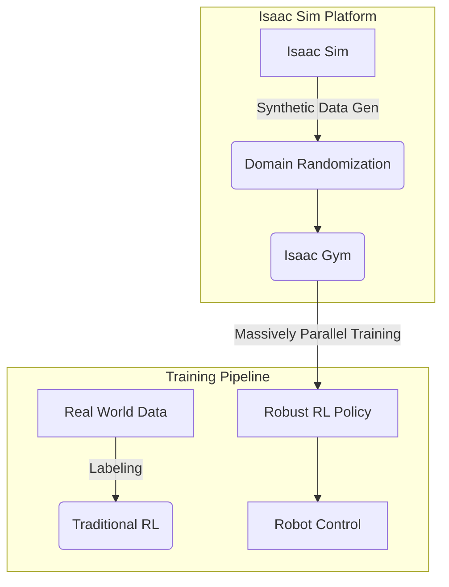

# Module 3: The AI-Robot Brain (NVIDIA Isaac)

## Overview

NVIDIA Isaac Sim is a powerful robotics simulation platform built on the Omniverse platform, designed for developing, testing, and training intelligent robotic systems. It leverages GPU acceleration for physically accurate simulation, perception system training, and reinforcement learning. Isaac Sim provides an end-to-end solution for the "AI-Brain" of robotic systems.

## Core Architecture

NVIDIA Isaac Sim is built on several key technologies:

1. **Omniverse Platform**: NVIDIA's simulation and collaboration platform
2. **USD (Universal Scene Description)**: Scalable file format for 3D scenes
3. **PhysX Physics Engine**: NVIDIA's multi-platform physics engine
4. **Warp**: NVIDIA's Python framework for high-performance computing
5. **Isaac Gym**: Simulated environments for reinforcement learning
6. **ROS 2 Bridge**: Seamless integration with ROS 2-based systems

## Isaac Sim Fundamentals

### Basic Isaac Sim Environment

```python
# minimal_isaac.py
import omni
from omni.isaac.kit import SimulationApp
from omni.isaac.core import World
from omni.isaac.core.objects import DynamicCuboid
from omni.isaac.core.utils.stage import add_reference_to_stage
from omni.isaac.core.utils.nucleus import get_assets_root_path

# Start Isaac Sim application
simulation_app = SimulationApp({"headless": False})

# Import required modules after launching Isaac Sim
from omni.isaac.core import World
from omni.isaac.core.objects import DynamicCuboid
from omni.isaac.core.utils.stage import add_reference_to_stage
from omni.isaac.core.utils.nucleus import get_assets_root_path

# Create world instance
world = World(stage_units_in_meters=1.0)

# Add ground plane
world.scene.add_default_ground_plane()

# Add a simple cube to the scene
my_cube = world.scene.add(
    DynamicCuboid(
        prim_path="/World/cube",
        name="my_cube",
        position=[0.0, 0.0, 1.0],
        size=0.5,
        color=[0.0, 0.0, 1.0],
    )
)

# Reset the world to initialize physics
world.reset()

# Main simulation loop
while simulation_app.is_running():
    # Step the world simulation
    world.step(render=True)
    
    # Perform actions during simulation
    if world.is_playing():
        if world.current_time_step_index == 0:
            # Initialize cube velocity
            world.get_rigid_prim_view("/World/cube").set_velocities(
                [[-0.5, 0.0, 0.0]], [[0.0, 0.0, 0.0]]
            )
    
    # Additional simulation logic can be added here

# Clean up
simulation_app.close()
```

### Robot Import and Control

Isaac Sim supports various robot formats, including URDF:

```python
# robot_controller.py
import omni
from omni.isaac.kit import SimulationApp
from omni.isaac.core import World
from omni.isaac.core.utils.nucleus import get_assets_root_path
from omni.isaac.core.utils.stage import add_reference_to_stage
from omni.isaac.franka import Franka
import numpy as np

# Start Isaac Sim
simulation_app = SimulationApp({"headless": False})
world = World(stage_units_in_meters=1.0)

# Add ground plane
world.scene.add_default_ground_plane()

# Get assets root path and add a robot from nucleus
assets_root_path = get_assets_root_path()
if assets_root_path is None:
    print("Could not find nucleus server with assets. Please select nucleus server to get assets.")
else:
    # Add a Franka robot to the scene
    franka_robot = world.scene.add(
        Franka(
            prim_path="/World/Franka",
            name="franka",
            position=[0.0, 0.0, 0.0],
        )
    )

# Reset the world
world.reset()

# Main control loop
while simulation_app.is_running():
    world.step(render=True)
    
    if world.is_playing():
        # Simple control logic for robot joints
        if world.current_time_step_index == 0:
            # Set initial joint positions
            joint_positions = np.array([0.0, -1.0, 0.0, 2.0, 0.0, 0.5, 0.0])
            franka_robot.set_joint_positions(joint_positions)
        elif world.current_time_step_index % 100 == 0:
            # Random joint movement for demonstration
            random_positions = np.random.uniform(-1.5, 1.5, size=7)
            franka_robot.set_joint_positions(random_positions)

simulation_app.close()
```

## Synthetic Data Generation

Isaac Sim excels at generating synthetic training data for perception systems:

```python
# synthetic_data_generator.py
import omni
from omni.isaac.kit import SimulationApp
from omni.isaac.core import World
from omni.isaac.core.utils.stage import add_reference_to_stage
from omni.isaac.core.utils import rotate_about_axis, create_orientation_matrix_from_dirs
from omni.isaac.sensor import Camera
from pxr import Gf, UsdGeom
import numpy as np
import cv2
import os

simulation_app = SimulationApp({"headless": True})
world = World(stage_units_in_meters=1.0)

# Create camera for synthetic data generation
camera = Camera(
    prim_path="/World/MyCamera",
    position=np.array([0.5, 0.5, 0.5]),
    frequency=20,
    resolution=(640, 480)
)

# Add ground plane and objects
world.scene.add_default_ground_plane()

# Main data generation loop
image_count = 0
for i in range(100):  # Generate 100 synthetic images with different lighting
    world.reset()
    
    # Apply domain randomization
    # Randomize lighting conditions
    dome_light = world.scene.dome_light
    dome_light.set_color(np.random.uniform(0.5, 1.0, 3))
    dome_light.set_intensity(np.random.uniform(500, 1500))
    
    # Add random objects to the scene
    # (In practice, this would involve spawning objects in random positions)
    
    for j in range(10):  # Capture 10 frames per scene configuration
        world.step(render=True)
        
        if world.current_time_step_index % 5 == 0:  # Capture every 5th frame
            # Capture RGB image
            rgb_image = camera.get_rgb()
            if rgb_image is not None:
                # Save the synthetic image
                filename = f"synthetic_image_{image_count:04d}.png"
                cv2.imwrite(filename, cv2.cvtColor(rgb_image, cv2.COLOR_RGB2BGR))
                image_count += 1
                
                print(f"Saved synthetic image: {filename}")

simulation_app.close()
```

## Isaac Gym for Reinforcement Learning

Isaac Sim includes Isaac Gym for accelerated RL training:

```python
# simple_rl_task.py
import isaacgym
import torch
import numpy as np
from isaacgym import gymapi, gymtorch
from isaacgym.torch_utils import *

class SimpleHumanoidEnv:
    def __init__(self, cfg):
        # Initialize gym
        self.gym = gymapi.acquire_gym()
        
        # Configure simulation
        self.sim_params = gymapi.SimParams()
        self.sim_params.dt = 1.0/60.0
        self.sim_params.substeps = 2
        self.sim_params.up_axis = gymapi.UP_AXIS_Z
        self.sim_params.gravity = gymapi.Vec3(0.0, 0.0, -9.81)
        
        # Configure physics
        self.sim_params.physx.solver_type = 1
        self.sim_params.physx.num_position_iterations = 4
        self.sim_params.physx.num_velocity_iterations = 0
        self.sim_params.physx.max_gpu_contact_pairs = 8 * 1024 * 1024
        self.sim_params.physx.num_threads = 4
        self.sim_params.physx.rest_offset = 0.0
        self.sim_params.physx.contact_offset = 0.02
        self.sim_params.physx.friction_offset_threshold = 0.04
        
        # Create simulation
        self.sim = self.gym.create_sim(0, 0, gymapi.SIM_PHYSX, self.sim_params)
        
        # Create viewer
        self.viewer = self.gym.create_viewer(self.sim, gymapi.CameraProjectionType.PERSPECTIVE)
        self.gym.viewer_camera_look_at(self.viewer, None, 
                                       gymapi.Vec3(5, 5, 1), gymapi.Vec3(0, 0, 0))
        
        # Load asset
        asset_root = "path/to/humanoid/asset"
        asset_file = "humanoid.urdf"
        
        asset_options = gymapi.AssetOptions()
        asset_options.fix_base_link = False
        asset_options.disable_gravity = False
        asset_options.thickness = 0.001
        asset_options.angular_damping = 0.0
        asset_options.linear_damping = 0.0
        asset_options.default_dof_drive_mode = gymapi.DOF_MODE_NONE
        
        self.humanoid_asset = self.gym.load_asset(self.sim, asset_root, asset_file, asset_options)
        
        # Set up environment space
        self.num_envs = cfg["num_envs"]
        env_spacing = 3.0
        self.env_lower = gymapi.Vec3(-env_spacing, -env_spacing, 0.0)
        self.env_upper = gymapi.Vec3(env_spacing, env_spacing, env_spacing)
        
        # Set up actor and per-env data
        self.setup_single_env()
        
        # Get some per-env data
        self.setup_per_env_data()
        
    def setup_single_env(self):
        # Create environment
        plane_params = gymapi.PlaneParams()
        plane_params.normal = gymapi.Vec3(0.0, 0.0, 1.0)
        plane_params.distance = 0.0
        plane_params.static_friction = 1.0
        plane_params.dynamic_friction = 1.0
        plane_params.restitution = 0.0
        self.gym.add_ground(self.sim, plane_params)
        
        # Create envs
        for i in range(self.num_envs):
            # Create env
            env = self.gym.create_env(self.sim, self.env_lower, self.env_upper, 1)
            
            # Add humanoid to env
            pos = gymapi.Vec3(0.0, 0.0, 1.0)
            pose = gymapi.Transform.from_rotation_translation(r=None, t=pos)
            humanoid_actor = self.gym.create_actor(env, self.humanoid_asset, pose, "humanoid", i, 0)
            
            # Set color
            for j in range(self.gym.get_actor_rigid_body_count(env, humanoid_actor)):
                self.gym.set_rigid_body_color(env, humanoid_actor, j, gymapi.MESH_VISUAL,
                                              gymapi.Vec3(0.97, 0.38, 0.06))
    
    def setup_per_env_data(self):
        # Get some per-env data
        self.num_dofs = self.gym.get_sim_dof_count(self.sim) // self.num_envs
        self.num_bodies = self.gym.get_sim_body_count(self.sim) // self.num_envs
        
        # Get envs, states, and other data
        self.envs = []
        self.humanoid_handles = []
        
        for i in range(self.num_envs):
            env = self.gym.get_env(self.sim, i)
            self.envs.append(env)
            
            humanoid_handle = self.gym.get_actor_handle(env, 0)
            self.humanoid_handles.append(humanoid_handle)

    def reset(self):
        # Reset simulation state
        pass

    def step(self, actions):
        # Perform one simulation step
        self.gym.simulate(self.sim)
        self.gym.fetch_results(self.sim, True)
        self.gym.render_all_camera_sensors(self.sim)
        self.gym.start_access_image_tensors(self.sim)
        
        # Process camera data, update states, etc.
        # ...
        
        self.gym.end_access_image_tensors(self.sim)
        
        # Compute observations, rewards, etc.
        # ...
        
        return self.compute_observations(), self.compute_rewards(), self.compute_dones(), {}

# Configuration
cfg = {"num_envs": 4096}  # Example: 4096 parallel environments
env = SimpleHumanoidEnv(cfg)

# Training loop
for episode in range(1000):
    obs = env.reset()
    done = False
    total_reward = 0
    
    while not done:
        # Sample random actions for demonstration
        actions = torch.randn(env.num_dofs)
        obs, reward, done, info = env.step(actions)
        total_reward += reward

print("Training complete!")
```

## ROS 2 Integration in Isaac Sim

Isaac Sim provides seamless integration with ROS 2:

```python
# isaac_ros_bridge.py
import omni
from omni.isaac.kit import SimulationApp
from omni.isaac.core import World
import carb
import rclpy
from rclpy.node import Node
from geometry_msgs.msg import Twist, PointStamped
from sensor_msgs.msg import Image, JointState
from cv_bridge import CvBridge
import numpy as np

# Start Isaac Sim
simulation_app = SimulationApp({"headless": False})
world = World(stage_units_in_meters=1.0)

class IsaacROSNode(Node):
    def __init__(self):
        super().__init__('isaac_ros_bridge')
        
        # Initialize CvBridge for image conversion
        self.bridge = CvBridge()
        
        # Create ROS 2 publishers and subscribers
        self.joint_state_pub = self.create_publisher(JointState, '/joint_states', 10)
        self.image_pub = self.create_publisher(Image, '/isaac_sim/camera/image_raw', 10)
        self.cmd_vel_sub = self.create_subscription(
            Twist,
            '/cmd_vel',
            self.cmd_vel_callback,
            10
        )
        
        # Timer to periodically publish data
        self.timer = self.create_timer(0.1, self.publish_simulation_data)
        
        # Store simulation data
        self.robot_velocity = [0.0, 0.0, 0.0]
        
    def cmd_vel_callback(self, msg):
        # Process velocity commands from ROS 2
        self.robot_velocity[0] = msg.linear.x
        self.robot_velocity[1] = msg.linear.y
        self.robot_velocity[2] = msg.angular.z
        self.get_logger().info(f'Received velocity command: {self.robot_velocity}')
        
    def publish_simulation_data(self):
        # Publish joint states from simulation
        joint_msg = JointState()
        joint_msg.header.stamp = self.get_clock().now().to_msg()
        joint_msg.name = ['joint_1', 'joint_2', 'joint_3']  # Example names
        joint_msg.position = [0.1, 0.2, 0.3]  # Example positions from simulation
        self.joint_state_pub.publish(joint_msg)
        
        # Publish camera image (in a real implementation, 
        # this would capture from an Isaac Sim camera)
        # image_msg = self.bridge.cv2_to_imgmsg(cv_image, "bgr8")
        # self.image_pub.publish(image_msg)

def main(args=None):
    # Initialize ROS 2
    rclpy.init(args=args)
    ros_node = IsaacROSNode()
    
    # Initialize Isaac Sim world
    world.scene.add_default_ground_plane()
    world.reset()
    
    # Create ROS 2 executor
    executor = rclpy.executors.SingleThreadedExecutor()
    executor.add_node(ros_node)
    
    # Main simulation loop
    while simulation_app.is_running():
        world.step(render=True)
        executor.spin_once(timeout_sec=0)
        
        # Additional simulation logic here
        if world.is_playing():
            # Process simulation data
            pass
    
    # Cleanup
    simulation_app.close()
    rclpy.shutdown()

if __name__ == '__main__':
    main()
```

## Isaac Sim Architecture Diagram



## Context7 Integration with Isaac Sim

Isaac Sim can leverage Context7 documentation servers through MCP integration:

```python
# isaac_context_helper.py
import omni
from omni.isaac.kit import SimulationApp
from omni.isaac.core import World
import carb
import asyncio
import aiohttp

class IsaacContextHelper:
    def __init__(self):
        self.mcp_client = None
        self.session = None
        
    async def initialize_mcp_client(self):
        """
        Initialize MCP client for Context7 documentation access
        """
        # In practice, this would connect to an MCP server
        # The actual implementation would depend on the MCP client library
        self.session = aiohttp.ClientSession()
        self.get_logger().info("MCP client initialized for Isaac Sim")
    
    async def get_isaac_api_docs(self, api_function):
        """
        Retrieve Isaac Sim API documentation using MCP
        """
        try:
            # This would make an MCP call to retrieve Isaac Sim documentation
            # It would use Context7 to get the most current API information
            mcp_request = {
                "method": "get-library-docs",
                "params": {
                    "context7CompatibleLibraryID": "/nvidia/isaac-sim",
                    "topic": api_function
                }
            }
            
            # In actual implementation, this would make an MCP call
            # For now, return a placeholder response
            response = await self.mock_mcp_call(mcp_request)
            return response
        except Exception as e:
            carb.log_error(f"Error retrieving Isaac API docs: {e}")
            return None
    
    async def get_robot_control_docs(self, robot_type, control_method):
        """
        Retrieve robot control documentation
        """
        try:
            mcp_request = {
                "method": "get-library-docs",
                "params": {
                    "context7CompatibleLibraryID": f"/nvidia/isaac-sim/{robot_type}",
                    "topic": f"control_{control_method}"
                }
            }
            
            response = await self.mock_mcp_call(mcp_request)
            return response
        except Exception as e:
            carb.log_error(f"Error retrieving robot control docs: {e}")
            return None
    
    async def mock_mcp_call(self, request):
        """
        Mock implementation of MCP call
        In real implementation, this would connect to an MCP server
        """
        # Placeholder implementation
        return {
            "documentation": f"Documentation for {request['params']['topic']}",
            "parameters": ["param1", "param2"],
            "return_values": ["result"],
            "examples": ["example1", "example2"]
        }
    
    def get_logger(self):
        """
        Return Isaac Sim logger
        """
        return carb.Logger.acquire_logger()

# Example usage within Isaac Sim
async def example_usage():
    context_helper = IsaacContextHelper()
    await context_helper.initialize_mcp_client()
    
    # Get documentation for a specific Isaac Sim API
    docs = await context_helper.get_isaac_api_docs("World.step")
    print(f"API Documentation: {docs}")
    
    # Get documentation for robot control
    control_docs = await context_helper.get_robot_control_docs("franka", "position_control")
    print(f"Control Documentation: {control_docs}")
```

## Advanced Isaac Sim Features

### Perception System Training

```python
# perception_training.py
import omni
from omni.isaac.kit import SimulationApp
from omni.isaac.core import World
from omni.isaac.core.utils.stage import add_reference_to_stage
from omni.isaac.sensor import Camera
import numpy as np
import cv2
import random

simulation_app = SimulationApp({"headless": True})
world = World(stage_units_in_meters=1.0)

# Create a camera for the perception system
camera = Camera(
    prim_path="/World/Camera",
    position=np.array([1.0, 0.0, 1.5]),
    frequency=20,
    resolution=(640, 480)
)

# Add ground plane
world.scene.add_default_ground_plane()

def setup_domain_randomization():
    """
    Apply domain randomization to improve model robustness
    """
    # Randomize materials
    materials = [
        {"roughness": random.uniform(0.1, 0.9)},
        {"metallic": random.uniform(0.0, 1.0)},
        {"specular": random.uniform(0.5, 1.0)}
    ]
    
    # Randomize lighting
    dome_light = world.scene.dome_light
    dome_light.set_color(np.random.uniform(0.7, 1.0, 3))
    dome_light.set_intensity(np.random.uniform(500, 2000))
    
    # Randomize camera properties
    camera.set_focal_length(random.uniform(15.0, 25.0))
    camera.set_horizontal_aperture(random.uniform(20.0, 30.0))

def generate_training_data(num_samples=1000):
    """
    Generate synthetic training data with domain randomization
    """
    for i in range(num_samples):
        world.reset()
        
        # Apply domain randomization
        setup_domain_randomization()
        
        # Capture multiple frames with different randomizations
        for frame in range(5):
            world.step(render=True)
            
            if (i * 5 + frame) % 10 == 0:  # Capture every 10th frame
                # Capture RGB image
                rgb_image = camera.get_rgb()
                depth_image = camera.get_depth()
                
                # Save synthetic data
                if rgb_image is not None:
                    cv2.imwrite(f"rgb_{i*5+frame:05d}.png", 
                               cv2.cvtColor(rgb_image, cv2.COLOR_RGB2BGR))
                
                if depth_image is not None:
                    cv2.imwrite(f"depth_{i*5+frame:05d}.png", 
                               (depth_image * 1000).astype(np.uint16))  # Convert to mm
                
                print(f"Captured synthetic data sample {i*5+frame}")

# Run the training data generation
generate_training_data(200)  # Generate 200 samples for quick test

simulation_app.close()
```

## Mini-Tasks for Students

1. Create a simple Isaac Sim environment with a robot and capture sensor data
2. Implement domain randomization techniques to generate robust perception models
3. Set up a basic reinforcement learning environment using Isaac Gym
4. Create a perception pipeline that processes Isaac Sim camera data
5. Integrate Isaac Sim with ROS 2 nodes for control and monitoring
6. Design a synthetic data generation pipeline for a specific perception task

## Integration Points for Capstone Project

Isaac Sim will be critical for the capstone project:
- Training locomotion policies for the autonomous humanoid
- Generating synthetic training data for vision systems
- Testing complex manipulation tasks in high-fidelity simulation
- Validating robot control algorithms before real-world deployment
- Implementing reinforcement learning for complex behaviors

## Learning Outcomes

After completing this module, students should be able to:
1. Understand the NVIDIA Omniverse ecosystem and Universal Scene Description (USD)
2. Utilize Isaac Sim for advanced robotic simulation and development
3. Implement basic robot control and sensor simulation within Isaac Sim
4. Apply synthetic data generation and domain randomization for robust AI training
5. Grasp the fundamentals of parallelized reinforcement learning with Isaac Gym
6. Integrate Isaac Sim with ROS 2 for holistic robotic system development
7. Use Context7 documentation to enhance Isaac Sim development

## Weekly Progression Notes

**Week 7**: Introduction to Isaac Sim basics, USD format, and Python API. Students should be able to set up a simple environment and add basic objects.

**Week 8**: Isaac Sim robot control, sensor simulation, and ROS 2 integration. Students should be able to import robots and implement basic control.

**Week 9**: Isaac Gym and synthetic data generation. Students should be able to create basic RL environments and generate training data.

## Hardware & Software Requirements

### Software Stack
- Ubuntu 22.04 LTS
- NVIDIA Omniverse Launcher
- Isaac Sim 2023.1.1+
- ROS 2 Humble
- Python 3.10+

### Hardware Requirements
- High-end NVIDIA GPU (RTX 3070 or better, RTX 4080/4090 recommended)
- Intel i9/AMD Ryzen 9 or better
- 32GB+ RAM (64GB recommended for large-scale RL)
- High-speed NVMe SSD (1TB+ recommended for synthetic datasets)