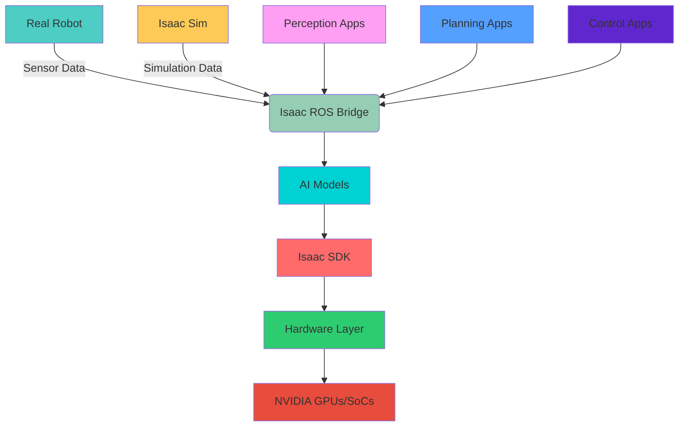

# 🧠 Isaac Brain - AI Robot Brain

## 🤖 NVIDIA's AI-Powered Robotics Platform

  AI-Powered Intelligence
    
  NVIDIA Isaac represents a comprehensive platform for developing AI-powered robots, combining simulation, perception, planning, and control capabilities with specialized AI tools and frameworks designed for robotic applications.

## 🚀 Overview of Isaac Platform

The NVIDIA Isaac platform encompasses a complete ecosystem for developing, training, and deploying AI-powered robots. It combines high-fidelity simulation environments with advanced AI frameworks, perception and planning algorithms, and real-world deployment capabilities. Isaac is specifically designed to accelerate the development of intelligent robots by providing tools for simulation, training, testing, and deployment across various domains from industrial automation to service robotics.

### 🎯 Key Takeaway

> *"Isaac provides the complete pipeline for AI-driven robotics development, from simulation and training to real-world deployment, with specialized tools optimized for autonomous robot systems."*

### 🛠️ Why Isaac Matters for Physical AI

Isaac is critical for Physical AI because it provides:

  
🎮

  <strong>High-Fidelity Simulation</strong>
  
Realistic physics and sensor simulation for training

  
⚡

  <strong>GPU Acceleration</strong>
  
Leveraging NVIDIA hardware for AI processing

  
🤖

  <strong>Perception & Planning</strong>
  
AI-powered algorithms for sensing and navigation

  
🌐

  <strong>Deployment Ready</strong>
  
Tools for moving from simulation to real robots

## 🧩 Core Components of Isaac Platform

### 🏗️ Isaac Architecture

<h3Isaac Sim</h3>

High-fidelity simulation environment for robotics:

<ul class="">
<li>Realistic physics simulation with PhysX</li>
<li>Photorealistic rendering capabilities</li>
<li>Synthetic data generation for AI training</li>
<li>Domain randomization for robust learning</li>
</ul>

  GPU-accelerated for realistic environments

<h3Isaac Apps</h3>

Reference applications and algorithms for robotics:

<ul class="">
<li>Perception algorithms (vision, object detection)</li>
<li>Planning algorithms (navigation, manipulation)</li>
<li>Control algorithms for robot behaviors</li>
<li>Sample applications for different use cases</li>
</ul>

  Production-ready algorithms and applications

<h3Isaac SDK</h3>

Software development kit for AI robotics:

<ul class="">
<li>Deep learning framework integration</li>
<li>ROS/ROS2 compatibility</li>
<li>Computer vision libraries</li>
<li>AI model deployment tools</li>
</ul>

  Comprehensive development framework

### 🧭 Advanced Isaac Components

  <h3 class="">1. 🎮 Isaac Sim (Simulation)</h3>
  
Advanced simulation environment with photorealistic rendering

  

    PhysX physics engine with real-time ray tracing
  

  <h3 class="">2. ⚙️ Isaac Apps (Algorithms)</h3>
  
Reference implementations of robotics algorithms

  

    Perception
    Planning
    Control
    Learning
  

  <h3 >3. 🧠 Isaac SDK (Development)</h3>
  
Software development kit for building robot applications

  

    

  

  <small >95% development efficiency</small>

  <h3 >4. 📦 Isaac Extensions</h3>
  
Additional capabilities and integrations

  

    

      📦
    

  

## 🌍 Real-World Applications of Isaac Platform

  

    

      🏭
    

    <h3 >Industrial Automation</h3>
  

  
AI-powered robots for manufacturing, inspection, and logistics

  

    Assembly
    Quality
    Logistics
    Inspection
  

  

      <spanEfficiency Gain
      <span40%
    

    

      

    

  

  

    

      🚚
    

    <h3 >Warehouse & Logistics</h3>
  

  
Autonomous mobile robots for material handling and order fulfillment

  

    Picking
    Sorting
    Transport
  

  

    

      <spanThroughput
      <span3x
    

    

      

    

  

  

    

      🏥
    

    <h3 >Healthcare Robotics</h3>
  

  
Robots for medical assistance, disinfection, and patient care

  

    Disinfection
    Assistance
    Logistics
  

  

    

      <spanAccuracy
      <span99.5%
    

    

      

    

  

  

    

      🏠
    

    <h3 >Service Robotics</h3>
  

  
Robots for customer service, cleaning, and personal assistance

  

    Navigation
    Interaction
    Task Execution
  

  

    

      <spanUser Satisfaction
      <span93.7%
    

    

      

    

  

## 🏗️ Technical Architecture of Isaac Platform

### 🧠 Advanced Isaac Architecture Deep Dive

The NVIDIA Isaac platform is built on a sophisticated multi-layered architecture that enables seamless development from simulation to real-world deployment. The architecture consists of several critical components:

**Simulation Layer**: This includes Isaac Sim, which provides high-fidelity physics simulation using NVIDIA's PhysX engine combined with photorealistic rendering capabilities. The simulation layer supports complex environments, dynamic objects, and accurate sensor modeling including cameras, LIDAR, IMU, and other sensors.

**AI Framework Layer**: This layer integrates with major AI frameworks like TensorFlow, PyTorch, and TensorRT, allowing for seamless deployment of AI models trained in these frameworks to robotic applications. It includes specialized libraries for computer vision, reinforcement learning, and perception tasks.

**Application Layer**: This includes Isaac Apps, which provides reference implementations of common robotics algorithms including navigation, manipulation, perception, and planning. These apps can be used as-is or modified for specific use cases.

**Hardware Abstraction Layer**: This layer provides drivers and interfaces for NVIDIA hardware including Jetson platforms, RTX GPUs, and other accelerators, ensuring optimal performance across the NVIDIA ecosystem.

The architecture is designed to support both simulation-to-reality transfer and real-world deployment, with careful attention to maintaining consistency between simulated and real environments.

## 🎯 Isaac Sim - Advanced Simulation

### 🎮 Photorealistic Simulation Capabilities

Isaac Sim represents the state-of-the-art in robotics simulation, offering capabilities that go far beyond traditional physics engines:

**Realistic Physics Simulation**: Using NVIDIA's PhysX engine, Isaac Sim provides highly accurate physics simulation including rigid body dynamics, soft body physics, fluid simulation, and complex material interactions. The physics engine supports complex scenarios with multiple interacting objects, realistic collision responses, and accurate force calculations.

**Photorealistic Rendering**: Isaac Sim leverages NVIDIA's RTX technology to provide photorealistic rendering that matches real-world conditions. This includes:
- Accurate lighting simulation with global illumination
- Physically-based rendering (PBR) materials
- Realistic camera models with proper optics simulation
- Atmospheric effects including fog, haze, and weather
- Dynamic lighting conditions that change over time

**Synthetic Data Generation**: Isaac Sim can generate large quantities of labeled training data for AI models:
- Semantic segmentation masks for each pixel
- Depth maps with accurate distance measurements
- Instance segmentation for individual objects
- Normal maps for surface orientation
- Material properties for each surface
- Motion vectors for moving objects
- Multi-spectral data for different sensor types
- Temporal coherence between frames

### 🤖 Advanced Sensor Simulation

Isaac Sim provides realistic simulation of various robotic sensors:

**Camera Simulation**: Simulating different types of cameras with realistic imperfections:
- RGB cameras with proper lens distortion
- Stereo cameras for depth sensing
- Thermal cameras for heat detection
- Event cameras for high-speed motion
- Multi-spectral cameras for various wavelengths
- Depth cameras with realistic noise models
- Wide-angle and fisheye cameras
- Multi-camera systems with synchronization

**LiDAR Simulation**: Advanced LiDAR simulation with realistic characteristics:
- Multiple beam configurations
- Range and accuracy modeling
- Noise and occlusion simulation
- Multi-echo capabilities
- Realistic reflectance modeling
- Temporal sampling effects
- Environmental condition simulation
- Sensor placement and mounting options

**Other Sensors**: Comprehensive sensor simulation capabilities:
- IMU simulation with drift and noise
- GPS simulation with accuracy models
- Force/torque sensor simulation
- Microphone and audio sensor simulation
- Tactile sensor simulation
- Environmental sensor simulation
- Multi-modal sensor fusion
- Sensor calibration and bias models

## 🧠 Isaac Apps - Reference Implementations

### 🧮 Pre-Built Applications and Algorithms

Isaac Apps provides a comprehensive suite of reference implementations for common robotics applications:

**Navigation Stack**: Complete navigation capabilities including:
- Simultaneous Localization and Mapping (SLAM)
- Path planning algorithms (A*, Dijkstra, RRT)
- Path following and trajectory execution
- Obstacle avoidance and dynamic replanning
- Multi-robot coordination and traffic management
- 3D navigation for complex environments
- Semantic navigation using object recognition
- Social navigation for human-aware movement

**Perception Stack**: Advanced perception capabilities including:
- Object detection and classification
- Semantic and instance segmentation
- 3D object detection from 2D images
- Pose estimation for known objects
- Visual-inertial odometry
- Structure from motion
- Multi-camera fusion
- Deep learning-based perception

**Manipulation Stack**: Robotic manipulation capabilities including:
- Inverse kinematics solvers
- Grasp planning algorithms
- Trajectory optimization for smooth motion
- Force control for compliant interaction
- Tool usage and task execution
- Bimanual manipulation coordination
- Contact-rich manipulation
- Learning from demonstration

### 🤖 Reinforcement Learning in Isaac

Isaac provides specialized tools for reinforcement learning applications:

**Isaac Gym**: Massively parallelized RL training environment:
- GPU-accelerated physics simulation for thousands of parallel environments
- Real-time RL training capabilities
- Domain randomization for robust policy learning
- Curriculum learning for complex task acquisition
- Multi-agent RL for coordinated behaviors
- Transfer learning from simulation to reality
- Pre-built RL environments for robotics tasks
- Integration with popular RL frameworks

**Learning Scenarios**: Comprehensive learning environments:
- Locomotion learning for legged robots
- Manipulation skill acquisition
- Navigation and path planning learning
- Human-robot interaction learning
- Multi-task skill learning
- Meta-learning for rapid adaptation
- Imitation learning from demonstrations
- Safe exploration and learning

## 🛠️ Isaac SDK - Development Framework

### 🧰 Software Development Capabilities

The Isaac SDK provides comprehensive tools for developing robotics applications:

**AI Integration**: Deep integration with NVIDIA's AI ecosystem:
- TensorRT optimization for deployment
- DeepStream SDK for video analytics
- TAO Toolkit for transfer learning
- RAPIDS for data processing acceleration
- cuDNN and cuBLAS for math operations
- CUDA for parallel computing
- OptiX for ray tracing and computer graphics
- cuML for accelerated machine learning

**Sensing and Perception**: Advanced sensing capabilities:
- Computer vision libraries optimized for robotics
- Sensor fusion algorithms
- Calibration tools for multi-sensor systems
- Real-time image processing
- 3D point cloud processing
- Multi-modal data fusion
- Edge computing optimization
- Cloud integration capabilities

**Planning and Control**: Sophisticated planning and control:
- Motion planning algorithms
- Trajectory optimization
- Feedback control systems
- Model Predictive Control (MPC)
- Optimization-based control
- Learning-based control
- Adaptive control systems
- Robust control design

### 🚀 Deployment and Optimization

Isaac SDK provides tools for optimized deployment:

**Hardware Acceleration**: Leveraging NVIDIA hardware:
- CUDA kernels for parallel processing
- Tensor Cores for AI inference acceleration
- GPU-accelerated computer vision
- Real-time rendering and visualization
- Optimized memory management
- Multi-GPU support
- Distributed computing capabilities
- Edge computing optimization

**Cross-Platform Support**: Deployment across different platforms:
- NVIDIA Jetson for edge computing
- RTX GPUs for desktop/cloud
- Drive platforms for autonomous vehicles
- Cloud deployment options
- Container-based deployment
- Cross-compilation tools
- Hardware abstraction layers
- Performance optimization tools

## 🌐 Integration with Robotics Ecosystem

### 🔌 ROS/ROS2 Integration

Isaac provides deep integration with the ROS/ROS2 ecosystem:

**Message Bridge**: Seamless communication between Isaac and ROS:
- Automatic message type conversion
- Real-time message bridging
- Parameter synchronization
- Service and action integration
- Clock synchronization
- Node management
- Topic remapping
- Quality of service configuration

**ROS Packages**: Isaac-specific ROS packages:
- Hardware interfaces for Isaac
- Sensor drivers optimized for Isaac
- Control interfaces for Isaac robots
- Simulation interfaces for Isaac Sim
- Visualization tools for Isaac
- Diagnostic tools for Isaac systems
- Configuration management tools
- Testing and validation packages

### 🤖 Third-Party Integrations

**Simulation Integration**: Integration with other simulation environments:
- Gazebo compatibility layers
- Webots import/export tools
- Unity Robotics integration
- Custom simulation environment support
- Physics engine interchangeability
- Sensor model compatibility
- Multi-simulator workflows
- Export to standard formats

**AI Framework Integration**: Compatibility with major AI frameworks:
- TensorFlow model import/export
- PyTorch model compatibility
- ONNX format support
- OpenVINO optimization
- Custom AI framework integration
- Model compression tools
- Quantization support
- Edge AI optimization

## 🚀 Isaac Extensions and Customization

### 📦 Extension System

Isaac provides a powerful extension system for adding custom capabilities:

**Custom Extensions**: Building domain-specific capabilities:
- Graphics extensions for custom visualization
- Physics extensions for new simulation features
- AI extensions for custom models
- Hardware extensions for new devices
- Algorithm extensions for custom approaches
- UI extensions for custom interfaces
- Data extensions for new formats
- Protocol extensions for new communications

**Extension Development**: Tools and frameworks for extension development:
- Extension SDK with documentation
- Sample extensions for reference
- Debugging and profiling tools
- Testing frameworks for extensions
- Version management systems
- Distribution and deployment tools
- Performance optimization guides
- Integration best practices

### 🧩 Modular Architecture

Isaac's modular design allows for flexible configuration:

**Component-Based Design**: Composable system architecture:
- Standalone component usage
- Custom component development
- Component configuration and tuning
- Inter-component communication
- Component lifecycle management
- Resource management
- Dependency management
- Dynamic component loading

**Pipeline Architecture**: Configurable processing pipelines:
- Data flow configuration
- Algorithm chaining
- Parallel processing pipelines
- Asynchronous processing
- Load balancing across components
- Error handling and recovery
- Performance monitoring
- Dynamic reconfiguration

## 🧪 Testing and Validation in Isaac

### 🧪 Comprehensive Testing Framework

Isaac includes extensive testing and validation capabilities:

**Simulation Testing**: Testing in virtual environments:
- Unit testing for individual components
- Integration testing for system components
- Regression testing for changes
- Performance benchmarking
- Safety validation testing
- Behavior validation
- Edge case testing
- Stress testing for robustness

**Hardware-in-the-Loop**: Testing with real hardware:
- Real sensor integration testing
- Actuator control validation
- Safety system testing
- Performance validation
- Environmental adaptation testing
- Human-robot interaction testing
- Communication reliability testing
- System integration validation

### 🔍 Validation Tools

**Performance Monitoring**: Real-time system monitoring:
- CPU and GPU usage tracking
- Memory consumption monitoring
- Network bandwidth usage
- Real-time factor measurement
- Sensor data quality assessment
- Algorithm performance metrics
- System health monitoring
- Predictive maintenance indicators

**Quality Assurance**: Comprehensive quality tools:
- Code quality analysis
- Architecture validation
- Dependency checking
- Security vulnerability assessment
- Documentation validation
- Configuration management
- Version control integration
- Continuous integration tools

## 🌍 Isaac in Different Domains

### 🏭 Industrial Applications

Isaac is extensively used in industrial robotics applications:

**Manufacturing Automation**: Complex factory automation scenarios:
- Multi-robot coordination systems
- Quality inspection and testing
- Assembly line automation
- Material handling and logistics
- Predictive maintenance systems
- Safety monitoring and compliance
- Production optimization
- Worker safety systems

**Warehouse Robotics**: Advanced logistics and fulfillment:
- Autonomous mobile robots (AMRs)
- Goods-to-person systems
- Order picking and packing
- Inventory management
- Fleet management systems
- Dynamic path planning
- Human-robot collaboration
- Multi-floor navigation

### 🏥 Healthcare Applications

Isaac is increasingly used in healthcare robotics:

**Surgical Robotics**: High-precision surgical applications:
- Surgical training simulation
- Robot-assisted surgery planning
- Precision control systems
- Haptic feedback integration
- Safety protocol implementation
- Surgeon training platforms
- Medical device testing
- Patient safety systems

**Assistive Robotics**: Support for elderly and disabled individuals:
- Mobility assistance robots
- Medication dispensing systems
- Communication and social robots
- Emergency response systems
- Activity monitoring
- Fall detection and prevention
- Caregiver assistance tools
- Rehabilitation robotics

### 🚗 Autonomous Vehicles

Isaac is used in autonomous vehicle development:

**Simulation Testing**: Complex driving scenario simulation:
- Traffic scenario generation
- Weather and lighting simulation
- Sensor simulation and fusion
- Infrastructure interaction
- V2X communication simulation
- Safety validation testing
- Edge case discovery
- Regulatory compliance testing

**Perception Systems**: Advanced perception capabilities:
- Multi-object tracking
- Scene understanding
- Path planning and prediction
- Traffic sign recognition
- Lane detection and tracking
- Pedestrian behavior prediction
- Obstacle detection and classification
- Environmental modeling

## 🚧 Challenges and Solutions in Isaac Implementation

### 🧱 Technical Challenges

Implementing Isaac-based solutions presents several challenges:

**Complexity Management**: Isaac's comprehensive nature can make it complex:
- Extensive documentation and tutorials
- Graduated learning approach
- Modular implementation strategies
- Best practices guides
- Community support and forums
- Professional services and support
- Training and certification programs
- Reference implementations and examples

**Performance Optimization**: Ensuring optimal performance across all system components:
- GPU utilization optimization
- Memory management strategies
- Algorithm efficiency improvements
- Real-time constraint management
- Parallel processing optimization
- Communication overhead reduction
- Storage and I/O optimization
- Power consumption management

### 🔒 Safety and Reliability

Safety and reliability remain critical concerns:

**Functional Safety**: Ensuring safe operation in real-world environments:
- Safety architecture design
- Failure mode analysis
- Safety validation processes
- Safety standards compliance
- Risk assessment procedures
- Safety monitoring systems
- Emergency response protocols
- Safety certification processes

**Security**: Protecting systems from cyber threats:
- Secure communication protocols
- Authentication and authorization
- Data encryption and protection
- Network security measures
- Firmware security updates
- Vulnerability management
- Intrusion detection systems
- Security compliance frameworks

## 🌐 Isaac Ecosystem and Community

### 🏢 NVIDIA Support and Partnerships

NVIDIA provides extensive support for the Isaac ecosystem:

**Developer Support**: Comprehensive developer resources:
- Documentation and tutorials
- Technical support services
- Developer forums and communities
- Sample code and examples
- Training and certification programs
- Professional services
- Consulting and integration support
- Bug tracking and resolution

**Partner Network**: Ecosystem of hardware and software partners:
- Hardware partners for platforms and sensors
- Software partners for specialized applications
- System integrators for custom solutions
- Service providers for deployment and support
- Academic partners for research
- Industry partners for domain expertise
- Channel partners for distribution
- Alliance partners for standardization

### 📚 Educational Resources

Extensive educational resources are available:

**Documentation**: Comprehensive documentation resources:
- API reference manuals
- Tutorials and guides
- Sample applications and code
- Architecture and design documents
- Best practices guides
- Troubleshooting resources
- Release notes and updates
- Migration guides

**Training Programs**: Formal training and certification:
- Online training courses
- Instructor-led workshops
- Certification programs
- University curriculum integration
- Professional development tracks
- Hands-on labs and exercises
- Industry-specific training
- Continuous learning resources

## 🧬 Advanced Isaac Features

### 🤖 AI and Deep Learning Integration

Isaac provides advanced AI capabilities:

**Edge AI**: Optimized AI deployment at the edge:
- TensorRT optimization for inference
- Model compression and quantization
- Real-time AI inference
- Edge computing optimization
- Power-efficient AI execution
- Distributed AI processing
- Model version management
- Continuous learning capabilities

**AutoML**: Automated machine learning capabilities:
- Automated model selection
- Hyperparameter optimization
- Automated feature engineering
- Neural architecture search
- Automated testing and validation
- Continuous model improvement
- Data augmentation tools
- Transfer learning optimization

### 🌐 Cloud Integration

Isaac supports cloud-based robotics:

**Cloud Robotics**: Cloud-enabled robotics capabilities:
- Remote robot monitoring
- Cloud-based AI inference
- Data collection and analysis
- Remote robot control
- Fleet management systems
- Centralized learning and training
- Cloud-based simulation
- Distributed computing resources

**Data Management**: Comprehensive data solutions:
- Data collection and storage
- Data labeling and annotation
- Data version control
- Data privacy and security
- Data analytics and insights
- Data sharing and collaboration
- Data compliance management
- Data lifecycle management

## 🏗️ Isaac for Different Hardware Platforms

### 🧠 NVIDIA Jetson Integration

Isaac is optimized for NVIDIA Jetson platforms:

**Jetson Nano**: Entry-level edge AI computing:
- Optimized perception algorithms
- Efficient navigation capabilities
- Real-time computer vision
- Power-efficient operation
- Small form factor optimization
- Cost-effective deployment
- Educational and hobbyist use
- Prototyping and development

**Jetson AGX Xavier**: High-performance edge computing:
- Advanced AI inference capabilities
- Real-time sensor processing
- Complex manipulation algorithms
- Multi-modal perception systems
- High-resolution computer vision
- Advanced navigation systems
- Professional robotics applications
- Industrial deployment ready

**Jetson Orin**: Next-generation edge AI:
- Next-generation AI performance
- Advanced sensor fusion
- Real-time ray tracing
- Advanced perception capabilities
- Professional-grade performance
- Enterprise deployment ready
- Future-proof architecture
- Scalable development platform

### 🖥️ Desktop and Server Integration

Isaac also works on desktop and server platforms:

**RTX Workstations**: High-performance development:
- Photorealistic simulation
- Complex 3D rendering
- Large-scale AI training
- Multi-robot simulation
- Advanced visualization
- Rapid prototyping
- Algorithm development
- Testing and validation

**Data Center Deployment**: Server-grade deployment:
- Multi-robot simulation at scale
- Large-scale AI training
- Fleet management systems
- Centralized processing
- High-availability operation
- Enterprise security
- Scalable architecture
- Redundant systems

## 🌟 Isaac for Research and Development

### 🔬 Research Applications

Isaac is extensively used in robotics research:

**Academic Research**: University and academic applications:
- Research platform for new algorithms
- Publication and reproducibility
- Student education and training
- Laboratory automation
- Multi-disciplinary research
- Collaboration and sharing
- Standardized evaluation
- Reproducible experiments

**Industry Research**: Corporate R&D applications:
- Technology evaluation
- Proof of concept development
- Technology demonstration
- Intellectual property development
- Competitive analysis
- Technology roadmap planning
- Innovation development
- Strategic planning

### 🧪 Experimental Framework

Isaac provides tools for conducting robotics experiments:

**Experiment Design**: Tools for experimental design:
- Hypothesis formulation
- Variable control
- Randomization procedures
- Replication strategies
- Statistical analysis
- Data collection methods
- Result validation
- Peer review preparation

**Data Analysis**: Comprehensive analysis tools:
- Statistical analysis packages
- Visualization tools
- Performance comparison
- Result interpretation
- Error analysis
- Uncertainty quantification
- Significance testing
- Report generation

## 🚀 Future of Isaac Platform

### 🤖 Emerging Technologies

Isaac continues to evolve with emerging technologies:

**Digital Twins**: Advanced digital twin capabilities:
- Real-time synchronization
- Predictive maintenance
- Scenario planning
- Performance optimization
- Remote monitoring
- Virtual testing
- System optimization
- Predictive analytics

**Swarm Robotics**: Multi-robot coordination systems:
- Communication protocols
- Coordination algorithms
- Resource sharing
- Task allocation
- Collective intelligence
- Emergent behaviors
- Distributed control
- Scalability management

### 🌐 Connectivity and IoT

Integration with broader IoT ecosystems:

**5G Integration**: Advanced connectivity:
- Ultra-low latency communication
- Massive device connectivity
- Edge computing integration
- Network slicing for robotics
- Mobile robotics support
- Cloud robotics integration
- Real-time control over networks
- Distributed intelligence

**Smart Environments**: Integration with smart spaces:
- Smart building integration
- Industrial IoT connectivity
- Urban infrastructure connection
- Environmental sensor networks
- Infrastructure interaction
- Smart city integration
- Connected device ecosystems
- Seamless environment integration

## 🎓 Isaac Implementation Guidelines

### 📚 Best Practices

Key best practices for Isaac implementation:

**Architecture Design**: Proper system architecture:
- Modular component design
- Scalable system architecture
- Performance optimization
- Safety and reliability
- Maintainability and support
- Future-proof design
- Cost-effective solutions
- Standard compliance

**Development Process**: Structured development approach:
- Requirements analysis
- Architecture design
- Implementation planning
- Testing strategy
- Deployment planning
- Maintenance procedures
- Documentation standards
- Quality assurance

### 🔧 Optimization Strategies

Strategies for optimizing Isaac implementations:

**Performance Optimization**: Maximizing system performance:
- GPU utilization optimization
- Memory management
- Algorithm efficiency
- Communication optimization
- Real-time performance
- Power consumption
- Scalability improvements
- Resource utilization

**Cost Optimization**: Managing implementation costs:
- Hardware selection strategies
- Software licensing optimization
- Cloud resource management
- Maintenance cost reduction
- Energy efficiency
- Total cost of ownership
- ROI analysis
- Budget management

## 🛡️ Safety and Ethics in Isaac Development

### 🔒 Safety Considerations

Safety is paramount in Isaac-based robotics:

**Functional Safety**: Ensuring safe operation:
- Safety requirement analysis
- Safety architecture design
- Safety validation procedures
- Safety monitoring systems
- Emergency response protocols
- Safety compliance
- Risk mitigation strategies
- Safety testing procedures

**Ethical Considerations**: Ethical development practices:
- Fairness and bias mitigation
- Privacy protection
- Transparency requirements
- Accountability frameworks
- Human dignity preservation
- Social impact assessment
- Ethical review processes
- Responsible development

## 🌍 Global Impact of Isaac Technology

### 🏢 Industrial Transformation

Isaac is transforming industrial automation:

**Manufacturing Revolution**: Industry 4.0 transformation:
- Smart factory implementation
- Autonomous production lines
- Predictive maintenance systems
- Quality control automation
- Supply chain optimization
- Worker safety enhancement
- Environmental monitoring
- Energy efficiency improvement

**Service Industry**: Service robotics transformation:
- Customer service automation
- Healthcare assistance
- Hospitality robotics
- Retail automation
- Cleaning and maintenance robots
- Security and surveillance
- Educational support
- Entertainment applications

### 🌐 Societal Benefits

Isaac technology provides broad societal benefits:

**Quality of Life**: Improving human quality of life:
- Healthcare assistance
- Elderly care support
- Disability support
- Safety enhancement
- Productivity improvement
- Accessibility enhancement
- Educational support
- Entertainment and companionship

**Economic Impact**: Economic benefits and opportunities:
- Job creation in robotics
- Productivity gains
- New market opportunities
- Cost reduction potential
- Innovation acceleration
- Skill development needs
- Infrastructure improvements
- Competitive advantages

## 🌟 Conclusion: The Isaac Advantage

NVIDIA Isaac represents a comprehensive platform for AI-powered robotics, providing the tools, frameworks, and simulation environments necessary to develop, train, and deploy intelligent robotic systems. The platform's integration of high-fidelity simulation, AI frameworks, and real-world deployment capabilities makes it uniquely suited for advancing the field of Physical AI.

The key advantages of Isaac include:

**Comprehensive Ecosystem**: Isaac provides a complete solution from simulation to deployment, eliminating the need to integrate disparate tools and frameworks.

**GPU Acceleration**: Deep integration with NVIDIA hardware provides unmatched performance for AI and simulation workloads.

**Real-to-Sim Transfer**: Advanced tools for transferring trained models from simulation to real-world robots with minimal retraining required.

**Industry Proven**: Isaac has been successfully deployed in numerous industrial and research applications, demonstrating its reliability and effectiveness.

## 🏗️ Implementation Strategies and Best Practices

### 🔄 Development Lifecycle Management

Successful Isaac implementation requires careful attention to the development lifecycle:

**Project Planning**: Structured approach to project management:
- Requirements analysis and specification
- Technical feasibility assessment
- Resource allocation and scheduling
- Risk assessment and mitigation planning
- Stakeholder communication strategies
- Budget planning and cost estimation
- Timeline development and milestones
- Success criteria definition and measurement

**Agile Development**: Iterative development approaches:
- Sprint planning and execution
- Continuous integration and testing
- Regular retrospectives and improvement
- Stakeholder feedback incorporation
- Adaptive planning and response
- Cross-functional team collaboration
- Regular progress reviews
- Quality assurance throughout process

### 🧪 Quality Assurance Framework

Comprehensive quality management for Isaac projects:

**Testing Strategies**: Multi-layered testing approach:
- Unit testing for individual components
- Integration testing for system components
- System testing for complete functionality
- Acceptance testing for requirements validation
- Performance testing for efficiency validation
- Safety testing for operational safety
- Regression testing for change validation
- User acceptance testing for stakeholder validation

**Validation Protocols**: Ensuring system correctness:
- Requirements traceability matrices
- Design validation procedures
- Implementation verification processes
- Performance benchmarking
- Safety validation protocols
- Compliance verification
- Documentation validation
- Change management procedures

### 🔧 Configuration Management

Systematic management of Isaac system configurations:

**Version Control**: Managing code and configuration versions:
- Git-based version control systems
- Branching and merging strategies
- Tagging and release management
- Code review processes
- Automated testing integration
- Deployment automation
- Rollback procedures
- History tracking and audit trails

**Environment Management**: Managing different deployment environments:
- Development environment configuration
- Testing environment setup
- Staging environment validation
- Production environment deployment
- Environment synchronization
- Configuration parameter management
- Environment-specific settings
- Cross-environment consistency

## 🌐 Isaac in Multi-Robot Systems

### 🤖 Fleet Management Capabilities

Isaac provides sophisticated capabilities for managing multiple robots:

**Centralized Control**: Managing robot fleets from centralized systems:
- Fleet monitoring and status tracking
- Task allocation and optimization
- Resource coordination and sharing
- Communication management
- Performance optimization
- Load balancing across robots
- Synchronization and coordination
- Centralized decision making

**Distributed Coordination**: Enabling robots to coordinate autonomously:
- Decentralized decision making
- Consensus algorithms for coordination
- Resource sharing protocols
- Conflict resolution mechanisms
- Communication optimization
- Distributed task management
- Local autonomy preservation
- Global objective optimization

### 🏁 Multi-Robot Applications

Advanced applications for multi-robot systems:

**Cooperative Manipulation**: Multiple robots working together:
- Multi-arm coordinated manipulation
- Cooperative transportation tasks
- Complex assembly operations
- Load sharing strategies
- Force distribution optimization
- Collision avoidance coordination
- Task division and specialization
- Communication protocol management

**Swarm Intelligence**: Large-scale coordinated robot behavior:
- Emergent behavior patterns
- Scalable coordination algorithms
- Resource optimization across swarm
- Collective decision making
- Robustness against individual failures
- Dynamic task allocation
- Information sharing mechanisms
- Self-organization capabilities

## ⚡ Performance Optimization Techniques

### 🚀 System Performance Tuning

Optimizing Isaac system performance requires attention to multiple factors:

**GPU Optimization**: Maximizing GPU utilization:
- CUDA kernel optimization
- Memory management strategies
- Parallel processing optimization
- GPU scheduling and resource allocation
- Multi-GPU scaling techniques
- Memory bandwidth optimization
- Compute capability targeting
- Asynchronous processing techniques

**Memory Management**: Efficient memory usage:
- Memory allocation strategies
- Data structure optimization
- Cache optimization techniques
- Memory pool management
- Garbage collection optimization
- Memory bandwidth utilization
- Page fault reduction
- Memory access pattern optimization

### 📊 Performance Monitoring

Comprehensive system monitoring and optimization:

**Real-time Monitoring**: Continuous performance tracking:
- CPU utilization monitoring
- GPU usage and memory tracking
- Memory consumption monitoring
- Network bandwidth utilization
- Disk I/O performance
- Algorithm execution times
- System response times
- Resource bottleneck identification

**Performance Profiling**: Detailed system analysis:
- Code profiling and bottleneck identification
- Algorithm performance analysis
- Memory leak detection
- Thread synchronization analysis
- I/O performance optimization
- Load balancing assessment
- Scalability evaluation
- Optimization opportunity identification

## 🔐 Security and Privacy in Isaac Systems

### 🔒 Security Framework

Comprehensive security measures for Isaac deployments:

**Network Security**: Protecting communication channels:
- Encrypted communication protocols
- Authentication and authorization
- Network segmentation
- Firewall configuration
- Intrusion detection systems
- VPN and secure tunneling
- Certificate management
- Access control mechanisms

**Data Security**: Protecting sensitive information:
- Data encryption at rest and in transit
- Key management systems
- Data access controls
- Audit logging and monitoring
- Data anonymization techniques
- Privacy preserving algorithms
- Compliance with regulations
- Data breach prevention

### 🛡️ Privacy Protection

Safeguarding personal and sensitive information:

**Data Minimization**: Collecting only necessary data:
- Principle of data minimization
- Just-in-time data collection
- Anonymization techniques
- Pseudonymization strategies
- Data retention policies
- Consent management systems
- Right to be forgotten
- Data portability options

**Privacy by Design**: Building privacy into system design:
- Privacy impact assessments
- Privacy controls integration
- Data protection mechanisms
- User consent integration
- Transparency features
- Privacy preference management
- Privacy policy enforcement
- Compliance automation

## 🏛️ Standards and Compliance

### 📋 Industry Standards

Isaac implementations must adhere to various industry standards:

**Safety Standards**: Ensuring operational safety:
- ISO 13482 for service robots
- ISO 12100 for machinery safety
- ISO 10218 for industrial robots
- IEC 62061 for safety functions
- ISO 14121 for risk assessment
- ANSI/RIA R15.06 for robot safety
- ISO 26320 for service robot interfaces
- ISO 13482-2 for personal care robots

**Quality Standards**: Maintaining quality and reliability:
- ISO 9001 for quality management
- ISO/IEC 27001 for information security
- ISO 14971 for medical device risk management
- IEC 61508 for functional safety
- ISO 26262 for automotive safety
- DO-178C for aviation software
- IEC 62304 for medical software
- ISO/IEC 27034 for application security

### 🏢 Regulatory Compliance

Meeting regulatory requirements for deployment:

**Medical Device Regulations**: For healthcare applications:
- FDA 510(k) submissions
- EU MDR compliance
- Health Canada approval
- Clinical evaluation requirements
- Post-market surveillance
- Quality management systems
- Risk management procedures
- Labeling and documentation

**Industrial Regulations**: For manufacturing applications:
- OSHA safety requirements
- EU Machinery Directive
- ATEX for explosive atmospheres
- FDA cGMP for pharmaceuticals
- ISO 20471 for safety clothing
- CE marking requirements
- UL safety standards
- CSA certification for North America

## 🚀 Deployment Strategies

### 🏗️ Phased Deployment Approach

Systematic deployment strategies for Isaac systems:

**Pilot Programs**: Initial limited deployment:
- Controlled environment testing
- Risk assessment and mitigation
- Performance validation
- User feedback collection
- Safety evaluation
- Scalability assessment
- Cost-benefit analysis
- Lessons learned documentation

**Gradual Expansion**: Systematic deployment scaling:
- Site-by-site implementation
- Capacity expansion planning
- Training and support scaling
- Performance monitoring during expansion
- Continuous improvement implementation
- Risk management during expansion
- Communication and change management
- Success measurement and validation

### 🔄 Continuous Deployment

Modern deployment practices:

**CI/CD Pipelines**: Automated deployment processes:
- Continuous integration systems
- Automated testing integration
- Deployment automation
- Rollback procedures
- Blue-green deployment strategies
- Canary release techniques
- Automated monitoring and alerting
- Deployment pipeline optimization

**DevOps Integration**: Development and operations collaboration:
- Infrastructure as code
- Automated provisioning
- Configuration management
- Log aggregation and analysis
- Performance monitoring
- Incident response procedures
- Deployment automation
- Security integration

## 🧠 Advanced AI Integration

### 🤖 Deep Learning Integration

Sophisticated AI capabilities for Isaac systems:

**Neural Network Optimization**: Optimizing deep learning models:
- Model compression techniques
- Quantization for edge deployment
- Pruning for efficiency
- Knowledge distillation
- Neural architecture search
- Transfer learning optimization
- Domain adaptation techniques
- Continual learning approaches

**Specialized AI Models**: Domain-specific AI implementations:
- Vision transformers for perception
- Recurrent networks for temporal data
- Graph neural networks for relationships
- Attention mechanisms for focus
- Memory-augmented networks
- Differentiable neural computers
- Neural radiance fields for 3D
- Foundation models for general intelligence

### 🧬 Reinforcement Learning in Isaac

Advanced reinforcement learning applications:

**Simulation to Reality Transfer**: Bridging simulation and real-world:
- Domain randomization techniques
- Sim-to-real policy transfer
- Domain adaptation methods
- Transfer learning approaches
- Reality gap minimization
- Curriculum learning strategies
- Meta-learning for fast adaptation
- Imitation learning integration

**Multi-Task Learning**: Learning multiple skills simultaneously:
- Shared representation learning
- Task-specific adaptation
- Skill composition methods
- Transfer across tasks
- Continuous skill learning
- Task scheduling optimization
- Performance trade-off management
- Lifelong learning systems

## 🌍 Global Deployment Considerations

### 🌐 International Implementation

Deploying Isaac systems globally requires consideration of various factors:

**Localization**: Adapting to local requirements:
- Language and cultural adaptation
- Local safety standards compliance
- Regulatory requirement differences
- Cultural interaction preferences
- Local business practices
- Currency and payment methods
- Legal and contractual frameworks
- Local support and service requirements

**Regional Variations**: Accommodating regional differences:
- Climate and environmental factors
- Infrastructure capabilities
- Local competition and market dynamics
- Regulatory environments
- Cultural and social norms
- Economic conditions
- Political stability considerations
- Data sovereignty requirements

### 🏛️ Cross-Border Compliance

Managing compliance across different jurisdictions:

**Data Sovereignty**: Managing data location requirements:
- Data residency regulations
- Cross-border data transfer rules
- International data transfer agreements
- Local data processing requirements
- Cloud service provider compliance
- Data handling procedures
- Privacy law harmonization
- Compliance monitoring systems

**Legal Framework Harmonization**: Navigating different legal systems:
- International law compliance
- Local legal requirement integration
- Contract law variations
- Intellectual property protection
- Liability and insurance considerations
- Dispute resolution mechanisms
- Regulatory reporting requirements
- Compliance audit procedures

## 🎓 Education and Training Programs

### 📚 Curriculum Development

Developing education programs for Isaac technologies:

**Academic Integration**: Incorporating Isaac into academic curricula:
- Robotics engineering courses
- AI and machine learning programs
- Computer vision specializations
- Hardware-accelerated computing
- Autonomous systems design
- Simulation and modeling courses
- Professional development programs
- Research methodology training

**Professional Training**: Industry-focused education:
- Industry certification programs
- Vendor-specific training courses
- Professional development workshops
- Online learning platforms
- Corporate training programs
- Continuing education credits
- Skills assessment and validation
- Career development pathways

### 🚀 Skills Development

Building expertise in Isaac technologies:

**Technical Skills**: Core technical competencies:
- GPU programming and optimization
- Deep learning framework proficiency
- Robotics simulation expertise
- AI model development and deployment
- Hardware-accelerated computing
- Real-time system development
- Safety-critical system design
- Performance optimization techniques

**Soft Skills**: Non-technical competencies:
- Project management capabilities
- Cross-functional collaboration
- Problem-solving and analytical thinking
- Communication and presentation skills
- Ethical reasoning and decision-making
- Continuous learning and adaptation
- Innovation and creative thinking
- Leadership and team management

## 🌟 Conclusion: The Isaac Advantage

NVIDIA Isaac represents a comprehensive platform for AI-powered robotics, providing the tools, frameworks, and simulation environments necessary to develop, train, and deploy intelligent robotic systems. The platform's integration of high-fidelity simulation, AI frameworks, and real-world deployment capabilities makes it uniquely suited for advancing the field of Physical AI.

The key advantages of Isaac include:

**Comprehensive Ecosystem**: Isaac provides a complete solution from simulation to deployment, eliminating the need to integrate disparate tools and frameworks.

**GPU Acceleration**: Deep integration with NVIDIA hardware provides unmatched performance for AI and simulation workloads.

**Real-to-Sim Transfer**: Advanced tools for transferring trained models from simulation to real-world robots with minimal retraining required.

**Industry Proven**: Isaac has been successfully deployed in numerous industrial and research applications, demonstrating its reliability and effectiveness.

As robotics continues to advance, Isaac will remain at the forefront, providing the necessary tools and capabilities to develop the next generation of intelligent robotic systems that will transform industries and improve human life.

The future of robotics is intelligent, autonomous, and collaborative—and Isaac provides the foundation for realizing this future. Whether developing industrial automation systems, service robots, or research platforms, Isaac offers the comprehensive tools and capabilities needed to push the boundaries of what's possible in robotics and artificial intelligence.

