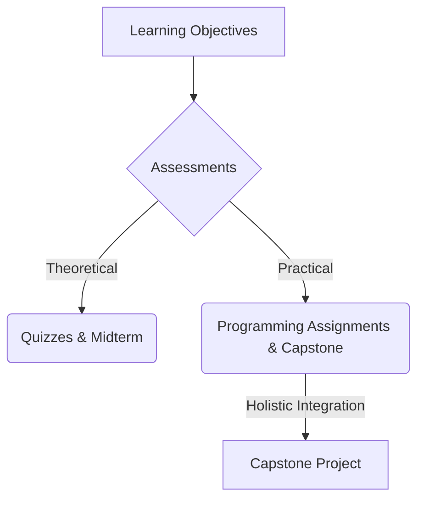

# Assessments

## High-level overview
Outline the assessment strategy for the course, including quizzes, assignments, midterm, and the capstone project, ensuring evaluation of both theoretical understanding and practical application.

## Deep technical explanation
*   **Quizzes:** Short, frequent checks on theoretical concepts (ROS 2 commands, VLM principles).
*   **Programming Assignments:** Practical tasks in each module (e.g., ROS 2 node implementation, Isaac Sim environment setup).
*   **Midterm Exam:** Comprehensive assessment of Modules 1-3.
*   **Capstone Project:** The primary assessment, demonstrating holistic understanding and application of all course concepts to build the autonomous humanoid.
*   **Grading Rubrics:** Detailed criteria for each assessment component.

## Real-world examples
How assessments mirror real-world engineering tasks (e.g., debugging ROS 2 systems, training RL agents, integrating components).

## Diagrams (Mermaid syntax)

*   Table: Assessment breakdown by weight (e.g., Quizzes 10%, Assignments 40%, Midterm 20%, Capstone 30%).

## Code snippet ideas
N/A.

<h2>Simulation exercises</h2>
N/A.

<h2>Hardware & software requirements for this module</h2>
N/A - Overview.

<h2>Mini-tasks for students</h2>
N/A.

<h2>Learning outcomes</h2>
*   Understand the evaluation criteria for the course.
*   Identify key areas of knowledge and skill to be assessed.
*   Prepare effectively for theoretical and practical evaluations.

<h2>Integration points for capstone project</h2>
The capstone serves as the ultimate practical assessment.

<h2>Cross-references between modules</h2>
Assessments cover content from all modules.

<h2>Notes for weekly progression (Week 1–13)</h2>
Weekly assignments tie directly to the module content. Midterm in week 7. Capstone final presentation in week 13.
