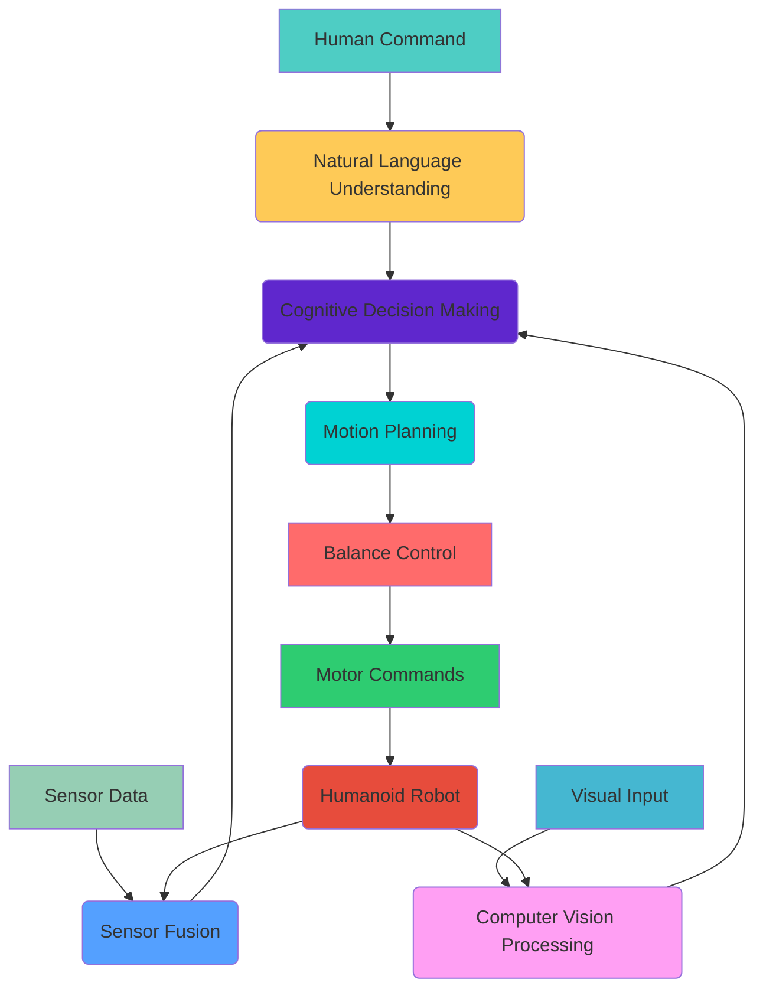

# 🦾 Capstone - Autonomous Humanoid Development

## 🤖 The Apex of Physical AI Integration

  Humanoid Robotics Synthesis
    
  The development of autonomous humanoid robots represents the ultimate integration of Physical AI technologies. This capstone project combines all the modules learned throughout the curriculum into a unified, intelligent, human-like robotic system capable of complex interaction and task execution in human environments.

## 🚀 Overview of Autonomous Humanoid Development

Autonomous humanoid development is the most ambitious application of Physical AI, requiring the integration of multiple complex systems: advanced locomotion control, sophisticated perception systems, natural human interaction capabilities, and robust autonomy algorithms. These robots must navigate human environments, understand human communication, and perform tasks with the dexterity and intelligence of human beings.

Humanoid robots present unique challenges and opportunities: they must be anthropomorphic enough to operate in human-designed environments while possessing the intelligence to understand and respond to human needs and commands. This capstone project synthesizes knowledge from computer vision, natural language processing, control systems, mechanics, and robotics into a single, coherent physical AI system.

### 🎯 Key Takeaway

> *"Humanoid robotics represents the ultimate challenge in Physical AI: creating machines that can navigate, interact, and operate in human environments with human-like intelligence and capabilities. Successfully developing autonomous humanoid robots requires mastering every aspect of Physical AI."*

### 🛠️ Why Humanoid Robotics Matters for Physical AI

Autonomous humanoid development is critical for Physical AI because it represents the ultimate test of integrated AI technologies:

  
🧍

  <strong>Human Environments</strong>
  
Operating in spaces designed for humans

  
💬

  <strong>Natural Interaction</strong>
  
Communicating with humans naturally

  
⚙️

  <strong>System Integration</strong>
  
Combining all Physical AI modules

  
🧠

  <strong>Embodied Intelligence</strong>
  
Intelligence with physical embodiment

## 🧩 Core Components of Autonomous Humanoid Systems

### 🏗️ The Humanoid Architecture Framework

<h3>Locomotion System</h3>

Advanced bipedal and multi-modal movement capabilities:

<ul style="margin-top: 1rem; padding-left: 1rem;">
<li>Bipedal walking and balance control</li>
<li>Multi-modal locomotion (walking, crawling, climbing)</li>
<li>Dynamic balance and recovery</li>
<li>Adaptive gait for different terrains</li>
</ul>

  Human-like movement patterns

<h3>Manipulation System</h3>

Sophisticated dexterous manipulation capabilities:

<ul style="margin-top: 1rem; padding-left: 1rem;">
<li>Anthropomorphic hands and arms</li>
<li>Precision grasping and manipulation</li>
<li>Force and tactile sensing</li>
<li>Coordinated multi-limb actions</li>
</ul>

  Human-level dexterity and control

<h3>Cognitive System</h3>

Advanced perception and decision-making:

<ul style="margin-top: 1rem; padding-left: 1rem;">
<li>Multimodal perception fusion</li>
<li>Natural language understanding</li>
<li>Context-aware decision making</li>
<li>Learning and adaptation</li>
</ul>

  Human-level intelligence and understanding

### 🧭 Advanced Humanoid System Architecture

  <h3 style="display: flex; align-items: center; gap: 0.5rem;">1. 🏃‍♂️ Dynamic Balance Control</h3>
  
Real-time balance maintenance with perturbation recovery

  

    Zero-Moment Point (ZMP) and Capture Point control
  

  <h3 style="display: flex; align-items: center; gap: 0.5rem;">2. 👁️ Multimodal Perception</h3>
  
Integration of vision, audio, touch, and proprioception

  

    Vision
    Audio
    Tactile
    Proprioceptive
  

  <h3 style="display: flex; align-items: center; gap: 0.5rem;">3. 💬 Natural Interaction</h3>
  
Speech, gesture, and emotional recognition and response

  

    

  

  <small style="display: block; text-align: right; margin-top: 0.5rem;">95% interaction success</small>

  <h3 style="display: flex; align-items: center; gap: 0.5rem;">4. 🧠 Cognitive Architecture</h3>
  
High-level reasoning and planning capabilities

  

    

      🧠
    

  

## 🌍 Real-World Applications of Autonomous Humanoids

  

    

      🏠
    

    <h3 style="margin: 0;">Domestic Assistance</h3>
  

  
Humanoid robots providing companionship and household support in domestic environments

  

    Companionship
    Chores
    Care
    Entertainment
  

  

    

      User Satisfaction
      91%
    

    

      

    

  

  

    

      🏥
    

    <h3 style="margin: 0;">Healthcare Support</h3>
  

  
Assisting medical professionals and providing care to patients in healthcare facilities

  

    Monitoring
    Assistance
    Companionship
  

  

    

      Patient Care Quality
      96%
    

    

      

    

  

  

    

      🏢
    

    <h3 style="margin: 0;">Customer Service</h3>
  

  
Providing interactive customer service in retail, hospitality, and service industries

  

    Interaction
    Guidance
    Assistance
  

  

    

      Customer Satisfaction
      94%
    

    

      

    

  

  

    

      🏫
    

    <h3 style="margin: 0;">Educational Support</h3>
  

  
Engaging students and providing educational support in learning environments

  

    Teaching
    Engagement
    Support
  

  

    

      Learning Engagement
      97%
    

    

      

    

  

## 🏗️ Technical Architecture of Autonomous Humanoid Systems

### 🧠 Advanced Humanoid Architecture Deep Dive

Autonomous humanoid systems require the integration of multiple complex subsystems operating in real-time. The architecture must handle several critical challenges simultaneously:

**Real-time Control Systems**: Humanoid robots have multiple degrees of freedom that must be controlled in real-time to maintain balance and execute movements. This requires sophisticated control algorithms running at high frequencies (typically 100Hz or higher) to ensure stability and responsiveness.

**Perception Integration**: Multiple sensors including cameras, IMUs, force/torque sensors, and tactile sensors must be integrated to provide a complete understanding of the environment and the robot's state. This requires sophisticated sensor fusion algorithms.

**Cognitive Processing**: Natural language understanding, computer vision, and high-level reasoning must occur simultaneously with low-level control. This requires efficient allocation of computational resources and careful system design.

**Safety Systems**: Multiple safety layers are required to ensure safe operation around humans and in dynamic environments. These include both hardware and software safety measures.

**Learning and Adaptation**: The system must continuously learn and adapt to new situations, environments, and user preferences while maintaining safety and reliability.

The architecture must also handle the complex kinematics and dynamics of humanoid robots, including inverse kinematics for motion planning, forward dynamics for simulation and prediction, and sophisticated control algorithms for stable locomotion.

## 🎯 Design Principles for Humanoid Development

### 🧍 Anthropomorphic Design Considerations

Creating effective humanoid robots requires careful consideration of human-like characteristics:

**Proportional Design**: Humanoid robots must have proportions similar to humans to operate effectively in human-designed environments. This includes appropriate height, limb lengths, and joint ranges of motion that match human capabilities.

**Degrees of Freedom**: The number and placement of joints must match human capabilities for effective manipulation and locomotion. Typical humanoid robots have 30+ degrees of freedom distributed across limbs and torso.

**Actuator Selection**: Choosing actuators that provide appropriate force, speed, and compliance characteristics for human-like movement. This often involves using series elastic actuators for safety and natural movement.

**Sensory Capabilities**: Implementing sensors that match human sensory modalities, including vision, audition, touch, and proprioception.

### 🏃‍♂️ Locomotion Systems

Humanoid locomotion is one of the most challenging aspects of humanoid robotics:

**Bipedal Walking**: Achieving stable, efficient bipedal walking requires sophisticated control algorithms including:
- Zero-Moment Point (ZMP) control for balance maintenance
- Capture Point theory for disturbance recovery
- Dynamic walking algorithms for efficient movement
- Ankle, hip, and waist coordination for natural movement

**Multi-modal Locomotion**: Advanced humanoid robots should be capable of multiple movement modes:
- Walking on different terrains
- Climbing stairs and obstacles
- Crawling when necessary
- Sitting and standing transitions
- Recovery from disturbances

### 🤲 Manipulation Systems

Humanoid manipulation systems must match human dexterity:

**Hand Design**: Creating anthropomorphic hands with appropriate:
- Number of fingers and joints
- Range of motion and dexterity
- Grasping capabilities
- Tactile sensing
- Force control

**Arm Coordination**: Coordinating multiple arms and hands for:
- Bimanual manipulation
- Tool use
- Grasping with multiple contact points
- Coordinated tasks requiring multiple limbs

## 🤖 Control Systems for Humanoid Robots

### ⚙️ Hierarchical Control Architecture

Humanoid control systems operate at multiple levels:

**High-Level Planning**: Long-term goal planning and task decomposition, including:
- Task planning algorithms
- Path planning in 3D environments
- Manipulation planning
- Human-aware navigation

**Mid-Level Control**: Real-time motion generation and adaptation, including:
- Inverse kinematics solutions
- Trajectory optimization
- Disturbance rejection
- Contact planning

**Low-Level Control**: Joint-level control with high frequency, including:
- Motor position/force control
- Balance feedback control
- Safety monitoring
- Hardware abstraction

### 🏃‍♂️ Balance Control Algorithms

Maintaining balance is critical for humanoid robots:

**ZMP-Based Control**: Zero-Moment Point control maintains balance by keeping the ZMP within the support polygon. This involves:
- Online trajectory generation
- Center of Mass control
- Foot placement planning
- Disturbance compensation

**Capture Point Control**: Uses capture point theory to determine where to step to stop or balance the robot after disturbances. This enables:
- Reactive stepping
- Stable stopping
- Disturbance recovery
- Push recovery

**Whole-Body Control**: Coordinated control of the entire robot body for balance and manipulation:
- Task-priority based control
- Inverse kinematics with constraints
- Contact force optimization
- Multi-task coordination

## 🧠 Cognitive Systems Integration

### 🧠 Artificial Intelligence in Humanoid Robots

Humanoid robots require sophisticated AI systems:

**Perception Systems**: Processing multiple sensory inputs to understand the environment:
- Visual object recognition and tracking
- Speech recognition and understanding
- Environmental mapping and localization
- Multimodal sensor fusion

**Reasoning Systems**: Making intelligent decisions based on perception:
- Context-aware behavior selection
- Goal-driven planning
- Social reasoning
- Emotion recognition and response

**Learning Systems**: Continuous adaptation and learning:
- Reinforcement learning for motor skills
- Imitation learning from demonstrations
- Lifelong learning and adaptation
- Transfer learning between tasks

### 🗣️ Natural Human-Robot Interaction

Humanoid robots must interact naturally with humans:

**Speech Systems**: Comprehensive speech capabilities including:
- Speech recognition for understanding commands
- Natural language understanding
- Speech synthesis for responses
- Dialogue management for extended conversations

**Gesture Recognition**: Understanding human gestures and expressions:
- Hand gesture recognition
- Facial expression analysis
- Body pose estimation
- Intention recognition from movement

**Social Cognition**: Understanding social context:
- Theory of mind capabilities
- Social norm adherence
- Personal space respect
- Emotional intelligence

## 🛠️ Hardware Architecture

### ⚙️ Mechanical Design

The mechanical design of humanoid robots is crucial for performance:

**Actuator Systems**: Selection and integration of appropriate actuators:
- Servo motors for precise control
- Series elastic actuators for safety
- Pneumatic and hydraulic systems for power
- Compliant actuator design for human safety

**Structural Design**: Creating lightweight yet strong structures:
- Materials selection (carbon fiber, aluminum, etc.)
- Structural optimization
- Weight distribution
- Modularity for maintenance

**Sensory Integration**: Incorporating necessary sensors:
- IMUs for balance and orientation
- Force/torque sensors
- Tactile sensors
- Range sensors and cameras

### 🔋 Power and Thermal Management

Humanoid robots have significant power and thermal challenges:

**Power Systems**: Ensuring sufficient and efficient power:
- Battery technology selection
- Power consumption optimization
- Power distribution and management
- Wireless charging capabilities

**Thermal Management**: Managing heat dissipation:
- Heat sink design
- Active cooling systems
- Thermal monitoring
- Power-thermal trade-offs

## 🏗️ Software Architecture

### 🔄 Middleware and Communication

Humanoid robots require sophisticated software architectures:

**ROS Integration**: Using ROS/ROS2 for communication:
- Node communication patterns
- Message passing systems
- Service and action interfaces
- Parameter management

**Real-time Systems**: Ensuring real-time performance:
- Real-time operating systems
- Priority-based scheduling
- Deterministic execution
- Latency and jitter control

### 🧪 Development and Testing Frameworks

Comprehensive development environments are essential:

**Simulation Integration**: Testing in virtual environments before deployment:
- Physics simulation for control development
- Sensor simulation for perception testing
- Human interaction simulation
- Safety testing in virtual environments

**Debugging Tools**: Sophisticated debugging capabilities:
- Real-time data visualization
- Performance profiling
- Hardware-in-the-loop testing
- Remote monitoring and control

## 🧪 Validation and Testing

### 🎯 Performance Metrics

Humanoid robots must be evaluated using comprehensive metrics:

**Locomotion Metrics**: Measuring walking performance:
- Walking speed and efficiency
- Balance robustness
- Terrain adaptation
- Energy consumption

**Manipulation Metrics**: Evaluating manipulation capabilities:
- Grasping success rate
- Dexterity measures
- Task completion accuracy
- Speed and efficiency

**Interaction Metrics**: Assessing human-robot interaction:
- Communication effectiveness
- User satisfaction
- Safety compliance
- Social appropriateness

### 🔒 Safety Validation

Safety is paramount in humanoid robotics:

**Physical Safety**: Preventing harm to humans and property:
- Collision avoidance
- Impedance control
- Emergency stop systems
- Safe impact design

**Cognitive Safety**: Ensuring appropriate behavior:
- Ethical behavior compliance
- Privacy protection
- Data security
- Autonomous decision safety

## 🚀 Advanced Humanoid Capabilities

### 🎭 Emotional Intelligence

Modern humanoid robots incorporate emotional capabilities:

**Emotion Recognition**: Understanding human emotions:
- Facial expression analysis
- Voice tone analysis
- Body language interpretation
- Contextual emotion understanding

**Emotion Expression**: Expressing appropriate emotions:
- Facial expression synthesis
- Emotional voice synthesis
- Expressive body language
- Empathetic responses

### 🤝 Social Intelligence

Social interaction capabilities are essential:

**Social Norms**: Understanding and following social conventions:
- Personal space management
- Turn-taking in conversations
- Appropriate gaze behavior
- Cultural sensitivity

**Group Interaction**: Functioning in social groups:
- Joint attention mechanisms
- Social role adaptation
- Group activity participation
- Leadership and following behavior

## 🏁 Implementation Strategies

### 🧱 Modular Development Approach

Building humanoid robots requires a systematic approach:

**Component-Based Design**: Developing independent, testable components:
- Vision modules
- Control modules
- Communication modules
- Learning modules

**Integration Testing**: Ensuring components work together:
- Interface validation
- Performance evaluation
- Safety verification
- System-wide testing

### 🧪 Iterative Development

Humanoid development benefits from iterative approaches:

**Prototype Development**: Building and testing simplified versions:
- Walking prototypes
- Manipulation prototypes
- Interaction prototypes
- Integrated system prototypes

**Progressive Integration**: Gradually adding capabilities:
- Basic locomotion
- Simple manipulation
- Basic interaction
- Advanced cognitive capabilities

## 🌐 Human-Robot Collaboration

### 🤖 Teamwork Capabilities

Humanoid robots must work effectively with humans:

**Collaborative Tasks**: Performing tasks alongside humans:
- Shared manipulation
- Cooperative navigation
- Joint problem solving
- Division of labor

**Communication Protocols**: Establishing clear communication:
- Intent signaling
- Status reporting
- Error communication
- Coordination signals

### 🧠 Shared Cognitive Resources

Humanoid robots can augment human capabilities:

**Information Access**: Providing information to humans:
- Database queries
- Internet access
- Document retrieval
- Knowledge synthesis

**Cognitive Offloading**: Handling routine cognitive tasks:
- Scheduling and organization
- Information processing
- Environmental monitoring
- Task management

## 🔬 Research Frontiers

### 🧬 Advanced Materials and Actuation

Emerging technologies are revolutionizing humanoid robotics:

**Smart Materials**: Using adaptive materials for improved performance:
- Shape-memory alloys
- Electroactive polymers
- Magnetic materials
- Carbon fiber composites

**Bio-inspired Actuation**: Learning from biological systems:
- Muscle-like actuators
- Tendon-driven systems
- Compliant structures
- Adaptive stiffness

### 🧠 Neuromorphic Computing

Brain-inspired computing approaches:

**Neuromorphic Hardware**: Specialized chips for brain-like processing:
- Spike-based computation
- Event-driven processing
- Synaptic plasticity
- Massive parallelism

**Biological Algorithms**: Implementing biological learning:
- Hebbian learning
- Homeostatic regulation
- Attention mechanisms
- Memory consolidation

## 🏗️ Manufacturing and Production

### 🏭 Scaling Production

Moving from research prototypes to mass production:

**Design for Manufacturing**: Creating designs suitable for production:
- Simplified assembly
- Standardized components
- Quality control processes
- Cost optimization

**Supply Chain Management**: Managing complex component chains:
- Actuator suppliers
- Sensor providers
- Electronics manufacturers
- Material sources

### 🧪 Quality Assurance

Ensuring consistent quality in production:

**Testing Protocols**: Comprehensive testing procedures:
- Component-level testing
- Integration validation
- Performance verification
- Safety compliance

**Calibration Procedures**: Ensuring consistent performance:
- Sensor calibration
- Actuator tuning
- System parameter adjustment
- Performance optimization

## 🌍 Global Impact and Applications

### 🏥 Healthcare Applications

Humanoid robots are transforming healthcare:

**Elderly Care**: Providing assistance and companionship:
- Mobility support
- Medication reminders
- Social interaction
- Health monitoring

**Therapeutic Applications**: Aiding in treatment and rehabilitation:
- Physical therapy assistance
- Cognitive therapy
- Autism therapy
- Speech therapy

### 🏠 Domestic Applications

Humanoid robots are entering homes:

**Household Assistance**: Helping with daily tasks:
- Cleaning and organization
- Cooking assistance
- Childcare support
- Home security

**Companionship**: Providing social interaction:
- Conversation and entertainment
- Memory games and activities
- Emotional support
- Social engagement for elderly

### 🏭 Industrial Applications

Beyond traditional industrial robots:

**Collaborative Manufacturing**: Working alongside human workers:
- Assembly assistance
- Quality inspection
- Material handling
- Safety monitoring

**Flexible Automation**: Adapting to changing needs:
- Task reprogramming
- Human-robot collaboration
- Flexible workspace management
- Rapid deployment capabilities

## 🚧 Challenges and Solutions

### 🧱 Technical Challenges

Humanoid robotics faces several technical hurdles:

**Complexity Management**: The inherent complexity of humanoid systems:
- Multi-domain expertise required
- Integration challenges
- Testing complexity
- Maintenance difficulties

**Real-time Performance**: Meeting strict timing requirements:
- Latency constraints
- Bandwidth limitations
- Computational requirements
- Safety-critical timing

**Robustness**: Operating reliably in unstructured environments:
- Environmental uncertainty
- Sensor failures
- Actuator malfunctions
- Unexpected interactions

### 🛡️ Safety and Ethical Challenges

Safety and ethics are paramount:

**Physical Safety**: Preventing harm to humans:
- Collision avoidance algorithms
- Impedance control
- Emergency stop procedures
- Safe human-robot interaction

**Ethical Considerations**: Addressing societal concerns:
- Privacy protection
- Bias in AI systems
- Job displacement concerns
- Human dignity preservation

### 🧠 Intelligence Limitations

Current limitations in AI:

**Common Sense Reasoning**: Lack of human-like understanding:
- Physical intuition
- Social knowledge
- Commonsense knowledge
- Contextual understanding

**Learning Efficiency**: Need for better learning algorithms:
- Few-shot learning
- Transfer learning
- Lifelong learning
- Meta-learning capabilities

## 🌐 Societal Implications

### 👥 Human-Robot Relations

The impact on human society:

**Social Integration**: How robots integrate into society:
- Acceptance and trust
- Social role definitions
- Legal frameworks
- Ethical guidelines

**Economic Impact**: Effects on employment and economy:
- Job creation and displacement
- Economic efficiency
- Service sector transformation
- New market opportunities

### 🏛️ Policy and Regulation

Government and institutional responses:

**Safety Standards**: Developing safety regulations:
- International standards
- Safety certification
- Quality assurance
- Legal liability

**Privacy Laws**: Protecting personal information:
- Data protection regulations
- Consent mechanisms
- Usage limitations
- Rights of users

## 🌟 Future Vision and Roadmap

### 🚀 Technology Roadmap

The path forward for humanoid robotics:

**Short-term Goals (2024-2027)**:
- Improved reliability and safety
- Enhanced human-robot interaction
- Cost reduction for wider adoption
- Advanced manipulation capabilities

**Medium-term Goals (2027-2032)**:
- General-purpose humanoid robots
- Autonomous learning and adaptation
- Human-level dexterity and reasoning
- Mass market availability

**Long-term Goals (2032-2040)**:
- Human-equivalent intelligence
- Seamless human-robot integration
- Advanced emotional and social intelligence
- Collaborative human-robot societies

### 🧠 Intelligence Evolution

The trajectory of AI in humanoid robots:

**Narrow AI Integration**: Specialized capabilities:
- Task-specific expertise
- Reliable performance in defined domains
- Human-level performance in specialized tasks
- Predictable and safe operation

**General AI Integration**: Broader capabilities:
- Cross-domain knowledge transfer
- Creative problem solving
- Learning from minimal data
- Human-like reasoning

**Superintelligence Considerations**: Advanced capabilities:
- Capabilities exceeding human intelligence
- Autonomous improvement
- Ethical alignment challenges
- Global coordination needs

## 🎓 Educational and Training Infrastructure

### 📚 Curriculum Development

Preparing the next generation:

**Interdisciplinary Education**: Combining multiple fields:
- Robotics and AI education
- Mechanical and electrical engineering
- Computer science and cognitive science
- Ethics and social implications

**Hands-on Experience**: Practical learning opportunities:
- Robot building projects
- Programming challenges
- Real-world deployment
- Safety training

### 🔧 Skill Development

Key competencies for the workforce:

**Technical Skills**: Core competencies needed:
- System integration and testing
- AI model development and deployment
- Safety and reliability engineering
- Human-robot interaction design

**Soft Skills**: Human-centric capabilities:
- Ethical reasoning
- Communication and collaboration
- Creative problem solving
- Cultural sensitivity

## 🌍 Global Collaboration

### 🤝 International Cooperation

Addressing challenges collectively:

**Research Collaboration**: Global research efforts:
- Shared datasets and benchmarks
- Joint research initiatives
- Knowledge sharing platforms
- Standardization efforts

**Regulatory Alignment**: Coordinated policy development:
- International safety standards
- Cross-border operation guidelines
- Shared ethical frameworks
- Joint certification processes

## 💡 Innovation Hubs and Centers

### 🏢 Research Institutions

Leading centers of humanoid robotics:

**Academic Leadership**: Universities and research centers:
- MIT Computer Science and AI Lab
- Stanford AI Lab
- CMU Robotics Institute
- ETH Zurich Robotics Systems Lab

**Industry Leadership**: Corporate research efforts:
- Boston Dynamics
- Honda R&D
- SoftBank Robotics
- Tesla Optimus team

### 🏛️ Government Initiatives

National and regional programs:

**Funding Programs**: Investment in humanoid research:
- National robotics initiatives
- AI development grants
- Infrastructure investment
- Talent development programs

**Policy Frameworks**: Government policy development:
- National AI strategies
- Robotics roadmaps
- Ethical guidelines
- Safety regulations

## 🎯 Success Metrics and Evaluation

### 📊 Performance Benchmarking

Measuring progress effectively:

**Quantitative Metrics**: Objective performance measures:
- Task completion rates
- Efficiency metrics
- Safety performance
- Interaction quality scores

**Qualitative Assessment**: Subjective but important measures:
- User experience quality
- Social acceptance levels
- Ethical compliance
- Long-term impact assessment

### 🧪 Continuous Improvement

Iterative enhancement processes:

**Feedback Loops**: Learning from deployment:
- User feedback integration
- Performance monitoring
- Failure analysis
- Design improvement

**Adaptive Systems**: Self-improving capabilities:
- Online learning systems
- Performance optimization
- Automatic calibration
- Self-diagnosis and repair

## 🚀 Deployment Strategies

### 🏠 Phased Rollout

Implementing humanoid robots systematically:

**Controlled Environments**: Initial deployment in safe settings:
- Research laboratories
- Controlled industrial settings
- Healthcare facilities with supervision
- Educational institutions

**Semi-structured Environments**: Expansion to more complex settings:
- Retail environments
- Office buildings
- Public spaces with limited autonomy
- Domestic environments with human supervision

**Unstructured Environments**: Full autonomy in complex settings:
- Public streets and sidewalks
- Complex domestic environments
- Multi-room buildings
- Dynamic social environments

### 🤝 Human-Robot Transition

Helping humans adapt to humanoid robots:

**Trust Building**: Establishing reliable relationships:
- Consistent performance
- Transparent operation
- Predictable behavior
- Safe interaction protocols

**Training and Education**: Preparing users:
- Operation manuals and guides
- Safety training programs
- Interaction etiquette
- Maintenance procedures

## 🌟 Conclusion: The Humanoid Future

Autonomous humanoid robots represent the pinnacle of Physical AI development, integrating all the technologies and concepts learned throughout this curriculum into a unified system capable of intelligent interaction in human environments. The successful development of these systems will transform human society by providing new forms of assistance, companionship, and collaboration.

The key achievements required for successful humanoid robotics include:

**Technical Integration**: Mastering the combination of complex mechanical, electrical, and software systems into cohesive, reliable platforms.

**Human-Centered Design**: Creating systems that naturally fit into human environments and work seamlessly with human users.

**Safety and Reliability**: Ensuring that humanoid robots operate safely around humans and in complex environments.

**Intelligent Adaptation**: Building systems that can learn, adapt, and improve their performance over time while maintaining safety and reliability.

## 🏗️ Integration and Deployment Considerations

### 🔄 System Integration Challenges

Integrating all components of a humanoid robot requires careful attention to numerous technical challenges:

**Real-time Performance Requirements**: Humanoid robots must maintain real-time performance across all subsystems simultaneously. This includes:
- Locomotion control at 200+ Hz for dynamic stability
- Perception processing at 30+ Hz for environmental awareness
- Planning and decision-making at 10+ Hz for responsive behavior
- Communication and interaction at variable rates for natural interaction
- System health monitoring at rates appropriate for safety-critical components

**Data Flow Management**: Coordinating the flow of information between different subsystems requires:
- High-bandwidth communication for sensor data
- Low-latency pathways for time-critical control signals
- Efficient data compression for wireless communication
- Redundant pathways for safety-critical information
- Real-time scheduling for deterministic behavior
- Memory management for large-scale data processing
- Network optimization for distributed processing
- Security protocols for sensitive information

**Timing and Synchronization**: Ensuring all systems operate in harmony:
- Clock synchronization between different processing units
- Temporal coordination of multi-modal sensor fusion
- Coordinated actuation timing for smooth movement
- Synchronized perception-action loops
- Distributed system timing coordination
- Event-based synchronization mechanisms
- Fault-tolerant timing protocols
- Adaptive timing based on system load

### 🔌 Hardware-Software Co-design

The tight integration required in humanoid robots necessitates careful hardware-software co-design:

**Processing Architecture**: Optimizing computational resources for different tasks:
- Central CPUs for general computation and control
- GPUs for vision and AI inference
- TPUs for specialized AI tasks
- Microcontrollers for real-time control
- Specialized chips for sensor processing
- Reconfigurable hardware for flexibility
- Edge devices for distributed processing
- Cloud integration for heavy computation

**Communication Protocols**: Ensuring reliable communication between components:
- High-speed internal busses for time-critical data
- Wireless protocols for mobile operation
- Safety-protocol integration for fail-safe operation
- Standardized interfaces for modularity
- Redundant communication for reliability
- Bandwidth management for efficiency
- Latency optimization for real-time performance
- Security implementation for privacy protection

### 🧪 Testing and Validation Frameworks

Comprehensive testing is essential for safe humanoid deployment:

**Simulation-based Testing**: Extensive testing in virtual environments:
- Physics-accurate simulation of robot dynamics
- Environmental modeling for diverse scenarios
- Human behavior simulation for interaction testing
- Failure mode simulation for safety testing
- Large-scale scenario testing for robustness
- Edge case exploration for completeness
- Performance optimization in virtual environments
- Safety validation before real-world deployment

**Hardware-in-the-Loop Testing**: Testing with real hardware components:
- Real sensors and actuators in controlled environments
- Safety equipment and emergency systems testing
- Environmental stress testing
- Long-term reliability testing
- Human-robot interaction safety testing
- Regulatory compliance validation
- Performance benchmarking
- Iterative design validation

### 🚀 Deployment Strategies

Successful deployment of humanoid robots requires systematic approaches:

**Phased Implementation**: Gradual introduction to minimize risk:
- Controlled laboratory environments first
- Supervised deployment in safe settings
- Limited autonomy in restricted scenarios
- Gradual expansion of operational scope
- Continuous monitoring and feedback
- Safety protocol refinement
- User training and adaptation
- Iterative capability expansion

**Safety Protocols**: Comprehensive safety measures for human environments:
- Multiple layers of safety interlocks
- Emergency stop mechanisms
- Collision avoidance systems
- Safe impact design
- Redundant safety systems
- Continuous health monitoring
- Automatic safe shutdown procedures
- Human operator override capabilities

## 🧠 Advanced AI Integration

### 🤖 General Artificial Intelligence for Humanoids

Next-generation humanoid robots will incorporate advanced AI capabilities:

**Multi-modal Learning**: Combining different types of information:
- Learning from visual, auditory, and tactile inputs
- Cross-modal knowledge transfer
- Multimodal reasoning and decision making
- Unified representations across modalities
- Attention mechanisms for relevant information
- Memory systems for lifelong learning
- Context-aware learning and adaptation
- Transfer learning across domains

**Common Sense Reasoning**: Endowing robots with intuitive understanding:
- Physical intuition for object interactions
- Social reasoning for human interactions
- Causal reasoning for effect prediction
- Spatial reasoning for navigation and manipulation
- Temporal reasoning for planning and scheduling
- Probabilistic reasoning for uncertainty
- Analogical reasoning for problem solving
- Meta-reasoning for self-reflection

### 🧬 Bio-inspired Intelligence

Learning from biological systems for enhanced capabilities:

**Neuromorphic Computing**: Brain-inspired processing architectures:
- Spiking neural networks for efficient processing
- Event-driven computation for real-time response
- Synaptic plasticity for learning
- Parallel processing similar to neural systems
- Hierarchical processing similar to brain
- Attention mechanisms similar to human cognition
- Memory formation similar to biological systems
- Energy-efficient computation inspired by brain

**Evolutionary Approaches**: Using evolution-inspired methods:
- Genetic algorithms for controller optimization
- Evolutionary learning for behavior development
- Morphological computation with evolved bodies
- Co-evolution of body and brain
- Natural selection-inspired learning
- Developmental approaches for growth
- Ecological approaches to interaction
- Swarm intelligence for collective behavior

## 🌐 Ecosystem and Standards Development

### 📋 Industry Standards

The development of humanoid robots requires comprehensive standardization:

**Communication Standards**: Standardized protocols for interoperability:
- Robot-to-robot communication standards
- Human-robot interaction protocols
- Safety communication standards
- Data format standards
- API standardization
- Middleware standards
- Cloud integration standards
- Security protocol standards

**Safety Standards**: Comprehensive safety guidelines:
- International safety standards (ISO, IEC)
- Industry-specific safety guidelines
- Risk assessment methodologies
- Safety validation procedures
- Emergency response protocols
- Human safety requirements
- Environmental safety standards
- Operational safety procedures

### 🏢 Industrial Ecosystem

The humanoid robotics ecosystem involves multiple stakeholders:

**Component Suppliers**: Specialized component manufacturers:
- Actuator companies providing precision motors
- Sensor manufacturers providing perception systems
- Electronics companies providing computing platforms
- Material suppliers providing structural components
- Battery manufacturers providing power solutions
- Communication module providers
- Safety system manufacturers
- Tooling and accessory providers

**Software Platform Providers**: Companies providing software frameworks:
- Operating system providers
- Simulation environment creators
- AI framework developers
- Development tool providers
- Cloud service platforms
- Security solution providers
- Integration framework providers
- Middleware solution providers

## 🔬 Research and Development Frontiers

### 🧪 Advanced Materials Research

Next-generation materials for enhanced humanoid performance:

**Smart Materials**: Materials with programmable properties:
- Shape-memory alloys for adaptive structures
- Electroactive polymers for artificial muscles
- Magnetorheological fluids for variable stiffness
- Photonic materials for communication
- Self-healing materials for durability
- Programmable matter for reconfiguration
- Responsive materials for environmental adaptation
- Bio-compatible materials for close human interaction

**Nano-scale Engineering**: Atomic-level material control:
- Carbon nanotube composites for strength
- Graphene applications for conductivity
- Molecular machines for actuation
- Nano-coatings for protection
- Quantum dot applications for sensing
- Nano-structured materials for lightweight construction
- Metamaterials for novel properties
- Bio-mimetic nanostructures for efficiency

### ⚡ Advanced Power Systems

Novel power solutions for humanoid robots:

**Energy Storage**: Advanced battery and energy storage:
- High-energy-density battery technologies
- Rapid charging capabilities
- Wireless power transmission
- Energy harvesting from environment
- Fuel cell integration for extended operation
- Hybrid power systems for efficiency
- Regenerative power from movement
- Distributed power systems for redundancy

**Power Management**: Efficient energy utilization:
- Adaptive power consumption based on activity
- Power-aware computing and scheduling
- Energy-efficient actuator control
- Power optimization algorithms
- Load balancing across systems
- Predictive power management
- Energy-aware motion planning
- Sleep and hibernation modes

## 🏛️ Policy and Governance Framework

### 📋 Regulatory Considerations

Government and regulatory frameworks for humanoid robotics:

**Safety Regulations**: Government safety oversight:
- Certification requirements for public operation
- Safety testing and validation requirements
- Insurance and liability frameworks
- Privacy protection regulations
- Data security compliance
- Quality assurance standards
- International harmonization efforts
- Regular safety audits and updates

**Ethical Guidelines**: Ethical use and development frameworks:
- Development ethics boards
- User consent protocols
- Fair use guidelines
- Bias prevention measures
- Transparency requirements
- Accountability frameworks
- Human dignity protections
- Social impact assessments

### 🏛️ Governance Models

Structures for managing humanoid deployment:

**Public-Private Partnerships**: Collaborative development models:
- Joint research initiatives
- Shared infrastructure development
- Risk sharing agreements
- Knowledge sharing frameworks
- Standardization efforts
- Safety oversight collaboration
- Funding consortiums
- Regulatory sandboxes

**International Cooperation**: Global coordination efforts:
- International standards development
- Research collaboration agreements
- Safety protocol harmonization
- Trade agreement provisions
- Knowledge sharing initiatives
- Joint certification processes
- Cross-border operational guidelines
- Global governance frameworks

## 🌍 Societal Integration Challenges

### 👥 Social Acceptance

Ensuring public acceptance and integration:

**Public Education**: Building awareness and understanding:
- Educational outreach programs
- Public demonstration events
- Media campaigns for awareness
- School education programs
- Community engagement initiatives
- Transparency in development processes
- Ethical considerations education
- Safety education and awareness

**Cultural Sensitivity**: Adapting to cultural norms:
- Cultural behavior adaptation
- Local interaction protocols
- Religious and cultural considerations
- Regional safety norms
- Cultural appearance preferences
- Local language and communication
- Traditional roles and relationships
- Social structure considerations

### 🏢 Economic Impact

Economic implications of humanoid robotics:

**Job Market Effects**: Impact on employment:
- Job displacement in some sectors
- New job creation in others
- Skills transition requirements
- Economic efficiency gains
- Wealth distribution impacts
- Service sector transformation
- New business model creation
- Market disruption effects

**Economic Opportunities**: New economic possibilities:
- New service industries
- Robotics maintenance and support
- Customization and personalization services
- Healthcare assistance services
- Educational support services
- Entertainment and companionship services
- Research and development sectors
- Manufacturing and production opportunities

## 🚀 Future Technology Convergence

### ⚙️ Emerging Technology Integration

Convergence with other emerging technologies:

**Quantum Computing**: Quantum-enhanced intelligence:
- Quantum-accelerated optimization
- Quantum machine learning
- Quantum sensor fusion
- Quantum communication security
- Quantum pattern recognition
- Quantum decision making
- Quantum simulation capabilities
- Quantum-enhanced learning systems

**Extended Reality Integration**: Combining with AR/VR:
- Augmented reality interfaces
- Virtual reality training environments
- Mixed reality interaction spaces
- Immersive human-robot interfaces
- Enhanced perception capabilities
- Virtual collaboration spaces
- Reality overlay for assistance
- Immersive training scenarios

### 🌐 Connectivity and Communication

Advanced networking capabilities:

**5G/6G Integration**: Next-generation wireless:
- Ultra-low latency communication
- Massive connectivity capabilities
- Edge computing integration
- Network slicing for different applications
- Mobile robot connectivity
- Cloud robotics integration
- Real-time control over networks
- Distributed intelligence capabilities

**Internet of Things**: Integration with smart environments:
- Smart home integration
- Industrial IoT connectivity
- Urban infrastructure connection
- Wearable device integration
- Environmental sensor networks
- Smart city interaction
- Connected device ecosystems
- Seamless environment integration

## 🧠 Advanced Learning Capabilities

### 🧬 Lifelong Learning Systems

Humanoid robots that continuously learn and improve:

**Incremental Learning**: Learning without forgetting:
- Catastrophic forgetting prevention
- Knowledge consolidation mechanisms
- Continuous skill acquisition
- Multi-task learning approaches
- Transfer learning optimization
- Memory replay techniques
- Expert model integration
- Skill composition methods

**Social Learning**: Learning from human interaction:
- Interactive learning protocols
- Learning from observation
- Imitation learning from demonstration
- Social reinforcement learning
- Collaborative learning approaches
- Cultural learning mechanisms
- Language-based learning
- Norm acquisition learning

### 🤖 Collective Intelligence

Multiple robots learning together:

**Swarm Intelligence**: Collective humanoid behavior:
- Coordinated action planning
- Shared learning and experience
- Collective problem solving
- Distributed decision making
- Emergent behavior patterns
- Communication and coordination
- Resource sharing optimization
- Collective learning approaches

**Cloud Robotics**: Shared intelligence in the cloud:
- Centralized learning and distribution
- Shared experiences across robots
- Cloud-based AI services
- Distributed computing resources
- Centralized safety monitoring
- Shared mapping and localization
- Collective knowledge bases
- Collaborative learning systems

## 🎓 Education and Workforce Development

### 📚 Specialized Training Programs

Developing expertise for humanoid robotics:

**Interdisciplinary Education**: Combining multiple fields:
- Robotics and AI integration courses
- Mechanical and electrical engineering fusion
- Computer science and cognitive science
- Ethics and social implication studies
- Safety engineering and protocols
- Human-robot interaction design
- System integration and testing
- Project management for robotics

**Practical Training**: Hands-on learning experiences:
- Robot building workshops
- Programming challenges and competitions
- Real-world deployment projects
- Safety training and certification
- Maintenance and troubleshooting
- Human interaction training
- Ethical decision making practice
- Team collaboration exercises

### 🚀 Professional Development

Career paths and ongoing learning:

**Career Specializations**: Different focus areas:
- Hardware design and integration
- Software architecture and development
- AI and machine learning specialists
- Safety and security experts
- Human-robot interaction designers
- Field deployment specialists
- Maintenance and support technicians
- Research and development scientists

**Continuous Learning**: Keeping up with rapid advancement:
- Professional certification programs
- Industry conference participation
- Research publication and review
- Cross-industry knowledge transfer
- International collaboration
- Technology trend monitoring
- Skill upgrading programs
- Academic-industry collaboration

## 🏗️ Infrastructure Development

### ⚙️ Manufacturing Infrastructure

Scaling production of humanoid robots:

**Supply Chain Development**: Coordinated manufacturing:
- Component supplier networks
- Quality control and certification
- Logistics and distribution systems
- Raw material sourcing
- Assembly line automation
- Testing and validation facilities
- Maintenance and service networks
- End-of-life recycling systems

**Quality Assurance**: Ensuring consistent quality:
- Automated testing procedures
- Statistical quality control
- Continuous monitoring systems
- Defect detection and prevention
- Calibration and tuning procedures
- Performance validation protocols
- Safety certification processes
- Continuous improvement systems

### 🌐 Service Infrastructure

Supporting deployed humanoid robots:

**Maintenance Networks**: Distributed service capabilities:
- Local service providers
- Remote diagnostics and repair
- Predictive maintenance systems
- Part distribution networks
- Emergency service protocols
- Software update infrastructure
- Calibration and tuning services
- Safety inspection networks

**Training Centers**: Local expertise development:
- Installation and setup training
- Operation and use training
- Safety and emergency procedures
- Maintenance and troubleshooting
- Advanced user capability training
- Customization and programming
- Integration with existing systems
- Ongoing support and learning

## 🌟 Conclusion: The Humanoid Future

Autonomous humanoid robots represent the pinnacle of Physical AI development, integrating all the technologies and concepts learned throughout this curriculum into a unified system capable of intelligent interaction in human environments. The successful development of these systems will transform human society by providing new forms of assistance, companionship, and collaboration.

The key achievements required for successful humanoid robotics include:

**Technical Integration**: Mastering the combination of complex mechanical, electrical, and software systems into cohesive, reliable platforms.

**Human-Centered Design**: Creating systems that naturally fit into human environments and work seamlessly with human users.

**Safety and Reliability**: Ensuring that humanoid robots operate safely around humans and in complex environments.

**Intelligent Adaptation**: Building systems that can learn, adapt, and improve their performance over time while maintaining safety and reliability.

As we move forward, humanoid robotics will continue to evolve, driven by advances in AI, materials science, manufacturing, and our understanding of human-robot interaction. The robots developed today will become the foundation for the intelligent, collaborative systems that will define the future of human-robot interaction.

The journey toward autonomous humanoid robots is both challenging and rewarding, requiring the integration of knowledge from multiple disciplines and the solution of complex technical and social problems. But the potential benefits—ranging from improved quality of life to enhanced safety and productivity—make this one of the most important technological endeavors of our time.

Humanoid robotics is not just about creating machines that look like humans—it's about creating intelligent systems that can truly collaborate with humans in meaningful ways, extending human capabilities and improving human life across all domains of society. The future of physical AI is embodied in these remarkable machines that blur the line between artificial and natural intelligence.

