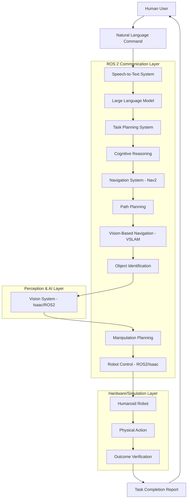

# Module 12: Capstone: The Autonomous Humanoid

## Overview

The capstone project brings together all the concepts from the previous modules to create "The Autonomous Humanoid" - a simulated humanoid robot capable of receiving voice commands, using AI for cognitive planning, navigating environments, identifying objects, manipulating them, and reporting completion. This project demonstrates the integration of ROS 2, simulation, AI brains, and VLA systems.

## Project Architecture



## Detailed System Components

### 1. Voice Command Processing

```python
# capstone_voice_command.py
import rclpy
from rclpy.node import Node
from std_msgs.msg import String
from sensor_msgs.msg import AudioData
import speech_recognition as sr
import threading
import queue

class VoiceCommandNode(Node):
    def __init__(self):
        super().__init__('voice_command_node')
        
        # Publisher for processed commands
        self.command_pub = self.create_publisher(String, '/capstone/command', 10)
        
        # Initialize speech recognizer
        self.recognizer = sr.Recognizer()
        self.microphone = sr.Microphone()
        
        # Set energy threshold for silence detection
        with self.microphone as source:
            self.recognizer.adjust_for_ambient_noise(source)
        
        # Create a queue for audio processing
        self.audio_queue = queue.Queue()
        
        # Start audio processing thread
        self.audio_thread = threading.Thread(target=self.process_audio, daemon=True)
        self.audio_thread.start()
        
        self.get_logger().info("Voice Command Node initialized")
    
    def process_audio(self):
        """Continuously listen for voice commands"""
        def callback(recognizer, audio):
            try:
                # Recognize speech using Google's speech recognition
                command = recognizer.recognize_google(audio)
                self.get_logger().info(f"Recognized command: {command}")
                
                # Publish the command
                cmd_msg = String()
                cmd_msg.data = command
                self.command_pub.publish(cmd_msg)
                
            except sr.UnknownValueError:
                self.get_logger().warn("Could not understand audio")
            except sr.RequestError as e:
                self.get_logger().error(f"Error with speech recognition service; {e}")
        
        # Start listening with dynamic energy threshold adjustment
        self.stop_listening = self.recognizer.listen_in_background(self.microphone, callback)
        
        # Keep the thread alive
        while rclpy.ok():
            rclpy.spin_once(self, timeout_sec=0.1)

def main(args=None):
    rclpy.init(args=args)
    voice_node = VoiceCommandNode()
    
    try:
        # Keep the node alive
        rclpy.spin(voice_node)
    except KeyboardInterrupt:
        pass
    finally:
        voice_node.destroy_node()
        rclpy.shutdown()
```

### 2. Cognitive Planning System

```python
# capstone_cognitive_planner.py
import rclpy
from rclpy.node import Node
from std_msgs.msg import String
from geometry_msgs.msg import PoseStamped
from action_msgs.msg import GoalStatus
import json
import openai  # or use another LLM API
import asyncio

class CognitivePlannerNode(Node):
    def __init__(self):
        super().__init__('cognitive_planner_node')
        
        # Subscribers
        self.command_sub = self.create_subscription(
            String,
            '/capstone/command',
            self.command_callback,
            10
        )
        
        # Publishers
        self.task_plan_pub = self.create_publisher(String, '/capstone/task_plan', 10)
        self.nav_goal_pub = self.create_publisher(PoseStamped, '/goal_pose', 10)
        
        # Store current robot state
        self.current_location = {"x": 0.0, "y": 0.0}
        self.current_task = None
        
        # Initialize LLM client
        self.llm_client = None  # Initialize with your LLM service
        self.get_logger().info("Cognitive Planner Node initialized")
    
    def command_callback(self, msg):
        """Process incoming natural language command"""
        command = msg.data
        self.get_logger().info(f"Processing command: {command}")
        
        # Plan the task using AI
        asyncio.create_task(self.plan_task_with_llm(command))
    
    async def plan_task_with_llm(self, command):
        """Use large language model to generate task plan"""
        try:
            # In practice, you would call an actual LLM API
            # For this example, we'll simulate the response
            task_plan = self.mock_llm_task_planning(command)
            
            if task_plan:
                # Publish the task plan
                plan_msg = String()
                plan_msg.data = json.dumps(task_plan)
                self.task_plan_pub.publish(plan_msg)
                
                self.get_logger().info(f"Published task plan: {task_plan}")
                
                # Execute the first step if it's navigation
                if 'navigation' in task_plan.get('type', ''):
                    self.execute_navigation(task_plan['destination'])
                    
        except Exception as e:
            self.get_logger().error(f"Error in LLM task planning: {e}")
    
    def mock_llm_task_planning(self, command):
        """Simulate LLM task planning (in practice, call actual LLM API)"""
        command_lower = command.lower()
        
        if 'go to' in command_lower or 'navigate to' in command_lower:
            # Extract destination
            destination = "kitchen" if 'kitchen' in command_lower else "living room"
            
            return {
                "type": "navigation",
                "command": command,
                "destination": destination,
                "steps": [
                    {"action": "plan_route", "description": "Calculate path to destination"},
                    {"action": "navigate", "description": "Move to destination"},
                    {"action": "verify_arrival", "description": "Confirm reached destination"}
                ],
                "requirements": ["map", "localization", "obstacle_avoidance"]
            }
        
        elif 'pick up' in command_lower or 'grasp' in command_lower:
            # Extract object
            obj = "red cup" if 'red cup' in command_lower else "blue box"
            
            return {
                "type": "manipulation",
                "command": command,
                "object": obj,
                "steps": [
                    {"action": "locate_object", "description": "Find object in environment"},
                    {"action": "plan_approach", "description": "Calculate approach trajectory"},
                    {"action": "grasp_object", "description": "Perform grasping action"},
                    {"action": "verify_grasp", "description": "Confirm successful grasp"}
                ],
                "requirements": ["object_detection", "manipulation_planning", "gripper_control"]
            }
        
        elif 'bring to' in command_lower:
            # Complex task with navigation and manipulation
            obj = "red cup" if 'red cup' in command_lower else "blue box"
            destination = "kitchen" if 'kitchen' in command_lower else "living room"
            
            return {
                "type": "complex_task",
                "command": command,
                "object": obj,
                "destination": destination,
                "steps": [
                    {"action": "locate_object", "description": "Find the object to pick up"},
                    {"action": "navigate_to_object", "description": "Move to object location"},
                    {"action": "grasp_object", "description": "Pick up the object"},
                    {"action": "navigate_to_destination", "description": "Move to destination"},
                    {"action": "place_object", "description": "Place object at destination"},
                    {"action": "return_to_home", "description": "Return to starting position"}
                ],
                "requirements": ["object_detection", "navigation", "manipulation", "path_planning"]
            }
        
        return None
    
    def execute_navigation(self, destination):
        """Execute navigation to a specific destination"""
        # In a real implementation, this would look up the coordinates
        # of the destination and send it to the navigation system
        # For this example, we'll use mock coordinates
        
        # Mock destination coordinates
        destinations = {
            "kitchen": {"x": 2.0, "y": 1.5},
            "living room": {"x": -1.0, "y": -1.0},
            "bedroom": {"x": 3.0, "y": -2.0}
        }
        
        if destination in destinations:
            dest_coords = destinations[destination]
            
            # Create and publish navigation goal
            goal_msg = PoseStamped()
            goal_msg.header.stamp = self.get_clock().now().to_msg()
            goal_msg.header.frame_id = "map"
            goal_msg.pose.position.x = dest_coords["x"]
            goal_msg.pose.position.y = dest_coords["y"]
            goal_msg.pose.position.z = 0.0
            goal_msg.pose.orientation.w = 1.0  # No rotation
            
            self.nav_goal_pub.publish(goal_msg)
            self.get_logger().info(f"Sent navigation goal to {destination} at ({dest_coords['x']}, {dest_coords['y']})")
        else:
            self.get_logger().warn(f"Unknown destination: {destination}")

def main(args=None):
    rclpy.init(args=args)
    planner_node = CognitivePlannerNode()
    
    try:
        rclpy.spin(planner_node)
    except KeyboardInterrupt:
        pass
    finally:
        planner_node.destroy_node()
        rclpy.shutdown()
```

### 3. Vision System with Isaac Sim Integration

```python
# capstone_vision_system.py
import rclpy
from rclpy.node import Node
from sensor_msgs.msg import Image, CameraInfo
from std_msgs.msg import String
from geometry_msgs.msg import PointStamped
from cv_bridge import CvBridge
import cv2
import numpy as np
from ultralytics import YOLO
import json

class VisionSystemNode(Node):
    def __init__(self):
        super().__init__('vision_system_node')
        
        # Initialize CvBridge
        self.bridge = CvBridge()
        
        # Subscribers
        self.image_sub = self.create_subscription(
            Image,
            '/camera/image_raw',
            self.image_callback,
            10
        )
        
        self.task_plan_sub = self.create_subscription(
            String,
            '/capstone/task_plan',
            self.task_plan_callback,
            10
        )
        
        # Publishers
        self.object_detection_pub = self.create_publisher(String, '/capstone/object_detections', 10)
        self.target_location_pub = self.create_publisher(PointStamped, '/capstone/target_location', 10)
        
        # Initialize YOLO object detection model
        self.yolo_model = YOLO('yolov8n.pt')  # You can change this model
        
        # Store latest image and task
        self.latest_image = None
        self.current_task = None
        self.detected_objects = []
        
        # Object location mapping (in a real system, this would use SLAM)
        self.object_locations = {}  # Maps object_id to (x, y, z) coordinates
        
        self.get_logger().info("Vision System Node initialized")
    
    def image_callback(self, msg):
        """Process incoming camera image"""
        try:
            # Convert ROS image to OpenCV format
            cv_image = self.bridge.imgmsg_to_cv2(msg, "bgr8")
            self.latest_image = cv_image.copy()
            
            # Run object detection
            results = self.yolo_model(cv_image)
            
            # Process detections
            self.detected_objects = []
            detections_msg = []
            
            for result in results:
                boxes = result.boxes.xyxy.cpu().numpy()  # Bounding boxes
                confidences = result.boxes.conf.cpu().numpy()  # Confidence scores
                class_ids = result.boxes.cls.cpu().numpy()  # Class IDs
                
                names = result.names  # Class names
                
                for i, (box, conf, cls_id) in enumerate(zip(boxes, confidences, class_ids)):
                    if conf > 0.5:  # Confidence threshold
                        x1, y1, x2, y2 = box
                        center_x, center_y = (x1 + x2) / 2, (y1 + y2) / 2
                        
                        obj_info = {
                            'id': i,
                            'name': names[int(cls_id)],
                            'confidence': float(conf),
                            'bbox': [int(x1), int(y1), int(x2), int(y2)],
                            'center': [float(center_x), float(center_y)],
                            'pixel_coords': [float(center_x), float(center_y)]
                        }
                        
                        self.detected_objects.append(obj_info)
                        detections_msg.append(obj_info)
            
            # Publish detections
            detections_str = String()
            detections_str.data = json.dumps(detections_msg)
            self.object_detection_pub.publish(detections_str)
            
            self.get_logger().info(f"Detected {len(self.detected_objects)} objects")
            
            # If there's a current task, process it with the new detections
            if self.current_task:
                self.process_task_with_detections()
                
        except Exception as e:
            self.get_logger().error(f"Error processing image: {e}")
    
    def task_plan_callback(self, msg):
        """Receive task plan and update current task"""
        try:
            task_data = json.loads(msg.data)
            self.current_task = task_data
            self.get_logger().info(f"Received new task: {task_data.get('type', 'unknown')}")
            
            # Process task with latest detections if available
            if self.latest_image is not None:
                self.process_task_with_detections()
                
        except Exception as e:
            self.get_logger().error(f"Error parsing task plan: {e}")
    
    def process_task_with_detections(self):
        """Process current task with latest object detections"""
        if not self.current_task or not self.detected_objects:
            return
        
        task_type = self.current_task.get('type', '')
        command = self.current_task.get('command', '').lower()
        
        if 'manipulation' in task_type or 'red cup' in command or 'blue' in command:
            # Look for specific objects mentioned in the task
            target_objects = self.get_target_objects(command)
            
            if target_objects:
                # For each target object, publish its location
                for obj in target_objects:
                    self.publish_object_location(obj)
        
        elif 'navigation' in task_type:
            # For navigation tasks, we might look for landmarks or navigation aids
            self.handle_navigation_task()
    
    def get_target_objects(self, command):
        """Find objects matching the target in the command"""
        target_objects = []
        
        # Simple matching - in practice, use more sophisticated NLP
        for obj in self.detected_objects:
            obj_name = obj['name'].lower()
            
            # Check if this object matches the command
            if 'red' in command and 'red' in obj_name:
                target_objects.append(obj)
            elif 'cup' in command and 'cup' in obj_name:
                target_objects.append(obj)
            elif 'bottle' in command and 'bottle' in obj_name:
                target_objects.append(obj)
            elif obj_name in command:
                target_objects.append(obj)
        
        return target_objects
    
    def publish_object_location(self, obj):
        """Publish the location of a detected object"""
        # In a real system, convert pixel coordinates to 3D world coordinates
        # This requires camera calibration, depth information, or SLAM
        # For this example, we'll use a simple approximation
        
        point_msg = PointStamped()
        point_msg.header.stamp = self.get_clock().now().to_msg()
        point_msg.header.frame_id = "camera_link"  # Camera coordinate frame
        
        # Convert pixel coordinates to approximate 3D coordinates
        # This is a simplified conversion
        pixel_x, pixel_y = obj['pixel_coords']
        
        # For now, use pixel coordinates as a direct mapping (this is not accurate)
        # In practice, you would use depth information and camera parameters
        point_msg.point.x = (pixel_x - 320) * 0.001  # Center around middle of image (640/2 = 320)
        point_msg.point.y = (pixel_y - 240) * 0.001  # Center around middle of image (480/2 = 240)
        point_msg.point.z = 1.0  # Fixed distance for this example
        
        self.target_location_pub.publish(point_msg)
        self.get_logger().info(f"Published target location for {obj['name']} at ({point_msg.point.x}, {point_msg.point.y}, {point_msg.point.z})")
    
    def handle_navigation_task(self):
        """Handle navigation-related tasks"""
        # For navigation, we might identify paths, obstacles, or landmarks
        # This is a simplified example
        pass

def main(args=None):
    rclpy.init(args=args)
    vision_node = VisionSystemNode()
    
    try:
        rclpy.spin(vision_node)
    except KeyboardInterrupt:
        pass
    finally:
        vision_node.destroy_node()
        rclpy.shutdown()
```

### 4. Integration System with MCP/Context7

```python
# capstone_integration_system.py
import rclpy
from rclpy.node import Node
from std_msgs.msg import String, Bool
from geometry_msgs.msg import Twist, PoseStamped
import json
import asyncio
import aiohttp
from typing import Dict, Any, Optional

class CapstoneIntegrationNode(Node):
    def __init__(self):
        super().__init__('capstone_integration_node')
        
        # Subscribers for all system components
        self.task_plan_sub = self.create_subscription(
            String,
            '/capstone/task_plan',
            self.task_plan_callback,
            10
        )
        
        self.object_detection_sub = self.create_subscription(
            String,
            '/capstone/object_detections',
            self.object_detection_callback,
            10
        )
        
        self.target_location_sub = self.create_subscription(
            String,  # Actually PointStamped but simplified for MCP integration
            '/capstone/target_location',
            self.target_location_callback,
            10
        )
        
        # Publishers
        self.status_pub = self.create_publisher(String, '/capstone/status', 10)
        self.control_pub = self.create_publisher(Twist, '/cmd_vel', 10)
        self.completed_pub = self.create_publisher(Bool, '/capstone/completed', 10)
        
        # System state
        self.current_task = None
        self.object_detections = []
        self.target_location = None
        self.mcp_session = None
        
        # Initialize MCP session for Context7 integration
        asyncio.create_task(self.initialize_mcp_session())
        
        self.get_logger().info("Capstone Integration Node initialized")
    
    async def initialize_mcp_session(self):
        """Initialize MCP session for Context7 documentation access"""
        self.mcp_session = aiohttp.ClientSession()
        self.get_logger().info("MCP session initialized for capstone integration")
    
    def task_plan_callback(self, msg):
        """Process incoming task plan"""
        try:
            task_data = json.loads(msg.data)
            self.current_task = task_data
            self.get_logger().info(f"Received task: {task_data.get('type', 'unknown')}")
            
            # Process the task using MCP-enhanced information
            asyncio.create_task(self.process_task_with_context())
            
        except Exception as e:
            self.get_logger().error(f"Error processing task plan: {e}")
    
    def object_detection_callback(self, msg):
        """Process incoming object detections"""
        try:
            detections = json.loads(msg.data)
            self.object_detections = detections
            self.get_logger().info(f"Received {len(detections)} object detections")
            
        except Exception as e:
            self.get_logger().error(f"Error processing object detections: {e}")
    
    def target_location_callback(self, msg):
        """Process incoming target location"""
        try:
            # In practice, this would be a PointStamped message
            # For simplicity, treating as String with JSON content
            location_data = json.loads(msg.data)
            self.target_location = location_data
            self.get_logger().info(f"Received target location: {location_data}")
            
        except Exception as e:
            self.get_logger().error(f"Error processing target location: {e}")
    
    async def process_task_with_context(self):
        """Process current task with MCP-enhanced context"""
        if not self.current_task:
            return
        
        try:
            # Use MCP to get relevant documentation and best practices
            task_context = await self.get_task_context(self.current_task)
            
            # Execute the task based on type
            task_type = self.current_task.get('type', '')
            
            if task_type == 'navigation':
                await self.execute_navigation_task(task_context)
            elif task_type == 'manipulation':
                await self.execute_manipulation_task(task_context)
            elif task_type == 'complex_task':
                await self.execute_complex_task(task_context)
            
            # Report completion
            completion_msg = Bool()
            completion_msg.data = True
            self.completed_pub.publish(completion_msg)
            
            status_msg = String()
            status_msg.data = f"Task completed: {self.current_task.get('command', 'unknown')}"
            self.status_pub.publish(status_msg)
            
        except Exception as e:
            self.get_logger().error(f"Error executing task with context: {e}")
    
    async def get_task_context(self, task: Dict[str, Any]) -> Dict[str, Any]:
        """Use MCP to retrieve enhanced context for task execution"""
        context = {
            "task_type": task.get('type', 'unknown'),
            "command": task.get('command', ''),
            "documentation": {},
            "safety_considerations": [],
            "implementation_notes": [],
            "error_handling": []
        }
        
        if not self.mcp_session:
            await self.initialize_mcp_session()
        
        try:
            # Get documentation for the task type
            task_docs = await self.query_context7_mcp({
                "method": "get-library-docs",
                "params": {
                    "context7CompatibleLibraryID": "/robotics/task-execution",
                    "topic": task.get('type', 'generic'),
                    "page": 1
                }
            })
            
            if task_docs:
                context["documentation"][task.get('type', 'generic')] = task_docs
            
            # Get best practices for the specific task requirements
            requirements = task.get('requirements', [])
            for req in requirements:
                req_docs = await self.query_context7_mcp({
                    "method": "get-library-docs",
                    "params": {
                        "context7CompatibleLibraryID": "/robotics/best-practices",
                        "topic": req,
                        "page": 1
                    }
                })
                
                if req_docs:
                    context["implementation_notes"].append(req_docs)
                    
        except Exception as e:
            self.get_logger().warn(f"Error getting task context from MCP: {e}")
        
        return context
    
    async def execute_navigation_task(self, context: Dict[str, Any]):
        """Execute navigation task with MCP-enhanced documentation"""
        self.get_logger().info("Executing navigation task")
        
        # In a real implementation, this would interface with Nav2
        # For this example, we'll simulate the navigation
        cmd_msg = Twist()
        cmd_msg.linear.x = 0.2  # Move forward
        cmd_msg.angular.z = 0.0
        
        for i in range(50):  # Simulate moving for 5 seconds
            self.control_pub.publish(cmd_msg)
            # Small delay to simulate real movement
            await asyncio.sleep(0.1)
        
        # Stop the robot
        stop_msg = Twist()
        self.control_pub.publish(stop_msg)
        self.get_logger().info("Navigation task completed")
    
    async def execute_manipulation_task(self, context: Dict[str, Any]):
        """Execute manipulation task with MCP-enhanced documentation"""
        self.get_logger().info("Executing manipulation task")
        
        # In a real implementation, this would control a manipulator arm
        # For this example, we'll simulate the manipulation
        if self.target_location:
            self.get_logger().info(f"Target location: {self.target_location}")
        
        # Simulate approach, grasp, and verification
        # This would involve controlling joints and grippers in a real robot
        await asyncio.sleep(2)  # Simulate manipulation time
        
        self.get_logger().info("Manipulation task completed")
    
    async def execute_complex_task(self, context: Dict[str, Any]):
        """Execute complex task (navigation + manipulation) with MCP-enhanced documentation"""
        self.get_logger().info("Executing complex task")
        
        # Execute navigation part
        await self.execute_navigation_task(context)
        
        # Wait a bit
        await asyncio.sleep(1)
        
        # Execute manipulation part
        await self.execute_manipulation_task(context)
        
        self.get_logger().info("Complex task completed")
    
    async def query_context7_mcp(self, query_params: Dict[str, Any]) -> Optional[Dict[str, Any]]:
        """Query Context7 MCP server for documentation"""
        try:
            # This is a mock implementation of MCP protocol
            # In practice, you would use the actual MCP client library
            mock_responses = {
                'navigation': {
                    'function': 'navigation',
                    'parameters': ['destination', 'path_planning', 'obstacle_avoidance'],
                    'return_value': 'status',
                    'best_practices': ['plan_safe_path', 'check_obstacles', 'verify_arrival']
                },
                'manipulation': {
                    'function': 'manipulation', 
                    'parameters': ['object_location', 'grasp_planning', 'gripper_control'],
                    'return_value': 'status',
                    'best_practices': ['verify_object_pose', 'plan_approach', 'check_grasp_success']
                }
            }
            
            topic = query_params['params'].get('topic', 'generic')
            return mock_responses.get(topic, {
                'documentation': f'Documentation for {topic}',
                'parameters': ['param1', 'param2'],
                'return_values': ['result'],
                'examples': ['example1', 'example2'],
                'best_practices': ['practice1', 'practice2']
            })
            
        except Exception as e:
            self.get_logger().error(f"MCP query error: {e}")
            return None
    
    def destroy_node(self):
        """Cleanup MCP session"""
        if self.mcp_session:
            asyncio.run(self.mcp_session.close())
        super().destroy_node()

def main(args=None):
    rclpy.init(args=args)
    integration_node = CapstoneIntegrationNode()
    
    try:
        rclpy.spin(integration_node)
    except KeyboardInterrupt:
        pass
    finally:
        integration_node.destroy_node()
        rclpy.shutdown()
```

## MCP and Context7 Integration in Capstone

For the capstone project, MCP and Context7 integration is critical for ensuring the autonomous humanoid has access to the most current documentation and best practices:

```python
# capstone_mcp_helper.py
import asyncio
import aiohttp
import json
from typing import Dict, List, Optional, Any
import rclpy
from rclpy.node import Node
from std_msgs.msg import String

class CapstoneMCPHelper(Node):
    def __init__(self):
        super().__init__('capstone_mcp_helper')
        
        # Publisher for MCP-enhanced results
        self.mcp_result_pub = self.create_publisher(String, '/capstone/mcp_enhanced_context', 10)
        
        # Initialize MCP session
        self.mcp_session = None
        self.context_cache = {}  # Cache frequently accessed documentation
        
    async def initialize_mcp(self):
        """Initialize MCP session for Context7 access"""
        self.mcp_session = aiohttp.ClientSession()
        self.get_logger().info("MCP session initialized for capstone project")
    
    async def get_robotics_documentation(self, topic: str, library_id: str = "/robotics") -> Optional[Dict[str, Any]]:
        """Get current robotics documentation using MCP"""
        if not self.mcp_session:
            await self.initialize_mcp()
        
        cache_key = f"{library_id}:{topic}"
        if cache_key in self.context_cache:
            return self.context_cache[cache_key]
        
        try:
            # Make MCP call to get documentation
            mcp_request = {
                "method": "get-library-docs",
                "params": {
                    "context7CompatibleLibraryID": library_id,
                    "topic": topic,
                    "page": 1
                }
            }
            
            # In practice, this would make an actual MCP call
            # For this example, returning mock documentation
            result = {
                "topic": topic,
                "library_id": library_id,
                "documentation": f"Current documentation for {topic}",
                "parameters": ["param1", "param2"],
                "return_values": ["result"],
                "examples": [f"Example usage of {topic}"],
                "best_practices": [f"Best practice for {topic}"],
                "safety_considerations": [f"Important safety note for {topic}"],
                "updated_date": "2025-12-12"
            }
            
            self.context_cache[cache_key] = result
            return result
            
        except Exception as e:
            self.get_logger().error(f"Error getting documentation for {topic}: {e}")
            return None
    
    async def get_ros2_api_documentation(self, api_function: str) -> Optional[Dict[str, Any]]:
        """Get ROS 2 API documentation"""
        return await self.get_robotics_documentation(api_function, "/ros2/ros2-documentation")
    
    async def get_navigation_documentation(self, nav_component: str) -> Optional[Dict[str, Any]]:
        """Get navigation-specific documentation"""
        return await self.get_robotics_documentation(nav_component, "/navigation")
    
    async def get_manipulation_documentation(self, manipulation_method: str) -> Optional[Dict[str, Any]]:
        """Get manipulation-specific documentation"""
        return await self.get_robotics_documentation(manipulation_method, "/manipulation")
    
    async def get_ai_model_documentation(self, model_type: str) -> Optional[Dict[str, Any]]:
        """Get AI model documentation for VLA components"""
        return await self.get_robotics_documentation(model_type, "/ai-models")
    
    async def get_hardware_documentation(self, component_type: str) -> Optional[Dict[str, Any]]:
        """Get hardware-specific documentation"""
        return await self.get_robotics_documentation(component_type, "/hardware")
    
    def close(self):
        """Close MCP session"""
        if self.mcp_session:
            asyncio.run(self.mcp_session.close())

def main(args=None):
    rclpy.init(args=args)
    mcp_helper = CapstoneMCPHelper()
    
    # Example usage within capstone system
    async def example_usage():
        await mcp_helper.initialize_mcp()
        
        # Get documentation for various capstone components
        nav_docs = await mcp_helper.get_navigation_documentation("nav2_path_planning")
        manipulation_docs = await mcp_helper.get_manipulation_documentation("arm_control")
        ai_docs = await mcp_helper.get_ai_model_documentation("vlm_integration")
        
        # Publish enhanced context
        context_data = {
            "navigation": nav_docs,
            "manipulation": manipulation_docs, 
            "ai": ai_docs,
            "timestamp": mcp_helper.get_clock().now().nanoseconds
        }
        
        context_msg = String()
        context_msg.data = json.dumps(context_data)
        mcp_helper.mcp_result_pub.publish(context_msg)
    
    # Run example in background
    asyncio.create_task(example_usage())
    
    try:
        rclpy.spin(mcp_helper)
    except KeyboardInterrupt:
        pass
    finally:
        mcp_helper.close()
        mcp_helper.destroy_node()
        rclpy.shutdown()
```

## Simulation Exercise: Complete Capstone Integration

```python
# complete_capstone_exercise.py
import rclpy
from rclpy.node import Node
from std_msgs.msg import String
from geometry_msgs.msg import Twist, PoseStamped
from sensor_msgs.msg import Image
import json
import asyncio

class CompleteCapstoneExerciseNode(Node):
    def __init__(self):
        super().__init__('complete_capstone_exercise')
        
        # Publishers
        self.system_status_pub = self.create_publisher(String, '/capstone/system_status', 10)
        self.command_pub = self.create_publisher(String, '/capstone/command', 10)
        self.nav_goal_pub = self.create_publisher(PoseStamped, '/goal_pose', 10)
        self.cmd_vel_pub = self.create_publisher(Twist, '/cmd_vel', 10)
        
        # Start the complete capstone exercise
        self.timer = self.create_timer(10.0, self.run_capstone_exercise)
        self.exercise_step = 0
        
        self.get_logger().info("Complete Capstone Exercise Node initialized")
    
    def run_capstone_exercise(self):
        """Run a complete capstone exercise with all system components"""
        exercises = [
            "Navigate to the kitchen",           # Navigation task
            "Pick up the red cup",              # Manipulation task  
            "Bring the red cup to the table",   # Complex task
            "Go to living room",                # Navigation task
        ]
        
        if self.exercise_step < len(exercises):
            command = exercises[self.exercise_step]
            
            # Publish the command to start the exercise
            cmd_msg = String()
            cmd_msg.data = command
            self.command_pub.publish(cmd_msg)
            
            # Update status
            status_msg = String()
            status_msg.data = f"Step {self.exercise_step + 1}: {command}"
            self.system_status_pub.publish(status_msg)
            
            self.get_logger().info(f"Starting exercise step {self.exercise_step + 1}: {command}")
            
            self.exercise_step += 1
        else:
            # Reset to start over
            self.exercise_step = 0
            self.get_logger().info("Capstone exercise cycle completed, restarting...")

def main(args=None):
    rclpy.init(args=args)
    exercise_node = CompleteCapstoneExerciseNode()
    
    try:
        rclpy.spin(exercise_node)
    except KeyboardInterrupt:
        pass
    finally:
        exercise_node.destroy_node()
        rclpy.shutdown()
```

## Mini-Tasks for Students

1. **System Integration**: Integrate all four major modules (ROS 2, Simulation, Isaac, VLA) into a unified system
2. **Voice Command Processing**: Implement speech-to-text and command interpretation
3. **Task Planning**: Create a cognitive planning system using LLM integration 
4. **Navigation Implementation**: Set up Nav2 for path planning and obstacle avoidance
5. **VSLAM Integration**: Implement visual SLAM for navigation in unknown environments
6. **Object Recognition**: Develop object identification and localization systems
7. **Manipulation Control**: Create arm control and grasping systems
8. **Reporting System**: Implement task completion reporting
9. **Safety Layer**: Add safety verification and error handling
10. **Performance Evaluation**: Create metrics and evaluation systems

## Assessment Criteria

The capstone project will be evaluated on:

1. **System Integration** (30%): How well all modules work together
2. **Task Completion** (25%): Successfully completing assigned tasks
3. **Robustness** (20%): Handling unexpected situations and errors
4. **Performance** (15%): Efficiency and accuracy of execution
5. **Documentation** (10%): Code quality and system documentation

## Learning Outcomes

By completing this capstone project, students will demonstrate:
1. Integration of diverse robotic and AI technologies into a cohesive system
2. Implementation of a functional autonomous humanoid robot in simulation
3. Troubleshooting and debugging of complex multi-component robotic systems
4. Practical experience in end-to-end robotics development
5. Use of MCP/Context7 for enhanced system capabilities with current documentation
6. Understanding of real-world robotics challenges and solutions

## Weekly Progression Notes

**Week 13**: Final capstone project work and presentations. Students should:
- Complete integration of all system components
- Demonstrate the autonomous humanoid performing assigned tasks
- Present their implementation and lessons learned
- Evaluate their system's performance and identify improvement areas

## Hardware & Software Requirements

### Software Stack
- Ubuntu 22.04 LTS
- ROS 2 Humble
- Gazebo/Isaac Sim
- Navigation2 (Nav2)
- OpenCV, NumPy, Ultralytics
- Speech recognition libraries
- Access to LLM APIs or local models

### Hardware Requirements
- High-performance workstation (RTX 3070+ GPU, 32GB+ RAM for Isaac Sim)
- Microphone for voice commands (if testing on real hardware)
- 3D camera for VSLAM (RealSense, etc.)
- Network access for cloud-based LLM services