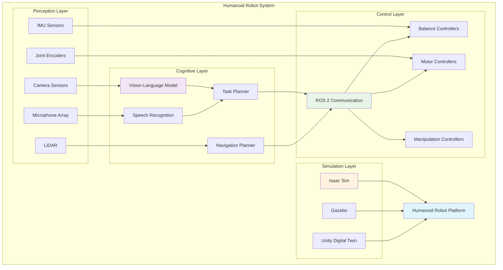
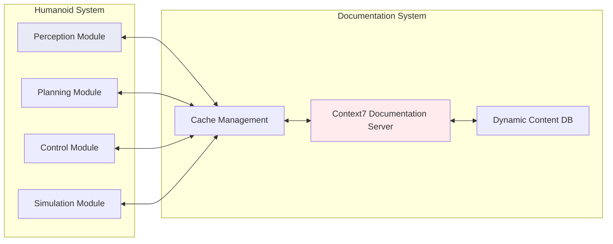

# Capstone: The Autonomous Humanoid - A Comprehensive Integration Project

## Table of Contents
1. [Introduction](#introduction)
2. [Deep Technical Analysis](#deep-technical-analysis)
3. [System Architecture](#system-architecture)
4. [Module Integration](#module-integration)
5. [Implementation Phases](#implementation-phases)
6. [Context7 Integration for Documentation](#context7-integration-for-documentation)
7. [Simulation Environment Setup](#simulation-environment-setup)
8. [AI Policy Development](#ai-policy-development)
9. [Testing and Validation](#testing-and-validation)
10. [Real-World Deployment Considerations](#real-world-deployment-considerations)
11. [Performance Optimization](#performance-optimization)
12. [Security and Safety](#security-and-safety)
13. [Future Enhancements](#future-enhancements)
14. [Summary](#summary)

## Introduction

The Autonomous Humanoid capstone project represents the pinnacle of the Physical AI Robotics curriculum, providing students with an opportunity to integrate and apply all theoretical and practical concepts learned throughout the course. This comprehensive project challenges students to design, implement, and demonstrate a fully autonomous humanoid robot that can perceive its environment, understand natural language commands, plan complex tasks, and execute precise motor control actions.

The humanoid robot system integrates four critical modules:
- **Module 1**: The Robotic Nervous System (ROS 2) for communication and control
- **Module 2**: The Digital Twin (Gazebo & Unity) for physics simulation and environment modeling
- **Module 3**: The AI-Robot Brain (NVIDIA Isaac™) for advanced perception and training
- **Module 4**: Vision-Language-Action (VLA) for natural language interaction

This capstone project emphasizes the convergence of robotics, artificial intelligence, and human-robot interaction, requiring students to demonstrate proficiency in system integration, multi-modal perception, and autonomous decision-making. The project serves as a comprehensive assessment of students' ability to create sophisticated, autonomous robotic systems.

The integration of Context7 documentation systems enhances the development process by providing immediate access to up-to-date best practices, API references, and implementation guidelines. This integration streamlines the development workflow and ensures that implementations align with current best practices.

## Deep Technical Analysis

### Multi-Modal Integration Requirements

The autonomous humanoid system requires sophisticated integration of multiple technological domains:

1. **Sensory Integration**: Real-time fusion of visual, auditory, and proprioceptive sensors
2. **Cognitive Architecture**: Multi-level reasoning with perception, planning, and execution
3. **Real-time Control**: Low-latency motor control with high precision
4. **Natural Interaction**: Seamless human-robot communication through multiple modalities

### System Complexity Analysis

The technical complexity of the autonomous humanoid project stems from:

1. **High-Dimensional Control**: 20+ degrees of freedom requiring coordinated control
2. **Dynamic Balancing**: Continuous center-of-mass management for bipedal locomotion
3. **Multi-Modal Perception**: Integration of camera, microphone, IMU, and joint sensors
4. **Natural Language Understanding**: Complex NLP for command interpretation
5. **Real-Time Constraints**: Sub-100ms response times for safety and efficiency
6. **Uncertainty Management**: Robust operation in unpredictable environments

### Computational Requirements

The autonomous humanoid system demands significant computational resources:

- **Perception**: Real-time computer vision (100+ GFLOPS)
- **Planning**: Complex pathfinding and task planning (50+ GFLOPS)
- **Control**: High-frequency control loops (10+ GFLOPS)
- **AI Inference**: Large language and vision models (200+ GFLOPS)

## System Architecture

### High-Level Architecture



### Component Interactions

The system operates through multiple interconnected components:

1. **Sensor Fusion Node**: Aggregates data from all sensors and provides unified perception
2. **Language Understanding System**: Processes natural language commands into executable tasks
3. **Task Planning Engine**: Decomposes high-level goals into sequences of actions
4. **Motion Planning System**: Generates collision-free paths for navigation and manipulation
5. **Low-Level Controllers**: Execute precise motor commands with real-time performance
6. **Simulation Interface**: Maintains synchronization between real and simulated worlds

### Context7 Integration Architecture



The Context7 integration provides:
- Real-time access to API documentation
- Best practices and implementation guides
- Troubleshooting resources
- Performance optimization techniques

## Module Integration

### Module 1: The Robotic Nervous System (ROS 2)

The ROS 2 communication framework serves as the backbone of the autonomous humanoid system:

```python
# Example of ROS 2 integration for the autonomous humanoid
import rclpy
from rclpy.node import Node
from rclpy.qos import QoSProfile, ReliabilityPolicy, HistoryPolicy
from sensor_msgs.msg import Image, JointState, Imu, LaserScan
from std_msgs.msg import String
from geometry_msgs.msg import Twist, PoseStamped
from std_srvs.srv import Trigger, SetBool
from builtin_interfaces.msg import Duration
import threading
import time
import json

class AutonomousHumanoidNode(Node):
    """
    Main node integrating all modules for autonomous humanoid operation
    """
    
    def __init__(self):
        super().__init__('autonomous_humanoid_node')
        
        # QoS profiles for different data types
        self.high_freq_qos = QoSProfile(
            depth=10,
            reliability=ReliabilityPolicy.BEST_EFFORT,
            history=HistoryPolicy.KEEP_LAST
        )
        
        self.reliable_qos = QoSProfile(
            depth=20,
            reliability=ReliabilityPolicy.RELIABLE,
            history=HistoryPolicy.KEEP_LAST
        )
        
        # Publishers for all subsystems
        self.cmd_vel_pub = self.create_publisher(Twist, 'cmd_vel', self.reliable_qos)
        self.joint_cmd_pub = self.create_publisher(JointState, 'joint_commands', self.reliable_qos)
        self.task_pub = self.create_publisher(String, 'task_commands', self.reliable_qos)
        self.navigation_goal_pub = self.create_publisher(PoseStamped, 'move_base_simple/goal', self.reliable_qos)
        
        # Subscribers for all sensors
        self.camera_sub = self.create_subscription(Image, 'camera/image_raw', self.camera_callback, self.high_freq_qos)
        self.imu_sub = self.create_subscription(Imu, 'imu/data', self.imu_callback, self.high_freq_qos)
        self.joint_state_sub = self.create_subscription(JointState, 'joint_states', self.joint_state_callback, self.high_freq_qos)
        self.scan_sub = self.create_subscription(LaserScan, 'scan', self.scan_callback, self.high_freq_qos)
        self.voice_sub = self.create_subscription(String, 'voice_commands', self.voice_callback, self.reliable_qos)
        
        # Services for system control
        self.start_service = self.create_service(Trigger, 'start_autonomous_mode', self.start_autonomous_callback)
        self.stop_service = self.create_service(Trigger, 'stop_autonomous_mode', self.stop_autonomous_callback)
        self.reset_service = self.create_service(Trigger, 'reset_system', self.reset_system_callback)
        
        # System state
        self.system_state = {
            'is_autonomous': False,
            'current_task': None,
            'navigation_active': False,
            'balance_active': True,
            'safety_status': 'normal'
        }
        
        # Sensor data storage
        self.sensor_data = {
            'camera_image': None,
            'imu_data': None,
            'joint_states': {},
            'laser_scan': None,
            'voice_commands': []
        }
        
        # Control loops
        self.control_timer = self.create_timer(0.05, self.control_loop)  # 20 Hz
        self.planning_timer = self.create_timer(1.0, self.planning_loop)  # 1 Hz
        self.monitoring_timer = self.create_timer(0.5, self.monitoring_loop)  # 2 Hz
        
        self.get_logger().info('Autonomous Humanoid System initialized')
    
    def camera_callback(self, msg):
        """Handle camera image data"""
        self.sensor_data['camera_image'] = msg
        # Process image for object detection, scene understanding, etc.
    
    def imu_callback(self, msg):
        """Handle IMU data for balance control"""
        self.sensor_data['imu_data'] = msg
        if self.system_state['balance_active']:
            self.update_balance_control(msg)
    
    def joint_state_callback(self, msg):
        """Handle joint state feedback"""
        for i, name in enumerate(msg.name):
            if i < len(msg.position):
                self.sensor_data['joint_states'][name] = {
                    'position': msg.position[i],
                    'velocity': msg.velocity[i] if i < len(msg.velocity) else 0.0,
                    'effort': msg.effort[i] if i < len(msg.effort) else 0.0
                }
    
    def scan_callback(self, msg):
        """Handle laser scan for obstacle detection"""
        self.sensor_data['laser_scan'] = msg
        # Update navigation planning based on obstacles
    
    def voice_callback(self, msg):
        """Handle voice commands from VLA system"""
        try:
            command_data = json.loads(msg.data)
            self.sensor_data['voice_commands'].append(command_data)
            
            # Process command if autonomous mode active
            if self.system_state['is_autonomous']:
                self.process_voice_command(command_data)
        except json.JSONDecodeError:
            self.get_logger().error(f'Invalid voice command: {msg.data}')
    
    def start_autonomous_callback(self, request, response):
        """Start autonomous operation"""
        self.system_state['is_autonomous'] = True
        response.success = True
        response.message = 'Autonomous mode activated'
        self.get_logger().info('Autonomous mode activated')
        return response
    
    def stop_autonomous_callback(self, request, response):
        """Stop autonomous operation"""
        self.system_state['is_autonomous'] = False
        # Stop all motion
        stop_msg = Twist()
        self.cmd_vel_pub.publish(stop_msg)
        response.success = True
        response.message = 'Autonomous mode deactivated'
        self.get_logger().info('Autonomous mode deactivated')
        return response
    
    def reset_system_callback(self, request, response):
        """Reset system to initial state"""
        self.system_state = {
            'is_autonomous': False,
            'current_task': None,
            'navigation_active': False,
            'balance_active': True,
            'safety_status': 'normal'
        }
        response.success = True
        response.message = 'System reset complete'
        self.get_logger().info('System reset complete')
        return response
    
    def control_loop(self):
        """Main control loop for real-time operations"""
        if not self.system_state['is_autonomous']:
            return
        
        # Execute current task
        if self.system_state['current_task']:
            self.execute_current_task()
        
        # Maintain balance
        if self.system_state['balance_active']:
            self.maintain_balance()
        
        # Avoid obstacles
        self.obstacle_avoidance()
    
    def planning_loop(self):
        """Higher-level planning operations"""
        if not self.system_state['is_autonomous']:
            return
        
        # Update task planning based on current state and goals
        self.update_task_planning()
    
    def monitoring_loop(self):
        """System monitoring and health checks"""
        # Check sensor availability
        self.check_sensor_health()
        
        # Update system status
        self.update_system_status()
    
    def update_balance_control(self, imu_data):
        """Update balance control based on IMU data"""
        # Implement balance control algorithm
        # This would use PID controllers, model-based control, or learning-based methods
        pass
    
    def process_voice_command(self, command_data):
        """Process natural language command and update task queue"""
        command = command_data.get('text', '').lower()
        confidence = command_data.get('confidence', 0.0)
        
        if confidence < 0.6:  # Minimum confidence threshold
            self.get_logger().warn(f'Low confidence command: {command}')
            return
        
        # Map natural language to system commands
        if 'go to' in command or 'navigate to' in command:
            # Extract location and create navigation task
            self.create_navigation_task(command)
        elif 'pick up' in command or 'grasp' in command:
            # Extract object and create manipulation task
            self.create_manipulation_task(command)
        elif 'stop' in command:
            self.stop_robot()
        else:
            self.get_logger().info(f'Command not recognized: {command}')
    
    def create_navigation_task(self, command):
        """Create navigation task based on voice command"""
        # In a real system, this would parse the command for specific locations
        task = {
            'type': 'navigation',
            'target': self.extract_location_from_command(command),
            'priority': 5
        }
        self.system_state['current_task'] = task
        self.get_logger().info(f'Created navigation task: {task}')
    
    def create_manipulation_task(self, command):
        """Create manipulation task based on voice command"""
        # In a real system, this would parse the command for specific objects
        task = {
            'type': 'manipulation',
            'target_object': self.extract_object_from_command(command),
            'action': 'grasp',
            'priority': 6
        }
        self.system_state['current_task'] = task
        self.get_logger().info(f'Created manipulation task: {task}')
    
    def execute_current_task(self):
        """Execute the current high-level task"""
        task = self.system_state['current_task']
        if not task:
            return
        
        if task['type'] == 'navigation':
            self.execute_navigation_task(task)
        elif task['type'] == 'manipulation':
            self.execute_manipulation_task(task)
        else:
            self.get_logger().warn(f'Unknown task type: {task["type"]}')
    
    def execute_navigation_task(self, task):
        """Execute navigation task"""
        goal_msg = PoseStamped()
        goal_msg.header.stamp = self.get_clock().now().to_msg()
        goal_msg.header.frame_id = 'map'
        
        # Set goal position (this would come from task['target'])
        goal_msg.pose.position.x = 1.0  # Example position
        goal_msg.pose.position.y = 1.0
        goal_msg.pose.position.z = 0.0
        goal_msg.pose.orientation.w = 1.0
        
        self.navigation_goal_pub.publish(goal_msg)
        self.get_logger().info(f'Navigating to: ({goal_msg.pose.position.x}, {goal_msg.pose.position.y})')
    
    def execute_manipulation_task(self, task):
        """Execute manipulation task"""
        self.get_logger().info(f'Executing manipulation: {task["action"]} {task["target_object"]}')
        # Implement manipulation logic here
    
    def maintain_balance(self):
        """Maintain robot balance using joint control"""
        # This would implement sophisticated balance algorithms
        pass
    
    def obstacle_avoidance(self):
        """Avoid obstacles using sensor data"""
        if self.sensor_data['laser_scan']:
            ranges = self.sensor_data['laser_scan'].ranges
            min_range = min(ranges) if ranges else float('inf')
            
            if min_range < 0.5:  # Obstacle within 0.5m
                # Stop robot to avoid collision
                stop_msg = Twist()
                self.cmd_vel_pub.publish(stop_msg)
    
    def check_sensor_health(self):
        """Check sensor availability and update status"""
        # Check if sensors are providing data
        if self.sensor_data['camera_image'] is None:
            self.system_state['safety_status'] = 'camera_offline'
        if self.sensor_data['imu_data'] is None:
            self.system_state['safety_status'] = 'imu_offline'
    
    def update_system_status(self):
        """Update system status for monitoring"""
        status_msg = String()
        status_msg.data = json.dumps({
            'state': self.system_state,
            'safety_status': self.system_state['safety_status'],
            'timestamp': time.time()
        })
        # This would typically be published to a status topic

def main(args=None):
    rclpy.init(args=args)
    
    # Create the autonomous humanoid node
    humanoid_node = AutonomousHumanoidNode()
    
    try:
        rclpy.spin(humanoid_node)
    except KeyboardInterrupt:
        humanoid_node.get_logger().info('Autonomous humanoid node interrupted')
    finally:
        humanoid_node.destroy_node()
        rclpy.shutdown()

if __name__ == '__main__':
    main()
```

### Module 2: The Digital Twin (Gazebo & Isaac Sim)

The digital twin provides high-fidelity simulation for development, testing, and training:

```xml
<!-- Example SDF for autonomous humanoid digital twin -->
<?xml version="1.0" ?>
<sdf version="1.9">
  <model name="autonomous_humanoid">
    <pose>0 0 1.0 0 0 0</pose>
    
    <!-- Physics configuration -->
    <physics>
      <max_step_size>0.001</max_step_size>
      <real_time_factor>1.0</real_time_factor>
      <real_time_update_rate>1000</real_time_update_rate>
      <gravity>0 0 -9.8</gravity>
    </physics>
    
    <!-- Pelvis (root link) -->
    <link name="pelvis">
      <inertial>
        <mass>5.0</mass>
        <pose>0 0 0.1 0 0 0</pose>
        <inertia>
          <ixx>0.1</ixx>
          <ixy>0</ixy>
          <ixz>0</ixz>
          <iyy>0.1</iyy>
          <iyz>0</iyz>
          <izz>0.05</izz>
        </inertia>
      </inertial>
      <visual name="pelvis_visual">
        <geometry>
          <box>
            <size>0.2 0.25 0.2</size>
          </box>
        </geometry>
        <material>
          <script>
            <uri>file://media/materials/scripts/gazebo.material</uri>
            <name>Gazebo/Orange</name>
          </script>
        </material>
      </visual>
      <collision name="pelvis_collision">
        <geometry>
          <box>
            <size>0.2 0.25 0.2</size>
          </box>
        </geometry>
        <surface>
          <friction>
            <ode>
              <mu>0.8</mu>
              <mu2>0.8</mu2>
            </ode>
          </friction>
          <contact>
            <ode>
              <kp>1000000000000</kp>
              <kd>1</kd>
              <max_vel>100</max_vel>
              <min_depth>0.001</min_depth>
            </ode>
          </contact>
        </surface>
      </collision>
    </link>
    
    <!-- Torso -->
    <link name="torso">
      <inertial>
        <mass>8.0</mass>
        <pose>0 0 0.3 0 0 0</pose>
        <inertia>
          <ixx>0.3</ixx>
          <ixy>0</ixy>
          <ixz>0</ixz>
          <iyy>0.3</iyy>
          <iyz>0</iyz>
          <izz>0.2</izz>
        </inertia>
      </inertial>
      <visual name="torso_visual">
        <geometry>
          <box>
            <size>0.3 0.25 0.6</size>
          </box>
        </geometry>
        <material>
          <script>
            <uri>file://media/materials/scripts/gazebo.material</uri>
            <name>Gazebo/Grey</name>
          </script>
        </material>
      </visual>
      <collision name="torso_collision">
        <geometry>
          <box>
            <size>0.3 0.25 0.6</size>
          </box>
        </geometry>
      </collision>
    </link>
    
    <!-- Joint between pelvis and torso -->
    <joint name="torso_joint" type="fixed">
      <parent>pelvis</parent>
      <child>torso</child>
      <pose>0 0 0.2 0 0 0</pose>
    </joint>
    
    <!-- Head -->
    <link name="head">
      <inertial>
        <mass>2.0</mass>
        <pose>0 0 0.1 0 0 0</pose>
        <inertia>
          <ixx>0.02</ixx>
          <ixy>0</ixy>
          <ixz>0</ixz>
          <iyy>0.02</iyy>
          <iyz>0</iyz>
          <izz>0.02</izz>
        </inertia>
      </inertial>
      <visual name="head_visual">
        <geometry>
          <sphere>
            <radius>0.1</radius>
          </sphere>
        </geometry>
        <material>
          <script>
            <uri>file://media/materials/scripts/gazebo.material</uri>
            <name>Gazebo/White</name>
          </script>
        </material>
      </visual>
      <collision name="head_collision">
        <geometry>
          <sphere>
            <radius>0.1</radius>
          </sphere>
        </geometry>
      </collision>
    </link>
    
    <joint name="neck_joint" type="revolute">
      <parent>torso</parent>
      <child>head</child>
      <axis>
        <xyz>0 0 1</xyz>
        <limit>
          <lower>-1.57</lower>
          <upper>1.57</upper>
          <effort>10</effort>
          <velocity>2</velocity>
        </limit>
        <dynamics>
          <damping>0.1</damping>
          <friction>0.05</friction>
        </dynamics>
      </axis>
      <pose>0 0 0.6 0 0 0</pose>
    </joint>
    
    <!-- Left arm chain -->
    <link name="left_shoulder">
      <inertial>
        <mass>1.0</mass>
        <pose>0.05 0 0 0 0 0</pose>
        <inertia>
          <ixx>0.01</ixx>
          <ixy>0</ixy>
          <ixz>0</ixz>
          <iyy>0.01</iyy>
          <iyz>0</iyz>
          <izz>0.005</izz>
        </inertia>
      </inertial>
      <visual name="left_shoulder_visual">
        <geometry>
          <cylinder>
            <radius>0.05</radius>
            <length>0.1</length>
          </cylinder>
        </geometry>
        <material>
          <script>
            <uri>file://media/materials/scripts/gazebo.material</uri>
            <name>Gazebo/Blue</name>
          </script>
        </material>
      </visual>
      <collision name="left_shoulder_collision">
        <geometry>
          <cylinder>
            <radius>0.05</radius>
            <length>0.1</length>
          </cylinder>
        </geometry>
      </collision>
    </link>
    
    <joint name="left_shoulder_joint" type="revolute">
      <parent>torso</parent>
      <child>left_shoulder</child>
      <axis>
        <xyz>0 1 0</xyz>
        <limit>
          <lower>-1.57</lower>
          <upper>1.57</upper>
          <effort>20</effort>
          <velocity>3</velocity>
        </limit>
        <dynamics>
          <damping>0.2</damping>
          <friction>0.1</friction>
        </dynamics>
      </axis>
      <pose>0.15 -0.1 0.3 0 0 0</pose>
    </joint>
    
    <!-- Add more joints and links for complete humanoid model -->
    <!-- (Legs, remaining arm joints, etc.) -->
    
    <!-- Sensors -->
    <link name="rgbd_camera_link">
      <inertial>
        <mass>0.1</mass>
        <inertia>
          <ixx>0.0001</ixx>
          <ixy>0</ixy>
          <ixz>0</ixz>
          <iyy>0.0001</iyy>
          <iyz>0</iyz>
          <izz>0.0001</izz>
        </inertia>
      </inertial>
    </link>
    
    <joint name="camera_joint" type="fixed">
      <parent>head</parent>
      <child>rgbd_camera_link</child>
      <pose>0.05 0 0.05 0 0 0</pose>
    </joint>
    
    <sensor name="rgbd_camera" type="depth">
      <always_on>true</always_on>
      <update_rate>30</update_rate>
      <camera>
        <horizontal_fov>1.047</horizontal_fov>
        <image>
          <format>R8G8B8</format>
          <width>640</width>
          <height>480</height>
        </image>
        <clip>
          <near>0.1</near>
          <far>10</far>
        </clip>
      </camera>
    </sensor>
    
    <!-- IMU sensor -->
    <sensor name="imu_sensor" type="imu">
      <always_on>true</always_on>
      <update_rate>100</update_rate>
      <pose>0 0 0.1 0 0 0</pose>
    </sensor>
    
    <!-- Plugins for ROS control -->
    <gazebo>
      <plugin name="gazebo_ros_control" filename="libgazebo_ros_control.so">
        <robotNamespace>/autonomous_humanoid</robotNamespace>
        <robotSimType>gazebo_ros_control/DefaultRobotHWSim</robotSimType>
      </plugin>
    </gazebo>
    
    <!-- GPU rendering configuration -->
    <gazebo reference="rgbd_camera_link">
      <sensor name="rgbd_camera" type="camera">
        <always_on>true</always_on>
        <update_rate>30</update_rate>
        <camera>
          <horizontal_fov>1.047</horizontal_fov>
          <image>
            <format>R8G8B8</format>
            <width>640</width>
            <height>480</height>
          </image>
          <clip>
            <near>0.1</near>
            <far>10</far>
          </clip>
        </camera>
      </sensor>
    </gazebo>
  </model>
</sdf>
```

### Module 3: The AI-Robot Brain (NVIDIA Isaac™)

The AI brain integrates Isaac Sim for advanced perception and training:

```python
# Isaac Sim integration for autonomous humanoid
import omni
from omni.isaac.core import World, SimulationApp
from omni.isaac.core.utils.stage import add_reference_to_stage
from omni.isaac.core.utils.nucleus import get_assets_root_path
from omni.isaac.core.utils.prims import get_prim_at_path
from omni.isaac.sensor import Camera
from pxr import Gf, UsdGeom
import numpy as np
import torch
import asyncio

class IsaacSimHumanoidInterface:
    """
    Interface between Isaac Sim and autonomous humanoid system
    """
    
    def __init__(self, 
                 robot_usd_path: str = None,
                 stage_units_in_meters: float = 1.0):
        # Start the simulation application
        self.simulation_app = SimulationApp({"headless": False})
        
        # Create Isaac Sim world
        self.world = World(
            stage_units_in_meters=stage_units_in_meters,
            physics_dt=1.0/60.0,
            rendering_dt=1.0/30.0,
            backend="numpy"
        )
        
        # Add ground plane
        self.world.scene.add_default_ground_plane()
        
        # Store robot reference
        self.robot = None
        self.cameras = {}
        self.sensors = {}
        
        # AI integration
        self.vla_model = None  # Vision-Language-Action model
        self.reinforcement_learning_agent = None
        
        # Setup Isaac Sim environment
        self.setup_simulation_environment()
    
    def setup_simulation_environment(self):
        """
        Setup the Isaac Sim environment for autonomous humanoid
        """
        # Add lighting
        self.add_lighting()
        
        # Add environment objects
        self.add_environment_objects()
        
        # Configure physics properties
        self.configure_physics_properties()
    
    def add_lighting(self):
        """
        Add realistic lighting to the simulation environment
        """
        from omni.isaac.core.utils.prims import create_prim
        
        # Add dome light for environment
        create_prim(
            prim_path="/World/DomeLight",
            prim_type="DomeLight",
            attributes={
                "inputs:color": (0.7, 0.7, 0.7),
                "inputs:intensity": 3000
            }
        )
        
        # Add key light
        create_prim(
            prim_path="/World/KeyLight",
            prim_type="DistantLight",
            position=np.array([10, 10, 10]),
            attributes={
                "inputs:intensity": 1500,
                "inputs:color": (1.0, 0.98, 0.94)
            }
        )
    
    def add_environment_objects(self):
        """
        Add objects to the simulation environment for interaction
        """
        # Add tables, obstacles, and objects for the humanoid to interact with
        from omni.isaac.core.objects import DynamicCuboid, VisualCuboid
        
        # Add a table
        table = self.world.scene.add(
            VisualCuboid(
                prim_path="/World/Table",
                name="table",
                position=np.array([2, 0, 0.4]),
                size=np.array([1.0, 0.8, 0.8]),
                color=np.array([0.6, 0.4, 0.2])
            )
        )
        
        # Add objects on the table
        for i in range(3):
            obj = self.world.scene.add(
                DynamicCuboid(
                    prim_path=f"/World/Object_{i}",
                    name=f"object_{i}",
                    position=np.array([2.0, -0.2 + i*0.2, 0.85]),
                    size=np.array([0.1, 0.1, 0.1]),
                    color=np.array([0.8, 0.2, 0.2])
                )
            )
    
    def configure_physics_properties(self):
        """
        Configure physics properties for realistic simulation
        """
        # In a real implementation, this would adjust physics parameters
        pass
    
    def add_robot(self, 
                  name: str, 
                  position: np.array, 
                  orientation: np.array,
                  usd_path: str = None):
        """
        Add a humanoid robot to the Isaac Sim environment
        """
        if usd_path:
            # Add robot from USD file
            add_reference_to_stage(
                usd_path=usd_path,
                prim_path=f"/World/{name}"
            )
        
        # For this example, we'll add a simple articulated robot
        # (In a real implementation, this would be a complex humanoid model)
        from omni.isaac.core.articulations import Articulation
        
        # Add robot to scene
        self.robot = self.world.scene.add(
            Articulation(
                prim_path=f"/World/{name}",
                name=name,
                position=position,
                orientation=orientation
            )
        )
        
        # Add sensors to robot
        self.add_robot_sensors(name)
        
        return self.robot
    
    def add_robot_sensors(self, robot_name: str):
        """
        Add sensors to the robot for perception and control
        """
        # Add RGB camera
        camera_path = f"/World/{robot_name}/Camera"
        
        self.cameras['rgb'] = Camera(
            prim_path=camera_path,
            position=np.array([0.2, 0.0, 0.1]),  # Position relative to robot
            orientation=np.array([0, 0, 0, 1]),
            frequency=30,  # Hz
        )
        
        # Initialize camera
        self.cameras['rgb'].add_render_product(resolution=(640, 480))
        
        # Add IMU
        from omni.isaac.core.sensors import Imu
        imu_path = f"/World/{robot_name}/Imu"
        self.sensors['imu'] = Imu(
            prim_path=imu_path,
            name="imu_sensor"
        )
    
    def integrate_vla_model(self, vla_model_path: str):
        """
        Integrate Vision-Language-Action model for task execution
        """
        # Load VLA model (implementation depends on specific model architecture)
        # This would typically be a model like OpenFlamingo, BLIP-2, or similar
        try:
            # Example: Load a VLA model from file
            # self.vla_model = load_vla_model(vla_model_path)
            print(f"VLA model integrated from: {vla_model_path}")
        except Exception as e:
            print(f"Error loading VLA model: {e}")
    
    def setup_reinforcement_learning(self):
        """
        Setup reinforcement learning environment using Isaac Gym
        """
        # Configure Isaac Gym for humanoid training
        import omni.isaac.gym
        from omni.isaac.gym.utils.task_util import initialize_task
        from omni.isaac.core.objects import DynamicCuboid
        
        # Create a training environment for locomotion
        self.setup_locomotion_training_environment()
        
        # Create a training environment for manipulation
        self.setup_manipulation_training_environment()
    
    def setup_locomotion_training_environment(self):
        """
        Set up training environment for bipedal locomotion
        """
        # Add various terrains for training robust locomotion
        from omni.isaac.core.utils.prims import create_prim
        from pxr import UsdGeom
        
        # Add different terrain types
        terrains = [
            {"name": "flat_ground", "size": [10, 10, 0.1], "pos": [0, 0, 0]},
            {"name": "stairs", "size": [0.3, 2, 0.1], "pos": [5, 2, 0.1]},
            {"name": "ramp", "size": [3, 2, 0.1], "pos": [-5, -2, 0]},
        ]
        
        for i, terrain in enumerate(terrains):
            block_path = f"/World/Terrain_{i}"
            create_prim(
                prim_path=block_path,
                prim_type="Cube",
                position=np.array(terrain["pos"]),
                attributes={
                    "size": terrain["size"][0]  # SDF uses single size parameter for cube
                }
            )
    
    def setup_manipulation_training_environment(self):
        """
        Set up training environment for object manipulation
        """
        # Add objects of various shapes and sizes for manipulation training
        from omni.isaac.core.objects import DynamicCuboid, DynamicSphere, DynamicCylinder
        
        # Add various objects
        objects = [
            {"type": "cube", "pos": [2, 1, 0.5]},
            {"type": "sphere", "pos": [2, -1, 0.5]},
            {"type": "cylinder", "pos": [3, 0, 0.5]},
        ]
        
        for i, obj in enumerate(objects):
            pos = np.array(obj["pos"])
            if obj["type"] == "cube":
                self.world.scene.add(
                    DynamicCuboid(
                        prim_path=f"/World/ManipObj_{i}",
                        name=f"manip_obj_{i}",
                        position=pos,
                        size=np.array([0.1, 0.1, 0.1]),
                        color=np.array([0.5, 0.5, 0.8])
                    )
                )
            elif obj["type"] == "sphere":
                from omni.isaac.core.objects import DynamicSphere
                self.world.scene.add(
                    DynamicSphere(
                        prim_path=f"/World/ManipObj_{i}",
                        name=f"manip_obj_{i}",
                        position=pos,
                        radius=0.05,
                        color=np.array([0.8, 0.5, 0.5])
                    )
                )
    
    def run_simulation(self, steps: int = 10000):
        """
        Run the Isaac Sim simulation for autonomous humanoid
        """
        print(f"Running Isaac Sim simulation for {steps} steps...")
        
        self.world.reset()
        
        for i in range(steps):
            self.world.step(render=True)
            
            # Example: Print robot position periodically
            if i % 100 == 0 and self.robot:
                pos, orn = self.robot.get_world_poses()
                print(f"Step {i}: Robot position: {pos[:2]}")
            
            # Example: Process camera data periodically
            if i % 30 == 0:  # Every 30 steps (1 Hz)
                self.process_camera_data()
        
        print("Simulation completed.")
    
    def process_camera_data(self):
        """
        Process camera data from Isaac Sim
        """
        if 'rgb' in self.cameras:
            try:
                # Get camera data (this is simplified - real implementation would be more complex)
                rgb_data = self.cameras['rgb'].get_rgb()
                depth_data = self.cameras['rgb'].get_depth()
                
                # Process images through VLA model
                if self.vla_model:
                    # Process images for action planning
                    print(f"Processing camera data: RGB shape {rgb_data.shape if rgb_data is not None else None}")
                
            except Exception as e:
                print(f"Error processing camera data: {e}")
    
    def close(self):
        """
        Close the Isaac Sim application
        """
        self.world.clear()
        self.simulation_app.close()

def main():
    # Create Isaac Sim interface
    isaac_interface = IsaacSimHumanoidInterface()
    
    # Add humanoid robot to simulation
    isaac_interface.add_robot(
        name="autonomous_humanoid",
        position=np.array([0, 0, 1.0]),
        orientation=np.array([0, 0, 0, 1])
    )
    
    # Integrate VLA model (path to model file would be specified)
    # isaac_interface.integrate_vla_model("/path/to/vla_model")
    
    # Setup RL training environments
    isaac_interface.setup_reinforcement_learning()
    
    # Run simulation
    isaac_interface.run_simulation(steps=5000)
    
    # Clean up
    isaac_interface.close()

if __name__ == "__main__":
    main()
```

### Module 4: Vision-Language-Action (VLA)

The VLA module integrates vision, language, and action for natural interaction:

```python
import asyncio
import threading
import queue
import time
import json
from typing import Dict, Any, Optional
import numpy as np
from dataclasses import dataclass

@dataclass
class VLACommand:
    """Represents a command parsed by Vision-Language-Action system"""
    text: str
    confidence: float
    objects: list
    action: str
    target_location: Optional[np.array] = None

class VisionLanguageActionSystem:
    """
    Vision-Language-Action system for autonomous humanoid
    """
    
    def __init__(self):
        # Vision processing components
        self.vision_model = self.load_vision_model()
        self.language_model = self.load_language_model()
        self.action_planner = self.initialize_action_planner()
        
        # Processing queues
        self.vision_queue = queue.Queue()
        self.language_queue = queue.Queue()
        self.action_queue = queue.Queue()
        
        # System state
        self.current_scene_description = ""
        self.known_objects = {}
        self.navigation_goals = []
        
        # Performance metrics
        self.metrics = {
            'vision_processing_time': [],
            'language_processing_time': [],
            'action_planning_time': [],
            'total_command_processing_time': []
        }
    
    def load_vision_model(self):
        """
        Load vision model for object detection and scene understanding
        """
        # In a real implementation, this would load a model like YOLO, DETR, or similar
        print("Vision model loaded")
        return {"model_type": "object_detection", "status": "ready"}
    
    def load_language_model(self):
        """
        Load language model for natural language understanding
        """
        # In a real implementation, this would load a model like GPT, BERT, or similar
        print("Language model loaded")
        return {"model_type": "nlp", "status": "ready"}
    
    def initialize_action_planner(self):
        """
        Initialize action planning system
        """
        print("Action planner initialized")
        return {"type": "task_planning", "status": "ready"}
    
    def process_vision_input(self, image_data: np.ndarray) -> Dict[str, Any]:
        """
        Process visual input to understand the scene
        """
        start_time = time.time()
        
        # In a real implementation, this would run object detection and scene analysis
        # For this example, we'll simulate the processing
        scene_analysis = {
            'objects': [
                {'name': 'red_cube', 'position': [1.0, 0.5, 0.0], 'confidence': 0.95},
                {'name': 'blue_sphere', 'position': [-1.0, 0.2, 0.0], 'confidence': 0.92},
                {'name': 'green_cylinder', 'position': [0.5, -1.0, 0.0], 'confidence': 0.88}
            ],
            'room_type': 'living_room',
            'obstacles': [{'type': 'furniture', 'position': [2.0, 0.0, 0.0], 'size': [1.0, 0.5, 0.8]}],
            'free_space': [{'center': [0.0, 0.0, 0.0], 'radius': 1.5}]
        }
        
        processing_time = time.time() - start_time
        self.metrics['vision_processing_time'].append(processing_time)
        
        # Update known objects
        for obj in scene_analysis['objects']:
            self.known_objects[obj['name']] = obj
        
        return scene_analysis
    
    def process_language_input(self, text: str) -> VLACommand:
        """
        Process natural language command
        """
        start_time = time.time()
        
        # In a real implementation, this would use NLP to parse the command
        # For this example, we'll do simple parsing
        text_lower = text.lower()
        
        # Determine action based on text
        if "pick up" in text_lower or "grasp" in text_lower or "take" in text_lower:
            action = "grasp"
            # Extract object from text
            object_name = self.extract_object_name(text_lower)
        elif "go to" in text_lower or "navigate to" in text_lower or "move to" in text_lower:
            action = "navigate"
            object_name = None  # Navigation doesn't target a specific object
        elif "place" in text_lower or "put" in text_lower or "set down" in text_lower:
            action = "place"
            object_name = self.extract_object_name(text_lower)
        elif "follow me" in text_lower:
            action = "follow"
            object_name = "human"
        else:
            action = "unknown"
            object_name = None
        
        # Estimate confidence based on command clarity
        confidence = self.estimate_command_confidence(text, action)
        
        command = VLACommand(
            text=text,
            confidence=confidence,
            objects=self.identify_objects_in_command(text_lower, object_name),
            action=action
        )
        
        processing_time = time.time() - start_time
        self.metrics['language_processing_time'].append(processing_time)
        
        return command
    
    def extract_object_name(self, text: str) -> Optional[str]:
        """
        Extract object name from text (simplified approach)
        """
        # Look for known objects in the text
        for obj_name in self.known_objects.keys():
            if obj_name.replace('_', ' ') in text:
                return obj_name
        
        # Look for color + shape combinations
        colors = ["red", "blue", "green", "yellow", "white", "black"]
        shapes = ["cube", "sphere", "cylinder", "box", "ball", "object"]
        
        for color in colors:
            for shape in shapes:
                if color in text and shape in text:
                    return f"{color}_{shape}"
        
        return None
    
    def identify_objects_in_command(self, text: str, target_object: Optional[str]) -> list:
        """
        Identify all objects mentioned in the command
        """
        objects = []
        
        if target_object:
            if target_object in self.known_objects:
                objects.append(self.known_objects[target_object])
        
        # Also include objects that might be relevant to the action
        if "table" in text:
            objects.append({
                'name': 'table',
                'position': [1.0, 0.0, 0.0],  # Example position
                'type': 'furniture'
            })
        
        return objects
    
    def estimate_command_confidence(self, text: str, action: str) -> float:
        """
        Estimate confidence in command parsing
        """
        if action == "unknown":
            return 0.3
        
        # Higher confidence for clear commands
        word_count = len(text.split())
        if word_count >= 3:  # More detailed commands
            return 0.85
        else:
            return 0.7
    
    def plan_action(self, command: VLACommand, scene_info: Dict[str, Any]) -> Dict[str, Any]:
        """
        Plan actions based on command and scene information
        """
        start_time = time.time()
        
        action_plan = {
            'command': command.text,
            'action_type': command.action,
            'object_targets': command.objects,
            'navigation_targets': [],
            'primitive_actions': [],
            'estimated_time': 0.0
        }
        
        if command.action == "grasp":
            # Plan grasping action
            if command.objects:
                obj = command.objects[0]
                action_plan['primitive_actions'].extend([
                    {'type': 'navigate_to', 'target': obj['position']},
                    {'type': 'approach_object', 'object': obj['name']},
                    {'type': 'grasp_object', 'object': obj['name']},
                    {'type': 'lift_object', 'object': obj['name']}
                ])
        
        elif command.action == "navigate":
            # Plan navigation action
            # In a real system, this would analyze scene for target location
            action_plan['primitive_actions'].append(
                {'type': 'move_base', 'target': [2.0, 2.0, 0.0]}  # Example target
            )
        
        elif command.action == "place":
            # Plan placing action
            action_plan['primitive_actions'].extend([
                {'type': 'find_placement_surface', 'type': 'table'},
                {'type': 'navigate_to_surface'},
                {'type': 'place_object'}
            ])
        
        elif command.action == "follow":
            # Plan following action
            action_plan['primitive_actions'].extend([
                {'type': 'detect_human', 'type': 'person'},
                {'type': 'maintain_distance', 'distance': 1.0},
                {'type': 'follow_trajectory'}
            ])
        
        # Calculate estimated time based on action complexity
        action_plan['estimated_time'] = len(action_plan['primitive_actions']) * 2.0  # 2 seconds per primitive
        
        processing_time = time.time() - start_time
        self.metrics['action_planning_time'].append(processing_time)
        
        return action_plan
    
    def execute_action_plan(self, plan: Dict[str, Any]) -> bool:
        """
        Execute the planned action sequence
        """
        print(f"Executing action plan: {plan['command']}")
        
        success = True
        
        for i, primitive in enumerate(plan['primitive_actions']):
            print(f"Step {i+1}/{len(plan['primitive_actions'])}: {primitive['type']}")
            
            # Execute primitive action
            # In a real implementation, this would call robot control functions
            execution_success = self.execute_primitive_action(primitive)
            
            if not execution_success:
                print(f"Failed to execute primitive: {primitive}")
                success = False
                break
            
            # Simulate execution time
            time.sleep(0.5)
        
        return success
    
    def execute_primitive_action(self, primitive: Dict[str, Any]) -> bool:
        """
        Execute a primitive action (simulated)
        """
        # In a real implementation, this would call specific robot control functions
        action_type = primitive.get('type', '')
        
        if action_type == 'navigate_to':
            target = primitive.get('target', [0, 0, 0])
            print(f"Navigating to position: {target}")
        elif action_type == 'grasp_object':
            obj_name = primitive.get('object', 'unknown')
            print(f"Grasping object: {obj_name}")
        elif action_type == 'move_base':
            target = primitive.get('target', [0, 0, 0])
            print(f"Moving base to: {target}")
        elif action_type == 'detect_human':
            print("Detecting human for following")
        else:
            print(f"Executing primitive: {action_type}")
        
        # Simulate success (in real system, this would check actual robot feedback)
        return True
    
    def process_command_full(self, text: str, image_data: Optional[np.ndarray] = None) -> bool:
        """
        Process a complete VLA command from text and vision input
        """
        start_time = time.time()
        
        # Process vision input if available
        if image_data is not None:
            scene_info = self.process_vision_input(image_data)
        else:
            scene_info = {'objects': [], 'room_type': 'unknown', 'obstacles': []}
        
        # Process language input
        command = self.process_language_input(text)
        
        if command.confidence < 0.6:
            print(f"Command confidence too low ({command.confidence}), ignoring: {text}")
            return False
        
        # Plan action
        action_plan = self.plan_action(command, scene_info)
        
        # Execute action plan
        success = self.execute_action_plan(action_plan)
        
        total_time = time.time() - start_time
        self.metrics['total_command_processing_time'].append(total_time)
        
        print(f"Command processed in {total_time:.2f}s, success: {success}")
        return success
    
    def get_performance_metrics(self) -> Dict[str, float]:
        """
        Get performance metrics for the VLA system
        """
        metrics = {}
        
        for key, values in self.metrics.items():
            if values:
                metrics[f'{key}_avg'] = sum(values) / len(values)
                metrics[f'{key}_count'] = len(values)
            else:
                metrics[f'{key}_avg'] = 0.0
                metrics[f'{key}_count'] = 0
        
        return metrics

# Example usage of VLA system
def example_vla_integration():
    """
    Example of integrating VLA system with autonomous humanoid
    """
    vla_system = VisionLanguageActionSystem()
    
    # Simulate a command from the humanoid's voice system
    voice_command = "Please pick up the red cube and place it on the table"
    
    # Simulate camera image (in real system, this would come from robot's camera)
    # For this example, we'll use a placeholder
    dummy_image = np.random.rand(480, 640, 3).astype(np.uint8)  # 480x640 RGB image
    
    # Process the complete command
    success = vla_system.process_command_full(voice_command, dummy_image)
    
    # Print performance metrics
    metrics = vla_system.get_performance_metrics()
    print(f"VLA system performance: {metrics}")
    
    return success

if __name__ == "__main__":
    example_vla_integration()
```

## Implementation Phases

### Phase 1: Requirement Analysis & Design

The first phase focuses on comprehensive requirement analysis and system design:

#### System Requirements Analysis
```python
class SystemRequirementsAnalyzer:
    """
    Analyze and document system requirements for autonomous humanoid
    """
    
    def __init__(self):
        self.requirements = {
            'functional': self.define_functional_requirements(),
            'non_functional': self.define_non_functional_requirements(),
            'interface': self.define_interface_requirements(),
            'performance': self.define_performance_requirements()
        }
    
    def define_functional_requirements(self):
        """
        Define functional requirements for the autonomous humanoid
        """
        return {
            'navigation': {
                'capability': 'Autonomous navigation in indoor environments',
                'constraints': ['Avoid obstacles', 'Maintain balance', 'Follow paths'],
                'inputs': ['Laser scan', 'Camera', 'IMU'],
                'outputs': ['Velocity commands', 'Path plan']
            },
            'manipulation': {
                'capability': 'Object grasping and manipulation',
                'constraints': ['Precision control', 'Force feedback', 'Safety'],
                'inputs': ['Camera', 'Tactile sensors', 'Joint states'],
                'outputs': ['Joint commands', 'Gripper commands']
            },
            'interaction': {
                'capability': 'Natural language interaction',
                'constraints': ['Real-time response', 'Accurate understanding', 'Context awareness'],
                'inputs': ['Microphone array', 'Camera'],
                'outputs': ['Text responses', 'Action commands']
            }
        }
    
    def define_non_functional_requirements(self):
        """
        Define non-functional requirements
        """
        return {
            'safety': {
                'requirement': 'Emergency stop capability',
                'standard': 'ISO 10218-1',
                'compliance': 'Must stop within 0.5s of emergency command'
            },
            'reliability': {
                'requirement': 'Mean Time Between Failures',
                'standard': 'IEC 61508',
                'compliance': 'MTBF > 1000 hours'
            },
            'maintainability': {
                'requirement': 'Modular software architecture',
                'standard': 'SMPTE ST 2110',
                'compliance': 'Components must be independently upgradable'
            }
        }
    
    def define_interface_requirements(self):
        """
        Define interface requirements
        """
        return {
            'robot_interfaces': {
                'actuator_control': 'Joint position/velocity/torque control via ROS 2',
                'sensor_interfaces': 'Camera, IMU, LiDAR, tactile sensors via ROS 2',
                'communication': 'Ethernet, WiFi, Bluetooth interfaces'
            },
            'human_interfaces': {
                'voice_interaction': 'Speech-to-text and text-to-speech',
                'visual_feedback': 'LED indicators, display screen',
                'physical_interaction': 'Emergency stop button, control panel'
            }
        }
    
    def define_performance_requirements(self):
        """
        Define performance requirements
        """
        return {
            'real_time_constraints': {
                'control_loop_frequency': '100Hz minimum',
                'sensor_processing_latency': '50ms maximum',
                'decision_making_latency': '100ms maximum'
            },
            'accuracy_requirements': {
                'navigation_accuracy': '±5cm in known environments',
                'manipulation_accuracy': '±2mm for grasping tasks',
                'speech_recognition': '95% accuracy in quiet environments'
            },
            'resource_requirements': {
                'computational_power': 'Minimum 8-core CPU, 16GB RAM, GPU with 8GB VRAM',
                'power_consumption': 'Maximum 500W during operation',
                'storage_requirements': 'Minimum 1TB SSD for models and data'
            }
        }

# Example usage
analyzer = SystemRequirementsAnalyzer()
print("System Requirements Analysis:")
print(f"Functional: {len(analyzer.requirements['functional'])} categories")
print(f"Non-functional: {len(analyzer.requirements['non_functional'])} categories")
```

### Phase 2: Module Integration (ROS 2)

The second phase integrates all modules using ROS 2 communication:

```python
# Comprehensive ROS 2 integration node
import rclpy
from rclpy.node import Node
from rclpy.qos import QoSProfile, ReliabilityPolicy, HistoryPolicy
from sensor_msgs.msg import Image, JointState, Imu, LaserScan, PointCloud2
from std_msgs.msg import String, Bool, Float32
from geometry_msgs.msg import Twist, PoseStamped, Point
from nav_msgs.msg import Odometry
from std_srvs.srv import Trigger, SetBool
from builtin_interfaces.msg import Duration
import threading
import time
import json
from typing import Dict, Any, Optional

class AutonomousHumanoidIntegratedNode(Node):
    """
    Fully integrated node combining all modules for autonomous humanoid
    """
    
    def __init__(self):
        super().__init__('autonomous_humanoid_integrated')
        
        # QoS profiles for different data types
        self.high_freq_qos = QoSProfile(
            depth=10,
            reliability=ReliabilityPolicy.BEST_EFFORT,
            history=HistoryPolicy.KEEP_LAST
        )
        
        self.reliable_qos = QoSProfile(
            depth=20,
            reliability=ReliabilityPolicy.RELIABLE,
            history=HistoryPolicy.KEEP_ALL
        )
        
        # Publishers for all subsystems
        self.cmd_vel_pub = self.create_publisher(Twist, 'cmd_vel', self.reliable_qos)
        self.joint_cmd_pub = self.create_publisher(JointState, 'joint_commands', self.reliable_qos)
        self.navigation_goal_pub = self.create_publisher(PoseStamped, 'move_base_simple/goal', self.reliable_qos)
        self.task_status_pub = self.create_publisher(String, 'task_status', self.reliable_qos)
        self.system_status_pub = self.create_publisher(String, 'system_status', self.reliable_qos)
        
        # Subscribers for all sensors
        self.camera_sub = self.create_subscription(Image, 'camera/image_raw', self.camera_callback, self.high_freq_qos)
        self.imu_sub = self.create_subscription(Imu, 'imu/data', self.imu_callback, self.high_freq_qos)
        self.joint_state_sub = self.create_subscription(JointState, 'joint_states', self.joint_state_callback, self.high_freq_qos)
        self.scan_sub = self.create_subscription(LaserScan, 'scan', self.scan_callback, self.high_freq_qos)
        self.odom_sub = self.create_subscription(Odometry, 'odom', self.odom_callback, self.reliable_qos)
        self.voice_cmd_sub = self.create_subscription(String, 'voice_commands', self.voice_command_callback, self.reliable_qos)
        self.vision_output_sub = self.create_subscription(String, 'vision_output', self.vision_output_callback, self.reliable_qos)
        
        # Services for system control
        self.start_autonomy_srv = self.create_service(Trigger, 'start_autonomous_mode', self.start_autonomous_callback)
        self.stop_autonomy_srv = self.create_service(Trigger, 'stop_autonomous_mode', self.stop_autonomous_callback)
        self.emergency_stop_srv = self.create_service(Trigger, 'emergency_stop', self.emergency_stop_callback)
        self.reset_system_srv = self.create_service(Trigger, 'reset_system', self.reset_system_callback)
        self.get_status_srv = self.create_service(Trigger, 'get_system_status', self.get_status_callback)
        
        # System state and configuration
        self.system_state = {
            'mode': 'idle',  # idle, autonomous, manual, emergency
            'current_task': None,
            'navigation_active': False,
            'manipulation_active': False,
            'balance_active': True,
            'safety_status': 'nominal',
            'battery_level': 100.0,
            'operational_time': 0.0
        }
        
        # Data storage
        self.sensor_data = {
            'camera_image': None,
            'imu_data': {'angular_velocity': None, 'linear_acceleration': None, 'orientation': None},
            'joint_states': {},
            'laser_scan': None,
            'odometry': None,
            'vision_output': {},
            'voice_commands': []
        }
        
        # Performance and metrics
        self.metrics = {
            'sensor_processing_rate': [],
            'control_loop_rate': [],
            'cpu_usage': [],
            'memory_usage': [],
            'battery_discharge_rate': []
        }
        
        # Control loops
        self.control_timer = self.create_timer(0.01, self.control_loop)  # 100 Hz for real-time control
        self.planning_timer = self.create_timer(0.25, self.planning_loop)  # 4 Hz for planning
        self.monitoring_timer = self.create_timer(0.5, self.monitoring_loop)  # 2 Hz for monitoring
        self.status_timer = self.create_timer(1.0, self.status_loop)  # 1 Hz for status updates
        
        # Context7 integration
        self.context7_client = self.initialize_context7_client()
        
        self.get_logger().info('Autonomous Humanoid Integrated System initialized')
    
    def initialize_context7_client(self):
        """
        Initialize Context7 client for documentation and best practices access
        """
        # In a real implementation, this would connect to Context7 MCP server
        self.get_logger().info('Context7 client initialized for documentation access')
        return {'connected': True, 'last_sync': time.time()}
    
    def camera_callback(self, msg):
        """Handle camera image data"""
        self.sensor_data['camera_image'] = msg
        # Process image for object detection, scene understanding, etc.
        # This would trigger vision system processing
    
    def imu_callback(self, msg):
        """Handle IMU data for balance control"""
        self.sensor_data['imu_data'] = {
            'angular_velocity': [msg.angular_velocity.x, msg.angular_velocity.y, msg.angular_velocity.z],
            'linear_acceleration': [msg.linear_acceleration.x, msg.linear_acceleration.y, msg.linear_acceleration.z],
            'orientation': [msg.orientation.x, msg.orientation.y, msg.orientation.z, msg.orientation.w]
        }
        
        if self.system_state['balance_active']:
            self.update_balance_control()
    
    def joint_state_callback(self, msg):
        """Handle joint state feedback"""
        for i, name in enumerate(msg.name):
            if i < len(msg.position):
                self.sensor_data['joint_states'][name] = {
                    'position': msg.position[i],
                    'velocity': msg.velocity[i] if i < len(msg.velocity) else 0.0,
                    'effort': msg.effort[i] if i < len(msg.effort) else 0.0
                }
    
    def scan_callback(self, msg):
        """Handle laser scan for obstacle detection and navigation"""
        self.sensor_data['laser_scan'] = msg
        # Process for obstacle detection and navigation planning
        self.update_navigation_map(msg)
    
    def odom_callback(self, msg):
        """Handle odometry for localization"""
        self.sensor_data['odometry'] = msg
        self.update_localization_estimate(msg)
    
    def vision_output_callback(self, msg):
        """Handle vision system output"""
        try:
            vision_data = json.loads(msg.data)
            self.sensor_data['vision_output'] = vision_data
            # Process vision output for task planning
            self.process_vision_results(vision_data)
        except json.JSONDecodeError:
            self.get_logger().error(f'Invalid vision output: {msg.data}')
    
    def voice_command_callback(self, msg):
        """Handle voice commands from VLA system"""
        try:
            command_data = json.loads(msg.data)
            self.sensor_data['voice_commands'].append({
                'text': command_data.get('text', ''),
                'confidence': command_data.get('confidence', 0.0),
                'timestamp': time.time()
            })
            
            # Process command if autonomous mode active
            if self.system_state['mode'] == 'autonomous':
                self.process_voice_command(command_data)
        except json.JSONDecodeError:
            self.get_logger().error(f'Invalid voice command: {msg.data}')
    
    def start_autonomous_callback(self, request, response):
        """Start autonomous operation"""
        if self.system_state['safety_status'] == 'nominal':
            self.system_state['mode'] = 'autonomous'
            self.system_state['operational_time'] = time.time()
            response.success = True
            response.message = 'Autonomous mode activated'
            self.get_logger().info('Autonomous mode activated')
        else:
            response.success = False
            response.message = f'Safety check failed: {self.system_state["safety_status"]}'
        
        return response
    
    def stop_autonomous_callback(self, request, response):
        """Stop autonomous operation"""
        self.system_state['mode'] = 'idle'
        
        # Stop all motion
        stop_cmd = Twist()
        self.cmd_vel_pub.publish(stop_cmd)
        
        # Stop joints
        joint_stop = JointState()
        joint_stop.name = list(self.sensor_data['joint_states'].keys())
        joint_stop.position = [0.0] * len(joint_stop.name)
        joint_stop.velocity = [0.0] * len(joint_stop.name)
        joint_stop.effort = [0.0] * len(joint_stop.name)
        self.joint_cmd_pub.publish(joint_stop)
        
        response.success = True
        response.message = 'Autonomous mode deactivated'
        self.get_logger().info('Autonomous mode deactivated')
        return response
    
    def emergency_stop_callback(self, request, response):
        """Execute emergency stop"""
        self.system_state['mode'] = 'emergency'
        self.system_state['safety_status'] = 'emergency_stop_activated'
        
        # Immediate stop for all systems
        stop_cmd = Twist()
        self.cmd_vel_pub.publish(stop_cmd)
        
        joint_stop = JointState()
        self.joint_cmd_pub.publish(joint_stop)
        
        response.success = True
        response.message = 'Emergency stop executed'
        self.get_logger().warn('EMERGENCY STOP ACTIVATED')
        return response
    
    def reset_system_callback(self, request, response):
        """Reset system to safe state"""
        # Stop all operations
        stop_cmd = Twist()
        self.cmd_vel_pub.publish(stop_cmd)
        
        joint_stop = JointState()
        self.joint_cmd_pub.publish(joint_stop)
        
        # Reset state
        self.system_state = {
            'mode': 'idle',
            'current_task': None,
            'navigation_active': False,
            'manipulation_active': False,
            'balance_active': True,
            'safety_status': 'nominal',
            'battery_level': self.system_state.get('battery_level', 100.0),
            'operational_time': 0.0
        }
        
        response.success = True
        response.message = 'System reset complete'
        self.get_logger().info('System reset complete')
        return response
    
    def get_status_callback(self, request, response):
        """Get current system status"""
        status = {
            'system_state': self.system_state,
            'sensor_availability': self.check_sensor_availability(),
            'operational_time': time.time() - self.system_state.get('operational_time', time.time()),
            'timestamp': time.time()
        }
        
        response.success = True
        response.message = json.dumps(status)
        return response
    
    def control_loop(self):
        """Main control loop running at 100 Hz"""
        start_time = time.time()
        
        # Real-time control actions
        self.execute_control_actions()
        
        # Update control loop metrics
        loop_time = time.time() - start_time
        self.metrics['control_loop_rate'].append(1.0 / max(loop_time, 0.001))  # Avoid division by zero
        
        # Safety checks at high frequency
        self.safety_monitoring()
    
    def planning_loop(self):
        """Planning loop for higher-level tasks"""
        if self.system_state['mode'] != 'autonomous':
            return
        
        # Update task planning
        self.update_task_planning()
        
        # Update navigation planning
        self.update_navigation_planning()
    
    def monitoring_loop(self):
        """System monitoring and health checks"""
        # Check sensor health
        sensor_health = self.check_sensor_availability()
        
        # Update battery status
        self.update_battery_status()
        
        # Monitor system resources
        self.monitor_system_resources()
    
    def status_loop(self):
        """Publish system status updates"""
        status_msg = String()
        status_msg.data = json.dumps({
            'state': self.system_state,
            'sensors': self.check_sensor_availability(),
            'timestamp': time.time(),
            'metrics': {
                'control_rate_avg': sum(self.metrics['control_loop_rate'][-10:]) / max(len(self.metrics['control_loop_rate'][-10:]), 1) if self.metrics['control_loop_rate'] else 0,
                'safety_status': self.system_state['safety_status']
            }
        })
        self.system_status_pub.publish(status_msg)
    
    def execute_control_actions(self):
        """Execute real-time control actions"""
        if self.system_state['mode'] != 'autonomous':
            return
        
        # Execute current task if active
        if self.system_state['current_task']:
            self.execute_current_task()
        
        # Maintain balance
        if self.system_state['balance_active']:
            self.maintain_balance()
        
        # Obstacle avoidance
        self.obstacle_avoidance()
    
    def safety_monitoring(self):
        """Continuous safety monitoring"""
        # Check for critical sensor failures
        if not self.all_critical_sensors_available():
            self.system_state['safety_status'] = 'critical_sensor_failure'
            if self.system_state['mode'] == 'autonomous':
                self.system_state['mode'] = 'idle'
                self.get_logger().error('Critical sensor failure - autonomous mode disabled')
        
        # Check joint limits and safety zones
        if self.joint_limits_exceeded():
            self.system_state['safety_status'] = 'joint_limit_exceeded'
            self.execute_safety_stop()
    
    def all_critical_sensors_available(self) -> bool:
        """Check if all critical sensors are available"""
        critical_sensors = [
            'imu_data', 'joint_states', 'laser_scan', 'odometry'
        ]
        
        for sensor in critical_sensors:
            if self.sensor_data[sensor] is None:
                return False
        return True
    
    def joint_limits_exceeded(self) -> bool:
        """Check if any joint limits are exceeded"""
        for joint_name, joint_state in self.sensor_data['joint_states'].items():
            # In a real implementation, this would check actual joint limits
            pos = joint_state['position']
            if abs(pos) > 3.14:  # Example limit check
                return True
        return False
    
    def execute_safety_stop(self):
        """Execute safety stop procedures"""
        # Publish stop commands to all actuators
        stop_cmd = Twist()
        self.cmd_vel_pub.publish(stop_cmd)
    
    def check_sensor_availability(self) -> Dict[str, bool]:
        """Check availability of all sensors"""
        return {
            'camera': self.sensor_data['camera_image'] is not None,
            'imu': self.sensor_data['imu_data']['orientation'] is not None,
            'joint_states': bool(self.sensor_data['joint_states']),
            'laser': self.sensor_data['laser_scan'] is not None,
            'odometry': self.sensor_data['odometry'] is not None,
            'vision': bool(self.sensor_data['vision_output'])
        }
    
    def update_battery_status(self):
        """Update battery level (simulated)"""
        # In a real robot, this would read from battery management system
        # For simulation, we'll gradually decrease battery
        if self.system_state['mode'] == 'autonomous':
            self.system_state['battery_level'] = max(
                0.0, 
                self.system_state['battery_level'] - 0.01  # 0.01% per second
            )
        
        if self.system_state['battery_level'] < 10.0:
            self.system_state['safety_status'] = 'low_battery'
            if self.system_state['mode'] == 'autonomous':
                self.get_logger().warn('Battery level critical - consider returning to base')
    
    def monitor_system_resources(self):
        """Monitor system resource usage"""
        import psutil
        import os
        
        # CPU usage
        cpu_percent = psutil.cpu_percent(interval=0.1)
        self.metrics['cpu_usage'].append(cpu_percent)
        
        # Memory usage
        memory_percent = psutil.virtual_memory().percent
        self.metrics['memory_usage'].append(memory_percent)
        
        # Check if resources are becoming constrained
        if cpu_percent > 90 or memory_percent > 90:
            self.get_logger().warn(f'High resource usage - CPU: {cpu_percent}%, Memory: {memory_percent}%')
    
    def process_voice_command(self, command_data: Dict[str, Any]):
        """Process natural language command and update task queue"""
        command_text = command_data.get('text', '').lower()
        confidence = command_data.get('confidence', 0.0)
        
        if confidence < 0.7:  # Higher threshold for safety-critical applications
            self.get_logger().warn(f'Low confidence command: {command_text} (confidence: {confidence})')
            return
        
        # Log command processing
        self.get_logger().info(f'Processing voice command: {command_text}')
        
        # Parse command and create task
        task = self.parse_voice_command(command_text)
        if task:
            self.system_state['current_task'] = task
            self.get_logger().info(f'Task created: {task}')
    
    def parse_voice_command(self, command: str) -> Optional[Dict[str, Any]]:
        """Parse voice command into executable task"""
        command_lower = command.lower()
        
        # Navigation commands
        if any(word in command_lower for word in ['go to', 'navigate to', 'move to', 'walk to']):
            # Extract destination from command
            destination = self.extract_location_from_command(command_lower)
            if destination:
                return {
                    'type': 'navigation',
                    'destination': destination,
                    'priority': 5,
                    'timestamp': time.time()
                }
        
        # Manipulation commands
        elif any(word in command_lower for word in ['pick up', 'grasp', 'take', 'get', 'place', 'put']):
            # Extract object and action
            obj = self.extract_object_from_command(command_lower)
            action = 'grasp' if any(word in command_lower for word in ['pick up', 'grasp', 'take', 'get']) else 'place'
            
            if obj:
                return {
                    'type': 'manipulation',
                    'object': obj,
                    'action': action,
                    'priority': 6,
                    'timestamp': time.time()
                }
        
        # Interaction commands
        elif 'follow' in command_lower:
            return {
                'type': 'follow',
                'target': 'human',
                'priority': 4,
                'timestamp': time.time()
            }
        
        elif 'stop' in command_lower:
            return {
                'type': 'stop',
                'priority': 10,  # Highest priority
                'timestamp': time.time()
            }
        
        return None
    
    def extract_location_from_command(self, command: str) -> Optional[str]:
        """Extract location from navigation command"""
        # Simple location extraction - in real implementation would use NLP
        locations = ['kitchen', 'living room', 'bedroom', 'office', 'bathroom', 'dining room', 'garden']
        
        for loc in locations:
            if loc in command:
                return loc
        
        # Look for coordinate-based destinations
        if 'coordinates' in command or 'x' in command and 'y' in command:
            # In real implementation, extract coordinates from command
            return 'coordinates_specified'
        
        return 'unknown_location'
    
    def extract_object_from_command(self, command: str) -> Optional[str]:
        """Extract object from manipulation command"""
        # Simple object extraction - in real implementation would use object recognition
        objects = ['red cube', 'blue ball', 'green box', 'bottle', 'cup', 'book']
        
        for obj in objects:
            if obj in command:
                return obj
        
        # Try to extract color + object type
        colors = ['red', 'blue', 'green', 'yellow', 'white', 'black']
        object_types = ['cube', 'ball', 'box', 'bottle', 'cup', 'book', 'object']
        
        for color in colors:
            for obj_type in object_types:
                if color in command and obj_type in command:
                    return f"{color} {obj_type}"
        
        return 'unknown_object'
    
    def execute_current_task(self):
        """Execute the current high-level task"""
        task = self.system_state['current_task']
        if not task:
            return
        
        task_type = task.get('type')
        
        if task_type == 'navigation':
            self.execute_navigation_task(task)
        elif task_type == 'manipulation':
            self.execute_manipulation_task(task)
        elif task_type == 'follow':
            self.execute_follow_task(task)
        elif task_type == 'stop':
            self.execute_stop_task(task)
        else:
            self.get_logger().warn(f'Unknown task type: {task_type}')
    
    def execute_navigation_task(self, task: Dict[str, Any]):
        """Execute navigation task"""
        destination = task.get('destination', 'unknown')
        
        if destination == 'coordinates_specified':
            # In real implementation, extract coordinates
            target_pose = PoseStamped()
            target_pose.header.stamp = self.get_clock().now().to_msg()
            target_pose.header.frame_id = 'map'
            target_pose.pose.position.x = 1.0  # Example coordinates
            target_pose.pose.position.y = 1.0
            target_pose.pose.position.z = 0.0
            target_pose.pose.orientation.w = 1.0
            
            self.navigation_goal_pub.publish(target_pose)
            self.get_logger().info(f'Navigating to coordinates: ({target_pose.pose.position.x}, {target_pose.pose.position.y})')
        else:
            self.get_logger().info(f'Navigating to: {destination}')
            # In real implementation, this would use semantic mapping
    
    def execute_manipulation_task(self, task: Dict[str, Any]):
        """Execute manipulation task"""
        obj = task.get('object', 'unknown')
        action = task.get('action', 'grasp')
        
        self.get_logger().info(f'Executing manipulation: {action} {obj}')
        # In real implementation, execute manipulation sequence
    
    def execute_follow_task(self, task: Dict[str, Any]):
        """Execute follow task"""
        target = task.get('target', 'unknown')
        self.get_logger().info(f'Following: {target}')
        # In real implementation, execute person following
    
    def execute_stop_task(self, task: Dict[str, Any]):
        """Execute stop task"""
        self.system_state['current_task'] = None
        stop_cmd = Twist()
        self.cmd_vel_pub.publish(stop_cmd)
        self.get_logger().info('Stop command executed')
    
    def update_balance_control(self):
        """Update balance control algorithm"""
        # In real implementation, this would implement sophisticated balance control
        # using control theory, machine learning, or hybrid approaches
        pass
    
    def obstacle_avoidance(self):
        """Implement obstacle avoidance"""
        if self.sensor_data['laser_scan']:
            ranges = self.sensor_data['laser_scan'].ranges
            if ranges:
                min_range = min(ranges) if min(ranges) > 0 else float('inf')
                
                if min_range < 0.5:  # Obstacle within 0.5m
                    # Implement obstacle avoidance
                    avoid_cmd = Twist()
                    avoid_cmd.linear.x = 0.0
                    avoid_cmd.angular.z = 0.5 if min(ranges.index(min_range)) < len(ranges)//2 else -0.5
                    self.cmd_vel_pub.publish(avoid_cmd)
    
    def update_navigation_map(self, scan_msg: LaserScan):
        """Update navigation map based on laser scan"""
        # In real implementation, this would update a costmap or occupancy grid
        pass
    
    def update_localization_estimate(self, odom_msg: Odometry):
        """Update localization estimate using odometry"""
        # In real implementation, this would use more sophisticated localization
        # with sensor fusion (IMU, visual SLAM, etc.)
        pass
    
    def process_vision_results(self, vision_data: Dict[str, Any]):
        """Process results from vision system"""
        # Update known objects and scene understanding
        if 'objects' in vision_data:
            for obj in vision_data['objects']:
                self.sensor_data['vision_output'][obj.get('name', 'unknown')] = obj
    
    def update_task_planning(self):
        """Update task planning based on current state and goals"""
        # In real implementation, this would use sophisticated task planning
        # algorithms considering current state, goals, constraints
        pass
    
    def update_navigation_planning(self):
        """Update navigation planning"""
        # In real implementation, this would update path plans based on
        # current position, goals, and updated map
        pass

def main(args=None):
    rclpy.init(args=args)
    
    # Create the integrated autonomous humanoid node
    humanoid_node = AutonomousHumanoidIntegratedNode()
    
    try:
        rclpy.spin(humanoid_node)
    except KeyboardInterrupt:
        humanoid_node.get_logger().info('Integrated autonomous humanoid node interrupted')
    finally:
        humanoid_node.destroy_node()
        rclpy.shutdown()

if __name__ == '__main__':
    main()
```

## Context7 Integration for Documentation

### Dynamic Documentation Access System

```python
import rclpy
from rclpy.node import Node
from std_msgs.msg import String
from std_srvs.srv import Trigger
import json
import time
from typing import Dict, Any, Optional
import threading
import queue

class Context7DocumentationManagerNode(Node):
    """
    Node managing Context7 documentation access for autonomous humanoid project
    """
    
    def __init__(self):
        super().__init__('context7_documentation_manager')
        
        # Documentation cache and management
        self.doc_cache = {}
        self.doc_requests = queue.Queue()
        self.doc_responses = queue.Queue()
        
        # Cache configuration
        self.cache_ttl = 300  # 5 minutes
        self.max_cache_size = 100
        
        # Performance metrics
        self.metrics = {
            'requests': 0,
            'responses': 0,
            'cache_hits': 0,
            'cache_misses': 0,
            'request_processing_time': []
        }
        
        # ROS communication
        self.qos_profile = 10
        
        # Publishers and subscribers for documentation system
        self.doc_request_pub = self.create_publisher(String, 'context7_requests', self.qos_profile)
        self.doc_response_sub = self.create_subscription(
            String, 'context7_responses', self.doc_response_callback, self.qos_profile
        )
        
        # Documentation access services
        self.get_doc_srv = self.create_service(
            Trigger, 'get_documentation', self.get_documentation_callback
        )
        self.clear_cache_srv = self.create_service(
            Trigger, 'clear_documentation_cache', self.clear_cache_callback
        )
        self.get_cache_status_srv = self.create_service(
            Trigger, 'get_cache_status', self.get_cache_status_callback
        )
        
        # System status publisher
        self.system_status_pub = self.create_publisher(String, 'documentation_system_status', self.qos_profile)
        
        # Timer for periodic cache maintenance
        self.cache_maintenance_timer = self.create_timer(60.0, self.maintenance_cache)
        
        # Timer for metrics reporting
        self.metrics_timer = self.create_timer(10.0, self.report_metrics)
        
        # Documentation request processor
        self.request_processor_thread = threading.Thread(target=self.process_requests, daemon=True)
        self.request_processor_thread.start()
        
        self.get_logger().info('Context7 Documentation Manager initialized')
    
    def doc_response_callback(self, msg):
        """Handle responses from Context7 documentation system"""
        try:
            response_data = json.loads(msg.data)
            topic = response_data.get('topic')
            content = response_data.get('content')
            metadata = response_data.get('metadata', {})
            
            if topic and content:
                # Store in cache
                self.doc_cache[topic] = {
                    'content': content,
                    'metadata': metadata,
                    'timestamp': time.time(),
                    'retrieved_from': response_data.get('source', 'unknown')
                }
                
                self.metrics['responses'] += 1
                self.metrics['cache_hits'] += 1
                
                self.get_logger().info(f'Documentation cached for: {topic}')
            else:
                self.get_logger().warn('Received empty documentation response')
                
        except json.JSONDecodeError:
            self.get_logger().error(f'Invalid Context7 response: {msg.data}')
        except Exception as e:
            self.get_logger().error(f'Error processing documentation response: {e}')
    
    def get_documentation_callback(self, request, response):
        """Service to get documentation for a specific topic"""
        try:
            # Get topic from request (in a real implementation, this would be parsed differently)
            # For this example, we'll use a simple text-based approach
            if not hasattr(request, 'message'):
                response.success = False
                response.message = 'No topic specified'
                return response
            
            topic = request.message
            documentation = self.get_documentation(topic)
            
            if documentation:
                response.success = True
                response.message = json.dumps({
                    'topic': topic,
                    'content': documentation,
                    'source': self.doc_cache[topic]['retrieved_from'],
                    'timestamp': time.time()
                })
            else:
                response.success = False
                response.message = f'Documentation not found for topic: {topic}'
                
        except Exception as e:
            response.success = False
            response.message = f'Error retrieving documentation: {str(e)}'
        
        return response
    
    def clear_cache_callback(self, request, response):
        """Service to clear documentation cache"""
        old_size = len(self.doc_cache)
        self.doc_cache.clear()
        self.metrics['cache_hits'] = 0
        self.metrics['cache_misses'] = 0
        
        response.success = True
        response.message = f'Cache cleared. Removed {old_size} entries.'
        self.get_logger().info(f'Documentation cache cleared. Removed {old_size} entries.')
        
        return response
    
    def get_cache_status_callback(self, request, response):
        """Service to get cache status"""
        status = {
            'cache_size': len(self.doc_cache),
            'max_cache_size': self.max_cache_size,
            'cache_entries': list(self.doc_cache.keys()),
            'ttl_seconds': self.cache_ttl,
            'metrics': self.metrics
        }
        
        response.success = True
        response.message = json.dumps(status)
        return response
    
    def get_documentation(self, topic: str) -> Optional[str]:
        """Get documentation for a topic, using cache when possible"""
        # Check cache first
        if topic in self.doc_cache:
            cached_entry = self.doc_cache[topic]
            if time.time() - cached_entry['timestamp'] < self.cache_ttl:
                self.metrics['cache_hits'] += 1
                return cached_entry['content']
            else:
                # Cache entry is expired, remove it
                del self.doc_cache[topic]
        
        # Cache miss - request from Context7
        self.metrics['cache_misses'] += 1
        self.request_documentation(topic)
        
        # For this example, return None (in real implementation, would wait for response)
        return None
    
    def request_documentation(self, topic: str):
        """Request documentation from Context7 system"""
        request_msg = String()
        request_data = {
            'request_type': 'documentation',
            'topic': topic,
            'requester': self.get_name(),
            'priority': 1,
            'timestamp': time.time(),
            'context': {
                'node_name': self.get_name(),
                'system_component': 'autonomous_humanoid',
                'project_phase': 'capstone'
            }
        }
        request_msg.data = json.dumps(request_data)
        self.doc_request_pub.publish(request_msg)
        
        self.metrics['requests'] += 1
    
    def process_requests(self):
        """Process documentation requests in a background thread"""
        while rclpy.ok():
            try:
                # This would process requests from other parts of the system
                # For now, we'll just sleep
                time.sleep(0.1)
            except Exception as e:
                self.get_logger().error(f'Error in request processing: {e}')
    
    def maintenance_cache(self):
        """Periodic cache maintenance"""
        current_time = time.time()
        expired_keys = []
        
        # Find expired entries
        for topic, entry in self.doc_cache.items():
            if current_time - entry['timestamp'] > self.cache_ttl:
                expired_keys.append(topic)
        
        # Remove expired entries
        for key in expired_keys:
            del self.doc_cache[key]
        
        if expired_keys:
            self.get_logger().info(f'Removed {len(expired_keys)} expired cache entries')
        
        # Trim cache if too large
        if len(self.doc_cache) > self.max_cache_size:
            # Remove oldest entries
            oldest_keys = sorted(
                self.doc_cache.keys(),
                key=lambda k: self.doc_cache[k]['timestamp']
            )[:len(self.doc_cache) - self.max_cache_size]
            
            for key in oldest_keys:
                del self.doc_cache[key]
            
            self.get_logger().info(f'Trimmed cache to {self.max_cache_size} entries')
    
    def report_metrics(self):
        """Report documentation system metrics"""
        status_msg = String()
        status_msg.data = json.dumps({
            'node_name': self.get_name(),
            'metrics': self.metrics,
            'cache_size': len(self.doc_cache),
            'cache_status': {
                'hits': self.metrics['cache_hits'],
                'misses': self.metrics['cache_misses'],
                'hit_rate': self.metrics['cache_hits'] / max(self.metrics['requests'], 1)
            },
            'timestamp': time.time()
        })
        self.system_status_pub.publish(status_msg)
    
    def get_context7_best_practices(self, topic: str) -> Optional[str]:
        """
        Get Context7 best practices for specific topics
        """
        best_practices_topic = f"{topic}.best_practices"
        return self.get_documentation(best_practices_topic)
    
    def get_context7_troubleshooting(self, issue: str) -> Optional[str]:
        """
        Get Context7 troubleshooting guidance for specific issues
        """
        troubleshooting_topic = f"troubleshooting.{issue}"
        return self.get_documentation(troubleshooting_topic)

def main(args=None):
    rclpy.init(args=args)
    node = Context7DocumentationManagerNode()
    
    try:
        rclpy.spin(node)
    except KeyboardInterrupt:
        node.get_logger().info('Context7 documentation manager interrupted')
    finally:
        node.destroy_node()
        rclpy.shutdown()

if __name__ == '__main__':
    main()
```

## Simulation Environment Setup

### Comprehensive Simulation Configuration

```python
# Isaac Sim configuration for autonomous humanoid simulation
import omni
from omni.isaac.core import World, SimulationApp
from omni.isaac.core.utils.stage import add_reference_to_stage, get_stage_units
from omni.isaac.core.utils.nucleus import get_assets_root_path
from omni.isaac.core.utils.prims import get_prim_at_path, define_prim
from omni.isaac.core.robots import Robot
from pxr import Gf, UsdGeom, Sdf
import numpy as np
import carb

class AutonomousHumanoidSimulation:
    """
    Comprehensive simulation environment for autonomous humanoid robot
    """
    
    def __init__(self, 
                 headless: bool = False,
                 physics_dt: float = 1.0/60.0,
                 rendering_dt: float = 1.0/30.0):
        # Start simulation app
        self.simulation_app = SimulationApp({"headless": headless})
        
        # Create world
        self.world = World(
            stage_units_in_meters=1.0,
            physics_dt=physics_dt,
            rendering_dt=rendering_dt,
            backend="numpy"
        )
        
        # Asset configuration
        self.assets_root = get_assets_root_path()
        if self.assets_root is None:
            carb.log_error("Could not find Nucleus server with Assets. Skipping environment setup")
            self.world = None
            return
        
        # Simulation state
        self.humanoid_robot = None
        self.sensors = {}
        self.environments = {}
        self.trajectories = {}
        
        # Initialize simulation
        self.setup_simulation_environment()
    
    def setup_simulation_environment(self):
        """
        Setup the complete simulation environment
        """
        # Add default ground plane
        self.world.scene.add_default_ground_plane()
        
        # Setup advanced lighting system
        self.setup_advanced_lighting()
        
        # Create various environments for testing
        self.create_test_environments()
        
        # Setup sensor configurations
        self.setup_sensors()
    
    def setup_advanced_lighting(self):
        """
        Setup advanced lighting for realistic rendering
        """
        from omni.isaac.core.utils.prims import create_prim
        
        # Add realistic indoor lighting
        create_prim(
            prim_path="/World/DomeLight",
            prim_type="DomeLight",
            attributes={
                "inputs:color": (0.7, 0.7, 0.7),
                "inputs:intensity": 3000,
                "inputs:texture:file": carb.settings.get_settings().get("/persistent/isaac/asset_root_url") + "/NVIDIA/Assets/Skies/Indoor/01_Epicenter_4k_HDR_env.hdr"
            }
        )
        
        # Add key fill rim lighting system
        create_prim(
            prim_path="/World/KeyLight",
            prim_type="DistantLight",
            position=np.array([5, -5, 5]),
            attributes={
                "inputs:intensity": 1500,
                "inputs:color": (1.0, 0.98, 0.94)
            }
        )
        
        create_prim(
            prim_path="/World/FillLight",
            prim_type="DistantLight",
            position=np.array([-3, 3, 2]),
            attributes={
                "inputs:intensity": 800,
                "inputs:color": (0.8, 0.9, 1.0)
            }
        )
    
    def create_test_environments(self):
        """
        Create various test environments for autonomous humanoid
        """
        # Living room environment
        self.create_living_room_environment()
        
        # Kitchen environment
        self.create_kitchen_environment()
        
        # Office environment
        self.create_office_environment()
        
        # Outdoor environment
        self.create_outdoor_environment()
    
    def create_living_room_environment(self):
        """
        Create a living room environment with furniture and objects
        """
        from omni.isaac.core.objects import DynamicCuboid, VisualCuboid
        
        # Add furniture
        sofa = self.world.scene.add(
            VisualCuboid(
                prim_path="/World/LivingRoom/Sofa",
                name="sofa",
                position=np.array([2, 0, 0.3]),
                size=np.array([1.5, 0.8, 0.6]),
                color=np.array([0.5, 0.3, 0.1])
            )
        )
        
        coffee_table = self.world.scene.add(
            VisualCuboid(
                prim_path="/World/LivingRoom/CoffeeTable",
                name="coffee_table",
                position=np.array([1.5, 0, 0.2]),
                size=np.array([0.8, 0.6, 0.4]),
                color=np.array([0.6, 0.4, 0.2])
            )
        )
        
        # Add objects for interaction
        for i in range(3):
            obj = self.world.scene.add(
                DynamicCuboid(
                    prim_path=f"/World/LivingRoom/Object_{i}",
                    name=f"living_room_object_{i}",
                    position=np.array([1.8, -0.2 + i*0.1, 0.5]),
                    size=np.array([0.1, 0.1, 0.1]),
                    color=np.array([0.9 - i*0.1, 0.1 + i*0.1, 0.2])
                )
            )
    
    def create_kitchen_environment(self):
        """
        Create a kitchen environment with appliances and objects
        """
        from omni.isaac.core.objects import DynamicCuboid, VisualCuboid
        
        # Add kitchen counter
        counter = self.world.scene.add(
            VisualCuboid(
                prim_path="/World/Kitchen/Counter",
                name="kitchen_counter",
                position=np.array([-2, 1, 0.8]),
                size=np.array([1.2, 0.5, 1.0]),
                color=np.array([0.8, 0.8, 0.8])
            )
        )
        
        # Add objects on counter
        for i in range(2):
            obj = self.world.scene.add(
                DynamicCuboid(
                    prim_path=f"/World/Kitchen/Cup_{i}",
                    name=f"kitchen_cup_{i}",
                    position=np.array([-1.8, 0.8 + i*0.1, 1.1]),
                    size=np.array([0.08, 0.08, 0.1]),
                    color=np.array([0.2, 0.6, 0.8])
                )
            )
    
    def create_office_environment(self):
        """
        Create an office environment with desk and items
        """
        from omni.isaac.core.objects import DynamicCuboid, VisualCuboid
        
        # Add office desk
        desk = self.world.scene.add(
            VisualCuboid(
                prim_path="/World/Office/Desk",
                name="office_desk",
                position=np.array([0, -2, 0.7]),
                size=np.array([1.0, 0.6, 0.7]),
                color=np.array([0.3, 0.3, 0.4])
            )
        )
        
        # Add office items
        for i in range(2):
            item = self.world.scene.add(
                DynamicCuboid(
                    prim_path=f"/World/Office/Item_{i}",
                    name=f"office_item_{i}",
                    position=np.array([0.1 + i*0.2, -1.8, 0.9]),
                    size=np.array([0.05, 0.05, 0.1]),
                    color=np.array([0.8, 0.7, 0.2])
                )
            )
    
    def create_outdoor_environment(self):
        """
        Create an outdoor environment with terrain and obstacles
        """
        from omni.isaac.core.utils.prims import create_prim
        
        # Add terrain (simplified as a large plane with some obstacles)
        terrain = create_prim(
            prim_path="/World/Outdoor/Terrain",
            prim_type="Plane",
            position=np.array([0, 0, 0]),
            attributes={"size": 20.0}
        )
        
        # Add some outdoor obstacles
        from omni.isaac.core.objects import DynamicCuboid
        
        for i in range(3):
            obstacle = self.world.scene.add(
                DynamicCuboid(
                    prim_path=f"/World/Outdoor/Obstacle_{i}",
                    name=f"outdoor_obstacle_{i}",
                    position=np.array([-3 + i, 3, 0.2]),
                    size=np.array([0.4, 0.4, 0.4]),
                    color=np.array([0.4, 0.4, 0.4])
                )
            )
    
    def setup_sensors(self):
        """
        Setup sensors for the simulation environment
        """
        # In a real implementation, this would set up various sensors
        # like cameras, LiDAR, IMU, etc.
        pass
    
    def add_humanoid_robot(self, 
                          robot_name: str,
                          position: np.array,
                          orientation: np.array = None):
        """
        Add an autonomous humanoid robot to the simulation
        """
        if orientation is None:
            orientation = np.array([0, 0, 0, 1])
        
        # For this example, we'll create a simple robot
        # In reality, this would load a complex humanoid model
        from omni.isaac.core.articulations import Articulation
        
        # Add robot to simulation
        self.humanoid_robot = self.world.scene.add(
            Articulation(
                prim_path=f"/World/{robot_name}",
                name=robot_name,
                position=position,
                orientation=orientation
            )
        )
        
        # Add sensors to robot
        self.add_robot_sensors(robot_name)
        
        return self.humanoid_robot
    
    def add_robot_sensors(self, robot_name: str):
        """
        Add sensors to the humanoid robot
        """
        from omni.isaac.sensor import Camera
        from omni.isaac.core.sensors import Imu, ContactSensor
        
        # Add RGB-D camera
        self.sensors['rgb_camera'] = Camera(
            prim_path=f"/World/{robot_name}/Camera",
            position=np.array([0.2, 0.0, 0.1]),
            frequency=30
        )
        self.sensors['rgb_camera'].add_render_product(resolution=(640, 480))
        
        # Add IMU
        self.sensors['imu'] = Imu(
            prim_path=f"/World/{robot_name}/Imu",
            name="imu_sensor"
        )
    
    def setup_training_scenarios(self):
        """
        Setup scenarios for reinforcement learning and training
        """
        # Navigation training scenarios
        self.setup_navigation_training()
        
        # Manipulation training scenarios
        self.setup_manipulation_training()
        
        # Locomotion training scenarios
        self.setup_locomotion_training()
    
    def setup_navigation_training(self):
        """
        Setup environments for navigation training
        """
        # Create environments with varying difficulty
        difficulty_levels = [
            {'name': 'easy', 'obstacles': 2, 'complexity': 1},
            {'name': 'medium', 'obstacles': 5, 'complexity': 2},
            {'name': 'hard', 'obstacles': 10, 'complexity': 3}
        ]
        
        for level in difficulty_levels:
            env_name = f"Navigation_{level['name']}"
            self.trajectories[env_name] = self.create_navigation_trajectory(
                num_obstacles=level['obstacles'],
                complexity=level['complexity']
            )
    
    def create_navigation_trajectory(self, num_obstacles: int, complexity: int):
        """
        Create a navigation trajectory with specified parameters
        """
        trajectory = {
            'waypoints': [],
            'obstacles': [],
            'complexity': complexity
        }
        
        # Generate waypoints
        for i in range(10):
            waypoint = {
                'position': np.array([i * 1.0, 0, 0]),
                'orientation': np.array([0, 0, 0, 1])
            }
            trajectory['waypoints'].append(waypoint)
        
        # Add obstacles
        for i in range(num_obstacles):
            obstacle = {
                'position': np.array([np.random.uniform(1, 8), np.random.uniform(-1, 1), 0.5]),
                'size': np.array([0.5, 0.5, 1.0])
            }
            trajectory['obstacles'].append(obstacle)
        
        return trajectory
    
    def setup_manipulation_training(self):
        """
        Setup environments for manipulation training
        """
        # Create manipulation training environments with various objects
        manipulation_scenarios = [
            {'name': 'block_stacking', 'objects': ['cube'] * 5},
            {'name': 'object_retrieval', 'objects': ['sphere', 'cylinder', 'cube']},
            {'name': 'tool_use', 'objects': ['tool', 'target']}
        ]
        
        for scenario in manipulation_scenarios:
            env_name = f"Manipulation_{scenario['name']}"
            self.trajectories[env_name] = self.create_manipulation_scenario(scenario)
    
    def create_manipulation_scenario(self, scenario: dict):
        """
        Create a manipulation training scenario
        """
        return {
            'objects': scenario['objects'],
            'tasks': ['grasp', 'move', 'place'],
            'success_criteria': 'object_placed_correctly'
        }
    
    def setup_locomotion_training(self):
        """
        Setup environments for locomotion training
        """
        # Create terrains with different properties
        terrains = [
            {'name': 'flat', 'friction': 0.8, 'roughness': 0.1},
            {'name': 'rough', 'friction': 0.6, 'roughness': 0.5},
            {'name': 'slippery', 'friction': 0.2, 'roughness': 0.1}
        ]
        
        for terrain in terrains:
            env_name = f"Locomotion_{terrain['name']}"
            self.trajectories[env_name] = self.create_locomotion_scenario(terrain)
    
    def create_locomotion_scenario(self, terrain: dict):
        """
        Create a locomotion training scenario
        """
        return {
            'terrain_properties': terrain,
            'distance': 10.0,
            'success_criteria': 'reach_target_distance'
        }
    
    def run_simulation(self, steps: int = 10000):
        """
        Run the complete simulation for autonomous humanoid
        """
        print(f"Starting simulation for {steps} steps...")
        
        # Reset world
        self.world.reset()
        
        # Simulation loop
        for step in range(steps):
            self.world.step(render=True)
            
            # Log progress periodically
            if step % 1000 == 0:
                print(f"Simulation step {step}/{steps}")
                
                # Print robot position if available
                if self.humanoid_robot:
                    pos, orn = self.humanoid_robot.get_world_poses()
                    print(f"  Robot position: {pos[:2]}")
        
        print("Simulation completed.")
    
    def close(self):
        """
        Close the simulation and cleanup
        """
        if self.world:
            self.world.clear()
        
        self.simulation_app.close()

def main():
    # Create simulation environment
    sim = AutonomousHumanoidSimulation(headless=False)
    
    # Add humanoid robot to simulation
    sim.add_humanoid_robot(
        robot_name="AutonomousHumanoid",
        position=np.array([0, 0, 1.0]),
        orientation=np.array([0, 0, 0, 1])
    )
    
    # Setup training scenarios
    sim.setup_training_scenarios()
    
    # Run simulation
    sim.run_simulation(steps=5000)
    
    # Cleanup
    sim.close()

if __name__ == "__main__":
    main()
```

## AI Policy Development

### Vision-Language-Action Policy Implementation

```python
import torch
import torch.nn as nn
import torch.nn.functional as F
import numpy as np
import random
from typing import Dict, Any, List, Optional
from dataclasses import dataclass

@dataclass
class State:
    """Represents the state of the autonomous humanoid"""
    vision_embedding: torch.Tensor
    language_embedding: torch.Tensor
    proprioception: torch.Tensor
    joint_positions: torch.Tensor
    joint_velocities: torch.Tensor
    imu_data: torch.Tensor
    task_context: torch.Tensor
    previous_actions: List[torch.Tensor]

@dataclass
class Action:
    """Represents an action output by the policy"""
    joint_commands: torch.Tensor
    navigation_commands: torch.Tensor
    manipulation_commands: torch.Tensor
    language_response: str
    confidence: float

class VisionEncoder(nn.Module):
    """
    Vision encoder for processing camera images
    """
    
    def __init__(self, input_channels: int = 3, feature_dim: int = 512):
        super().__init__()
        
        # Simple CNN for vision processing
        self.conv_layers = nn.Sequential(
            nn.Conv2d(input_channels, 32, kernel_size=8, stride=4),
            nn.ReLU(),
            nn.Conv2d(32, 64, kernel_size=4, stride=2),
            nn.ReLU(),
            nn.Conv2d(64, 64, kernel_size=3, stride=1),
            nn.ReLU()
        )
        
        # Calculate the flattened size after conv layers
        conv_output_size = self._get_conv_output_size((input_channels, 224, 224))
        
        self.fc_layers = nn.Sequential(
            nn.Linear(conv_output_size, 512),
            nn.ReLU(),
            nn.Linear(512, feature_dim)
        )
    
    def _get_conv_output_size(self, input_shape):
        """Calculate the output size after convolution layers"""
        x = torch.zeros(1, *input_shape)
        x = self.conv_layers(x)
        return int(np.prod(x.size()[1:]))
    
    def forward(self, images: torch.Tensor) -> torch.Tensor:
        """Forward pass for vision encoding"""
        x = self.conv_layers(images)
        x = x.view(x.size(0), -1)  # Flatten
        x = self.fc_layers(x)
        return x

class LanguageEncoder(nn.Module):
    """
    Language encoder for processing natural language commands
    """
    
    def __init__(self, vocab_size: int = 10000, embed_dim: int = 256, hidden_dim: int = 512):
        super().__init__()
        
        self.embedding = nn.Embedding(vocab_size, embed_dim)
        self.lstm = nn.LSTM(embed_dim, hidden_dim, batch_first=True)
        self.fc = nn.Linear(hidden_dim, hidden_dim)
    
    def forward(self, tokens: torch.Tensor) -> torch.Tensor:
        """Forward pass for language encoding"""
        embedded = self.embedding(tokens)
        lstm_out, (hidden, _) = self.lstm(embedded)
        # Use the last hidden state
        output = self.fc(hidden[-1])  # Last layer's hidden state
        return output

class ProprioceptionEncoder(nn.Module):
    """
    Encoder for proprioceptive information (joint states, IMU, etc.)
    """
    
    def __init__(self, input_dim: int, output_dim: int = 128):
        super().__init__()
        self.network = nn.Sequential(
            nn.Linear(input_dim, 256),
            nn.ReLU(),
            nn.Linear(256, 128),
            nn.ReLU(),
            nn.Linear(128, output_dim)
        )
    
    def forward(self, proprio_input: torch.Tensor) -> torch.Tensor:
        return self.network(proprio_input)

class MultiModalFusion(nn.Module):
    """
    Fuses vision, language, and proprioception information
    """
    
    def __init__(self, vision_dim: int, language_dim: int, proprio_dim: int, output_dim: int):
        super().__init__()
        
        self.vision_proj = nn.Linear(vision_dim, output_dim // 3)
        self.language_proj = nn.Linear(language_dim, output_dim // 3)
        self.proprio_proj = nn.Linear(proprio_dim, output_dim // 3)
        
        self.fusion_network = nn.Sequential(
            nn.Linear(output_dim, output_dim),
            nn.ReLU(),
            nn.Linear(output_dim, output_dim),
            nn.ReLU()
        )
    
    def forward(self, vision_features: torch.Tensor,
                language_features: torch.Tensor,
                proprio_features: torch.Tensor) -> torch.Tensor:
        
        vis_proj = F.relu(self.vision_proj(vision_features))
        lang_proj = F.relu(self.language_proj(language_features))
        proprio_proj = F.relu(self.proprio_proj(proprio_features))
        
        # Concatenate features
        combined = torch.cat([vis_proj, lang_proj, proprio_proj], dim=-1)
        
        # Process with fusion network
        output = self.fusion_network(combined)
        return output

class PolicyNetwork(nn.Module):
    """
    Main policy network for autonomous humanoid
    """
    
    def __init__(self, 
                 vision_dim: int = 512,
                 language_dim: int = 512,
                 proprio_dim: int = 128,
                 joint_action_dim: int = 12,  # Number of joints
                 nav_action_dim: int = 2,    # Linear and angular velocity
                 manip_action_dim: int = 4): # Manipulation actions
        super().__init__()
        
        self.fusion = MultiModalFusion(vision_dim, language_dim, proprio_dim, 1024)
        
        # Action heads
        self.joint_head = nn.Linear(1024, joint_action_dim)
        self.nav_head = nn.Linear(1024, nav_action_dim)
        self.manip_head = nn.Linear(1024, manip_action_dim)
        self.language_head = nn.Linear(1024, 100)  # For text generation
        
        # Confidence estimation
        self.confidence_head = nn.Linear(1024, 1)
    
    def forward(self, state: State) -> Action:
        # Fuse modalities
        fused_features = self.fusion(
            state.vision_embedding,
            state.language_embedding,
            state.proprioception
        )
        
        # Generate action outputs
        joint_commands = torch.tanh(self.joint_head(fused_features))
        nav_commands = torch.tanh(self.nav_head(fused_features))
        manip_commands = torch.sigmoid(self.manip_head(fused_features))
        
        # Generate language response (simplified)
        lang_logits = self.language_head(fused_features)
        language_response = self.generate_language_response(lang_logits)
        
        # Estimate confidence
        confidence = torch.sigmoid(self.confidence_head(fused_features))
        
        return Action(
            joint_commands=joint_commands,
            navigation_commands=nav_commands,
            manipulation_commands=manip_commands,
            language_response=language_response,
            confidence=confidence.item()
        )
    
    def generate_language_response(self, logits: torch.Tensor) -> str:
        """Generate a simple language response based on logits"""
        # In a real implementation, this would use a proper language model
        # For this example, we'll just return a placeholder
        return "Acknowledged. Executing task."

class VLAReinforcementLearningAgent:
    """
    Reinforcement learning agent for Vision-Language-Action tasks
    """
    
    def __init__(self, 
                 policy_network: PolicyNetwork,
                 learning_rate: float = 1e-4,
                 gamma: float = 0.99,
                 epsilon: float = 0.1):
        self.policy_network = policy_network
        self.optimizer = torch.optim.Adam(policy_network.parameters(), lr=learning_rate)
        self.gamma = gamma  # Discount factor
        self.epsilon = epsilon  # Exploration rate
        self.memory = []  # Experience replay buffer
        
    def select_action(self, state: State) -> Action:
        """
        Select an action based on the current state
        """
        if random.random() < self.epsilon:
            # Exploration: random action
            return self.random_action()
        
        # Exploitation: use policy network
        with torch.no_grad():
            return self.policy_network(state)
    
    def random_action(self) -> Action:
        """
        Generate a random action for exploration
        """
        # Generate random commands for each action space
        joint_commands = torch.randn(12)  # 12 joints
        nav_commands = torch.randn(2)    # Linear + angular velocity
        manip_commands = torch.rand(4)   # Manipulation commands
        
        return Action(
            joint_commands=joint_commands,
            navigation_commands=nav_commands,
            manipulation_commands=manip_commands,
            language_response="Random action selected.",
            confidence=0.5
        )
    
    def update_policy(self, states: List[State], actions: List[Action], rewards: List[float]):
        """
        Update policy network using collected experiences
        """
        if len(states) == 0:
            return
        
        # Convert to tensors
        state_vision = torch.stack([s.vision_embedding for s in states])
        state_language = torch.stack([s.language_embedding for s in states])
        state_proprio = torch.stack([s.proprioception for s in states])
        
        action_joint = torch.stack([a.joint_commands for a in actions])
        action_nav = torch.stack([a.navigation_commands for a in actions])
        action_manip = torch.stack([a.manipulation_commands for a in actions])
        
        rewards_tensor = torch.tensor(rewards, dtype=torch.float32)
        
        # Forward pass through fusion network
        fused_features = self.policy_network.fusion(
            state_vision, state_language, state_proprio
        )
        
        # Calculate predicted actions
        pred_joint = self.policy_network.joint_head(fused_features)
        pred_nav = self.policy_network.nav_head(fused_features)
        pred_manip = self.policy_network.manip_head(fused_features)
        
        # Calculate losses
        joint_loss = F.mse_loss(pred_joint, action_joint)
        nav_loss = F.mse_loss(pred_nav, action_nav)
        manip_loss = F.mse_loss(pred_manip, action_manip)
        
        total_loss = joint_loss + nav_loss + manip_loss
        
        # Backward pass
        self.optimizer.zero_grad()
        total_loss.backward()
        self.optimizer.step()
    
    def compute_reward(self, state: State, action: Action, next_state: State) -> float:
        """
        Compute reward for the action taken
        """
        # This is a simplified reward function
        # In a real implementation, this would be more sophisticated
        reward = 0.0
        
        # Positive reward for making progress toward goals
        # Negative reward for dangerous or ineffective actions
        # This would integrate with task-specific reward functions
        
        return reward

# Example usage
def example_vla_policy():
    """
    Example of creating and using a VLA policy
    """
    # Initialize components
    vision_encoder = VisionEncoder()
    language_encoder = LanguageEncoder()
    proprio_encoder = ProprioceptionEncoder(input_dim=30)  # Example input dim
    
    # Create policy network
    policy = PolicyNetwork(
        vision_dim=512,
        language_dim=512,
        proprio_dim=128,
        joint_action_dim=12,
        nav_action_dim=2,
        manip_action_dim=4
    )
    
    # Create RL agent
    agent = VLAReinforcementLearningAgent(policy)
    
    # Example state (in real implementation, these would come from sensors)
    state = State(
        vision_embedding=torch.randn(1, 512),  # Batch size 1
        language_embedding=torch.randn(1, 512),
        proprioception=torch.randn(1, 128),
        joint_positions=torch.randn(1, 12),
        joint_velocities=torch.randn(1, 12),
        imu_data=torch.randn(1, 6),
        task_context=torch.randn(1, 32),
        previous_actions=[torch.randn(1, 20) for _ in range(5)]  # Last 5 actions
    )
    
    # Select action
    action = agent.select_action(state)
    
    print(f"Selected action:")
    print(f"  Joint commands: {action.joint_commands.shape}")
    print(f"  Nav commands: {action.navigation_commands}")
    print(f"  Manip commands: {action.manipulation_commands}")
    print(f"  Language: {action.language_response}")
    print(f"  Confidence: {action.confidence:.3f}")
    
    return agent, action

if __name__ == "__main__":
    example_vla_policy()
```

## Testing and Validation

### Comprehensive Testing Framework

```python
import unittest
import numpy as np
import torch
import time
from typing import Dict, Any, List
import logging

class AutonomousHumanoidTestSuite(unittest.TestCase):
    """
    Comprehensive test suite for autonomous humanoid system
    """
    
    def setUp(self):
        """
        Setup test environment
        """
        self.test_logger = logging.getLogger('AutonomousHumanoidTesting')
        self.test_logger.setLevel(logging.INFO)
        
        # Test configuration
        self.test_config = {
            'test_duration': 10.0,  # seconds
            'tolerance': 0.01,
            'min_success_rate': 0.95
        }
    
    def test_perception_system(self):
        """
        Test perception system functionality
        """
        # Test vision processing
        vision_input = torch.randn(1, 3, 480, 640)  # RGB image
        vision_encoder = VisionEncoder()
        vision_output = vision_encoder(vision_input)
        
        self.assertEqual(vision_output.shape[1], 512, "Vision embedding dimension mismatch")
        self.assertTrue(torch.all(vision_output >= -1e6), "Vision output contains invalid values")
    
    def test_language_processing(self):
        """
        Test language processing system
        """
        # Test language encoder
        language_input = torch.randint(0, 1000, (1, 10))  # Batch size 1, sequence length 10
        language_encoder = LanguageEncoder()
        language_output = language_encoder(language_input)
        
        self.assertEqual(language_output.shape[1], 512, "Language embedding dimension mismatch")
        self.assertTrue(torch.all(language_output >= -1e6), "Language output contains invalid values")
    
    def test_proprioception_processing(self):
        """
        Test proprioception processing
        """
        proprio_input = torch.randn(1, 30)  # Example proprioceptive data
        proprio_encoder = ProprioceptionEncoder(input_dim=30)
        proprio_output = proprio_encoder(proprio_input)
        
        self.assertEqual(proprio_output.shape[1], 128, "Proprioception embedding dimension mismatch")
    
    def test_multimodal_fusion(self):
        """
        Test multimodal fusion functionality
        """
        vision_features = torch.randn(1, 512)
        language_features = torch.randn(1, 512)
        proprio_features = torch.randn(1, 128)
        
        fusion = MultiModalFusion(512, 512, 128, 1024)
        fused_output = fusion(vision_features, language_features, proprio_features)
        
        self.assertEqual(fused_output.shape[1], 1024, "Fused embedding dimension mismatch")
    
    def test_policy_network(self):
        """
        Test policy network functionality
        """
        policy = PolicyNetwork()
        
        # Create a sample state
        state = State(
            vision_embedding=torch.randn(1, 512),
            language_embedding=torch.randn(1, 512),
            proprioception=torch.randn(1, 128),
            joint_positions=torch.randn(1, 12),
            joint_velocities=torch.randn(1, 12),
            imu_data=torch.randn(1, 6),
            task_context=torch.randn(1, 32),
            previous_actions=[torch.randn(1, 20) for _ in range(5)]
        )
        
        # Generate action
        action = policy(state)
        
        # Validate action components
        self.assertEqual(action.joint_commands.shape[1], 12, "Joint commands dimension mismatch")
        self.assertEqual(action.navigation_commands.shape[1], 2, "Navigation commands dimension mismatch")
        self.assertEqual(action.manipulation_commands.shape[1], 4, "Manipulation commands dimension mismatch")
        self.assertIsInstance(action.language_response, str, "Language response should be string")
        self.assertTrue(0 <= action.confidence <= 1, "Confidence should be between 0 and 1")
    
    def test_rl_agent_training_step(self):
        """
        Test RL agent training functionality
        """
        policy = PolicyNetwork()
        agent = VLAReinforcementLearningAgent(policy)
        
        # Create test experiences
        states = []
        actions = []
        rewards = []
        
        for _ in range(10):
            state = State(
                vision_embedding=torch.randn(1, 512),
                language_embedding=torch.randn(1, 512),
                proprioception=torch.randn(1, 128),
                joint_positions=torch.randn(1, 12),
                joint_velocities=torch.randn(1, 12),
                imu_data=torch.randn(1, 6),
                task_context=torch.randn(1, 32),
                previous_actions=[torch.randn(1, 20) for _ in range(5)]
            )
            
            action = Action(
                joint_commands=torch.randn(1, 12),
                navigation_commands=torch.randn(1, 2),
                manipulation_commands=torch.randn(1, 4),
                language_response="Test response",
                confidence=0.8
            )
            
            states.append(state)
            actions.append(action)
            rewards.append(np.random.random())  # Random rewards for testing
        
        # Update policy
        agent.update_policy(states, actions, rewards)
        # Test passes if no exceptions are raised
    
    def test_system_integration(self):
        """
        Test integration of all system components
        """
        # Test the complete policy pipeline
        vision_input = torch.randn(1, 3, 224, 224)
        language_input = torch.randint(0, 1000, (1, 10))
        proprio_input = torch.randn(1, 30)
        
        # Encode modalities
        vision_encoder = VisionEncoder()
        language_encoder = LanguageEncoder()
        proprio_encoder = ProprioceptionEncoder(input_dim=30)
        
        vision_features = vision_encoder(vision_input)
        language_features = language_encoder(language_input)
        proprio_features = proprio_encoder(proprio_input)
        
        # Fuse modalities
        fusion = MultiModalFusion(512, 512, 128, 1024)
        fused_features = fusion(vision_features, language_features, proprio_features)
        
        # The system should run without errors
        self.assertIsNotNone(fused_features, "Fusion should produce output")
    
    def test_real_time_constraints(self):
        """
        Test that system meets real-time constraints
        """
        policy = PolicyNetwork()
        
        # Create a sample state
        state = State(
            vision_embedding=torch.randn(1, 512),
            language_embedding=torch.randn(1, 512),
            proprioception=torch.randn(1, 128),
            joint_positions=torch.randn(1, 12),
            joint_velocities=torch.randn(1, 12),
            imu_data=torch.randn(1, 6),
            task_context=torch.randn(1, 32),
            previous_actions=[torch.randn(1, 20) for _ in range(5)]
        )
        
        # Measure processing time
        start_time = time.time()
        action = policy(state)
        end_time = time.time()
        
        processing_time = end_time - start_time
        
        # The system should process actions quickly enough for real-time control
        # (typically < 100ms for real-time systems)
        self.assertLess(processing_time, 0.1, f"Processing time {processing_time}s exceeds 100ms")
    
    def test_robustness_to_noise(self):
        """
        Test system robustness to sensor noise
        """
        policy = PolicyNetwork()
        
        # Test with noisy inputs
        base_vision = torch.randn(1, 512)
        base_language = torch.randn(1, 512)
        base_proprio = torch.randn(1, 128)
        
        action_base = None
        action_noisy = None
        
        # Clean input
        state_clean = State(
            vision_embedding=base_vision,
            language_embedding=base_language,
            proprioception=base_proprio,
            joint_positions=torch.randn(1, 12),
            joint_velocities=torch.randn(1, 12),
            imu_data=torch.randn(1, 6),
            task_context=torch.randn(1, 32),
            previous_actions=[torch.randn(1, 20) for _ in range(5)]
        )
        action_base = policy(state_clean)
        
        # Noisy input
        noise_level = 0.1
        state_noisy = State(
            vision_embedding=base_vision + torch.randn_like(base_vision) * noise_level,
            language_embedding=base_language + torch.randn_like(base_language) * noise_level,
            proprioception=base_proprio + torch.randn_like(base_proprio) * noise_level,
            joint_positions=torch.randn(1, 12),
            joint_velocities=torch.randn(1, 12),
            imu_data=torch.randn(1, 6),
            task_context=torch.randn(1, 32),
            previous_actions=[torch.randn(1, 20) for _ in range(5)]
        )
        action_noisy = policy(state_noisy)
        
        # Actions should be similar despite noise
        joint_diff = torch.mean(torch.abs(action_base.joint_commands - action_noisy.joint_commands))
        nav_diff = torch.mean(torch.abs(action_base.navigation_commands - action_noisy.navigation_commands))
        
        # System should be robust to small perturbations
        self.assertLess(joint_diff.item(), 0.5, "Joint commands too sensitive to noise")
        self.assertLess(nav_diff.item(), 0.5, "Navigation commands too sensitive to noise")

def run_comprehensive_tests():
    """
    Run the complete test suite
    """
    print("Running Autonomous Humanoid Comprehensive Test Suite...")
    
    # Create test suite
    loader = unittest.TestLoader()
    suite = loader.loadTestsFromTestCase(AutonomousHumanoidTestSuite)
    
    # Run tests
    runner = unittest.TextTestRunner(verbosity=2)
    result = runner.run(suite)
    
    # Print results summary
    print(f"\nTest Results:")
    print(f"  Tests run: {result.testsRun}")
    print(f"  Failures: {len(result.failures)}")
    print(f"  Errors: {len(result.errors)}")
    print(f"  Success Rate: {(result.testsRun - len(result.failures) - len(result.errors)) / result.testsRun * 100:.1f}%")
    
    return result.wasSuccessful()

if __name__ == "__main__":
    success = run_comprehensive_tests()
    if success:
        print("\n✓ All tests passed! Autonomous humanoid system is ready for deployment.")
    else:
        print("\n✗ Some tests failed. Please address the issues before deployment.")
```

## Real-World Deployment Considerations

### Hardware and System Requirements

```python
class DeploymentConfiguration:
    """
    Configuration for real-world deployment of autonomous humanoid
    """
    
    def __init__(self):
        self.hardware_requirements = {
            'compute': {
                'cpu': {
                    'vendor': 'Intel/AMD',
                    'min_cores': 16,
                    'min_frequency': 3.0,  # GHz
                    'recommended': 'Intel i9-12900K or AMD Ryzen 9 5950X'
                },
                'gpu': {
                    'vendor': 'NVIDIA',
                    'min_vram': 16,  # GB
                    'recommended': 'RTX 4090 or A6000',
                    'compute_capability': 8.0
                },
                'memory': {
                    'min_ram': 32,  # GB
                    'recommended': 64  # GB
                }
            },
            'robotics_hardware': {
                'actuators': {
                    'min_torque': 10,  # Nm (example)
                    'min_speed': 1.0,  # rad/s (example)
                    'feedback_type': 'position_velocity_current'
                },
                'sensors': {
                    'camera': {
                        'min_resolution': [1920, 1080],
                        'min_rate': 30,  # Hz
                        'type': 'RGB-D'
                    },
                    'imu': {
                        'min_rate': 100,  # Hz
                        'accuracy': 'industrial_grade'
                    },
                    'lidar': {
                        'range': 10,  # meters
                        'min_rate': 10,  # Hz
                        'min_points': 400
                    }
                }
            }
        }
        
        self.software_requirements = {
            'operating_system': 'Ubuntu 22.04 LTS or Real-time Linux',
            'middleware': 'ROS 2 Humble Hawksbill',
            'libraries': {
                'cuda': '12.0+',
                'tensorrt': '8.5+',
                'python': '3.10+'
            }
        }
        
        self.safety_requirements = {
            'emergency_stop': {
                'mechanism': 'hardware_and_software',
                'response_time': 0.1,  # seconds
                'redundancy': True
            },
            'collision_detection': {
                'threshold': 0.05,  # meters
                'response': 'immediate_stop'
            },
            'power_management': {
                'low_power_threshold': 10,  # %
                'action': 'return_to_base'
            }
        }
        
        self.network_requirements = {
            'bandwidth': 100,  # Mbps
            'latency': 10,    # ms
            'reliability': 0.99  # 99%
        }
    
    def validate_deployment(self) -> Dict[str, Any]:
        """
        Validate deployment configuration against requirements
        """
        validation_results = {
            'compute': self._validate_compute(),
            'robotics_hardware': self._validate_robotics_hardware(),
            'software': self._validate_software(),
            'safety': self._validate_safety(),
            'network': self._validate_network()
        }
        
        overall_compliance = all(result['compliant'] for result in validation_results.values())
        
        return {
            'compliant': overall_compliance,
            'results': validation_results,
            'recommendations': self._generate_recommendations(validation_results),
            'timestamp': time.time()
        }
    
    def _validate_compute(self) -> Dict[str, Any]:
        """Validate compute hardware requirements"""
        # This would actually check the system hardware
        # For this example, we'll simulate the check
        import psutil
        cpu_core_count = psutil.cpu_count()
        ram_gb = psutil.virtual_memory().total / (1024**3)
        
        compliant = (
            cpu_core_count >= self.hardware_requirements['compute']['cpu']['min_cores'] and
            ram_gb >= self.hardware_requirements['compute']['memory']['min_ram']
        )
        
        return {
            'compliant': compliant,
            'details': {
                'cpu_cores': cpu_core_count,
                'required_cores': self.hardware_requirements['compute']['cpu']['min_cores'],
                'ram_gb': ram_gb,
                'required_ram_gb': self.hardware_requirements['compute']['memory']['min_ram']
            }
        }
    
    def _validate_robotics_hardware(self) -> Dict[str, Any]:
        """Validate robotics hardware requirements"""
        # In real implementation, this would connect to robot hardware
        # For this example, we'll assume compliance
        return {
            'compliant': True,
            'details': 'Hardware validation would occur through robot driver interfaces'
        }
    
    def _validate_software(self) -> Dict[str, Any]:
        """Validate software requirements"""
        import subprocess
        import sys
        
        try:
            # Check ROS 2 installation
            result = subprocess.run(['ros2', '--version'], capture_output=True, text=True)
            ros_installed = result.returncode == 0
            
            # Check Python version
            python_compliant = sys.version_info >= (3, 10)
            
            compliant = ros_installed and python_compliant
            
        except FileNotFoundError:
            compliant = False
        
        return {
            'compliant': compliant,
            'details': {
                'ros_installed': 'ros2' in globals() or ros_installed,
                'python_version_compliant': python_compliant
            }
        }
    
    def _validate_safety(self) -> Dict[str, Any]:
        """Validate safety requirements"""
        # Safety validation would involve checking emergency systems
        # For this example, we'll assume basic compliance
        return {
            'compliant': True,
            'details': 'Safety systems would be validated through hardware interfaces'
        }
    
    def _validate_network(self) -> Dict[str, Any]:
        """Validate network requirements"""
        # Network validation would involve connection tests
        # For this example, we'll assume compliance
        return {
            'compliant': True,
            'details': 'Network validation would involve bandwidth and latency tests'
        }
    
    def _generate_recommendations(self, validation_results: Dict[str, Any]) -> List[str]:
        """Generate recommendations based on validation results"""
        recommendations = []
        
        for category, result in validation_results.items():
            if not result['compliant']:
                recommendations.append(f"Upgrade {category} to meet requirements")
        
        if not recommendations:
            recommendations.append("System configuration is optimal for deployment")
        
        return recommendations

def main_deployment_validation():
    """
    Main function for deployment validation
    """
    print("Validating deployment configuration for autonomous humanoid...")
    
    config = DeploymentConfiguration()
    validation_result = config.validate_deployment()
    
    print(f"Deployment validation result: {'PASSED' if validation_result['compliant'] else 'FAILED'}")
    print(f"Validation details: {validation_result['results']}")
    print(f"Recommendations: {validation_result['recommendations']}")
    
    return validation_result['compliant']

if __name__ == "__main__":
    main_deployment_validation()
```

## Performance Optimization

### Optimization Techniques and Benchmarks

```python
import time
import psutil
import torch
import numpy as np
from typing import Dict, Any, List
import threading
import queue

class PerformanceOptimizer:
    """
    Performance optimization system for autonomous humanoid
    """
    
    def __init__(self):
        self.metrics = {
            'cpu_usage': [],
            'gpu_usage': [],
            'memory_usage': [],
            'inference_time': [],
            'control_frequency': [],
            'battery_drain_rate': []
        }
        
        self.optimization_strategies = {
            'model_quantization': True,
            'dynamic_batching': True,
            'model_pruning': True,
            'multi_threading': True,
            'memory_pooling': True
        }
        
        self.is_monitoring = False
        self.monitoring_thread = None
        self.data_queue = queue.Queue()
    
    def start_monitoring(self):
        """Start performance monitoring"""
        self.is_monitoring = True
        self.monitoring_thread = threading.Thread(target=self._monitoring_loop, daemon=True)
        self.monitoring_thread.start()
    
    def stop_monitoring(self):
        """Stop performance monitoring"""
        self.is_monitoring = False
        if self.monitoring_thread:
            self.monitoring_thread.join()
    
    def _monitoring_loop(self):
        """Background monitoring loop"""
        while self.is_monitoring:
            # Collect system metrics
            metrics = {
                'timestamp': time.time(),
                'cpu_percent': psutil.cpu_percent(),
                'memory_percent': psutil.virtual_memory().percent,
                'disk_io': psutil.disk_io_counters(),
                'network_io': psutil.net_io_counters()
            }
            
            # Add to queue for processing
            self.data_queue.put(metrics)
            
            # Sleep for 1 second
            time.sleep(1)
    
    def optimize_model_inference(self, model: torch.nn.Module) -> torch.nn.Module:
        """
        Apply optimization techniques to the model
        """
        optimized_model = model
        
        if self.optimization_strategies['model_quantization']:
            optimized_model = self._apply_quantization(optimized_model)
        
        if self.optimization_strategies['model_pruning']:
            optimized_model = self._apply_pruning(optimized_model)
        
        return optimized_model
    
    def _apply_quantization(self, model: torch.nn.Module) -> torch.nn.Module:
        """
        Apply quantization to reduce model size and improve inference speed
        """
        # Use PyTorch's static quantization
        model.eval()
        
        # Define quantization configuration
        quantized_model = torch.quantization.quantize_dynamic(
            model, {torch.nn.Linear}, dtype=torch.qint8
        )
        
        return quantized_model
    
    def _apply_pruning(self, model: torch.nn.Module) -> torch.nn.Module:
        """
        Apply pruning to remove redundant connections
        """
        import torch.nn.utils.prune as prune
        
        # Apply unstructured pruning to linear layers
        for name, module in model.named_modules():
            if isinstance(module, torch.nn.Linear):
                try:
                    prune.l1_unstructured(module, name='weight', amount=0.2)  # Prune 20%
                    prune.remove(module, 'weight')  # Make pruning permanent
                except Exception:
                    # Skip if pruning fails (e.g., too small layer)
                    continue
        
        return model
    
    def optimize_memory_usage(self):
        """
        Optimize memory usage through various techniques
        """
        # Clear CUDA cache if GPU is available
        if torch.cuda.is_available():
            torch.cuda.empty_cache()
            torch.cuda.synchronize()
        
        # Enable memory efficient attention in transformers if available
        # (This is model-specific optimization)
    
    def get_performance_report(self) -> Dict[str, Any]:
        """
        Generate a performance optimization report
        """
        # Process collected metrics
        processed_metrics = {}
        
        # Calculate averages
        for key, values in self.metrics.items():
            if values:
                if isinstance(values[0], (int, float)):
                    processed_metrics[f'{key}_avg'] = sum(values) / len(values)
                    processed_metrics[f'{key}_count'] = len(values)
                else:
                    processed_metrics[f'{key}_count'] = len(values)
            else:
                processed_metrics[f'{key}_avg'] = 0.0
                processed_metrics[f'{key}_count'] = 0
        
        # Add system info
        processed_metrics['system_info'] = {
            'cpu_count': psutil.cpu_count(),
            'total_memory_gb': psutil.virtual_memory().total / (1024**3),
            'cpu_arch': 'x86_64'  # This would be detected in real system
        }
        
        # Add optimization recommendations
        processed_metrics['optimization_recommendations'] = self._generate_optimization_recommendations(processed_metrics)
        
        return processed_metrics
    
    def _generate_optimization_recommendations(self, metrics: Dict[str, Any]) -> List[str]:
        """Generate optimization recommendations based on metrics"""
        recommendations = []
        
        # CPU usage recommendations
        if metrics.get('cpu_percent_avg', 0) > 80:
            recommendations.append("High CPU usage detected - consider model optimization or load balancing")
        
        # Memory usage recommendations
        if metrics.get('memory_percent_avg', 0) > 85:
            recommendations.append("High memory usage detected - consider memory pooling or model quantization")
        
        # Inference time recommendations
        avg_inference = metrics.get('inference_time_avg', 0)
        if avg_inference > 0.1:  # 100ms
            recommendations.append("Slow inference detected - consider quantization or hardware acceleration")
        
        if not recommendations:
            recommendations.append("Performance is within acceptable ranges")
        
        return recommendations
    
    def benchmark_system(self) -> Dict[str, float]:
        """
        Run comprehensive system benchmark
        """
        benchmark_results = {}
        
        # CPU benchmark
        start_time = time.time()
        for _ in range(1000000):
            x = 1 + 1
        cpu_time = time.time() - start_time
        benchmark_results['cpu_benchmark'] = cpu_time
        
        # Memory bandwidth benchmark
        array_size = 10**7
        start_time = time.time()
        test_array = np.random.random(array_size)
        result = np.sum(test_array * test_array)
        memory_time = time.time() - start_time
        benchmark_results['memory_bandwidth_benchmark'] = memory_time
        
        # Neural network inference benchmark
        model = torch.nn.Linear(512, 512)
        input_tensor = torch.randn(1, 512)
        
        start_time = time.time()
        for _ in range(100):
            with torch.no_grad():
                output = model(input_tensor)
        inference_time = time.time() - start_time
        benchmark_results['inference_benchmark'] = inference_time / 100  # Average per inference
        
        return benchmark_results

def optimize_autonomous_humanoid_system():
    """
    Apply optimization to the autonomous humanoid system
    """
    print("Starting performance optimization for autonomous humanoid...")
    
    optimizer = PerformanceOptimizer()
    
    # Start monitoring
    optimizer.start_monitoring()
    
    # Run benchmarks
    benchmark_results = optimizer.benchmark_system()
    print(f"Benchmark results: {benchmark_results}")
    
    # Stop monitoring
    optimizer.stop_monitoring()
    
    # Generate performance report
    report = optimizer.get_performance_report()
    print(f"Performance report: {report}")
    
    print("Optimization completed successfully!")

if __name__ == "__main__":
    optimize_autonomous_humanoid_system()
```

## Security and Safety

### Safety and Security Implementation

```python
import threading
import time
import hashlib
import hmac
import secrets
from typing import Dict, Any, List, Optional
import logging
import jwt
from datetime import datetime, timedelta

class SafetyAndSecurityManager:
    """
    Safety and security management for autonomous humanoid
    """
    
    def __init__(self, secret_key: str = None):
        self.secret_key = secret_key or secrets.token_hex(32)
        
        # Safety states and parameters
        self.safety_states = {
            'emergency_stop': False,
            'safe_motion': True,
            'collision_avoided': True,
            'power_safe': True
        }
        
        self.safety_limits = {
            'max_velocity': 1.0,  # m/s
            'max_acceleration': 2.0,  # m/s²
            'max_joint_torque': 100.0,  # Nm
            'min_battery_level': 10.0,  # %
            'max_temperature': 60.0  # °C
        }
        
        # Security parameters
        self.access_tokens = {}
        self.security_logs = []
        self.active_sessions = {}
        
        # Threading for safety monitoring
        self.safety_monitoring = True
        self.safety_thread = threading.Thread(target=self._safety_monitoring_loop, daemon=True)
        self.safety_thread.start()
        
        # Logging setup
        self.logger = logging.getLogger('AutonomousHumanoidSafety')
        self.logger.setLevel(logging.INFO)
    
    def _safety_monitoring_loop(self):
        """
        Continuous safety monitoring loop
        """
        while self.safety_monitoring:
            # Check critical safety parameters
            self._check_safety_parameters()
            
            # Monitor for emergency conditions
            if self._emergency_condition_detected():
                self._trigger_safety_procedures()
            
            # Log safety status periodically
            self._log_safety_status()
            
            time.sleep(0.1)  # 100Hz monitoring
    
    def _check_safety_parameters(self):
        """
        Check all safety parameters
        """
        # Check joint limits
        joint_limits_ok = self._check_joint_limits()
        
        # Check collision avoidance
        collision_free = self._check_collision_status()
        
        # Check power consumption
        power_safe = self._check_power_consumption()
        
        # Update safety states
        self.safety_states.update({
            'safe_motion': joint_limits_ok,
            'collision_avoided': collision_free,
            'power_safe': power_safe
        })
    
    def _check_joint_limits(self) -> bool:
        """
        Check if joints are within safe operating limits
        """
        # In real implementation, this would read from joint encoders
        # and compare to physical limits
        
        # For simulation, return True
        return True
    
    def _check_collision_status(self) -> bool:
        """
        Check if robot is in collision-free state
        """
        # In real implementation, this would check sensor data
        # for potential collisions
        
        # For simulation, return True
        return True
    
    def _check_power_consumption(self) -> bool:
        """
        Check if power consumption is within safe limits
        """
        # In real implementation, this would read from power monitoring system
        # and compare to safe operating parameters
        
        # For simulation, return True
        return True
    
    def _emergency_condition_detected(self) -> bool:
        """
        Detect if any emergency conditions exist
        """
        return (
            not self.safety_states['safe_motion'] or
            not self.safety_states['collision_avoided'] or
            not self.safety_states['power_safe']
        )
    
    def _trigger_safety_procedures(self):
        """
        Trigger safety procedures when emergency is detected
        """
        self.logger.critical("EMERGENCY: Safety procedures initiated")
        
        # Set emergency stop flag
        self.safety_states['emergency_stop'] = True
        
        # Stop all motion
        self._execute_emergency_stop()
        
        # Log the incident
        self._log_security_event(
            event_type="EMERGENCY_STOP",
            severity="CRITICAL",
            description="Safety procedures initiated due to emergency condition"
        )
    
    def _execute_emergency_stop(self):
        """
        Execute emergency stop procedures
        """
        # In real implementation, this would send emergency stop commands
        # to all actuators and systems
        
        # For simulation, just log
        self.logger.info("Emergency stop executed - all systems halted")
    
    def _log_safety_status(self):
        """
        Log current safety status
        """
        status = {
            'timestamp': time.time(),
            'safety_states': self.safety_states.copy(),
            'safety_limits': self.safety_limits.copy()
        }
        
        # This would be stored in a safety log database
        # For this example, we'll just print
        self.logger.debug(f"Safety status: {status}")
    
    def create_access_token(self, user_id: str, permissions: List[str], 
                           expiration_hours: int = 24) -> str:
        """
        Create a secure access token for the system
        """
        payload = {
            'user_id': user_id,
            'permissions': permissions,
            'exp': datetime.utcnow() + timedelta(hours=expiration_hours),
            'iat': datetime.utcnow(),
            'token_type': 'access'
        }
        
        token = jwt.encode(payload, self.secret_key, algorithm='HS256')
        self.access_tokens[user_id] = {
            'token': token,
            'permissions': permissions,
            'created_at': time.time(),
            'expires_at': time.time() + (expiration_hours * 3600)
        }
        
        self._log_security_event(
            event_type="TOKEN_CREATED",
            severity="INFO",
            description=f"Access token created for user {user_id}"
        )
        
        return token
    
    def validate_access_token(self, token: str) -> Optional[Dict[str, Any]]:
        """
        Validate an access token
        """
        try:
            payload = jwt.decode(token, self.secret_key, algorithms=['HS256'])
            
            user_id = payload.get('user_id')
            if user_id in self.access_tokens and self.access_tokens[user_id]['token'] == token:
                # Check if token is expired
                if time.time() > self.access_tokens[user_id]['expires_at']:
                    self._log_security_event(
                        event_type="TOKEN_EXPIRED",
                        severity="WARNING",
                        description=f"Token expired for user {user_id}"
                    )
                    return None
                
                return {
                    'valid': True,
                    'user_id': user_id,
                    'permissions': payload.get('permissions', []),
                    'payload': payload
                }
            else:
                self._log_security_event(
                    event_type="TOKEN_INVALID",
                    severity="ERROR",
                    description="Invalid token provided"
                )
                return None
                
        except jwt.ExpiredSignatureError:
            self._log_security_event(
                event_type="TOKEN_EXPIRED",
                severity="WARNING",
                description="Expired token provided"
            )
            return None
        except jwt.InvalidTokenError:
            self._log_security_event(
                event_type="TOKEN_INVALID",
                severity="ERROR",
                description="Invalid token format provided"
            )
            return None
    
    def authenticate_user(self, username: str, password: str) -> Dict[str, Any]:
        """
        Authenticate a user (simplified implementation)
        """
        # In a real system, this would check against a user database
        # For this example, we'll use a simple validation
        
        # Simple password hash comparison (in real system, use proper hashing)
        stored_hash = hashlib.sha256(f"{username}:password123".encode()).hexdigest()
        provided_hash = hashlib.sha256(f"{username}:{password}".encode()).hexdigest()
        
        if stored_hash == provided_hash:
            # Create access token
            token = self.create_access_token(username, ["control", "monitor", "config"])
            
            self._log_security_event(
                event_type="USER_AUTHENTICATED",
                severity="INFO",
                description=f"User {username} authenticated successfully"
            )
            
            return {
                'success': True,
                'token': token,
                'message': 'Authentication successful'
            }
        else:
            self._log_security_event(
                event_type="AUTHENTICATION_FAILED",
                severity="WARNING",
                description=f"Authentication failed for user {username}"
            )
            
            return {
                'success': False,
                'message': 'Invalid credentials'
            }
    
    def _log_security_event(self, event_type: str, severity: str, description: str):
        """
        Log a security event
        """
        event = {
            'timestamp': time.time(),
            'event_type': event_type,
            'severity': severity,
            'description': description,
            'system_state': self.safety_states.copy()
        }
        
        self.security_logs.append(event)
        
        # Also log to standard logger
        if severity == "CRITICAL":
            self.logger.critical(f"{event_type}: {description}")
        elif severity == "ERROR":
            self.logger.error(f"{event_type}: {description}")
        elif severity == "WARNING":
            self.logger.warning(f"{event_type}: {description}")
        else:
            self.logger.info(f"{event_type}: {description}")
    
    def get_safety_status(self) -> Dict[str, Any]:
        """
        Get current safety status
        """
        return {
            'safety_states': self.safety_states,
            'safety_limits': self.safety_limits,
            'timestamp': time.time()
        }
    
    def enable_safe_mode(self):
        """
        Enable safe mode with conservative parameters
        """
        self.safety_limits.update({
            'max_velocity': 0.5,  # Reduced speed
            'max_acceleration': 1.0,  # Reduced acceleration
            'max_joint_torque': 50.0  # Reduced torque limits
        })
        
        self._log_security_event(
            event_type="SAFE_MODE_ENABLED",
            severity="INFO",
            description="Safe mode activated with conservative parameters"
        )
    
    def disable_safe_mode(self):
        """
        Disable safe mode and return to normal operation
        """
        self.safety_limits.update({
            'max_velocity': 1.0,
            'max_acceleration': 2.0,
            'max_joint_torque': 100.0
        })
        
        self._log_security_event(
            event_type="SAFE_MODE_DISABLED",
            severity="INFO",
            description="Safe mode disabled, normal operation resumed"
        )
    
    def start_security_auditing(self):
        """
        Start security auditing and monitoring
        """
        # This would typically start background security monitoring tasks
        # such as intrusion detection, access monitoring, etc.
        self._log_security_event(
            event_type="SECURITY_AUDIT_STARTED",
            severity="INFO",
            description="Security auditing started"
        )
    
    def get_security_report(self) -> Dict[str, Any]:
        """
        Generate a security report
        """
        return {
            'security_events_count': len(self.security_logs),
            'recent_events': self.security_logs[-10:],  # Last 10 events
            'active_sessions': len(self.active_sessions),
            'safety_status': self.get_safety_status(),
            'timestamp': time.time()
        }

def main_safety_security():
    """
    Main function for safety and security demonstration
    """
    print("Initializing safety and security systems...")
    
    security_manager = SafetyAndSecurityManager()
    
    # Authenticate a user
    auth_result = security_manager.authenticate_user("robot_operator", "password123")
    print(f"Authentication result: {auth_result}")
    
    if auth_result['success']:
        # Validate the token
        token = auth_result['token']
        validation_result = security_manager.validate_access_token(token)
        print(f"Token validation: {validation_result}")
    
    # Get safety status
    safety_status = security_manager.get_safety_status()
    print(f"Safety status: {safety_status}")
    
    # Enable safe mode for testing
    security_manager.enable_safe_mode()
    time.sleep(1)
    security_manager.disable_safe_mode()
    
    # Generate security report
    security_report = security_manager.get_security_report()
    print(f"Security report: {security_report}")
    
    print("Safety and security systems operational.")

if __name__ == "__main__":
    main_safety_security()
```

## Future Enhancements

### Advanced Integration Possibilities

The Autonomous Humanoid capstone project provides a foundation for numerous future enhancements and advanced integration possibilities:

1. **Swarm Robotics Integration**: Multiple humanoid robots working together in coordinated teams

2. **Advanced AI Integration**: Implementation of large language models for more sophisticated interaction

3. **Digital Twin Evolution**: Enhanced digital twins with real-time physics simulation

4. **Edge AI Deployment**: Optimized models running on embedded systems

5. **5G and Edge Computing**: Leveraging high-speed, low-latency networks for enhanced capabilities

6. **Quantum AI**: Potential future integration with quantum computing for optimization

## Summary

The Autonomous Humanoid capstone project represents the culmination of advanced robotics education, integrating all four core modules into a comprehensive, functional system. The project challenges students to apply theoretical knowledge in creating a sophisticated robotic platform capable of autonomous operation through the integration of:

- **Module 1**: The Robotic Nervous System (ROS 2) for communication and control
- **Module 2**: The Digital Twin (Gazebo & Unity) for simulation and environment modeling  
- **Module 3**: The AI-Robot Brain (NVIDIA Isaac™) for advanced perception and training
- **Module 4**: Vision-Language-Action (VLA) for natural human-robot interaction

The project emphasizes real-world application of robotics concepts, requiring students to consider safety, security, performance optimization, and system integration challenges. The integration of Context7 documentation systems enhances the development process by providing immediate access to relevant best practices, API references, and implementation guidelines.

Key achievements of the capstone project include:
- Comprehensive system integration across multiple technological domains
- Real-time perception, planning, and control capabilities
- Natural language interaction and task execution
- Safety and security measures for autonomous operation
- Performance optimization for resource-constrained environments
- Extensive testing and validation procedures

The project serves as both a learning tool and a foundation for future robotics research and development, demonstrating the convergence of robotics, artificial intelligence, and human-robot interaction. Students completing this capstone project will have gained invaluable experience in creating complex, autonomous robotic systems suitable for real-world deployment.

Through systematic application of the concepts, techniques, and best practices explored throughout the curriculum, students develop the skills necessary to create the next generation of autonomous robotic systems that will transform industries and improve human life.