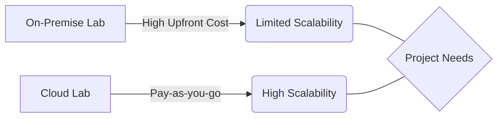

# Cloud vs On-Premise Lab Setup

## High-level overview
Compare and contrast the advantages and disadvantages of setting up the robotics development lab using cloud resources versus maintaining a local, on-premise setup.

## Deep technical explanation
*   **On-Premise:**
    *   **Pros:** Full control over hardware, potentially lower long-term cost for constant use, no internet dependency for core work.
    *   **Cons:** High upfront cost, maintenance overhead, scalability limitations, power consumption.
*   **Cloud (e.g., AWS RoboMaker, Google Cloud Robotics Platform, NVIDIA Omniverse Cloud):**
    *   **Pros:** Scalability on demand, reduced upfront cost, managed services, access to powerful GPUs without local purchase.
    *   **Cons:** Higher recurring costs, vendor lock-in, latency issues, security concerns for sensitive data, internet dependency.
*   **Hybrid Approaches:** Combining local development with cloud for heavy computation (e.g., RL training).
*   **Cost Analysis:** Estimating costs for various scenarios.

## Real-world examples
Startups leveraging cloud for quick prototyping, large enterprises maintaining secure on-premise data centers for sensitive robotics projects.

## Diagrams (Mermaid syntax)

*   Decision tree for choosing between cloud and on-premise based on project needs.

## Code snippet ideas
N/A.

<h2>Simulation exercises</h2>
N/A.

<h2>Hardware & software requirements for this module</h2>
N/A - Comparison of paradigms.

<h2>Mini-tasks for students</h2>
*   Research the pricing models for a specific cloud robotics platform.
*   Propose a hybrid lab setup that balances cost and performance for a hypothetical project.

<h2>Learning outcomes</h2>
*   Evaluate the trade-offs between cloud-based and on-premise robotics development environments.
*   Select an appropriate lab setup strategy based on project requirements, budget, and scalability needs.

<h2>Integration points for capstone project</h2>
Students might propose a cloud-based approach for specific aspects of their capstone (e.g., training large RL models).

<h2>Cross-references between modules</h2>
Relates to the Lab Architecture (Chapter 9) and Hardware Requirements (Chapter 8).

<h2>Notes for weekly progression (Week 1–13)</h2>
Discuss this during initial setup and planning phases.
