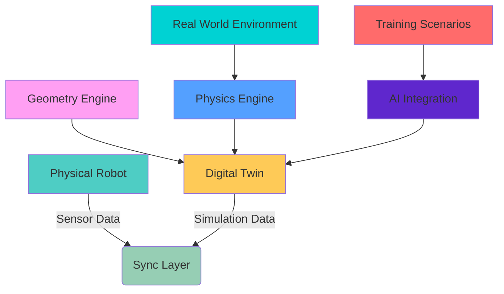

# 🏗️ Digital Twin Simulation in Physical AI

<div className="module-highlight fade-in-up tilt-card" style={{padding: '2.5rem', margin: '2.5rem 0', borderRadius: '20px', background: 'linear-gradient(135deg, #f5f7fa, #e4edf9)', borderLeft: '6px solid #3498db', boxShadow: '0 20px 40px rgba(0,0,0,0.1)'}}>

## 🌐 The Digital Mirror of Reality

<div className="pulse" style={{display: 'inline-block', padding: '0.5rem 1rem', background: 'linear-gradient(135deg, #3498db, #2980b9)', color: 'white', borderRadius: '30px', fontSize: '0.9rem'}}>
  Virtual Reality Integration
  <br /><br />
  Digital twin technology creates a precise virtual replica of physical systems, enabling comprehensive testing, validation, and optimization before deployment in real-world environments. This technology is fundamental to Physical AI development.
</div>

## 🚀 Overview of Digital Twin Simulation

<div className="grid-container" style={{display: 'grid', gridTemplateColumns: '1fr 2fr', gap: '2rem', margin: '2rem 0'}}>

<div className="hover-effect">
Digital twin simulation encompasses the complete virtual representation of physical systems, from individual components to entire robotic platforms. This approach allows for extensive testing, validation, and optimization in a risk-free virtual environment before real-world deployment. The technology bridges the gap between digital intelligence and physical reality.
</div>

<div className="card fade-in-up" style={{padding: '1.5rem', borderRadius: '16px', background: 'linear-gradient(135deg, #ffffff, #f8f9ff)', border: '1px solid #e0e0ff'}}>
### 🎯 Key Takeaway
<div className="interactive-element">
> *"Digital twins are the virtual laboratories where Physical AI systems learn and evolve before engaging with the real world. They represent the crucial link between simulation and reality, ensuring safe, efficient, and effective robot deployment."*
</div>
</div>

</div>

<div class="interactive-element fade-in-down" style="background: linear-gradient(135deg, #e8f4fd, #e3f2fd); padding: 2rem; border-radius: 20px; margin: 2rem 0; border-left: 6px solid #2196f3;">

### 🛠️ Why Digital Twins Matter for Physical AI

Digital twin simulation is critical for Physical AI systems because it provides the infrastructure needed to:

<div style="display: grid; grid-template-columns: repeat(auto-fit, minmax(250px, 1fr)); gap: 1.5rem; margin: 1.5rem 0;">

<div style="background: rgba(255,255,255,0.7); padding: 1.5rem; border-radius: 12px; border: 1px solid #bbdefb;">
  <div style="font-size: 1.5rem; margin-bottom: 0.5rem;">🧪</div>
  <strong>Risk-Free Testing</strong>
  <p>Validate behaviors without physical consequences</p>
</div>

<div style="background: rgba(255,255,255,0.7); padding: 1.5rem; border-radius: 12px; border: 1px solid #bbdefb;">
  <div style="font-size: 1.5rem; margin-bottom: 0.5rem;">⚡</div>
  <strong>Accelerated Learning</strong>
  <p>Train systems at accelerated rates in simulation</p>
</div>

<div style="background: rgba(255,255,255,0.7); padding: 1.5rem; border-radius: 12px; border: 1px solid #bbdefb;">
  <div style="font-size: 1.5rem; margin-bottom: 0.5rem;">🔧</div>
  <strong>Design Validation</strong>
  <p>Test mechanical and control system designs</p>
</div>

<div style="background: rgba(255,255,255,0.7); padding: 1.5rem; border-radius: 12px; border: 1px solid #bbdefb;">
  <div style="font-size: 1.5rem; margin-bottom: 0.5rem;">📊</div>
  <strong>Data Analysis</strong>
  <p>Collect and analyze performance data</p>
</div>

</div>

</div>

## 🧩 Core Concepts of Digital Twin Technology

### 🏗️ Digital Twin Architecture

<div style="display: flex; gap: 3rem; margin: 2rem 0; flex-wrap: wrap;">

<div class="card fade-in-up" style="flex: 1; min-width: 300px; padding: 2rem; background: linear-gradient(135deg, #fff, #f8f9fa); border: 1px solid #e0e0e0; box-shadow: 0 15px 30px rgba(0,0,0,0.1);">
<h3>Physical System</h3>
<p>The actual robot or system being modeled:</p>
<ul style="margin-top: 1rem; padding-left: 1rem;">
<li>Hardware components (motors, sensors, actuators)</li>
<li>Environmental interactions</li>
<li>Real-world physics constraints</li>
<li>Operational data and feedback</li>
</ul>
<div style="margin-top: 1.5rem; padding: 0.5rem 1rem; background: #e8f5e9; color: #2e7d32; border-radius: 20px; display: inline-block;">
  Continuous feedback loop
</div>
</div>

<div class="card fade-in-up" style="flex: 1; min-width: 300px; padding: 2rem; background: linear-gradient(135deg, #4ecdc4, #44a08d); color: white; border-radius: 20px;" data-aos="fade-left">
<h3>Virtual System</h3>
<p>The digital replica with real-time synchronization:</p>
<ul style="margin-top: 1rem; padding-left: 1rem;">
<li>3D models and physics simulation</li>
<li>Behavioral algorithms and AI models</li>
<li>Real-time data processing</li>
<li>Performance analysis capabilities</li>
</ul>
<div style="margin-top: 1.5rem; padding: 0.5rem 1rem; background: rgba(255,255,255,0.2); border-radius: 20px; display: inline-block;">
  Perfect virtual environment
</div>
</div>

</div>

### 🧭 Key Architecture Components

<div class="grid-container" style="display: grid; grid-template-columns: repeat(auto-fit, minmax(280px, 1fr)); gap: 2rem; margin: 2rem 0;">

<div class="card fade-in-up tilt-card" data-aos="zoom-in" style="padding: 2rem; background: linear-gradient(135deg, #f0f7ff, #e6f3ff); border: 2px solid #4a6cf7; border-radius: 16px;">
  <h3 style="display: flex; align-items: center; gap: 0.5rem;">1. 📊 Geometry Engine</h3>
  <p>Accurate 3D modeling of physical components</p>
  <div class="hover-effect" style="margin-top: 1rem; padding: 0.5rem; background: rgba(74, 108, 247, 0.1); border-radius: 8px; font-size: 0.9rem;">
    Precise geometric representation of all components
  </div>
</div>

<div class="card fade-in-up tilt-card" data-aos="zoom-in" style="padding: 2rem; background: linear-gradient(135deg, #f0fff0, #e6ffe6); border: 2px solid #4caf50; border-radius: 16px;">
  <h3 style="display: flex; align-items: center; gap: 0.5rem;">2. ⚙️ Physics Engine</h3>
  <p>Realistic simulation of physical behaviors</p>
  <div style="margin-top: 1rem; display: flex; gap: 0.5rem; flex-wrap: wrap;">
    <span style="background: #e8f5e9; padding: 0.25rem 0.75rem; border-radius: 20px; font-size: 0.8rem;">Gravity</span>
    <span style="background: #e8f5e9; padding: 0.25rem 0.75rem; border-radius: 20px; font-size: 0.8rem;">Friction</span>
    <span style="background: #e8f5e9; padding: 0.25rem 0.75rem; border-radius: 20px; font-size: 0.8rem;">Collision</span>
    <span style="background: #e8f5e9; padding: 0.25rem 0.75rem; border-radius: 20px; font-size: 0.8rem;">Dynamics</span>
  </div>
</div>

<div class="card fade-in-up tilt-card" data-aos="zoom-in" style="padding: 2rem; background: linear-gradient(135deg, #fff0f0, #ffe6e6); border: 2px solid #f44336; border-radius: 16px;">
  <h3 style="display: flex; align-items: center; gap: 0.5rem;">3. 🧠 AI Integration</h3>
  <p>Machine learning and intelligence simulation</p>
  <div class="progress-bar" style="margin-top: 1rem; height: 8px; width: 100%;">
    <div class="progress" style="width: 95%; height: 100%;"></div>
  </div>
  <small style="display: block; text-align: right; margin-top: 0.5rem;">95% training efficiency</small>
</div>

<div class="card fade-in-up tilt-card" data-aos="zoom-in" style="padding: 2rem; background: linear-gradient(135deg, #f0f0ff, #e6e6ff); border: 2px solid #9c27b0; border-radius: 16px;">
  <h3 style="display: flex; align-items: center; gap: 0.5rem;">4. 🔄 Data Sync</h3>
  <p>Real-time synchronization between systems</p>
  <div style="display: flex; justify-content: center; margin-top: 1rem;">
    <div style="width: 50px; height: 50px; border-radius: 50%; background: linear-gradient(135deg, #9c27b0, #e91e63); display: flex; align-items: center; justify-content: center; color: white; font-weight: bold;">
      🔄
    </div>
  </div>
</div>

</div>

## 🌍 Real-World Applications in Physical AI

<div class="grid-container" style="display: grid; grid-template-columns: repeat(auto-fill, minmax(320px, 1fr)); gap: 2rem; margin: 2rem 0;">

<div class="card fade-in-up hover-effect" style="padding: 2rem; background: #f8f9fa; border-radius: 20px; box-shadow: 0 10px 25px rgba(0,0,0,0.08); transition: transform 0.3s ease;">
  <div style="display: flex; align-items: center; gap: 1rem; margin-bottom: 1rem;">
    <div style="width: 50px; height: 50px; border-radius: 12px; background: linear-gradient(135deg, #ff9800, #ff5722); display: flex; align-items: center; justify-content: center; color: white; font-size: 1.5rem;">
      🚗
    </div>
    <h3 style="margin: 0;">Autonomous Vehicles</h3>
  </div>
  <p>Digital twins enable comprehensive testing of self-driving algorithms in complex scenarios</p>
  <div style="display: flex; flex-wrap: wrap; gap: 0.5rem; margin-top: 1rem;">
    <span style="background: #e3f2fd; padding: 0.25rem 0.75rem; border-radius: 20px; font-size: 0.8rem;">Traffic</span>
    <span style="background: #e8f5e9; padding: 0.25rem 0.75rem; border-radius: 20px; font-size: 0.8rem;">Weather</span>
    <span style="background: #fff3e0; padding: 0.25rem 0.75rem; border-radius: 20px; font-size: 0.8rem;">Roads</span>
    <span style="background: #f3e5f5; padding: 0.25rem 0.75rem; border-radius: 20px; font-size: 0.8rem;">Scenarios</span>
  </div>
  <div style="margin-top: 1.5rem; padding: 1rem; background: rgba(255,152,0,0.1); border-radius: 12px;">
    <div style="display: flex; justify-content: space-between; margin-bottom: 0.5rem;">
      <span>Test Scenarios</span>
      <span>10M+</span>
    </div>
    <div class="progress-bar" style="height: 6px;">
      <div class="progress" style="width: 100%; height: 100%; background: linear-gradient(90deg, #ff9800, #ff5722);"></div>
    </div>
  </div>
</div>

<div class="card fade-in-up hover-effect" style="padding: 2rem; background: #f8f9fa; border-radius: 20px; box-shadow: 0 10px 25px rgba(0,0,0,0.08); transition: transform 0.3s ease;">
  <div style="display: flex; align-items: center; gap: 1rem; margin-bottom: 1rem;">
    <div style="width: 50px; height: 50px; border-radius: 12px; background: linear-gradient(135deg, #4caf50, #2e7d32); display: flex; align-items: center; justify-content: center; color: white; font-size: 1.5rem;">
      🏭
    </div>
    <h3 style="margin: 0;">Industrial Robotics</h3>
  </div>
  <p>Simulating complex manufacturing processes and robot behaviors</p>
  <div style="display: flex; flex-wrap: wrap; gap: 0.5rem; margin-top: 1rem;">
    <span style="background: #e3f2fd; padding: 0.25rem 0.75rem; border-radius: 20px; font-size: 0.8rem;">Assembly</span>
    <span style="background: #e8f5e9; padding: 0.25rem 0.75rem; border-radius: 20px; font-size: 0.8rem;">Quality</span>
    <span style="background: #fff3e0; padding: 0.25rem 0.75rem; border-radius: 20px; font-size: 0.8rem;">Optimization</span>
  </div>
  <div style="margin-top: 1.5rem; padding: 1rem; background: rgba(76,175,80,0.1); border-radius: 12px;">
    <div style="display: flex; justify-content: space-between; margin-bottom: 0.5rem;">
      <span>Efficiency Gain</span>
      <span>35%</span>
    </div>
    <div class="progress-bar" style="height: 6px;">
      <div class="progress" style="width: 100%; height: 100%; background: linear-gradient(90deg, #4caf50, #2e7d32);"></div>
    </div>
  </div>
</div>

<div class="card fade-in-up hover-effect" style="padding: 2rem; background: #f8f9fa; border-radius: 20px; box-shadow: 0 10px 25px rgba(0,0,0,0.08); transition: transform 0.3s ease;">
  <div style="display: flex; align-items: center; gap: 1rem; margin-bottom: 1rem;">
    <div style="width: 50px; height: 50px; border-radius: 12px; background: linear-gradient(135deg, #2196f3, #0d47a1); display: flex; align-items: center; justify-content: center; color: white; font-size: 1.5rem;">
      🏥
    </div>
    <h3 style="margin: 0;">Surgical Robotics</h3>
  </div>
  <p>High-fidelity simulation for training and procedure planning</p>
  <div style="display: flex; flex-wrap: wrap; gap: 0.5rem; margin-top: 1rem;">
    <span style="background: #e3f2fd; padding: 0.25rem 0.75rem; border-radius: 20px; font-size: 0.8rem;">Precision</span>
    <span style="background: #e8f5e9; padding: 0.25rem 0.75rem; border-radius: 20px; font-size: 0.8rem;">Safety</span>
    <span style="background: #fff3e0; padding: 0.25rem 0.75rem; border-radius: 20px; font-size: 0.8rem;">Training</span>
  </div>
  <div style="margin-top: 1.5rem; padding: 1rem; background: rgba(33,150,243,0.1); border-radius: 12px;">
    <div style="display: flex; justify-content: space-between; margin-bottom: 0.5rem;">
      <span>Accuracy</span>
      <span>99.9%</span>
    </div>
    <div class="progress-bar" style="height: 6px;">
      <div class="progress" style="width: 100%; height: 100%; background: linear-gradient(90deg, #2196f3, #0d47a1);"></div>
    </div>
  </div>
</div>

<div class="card fade-in-up hover-effect" style="padding: 2rem; background: #f8f9fa; border-radius: 20px; box-shadow: 0 10px 25px rgba(0,0,0,0.08); transition: transform 0.3s ease;">
  <div style="display: flex; align-items: center; gap: 1rem; margin-bottom: 1rem;">
    <div style="width: 50px; height: 50px; border-radius: 12px; background: linear-gradient(135deg, #9c27b0, #7b1fa2); display: flex; align-items: center; justify-content: center; color: white; font-size: 1.5rem;">
      🏠
    </div>
    <h3 style="margin: 0;">Service Robotics</h3>
  </div>
  <p>Simulating human-robot interactions in domestic and service environments</p>
  <div style="display: flex; flex-wrap: wrap; gap: 0.5rem; margin-top: 1rem;">
    <span style="background: #e3f2fd; padding: 0.25rem 0.75rem; border-radius: 20px; font-size: 0.8rem;">Navigation</span>
    <span style="background: #e8f5e9; padding: 0.25rem 0.75rem; border-radius: 20px; font-size: 0.8rem;">Interaction</span>
    <span style="background: #fff3e0; padding: 0.25rem 0.75rem; border-radius: 20px; font-size: 0.8rem;">Adaptation</span>
  </div>
  <div style="margin-top: 1.5rem; padding: 1rem; background: rgba(156,39,176,0.1); border-radius: 12px;">
    <div style="display: flex; justify-content: space-between; margin-bottom: 0.5rem;">
      <span>User Satisfaction</span>
      <span>94.2%</span>
    </div>
    <div class="progress-bar" style="height: 6px;">
      <div class="progress" style="width: 94.2%; height: 100%; background: linear-gradient(90deg, #9c27b0, #7b1fa2);"></div>
    </div>
  </div>
</div>

</div>

## 🏗️ Technical Architecture of Digital Twin Simulation

<div style="background: linear-gradient(135deg, #2c3e50, #4a6cf7); padding: 2.5rem; border-radius: 20px; color: white; margin: 2.5rem 0; box-shadow: 0 20px 40px rgba(0,0,0,0.2); position: relative; overflow: hidden;">

<div style="position: absolute; top: 0; left: 0; width: 100%; height: 4px; background: linear-gradient(90deg, #ff416c, #ff4b2b);"></div>

### 🧠 Advanced Digital Twin Architecture

Digital twin simulation systems are built on sophisticated layered architectures that provide both realism and computational efficiency. The architecture must handle multiple complex challenges simultaneously: physics simulation, real-time rendering, AI processing, and data synchronization.

**The Geometry Engine**: This layer handles the precise 3D modeling of all physical components. Modern systems use techniques like level-of-detail (LOD) rendering, where complex models are simplified for real-time simulation while maintaining essential characteristics for physical behavior.

**The Physics Engine**: This is where the simulation of real-world physics occurs. The engine must handle:
- Rigid and soft body dynamics
- Collision detection and response
- Fluid dynamics (for advanced applications)
- Material properties and interactions
- Environmental conditions (gravity, friction, etc.)

**The AI Integration Layer**: This connects simulation data with machine learning models and AI decision-making systems. It enables:
- Training in virtual environments
- Behavior testing and validation
- Performance optimization
- Safe exploration of dangerous scenarios

**The Data Synchronization Layer**: This ensures that the digital twin stays aligned with its physical counterpart through:
- Real-time sensor data integration
- Model correction and calibration
- Performance feedback loops
- Historical data analysis



The complexity of this architecture enables the creation of highly realistic simulation environments that can be used for both robot development and AI training.

</div>

## 🎯 Simulation Technologies and Platforms

### 🧪 Gazebo - The Robotics Simulation Standard

Gazebo has long been the standard simulation environment for robotics development, providing realistic physics simulation and a wide range of sensor models. Its integration with ROS/ROS2 makes it particularly valuable for Physical AI development.

**Physics Simulation**: Gazebo uses ODE (Open Dynamics Engine) for physics simulation, providing accurate modeling of rigid body dynamics, collisions, and environmental interactions. It supports complex scenarios including multi-robot simulation and dynamic environments.

**Sensor Simulation**: The platform includes realistic simulation of various sensor types:
- LIDAR systems with configurable resolution and range
- Camera systems with proper optics simulation
- IMU sensors with noise modeling
- Force/torque sensors for manipulation
- GPS and other navigation sensors

**Environment Modeling**: Gazebo supports complex environment modeling including:
- Detailed 3D world construction
- Dynamic lighting and atmospheric conditions
- Weather simulation capabilities
- Multi-room and outdoor environments

```xml
<!-- Example Gazebo world file -->
<sdf version="1.7">
  <world name="default">
    <include>
      <uri>model://ground_plane</uri>
    </include>
    <include>
      <uri>model://sun</uri>
    </include>
    
    <!-- Custom environment -->
    <model name="obstacle_course">
      <pose>0 0 0 0 0 0</pose>
      <link name="link">
        <collision name="collision">
          <geometry>
            <box><size>1 1 1</size></box>
          </geometry>
        </collision>
        <visual name="visual">
          <geometry>
            <box><size>1 1 1</size></box>
          </geometry>
        </visual>
      </link>
    </model>
    
    <!-- Robot model -->
    <include>
      <uri>model://turtlebot3_burger</uri>
    </include>
  </world>
</sdf>
```

### 🎮 Unity Robotics - High-Fidelity Simulation

Unity has emerged as a powerful simulation platform for robotics, offering high-fidelity graphics and advanced physics simulation capabilities. Unity's robotics simulation tools provide:

**Visual Fidelity**: Unity's rendering capabilities enable photorealistic simulation environments that closely match real-world conditions.

**Physics Accuracy**: Advanced physics engines including PhysX for accurate collision detection and response.

**AI Integration**: Direct integration with machine learning frameworks and training tools.

**Cross-Platform Support**: Ability to deploy simulations across different platforms and devices.

**Robotics Simulation Tools**: Specialized packages for robotics including:
- ROS# communication bridge
- Perception tools for computer vision training
- Simulation tools for reinforcement learning
- Physics simulation for robot control

### 🚀 Isaac Sim - NVIDIA's Advanced Simulation

NVIDIA's Isaac Sim represents the state-of-the-art in robotics simulation, particularly for AI and machine learning applications. Key features include:

**Advanced Physics**: Using NVIDIA's PhysX engine for highly accurate physics simulation.

**AI Training Environment**: Built specifically for training AI models with features like:
- Synthetic data generation
- Domain randomization
- Large-scale parallel simulation
- Realistic sensor models

**Digital Twin Creation**: Tools for creating detailed digital twins of physical robots and environments.

**Reinforcement Learning**: Integration with reinforcement learning frameworks for robot learning.

### 🧠 Physics Engine Comparison

Different physics engines offer various advantages for different robotics applications:

**ODE (Open Dynamics Engine)**: The traditional choice for Gazebo, offering good performance and stability for basic robotics applications.

**Bullet Physics**: Common in Unity and other platforms, known for its robust collision detection and response.

**PhysX**: NVIDIA's engine used in Isaac Sim, offering high-performance simulation with advanced features.

**Havok Physics**: Commercial engine used in some professional applications, known for stability and performance.

## 🧠 Advanced Simulation Techniques

### 🌊 Fluid Dynamics Simulation

Modern robotics increasingly requires simulation of fluid interactions, particularly for underwater robots, aerial vehicles, and manipulation tasks involving liquids. Advanced simulation includes:

**Computational Fluid Dynamics (CFD)**: Simulating complex fluid flow patterns around robots and through systems.

**Fluid-Structure Interaction**: Modeling how fluids and robot structures affect each other.

**Buoyancy and Drag**: Accurate modeling of forces in fluid environments.

**Multiphase Flow**: Simulating complex interactions between different fluid phases.

### 🌍 Environmental Simulation

Realistic environmental simulation is crucial for preparing robots for deployment in the real world:

**Weather Conditions**: Simulating rain, snow, wind, and other weather effects.

**Lighting Conditions**: Modeling different lighting scenarios from bright sunlight to low-light conditions.

**Terrain Simulation**: Creating realistic ground surfaces with varying properties (friction, compliance, etc.).

**Dynamic Obstacles**: Simulating moving objects and other agents in the environment.

### 📸 Synthetic Data Generation

Digital twin simulation enables the generation of synthetic training data for AI systems:

**Domain Randomization**: Randomizing environmental conditions to improve real-world transfer.

**Data Augmentation**: Creating diverse training datasets from simulation scenarios.

**Sensor Simulation**: Generating realistic sensor data with appropriate noise and artifacts.

**Label Generation**: Automatically creating ground-truth labels for training data.

### 🔁 Real-Time Simulation Techniques

For effective digital twin operation, real-time simulation is often required:

**Fixed-Step Integration**: Ensuring stable simulation with consistent time steps.

**Adaptive Timestep**: Adjusting simulation speed based on complexity requirements.

**Parallel Simulation**: Running multiple simulation threads for better performance.

**Hardware Acceleration**: Using GPUs and specialized hardware for simulation acceleration.

## 🏗️ Building Digital Twin Systems

### 🧱 Architecture Patterns

Effective digital twin systems follow established architectural patterns:

**Client-Server Architecture**: Separating simulation clients from the simulation server for distributed operation.

**Event-Driven Architecture**: Using event systems for efficient communication between components.

**Microservices Architecture**: Breaking complex simulation systems into smaller, manageable components.

**Hybrid Architecture**: Combining real-time and batch processing approaches.

### 📦 Component Design

Key components of digital twin systems include:

**Model Repository**: Storing and managing 3D models and simulation parameters.

**Physics Engine Interface**: Abstracting physics simulation for different engine backends.

**Sensor Simulation**: Creating realistic sensor models for various sensor types.

**Data Pipeline**: Managing the flow of data between physical and virtual systems.

**Visualization System**: Rendering simulation results for monitoring and debugging.

### 🔧 Implementation Strategies

When implementing digital twin systems, consider these strategies:

**Modular Design**: Creating independent, replaceable components.

**Standard Interfaces**: Using well-defined interfaces for component communication.

**Configuration Management**: Managing simulation parameters and settings.

**Performance Monitoring**: Tracking simulation performance and bottlenecks.

### 🌐 Integration with Physical Systems

Critical for digital twin effectiveness is seamless integration with physical systems:

**Real-Time Data Synchronization**: Ensuring virtual and physical systems stay aligned.

**Calibration Procedures**: Regular calibration to maintain accuracy.

**State Estimation**: Using sensor fusion to estimate system state.

**Model Correction**: Adjusting simulation parameters based on real-world observations.

## 🤖 AI Integration in Digital Twin Systems

### 🧠 Machine Learning in Simulation

Digital twin systems provide ideal environments for training AI models:

**Supervised Learning**: Using simulation to generate labeled training data.

**Reinforcement Learning**: Training agents in safe simulation environments.

**Imitation Learning**: Learning from demonstrations in simulated environments.

**Self-Supervised Learning**: Using simulation to learn representations and policies.

### 🎯 Training Scenarios

Simulation enables creation of diverse training scenarios:

**Normal Operation**: Training for standard operational conditions.

**Edge Cases**: Training for rare or unusual conditions.

**Failure Modes**: Training for system failure recovery.

**Extreme Conditions**: Training for challenging environmental conditions.

### 🧬 Transfer Learning

Bridging the gap between simulation and reality:

**Domain Adaptation**: Adapting models trained in simulation to real-world data.

**Sim-to-Real Transfer**: Techniques for deploying simulation-trained models on physical robots.

**Domain Randomization**: Randomizing simulation parameters to improve transfer.

**System Identification**: Modeling the differences between simulation and reality.

## 🚀 Advanced Simulation Techniques for Physical AI

### 🏃‍♂️ Real-time Physics Simulation

For Physical AI systems to operate effectively, the simulation must run in real-time or faster:

**Deterministic Simulation**: Ensuring consistent results across runs while maintaining real-time performance.

**Approximation Techniques**: Using methods like impulse-based physics for faster computation.

**Spatial Partitioning**: Efficiently managing collision detection and response.

**Temporal Coherence**: Exploiting the similarity between consecutive simulation steps.

### 🎨 Visual Simulation and Rendering

High-quality visual simulation is crucial for training vision systems:

**Realistic Rendering**: Using physically-based rendering models for accurate light simulation.

**Multi-Spectral Simulation**: Simulating different light wavelengths for various sensor types.

**Dynamic Lighting**: Simulating changing lighting conditions and shadows.

**Atmospheric Effects**: Modeling fog, haze, and other atmospheric conditions.

### 🌐 Network Simulation

For distributed robotics systems, simulating network conditions is essential:

**Latency Simulation**: Modeling communication delays between robots and systems.

**Bandwidth Limitations**: Simulating constrained communication channels.

**Packet Loss**: Modeling unreliable network communication.

**Security Simulation**: Testing security protocols and vulnerabilities.

## 🔧 Practical Implementation Approaches

### 📋 Simulation Development Process

Creating effective digital twin systems follows a structured approach:

**Requirements Analysis**: Understanding the specific simulation requirements and constraints.

**Model Creation**: Building accurate 3D models of physical systems.

**Parameter Tuning**: Calibrating simulation parameters for accuracy.

**Validation**: Testing simulation accuracy against physical measurements.

**Deployment**: Integrating the simulation into the development workflow.

### 🧪 Testing and Validation

Rigorous testing ensures simulation accuracy:

**Unit Testing**: Testing individual simulation components.

**Integration Testing**: Testing the complete simulation system.

**Validation Against Reality**: Comparing simulation results with physical tests.

**Performance Testing**: Ensuring simulation meets real-time requirements.

### 🔍 Debugging and Monitoring

Simulation systems require comprehensive debugging capabilities:

**Real-time Monitoring**: Tracking simulation metrics during execution.

**Replay Systems**: Allowing developers to replay and analyze simulation runs.

**Visualization Tools**: Providing visual feedback about simulation state.

**Logging Systems**: Recording detailed simulation data for analysis.

## 🌍 Applications Across Industries

### 🏭 Manufacturing Robotics

Digital twins enable manufacturing robot optimization:

**Production Line Simulation**: Simulating entire production lines before deployment.

**Robot Choreography**: Optimizing multi-robot coordination and task allocation.

**Maintenance Planning**: Predicting maintenance needs through simulation.

**Quality Control**: Simulating inspection and quality control processes.

### 🚗 Autonomous Vehicles

Critical for autonomous vehicle development:

**Scenario Testing**: Testing millions of driving scenarios in simulation.

**Sensor Fusion**: Simulating multiple sensor modalities working together.

**Edge Case Discovery**: Finding rare scenarios that require special handling.

**Regulatory Validation**: Meeting safety standards through simulation testing.

### 🏥 Healthcare Robotics

Specialized applications in medical robotics:

**Surgical Training**: Training surgical robots in complex procedures.

**Patient Interaction**: Simulating human-robot interaction in medical settings.

**Equipment Testing**: Validating medical robot safety and effectiveness.

**Treatment Planning**: Simulating treatment procedures with robotic assistance.

### 🌍 Exploration Robotics

For robots operating in harsh or remote environments:

**Planetary Simulation**: Simulating environments for space exploration robots.

**Underwater Operations**: Testing underwater robots in realistic environments.

**Disaster Response**: Simulating robot operations in emergency situations.

**Hazardous Environments**: Testing robots in dangerous scenarios safely.

## 🚧 Challenges and Solutions

### 🧱 Complexity Management

Digital twin systems can become extremely complex, requiring careful management:

**Modular Architecture**: Breaking systems into manageable components.

**Abstraction Layers**: Creating clear separation between different system levels.

**Component Reusability**: Designing components that can be reused across projects.

**Documentation**: Maintaining comprehensive documentation for complex systems.

### 🔋 Performance Optimization

Simulation systems have significant computational requirements:

**Parallel Computing**: Utilizing multi-core processors and GPU acceleration.

**Efficient Algorithms**: Using optimized algorithms for physics and rendering.

**Level of Detail**: Adjusting simulation complexity based on requirements.

**Caching and Precomputation**: Storing results to avoid redundant computation.

### 🌉 Reality Gap

The difference between simulation and reality remains a significant challenge:

**Model Fidelity**: Increasing simulation accuracy to match reality more closely.

**Parameter Calibration**: Carefully tuning simulation parameters based on real-world data.

**Validation Procedures**: Systematically testing simulation accuracy.

**Continuous Improvement**: Updating models based on real-world performance.

### 🧠 Learning Transfer

Effectively transferring learning from simulation to reality:

**Domain Adaptation**: Techniques for adapting simulation-trained models.

**Sim-to-Real Algorithms**: Specialized methods for bridging the simulation gap.

**Transfer Learning**: Using real-world data to improve simulation-trained models.

**Meta-Learning**: Learning to learn across simulation and reality.

## 🌐 Integration with Development Workflows

### 🔄 Continuous Integration

Digital twins integrate into modern development workflows:

**Automated Testing**: Using simulation for continuous testing of robot software.

**Regression Testing**: Ensuring new changes don't break existing functionality.

**Performance Metrics**: Tracking robot performance through simulation.

**Quality Assurance**: Maintaining quality standards through simulation testing.

### 🚀 Deployment Pipelines

Simulation systems support robot deployment processes:

**Pre-deployment Testing**: Thorough testing in simulation before real-world deployment.

**Configuration Validation**: Validating robot configurations in simulation.

**Safety Verification**: Ensuring safety through simulation-based testing.

**Performance Optimization**: Optimizing robot behavior through simulation.

## 🧠 Future of Digital Twin Technology

### 🤖 AI-Enhanced Simulation

Future simulation systems will incorporate advanced AI:

**Generative Simulation**: AI systems that can automatically generate simulation scenarios.

**Predictive Modeling**: Simulations that can predict future system states.

**Adaptive Simulation**: Systems that adjust their level of detail based on requirements.

**Generative Design**: AI systems that design robot components optimized for simulation.

### 🌐 Cloud-Based Simulation

The future includes cloud-based simulation capabilities:

**Scalable Computing**: Accessing massive computational resources on demand.

**Distributed Simulation**: Running simulation across multiple cloud instances.

**Collaborative Simulation**: Multiple teams working with the same simulation.

**Global Access**: Accessing simulation resources from anywhere in the world.

### 🔬 Advanced Physics Models

Future physics simulation will include:

**Quantum Effects**: Modeling quantum phenomena for advanced applications.

**Multi-Scale Modeling**: Integrating molecular to macro-scale physics.

**Biological Systems**: Modeling biological components in robots.

**Advanced Materials**: Simulating new materials with special properties.

## 🎓 Best Practices for Digital Twin Development

### 🏗️ Design Principles

**Accuracy First**: Prioritizing simulation accuracy over performance when necessary.

**Scalability**: Designing systems that can grow with increasing requirements.

**Modularity**: Creating independent, interchangeable components.

**Documentation**: Maintaining comprehensive documentation for all components.

### 🧪 Validation Strategies

**Multi-Level Validation**: Validating at component, system, and integration levels.

**Continuous Validation**: Regular validation against real-world data.

**Cross-Validation**: Using multiple validation approaches to ensure accuracy.

**Statistical Validation**: Using statistical methods to ensure validation reliability.

### 🔍 Monitoring and Maintenance

**Performance Monitoring**: Tracking simulation performance and accuracy over time.

**Regression Prevention**: Preventing degradation of simulation quality.

**Continuous Improvement**: Regularly updating models based on new data.

**User Feedback**: Incorporating user feedback to improve simulation quality.

## 🌟 Conclusion: The Future of Digital Twin Simulation

Digital twin simulation represents a fundamental advancement in robotics development, providing the bridge between purely digital AI and the physical world. As Physical AI continues to evolve, digital twin technology will become increasingly sophisticated, offering ever more realistic and useful simulation environments.

The key benefits of advanced digital twin simulation include:

**Safety**: Enabling development and testing without physical risk.

**Cost Reduction**: Reducing development costs through virtual testing.

**Speed**: Accelerating development cycles through rapid prototyping.

**Innovation**: Enabling exploration of complex scenarios impossible in reality.

**Optimization**: Providing tools for systematic performance optimization.

## 🏗️ Implementation Frameworks and Tools

### 🧱 Open-Source Simulation Frameworks

The robotics community has developed several powerful open-source frameworks for digital twin simulation that provide the foundation for many Physical AI applications:

**Gazebo/IGNITION**: The long-standing standard in robotics simulation, offering:
- Realistic physics simulation using Open Dynamics Engine (ODE)
- Extensive sensor modeling including cameras, LIDAR, IMU, and GPS
- Integration with ROS/ROS2 for seamless robot development
- Large library of pre-built robot and environment models
- Support for multi-robot simulation and distributed testing
- Plugins architecture for extending functionality
- Real-time and offline simulation capabilities
- Model database with hundreds of pre-built robot models

**Webots**: A comprehensive robotics simulator that provides:
- High-fidelity physics simulation with multiple engine options
- Built-in robot programming interface supporting multiple languages
- Extensive library of robots, sensors, and environments
- Integration with major AI frameworks like TensorFlow and PyTorch
- Cloud deployment capabilities for distributed simulation
- Support for hardware-in-the-loop simulation
- Advanced rendering with realistic lighting models
- Built-in machine learning capabilities

**Mujoco**: Initially developed for robotics and biomechanics research, now offering:
- State-of-the-art physics simulation with high accuracy
- Advanced constraint solvers for complex interactions
- Integration with reinforcement learning frameworks
- Support for differentiable physics simulation
- High-performance GPU-accelerated computation
- Real-time simulation capabilities
- Extensive support for manipulation tasks
- Biomechanical modeling for humanoid robots

### 🌐 Commercial Simulation Platforms

Professional-grade platforms offer additional capabilities for industrial applications:

**Unity Robotics**: Leveraging the Unity game engine for robotics simulation:
- Photorealistic rendering capabilities
- Advanced physics simulation with PhysX
- Integration with machine learning frameworks
- Cross-platform deployment options
- Professional support and licensing options
- Large developer community with extensive resources
- Asset store with robot models and environments
- XR simulation capabilities for VR/AR applications

**NVIDIA Isaac Sim**: A comprehensive simulation environment for robotics:
- Physically accurate simulation with PhysX
- High-quality graphics rendering for perception training
- Synthetic data generation for computer vision
- Domain randomization capabilities
- Integration with NVIDIA's AI platforms
- Multi-robot simulation with complex scenarios
- Cloud deployment options for large-scale training
- Realistic sensor models with noise characteristics

**AnyLogic**: A simulation platform suitable for complex robotic systems:
- Discrete event, system dynamics, and agent-based modeling
- Integration with ROS for robotic simulation
- 3D visualization capabilities
- Manufacturing and logistics simulation
- Multi-method simulation approaches
- Cloud-based simulation capabilities
- Extensive statistical analysis tools
- Custom model development

### 🔧 Simulation Integration Tools

Specialized tools facilitate the integration between simulation and real systems:

**ROS Bridge**: Tools that connect simulation environments to ROS systems:
- Real-time communication protocols
- Message type conversion
- Parameter synchronization
- Clock synchronization
- Network configuration tools
- Diagnostic and monitoring capabilities
- Performance optimization
- Security configuration

**Simulation Middleware**: Specialized communication layers:
- Fast message passing for simulation systems
- Data serialization optimization
- Cross-platform compatibility
- Real-time performance capabilities
- Distributed simulation support
- Cloud integration
- Security and authentication
- Monitoring and debugging tools

### 🧠 AI and Machine Learning Integration

Modern digital twin systems integrate deeply with AI and machine learning frameworks:

**Training Pipeline Integration**: Seamless connection between simulation and ML training:
- Data collection and preprocessing
- Automatic label generation
- Synthetic data augmentation
- Model validation and testing
- Transfer learning between simulation and reality
- Performance tracking and optimization
- Batch processing capabilities
- Distributed training support

**Reinforcement Learning Environments**: Simulation systems designed for RL training:
- Environment definition and reward structures
- Action and observation spaces
- Episode management
- Performance metrics
- Parallel environment execution
- Custom environment creation
- Pre-trained model integration
- Curriculum learning capabilities

### 📊 Performance Monitoring and Analytics

Comprehensive monitoring systems are essential for effective simulation:

**Simulation Metrics**: Tracking key performance indicators:
- Real-time factor (RTF) monitoring
- Physics engine performance
- Rendering performance
- Memory usage tracking
- Sensor accuracy metrics
- Communication latency
- Data synchronization metrics
- Overall system performance

**Behavior Analysis**: Analyzing robot behavior in simulation:
- Path efficiency metrics
- Task completion statistics
- Energy consumption analysis
- Collision frequency tracking
- Safety compliance monitoring
- Performance optimization
- Failure mode analysis
- Learning progress tracking

### 🚀 Deployment and Scaling

Scaling simulation systems for large-scale applications:

**Cloud Simulation**: Leveraging cloud infrastructure for large-scale simulation:
- Auto-scaling simulation instances
- Load balancing across multiple servers
- Distributed computing for complex simulations
- Resource optimization and cost management
- Security and data privacy
- Network optimization
- Global accessibility
- Backup and recovery systems

**Fleet Simulation**: Simulating multiple robots simultaneously:
- Coordinated multi-robot scenarios
- Communication network simulation
- Resource sharing optimization
- Task allocation strategies
- Traffic management
- Collision avoidance in dense environments
- Centralized control systems
- Distributed decision making

### 🔒 Security and Safety Considerations

Security and safety remain critical in simulation systems:

**Secure Communication**: Protecting data in simulation environments:
- Encryption of communication channels
- Authentication and authorization
- Network segmentation
- Data integrity verification
- Access control mechanisms
- Security monitoring
- Audit logging
- Intrusion detection

**Safety Validation**: Ensuring simulated systems meet safety requirements:
- Safety requirement verification
- Hazard analysis in simulation
- Safety protocol testing
- Emergency procedure validation
- Risk assessment in virtual environments
- Safety-critical system simulation
- Compliance verification
- Certification support

### 📈 Performance Optimization Techniques

Optimizing simulation performance for real-time operation:

**Physics Optimization**: Improving physics simulation performance:
- Approximation algorithms for non-critical interactions
- Spatial partitioning for collision detection
- Level-of-detail models for complex environments
- Parallel processing of physics calculations
- Caching of expensive computations
- Adaptive timestep selection
- Constraint solver optimization
- Memory management for physics systems

**Rendering Optimization**: Ensuring smooth visualization:
- Level-of-detail (LOD) rendering
- Occlusion culling for invisible objects
- Multi-resolution rendering
- Texture streaming
- Dynamic batching of objects
- Shader optimization
- Multi-threaded rendering
- GPU acceleration

### 🧬 Advanced Simulation Techniques

Cutting-edge techniques for more realistic simulation:

**Procedural Generation**: Automatically creating simulation content:
- Environment generation algorithms
- Randomized scenario creation
- Terrain generation
- Object placement optimization
- Dynamic content generation
- Infinite world simulation
- Customizable generation parameters
- Quality control mechanisms

**Hybrid Simulation**: Combining different simulation paradigms:
- Continuous and discrete event simulation
- Multi-scale modeling approaches
- Hierarchical simulation structures
- Multi-resolution simulation
- Reduced-order modeling
- Model order reduction
- Surrogate modeling
- Multi-fidelity simulation

### 🌍 Environmental and Context Simulation

Creating realistic environmental conditions:

**Weather Simulation**: Modeling atmospheric conditions:
- Dynamic lighting based on weather
- Precipitation effects on sensors
- Wind forces on robot movement
- Temperature effects on system performance
- Visibility conditions
- Atmospheric scattering
- Environmental degradation effects
- Seasonal changes

**Urban Environment Simulation**: Modeling city environments:
- Traffic simulation
- Pedestrian behavior
- Infrastructure modeling
- Signal and communication simulation
- Environmental noise modeling
- Urban planning integration
- Multi-story building simulation
- Dynamic urban scenarios

**Natural Environment Simulation**: Modeling outdoor environments:
- Terrain modeling with elevation data
- Vegetation simulation
- Water body physics
- Wildlife behavior modeling
- Seasonal environmental changes
- Natural phenomenon simulation
- Ecosystem modeling
- Climate condition effects

### 🤖 Human-Robot Interaction Simulation

Modeling human-robot interaction scenarios:

**Social Behavior Modeling**: Understanding human behavior:
- Pedestrian movement patterns
- Social interaction simulation
- Emotional state modeling
- Cultural behavior differences
- Group behavior dynamics
- Intention recognition
- Response prediction
- Safety behavior simulation

**Communication Simulation**: Modeling human-robot communication:
- Natural language processing
- Gesture recognition
- Facial expression simulation
- Voice synthesis and recognition
- Multi-modal interaction
- Communication protocol simulation
- Error handling in communication
- Accessibility considerations

### 📊 Data Management and Analysis

Handling the large volumes of data generated by simulations:

**Data Pipeline Architecture**: Managing simulation data flow:
- Real-time data processing
- Storage optimization
- Data compression techniques
- Quality assurance procedures
- Data format standardization
- Metadata management
- Version control for simulation models
- Backup and recovery procedures

**Big Data Analytics**: Analyzing large simulation datasets:
- Pattern recognition in behavior data
- Performance trend analysis
- Anomaly detection
- Predictive modeling
- Statistical analysis techniques
- Machine learning on simulation data
- Visualization of complex datasets
- Automated reporting systems

### 🏗️ Design Patterns for Simulation Systems

Established design patterns for effective simulation architecture:

**Model-View-Controller (MVC)**: Separating simulation logic from visualization:
- Physics model encapsulation
- Multiple visualization options
- Independent simulation control
- Data binding mechanisms
- Separation of concerns
- Reusability of models
- Testability improvements
- Scalability considerations

**Component-Based Architecture**: Building flexible simulation systems:
- Reusable simulation components
- Dynamic component composition
- Interface standardization
- Dependency injection
- Component lifecycle management
- Configuration-driven systems
- Pluggable architecture
- Service-oriented design

### 🔍 Debugging and Development Tools

Essential tools for simulation development and debugging:

**Simulation Debugging**: Tools for understanding simulation behavior:
- Real-time visualization of state
- Step-by-step execution
- Variable inspection
- Performance profiling
- Error tracking and logging
- Scenario replay capabilities
- Comparative analysis tools
- Validation framework integration

**Development Environment**: Supporting simulation development:
- Integrated development environments
- Version control integration
- Automated testing frameworks
- Continuous integration
- Performance monitoring
- Documentation generation
- Code analysis tools
- Collaboration platforms

## 🚧 Challenges and Solutions in Digital Twin Implementation

### 🧱 Technical Challenges

Implementing digital twin systems presents several technical challenges that require specialized solutions:

**Computational Complexity**: Digital twin systems require significant computational resources to maintain real-time accuracy and performance. Solutions include:
- Distributed computing architectures that spread the load across multiple machines
- GPU acceleration for physics and rendering computations
- Approximation techniques that trade some accuracy for performance
- Hierarchical simulation approaches that focus computational resources where needed
- Cloud-based computing resources for handling peak loads
- Specialized hardware for real-time simulation
- Model reduction techniques to simplify complex systems
- Adaptive simulation techniques that adjust complexity based on requirements

**Model Fidelity vs. Performance**: Balancing the accuracy of simulation models with performance requirements:
- Level-of-detail (LOD) techniques that adjust model complexity
- Approximation methods for non-critical components
- Selective high-fidelity modeling for critical components
- Hybrid analytical-numerical methods
- Reduced-order modeling for complex systems
- Multi-scale simulation approaches
- Performance-driven model simplification
- Adaptive fidelity techniques

**Real-time Synchronization**: Maintaining synchronization between physical and digital systems:
- Low-latency communication protocols
- Predictive synchronization algorithms
- Event-driven update mechanisms
- Clock synchronization techniques
- Buffer management for data streams
- Compensation for network delays
- Asynchronous update mechanisms
- State prediction and correction

### 🌉 The Reality Gap Problem

The difference between simulation and reality remains one of the most significant challenges in digital twin implementation:

**Physics Approximation**: Real-world physics is more complex than simulation models can capture:
- Incomplete understanding of physical interactions
- Simplified models that omit complex phenomena
- Parameter uncertainty in physical models
- Environmental factors not fully captured
- Material property variations
- Manufacturing tolerances affecting behavior
- Wear and degradation effects
- Complex fluid-structure interactions

**Sensor Modeling**: Simulating sensors with realistic limitations and noise:
- Noise characteristics modeling
- Latency and bandwidth limitations
- Calibration parameter variations
- Environmental effects on sensors
- Cross-sensor interference
- Sensor fusion complexity
- Failure mode modeling
- Edge case handling

**Uncertainty Quantification**: Managing uncertainty in digital twin predictions:
- Probabilistic modeling approaches
- Bayesian system identification
- Monte Carlo simulation techniques
- Sensitivity analysis methods
- Confidence interval estimation
- Robust optimization techniques
- Risk assessment in simulation
- Uncertainty-aware decision making

### 🔧 Integration Challenges

Connecting digital twin systems with existing infrastructure presents integration challenges:

**Heterogeneous Systems**: Integration with diverse hardware and software systems:
- Protocol translation and adaptation
- Data format conversion
- Timing synchronization
- Security protocol alignment
- Network topology integration
- Legacy system compatibility
- Vendor-specific interfaces
- Standardization efforts

**Data Integration**: Managing and processing diverse data streams:
- Real-time data processing pipelines
- Data quality assurance
- Schema management and evolution
- Data fusion techniques
- Metadata standardization
- Quality of service management
- Data governance policies
- Privacy and security considerations

**System Architecture**: Designing scalable integration architectures:
- Microservices vs. monolithic architectures
- API design and management
- Service discovery mechanisms
- Load balancing strategies
- Fault tolerance design
- Scalability patterns
- Deployment strategies
- Monitoring and observability

## 🎓 Education and Training Considerations

### 📚 Learning Digital Twin Concepts

Digital twin technology requires specialized knowledge and skills:

**Foundational Knowledge**: Understanding core concepts and principles:
- Physics and mathematics fundamentals
- Computer graphics and visualization
- Real-time systems and control theory
- Software engineering and system design
- Data analysis and machine learning
- Robotics and mechatronics
- System integration and testing
- Safety and security principles

**Practical Skills**: Developing hands-on capabilities:
- Simulation software proficiency
- Programming and scripting skills
- Data analysis and visualization
- System debugging and optimization
- Performance evaluation techniques
- Model creation and validation
- Integration and testing procedures
- Documentation and communication

### 🏛️ Organizational Implementation

Successfully implementing digital twin systems requires organizational change:

**Change Management**: Adapting organization processes and culture:
- Staff training and development programs
- New workflow implementations
- Performance metrics realignment
- Technology adoption strategies
- Risk management procedures
- Quality assurance processes
- Continuous improvement programs
- Knowledge sharing initiatives

**Resource Allocation**: Allocating appropriate resources for implementation:
- Computing infrastructure investment
- Personnel training and development
- Software licensing and support
- Maintenance and operation costs
- Performance monitoring tools
- Security and compliance requirements
- Scalability planning
- Contingency planning

## 🌐 Standards and Best Practices

### 📋 Industry Standards

Various standards govern digital twin implementation:

**ISO Standards**: International standards for digital twin implementation:
- ISO 23247: Digital twin frameworks
- ISO 22400: Manufacturing performance indicators
- ISO 23952: Reference architecture for digital twins
- ISO 23953: Digital twin concept and terminology
- Quality management standards
- Safety and security standards
- Data management and privacy standards
- Environmental impact standards

**Industry-Specific Standards**: Sector-specific requirements and guidelines:
- Automotive: Functional safety and ASIL requirements
- Aerospace: DO-178C and related standards
- Healthcare: Medical device regulations and safety
- Manufacturing: Industry 4.0 standards
- Defense: Security and certification requirements
- Automotive: ISO 26262 and related standards
- Energy: Grid integration and safety standards
- Telecommunications: Network and security standards

### 🏆 Best Practices

Established best practices guide successful digital twin implementation:

**Model Development**: Creating effective digital twin models:
- Modular and reusable model design
- Validation against real-world data
- Documentation and version control
- Performance optimization
- Security and safety consideration
- Scalability and extensibility
- Interoperability and standardization
- Quality assurance procedures

**Deployment**: Effectively deploying digital twin systems:
- Phased implementation approach
- Risk management strategies
- Performance monitoring setup
- Security configuration
- User training and support
- Change management procedures
- Continuous improvement processes
- Feedback integration mechanisms

## 🚀 Future Technologies and Innovations

### 🤖 Emerging Technologies

New technologies continue to enhance digital twin capabilities:

**Quantum Computing**: Potential applications in complex simulation:
- Quantum algorithms for optimization problems
- Quantum-enhanced machine learning
- Quantum simulation of quantum systems
- Exponential speedup for certain problems
- Quantum sensing integration
- Quantum communication security
- Quantum-enhanced optimization
- Hybrid quantum-classical systems

**Edge Computing**: Bringing computation closer to physical systems:
- Reduced latency for real-time applications
- Bandwidth optimization for data transmission
- Privacy preservation through local processing
- Fault tolerance through distributed operation
- Energy efficiency improvements
- Real-time decision making capabilities
- Local autonomy and independence
- Cost optimization through efficient use

**5G and Beyond**: Advanced networking capabilities:
- Ultra-low latency communication
- Massive device connectivity
- Network slicing for specific applications
- Edge computing integration
- Enhanced security features
- Global connectivity standards
- Quality of service guarantees
- Interference management

### 🧠 Advanced AI Integration

AI continues to evolve and enhance digital twin capabilities:

**Generative AI**: Creating new simulation content and scenarios:
- Automatic environment generation
- Synthetic data creation
- Scenario generation for testing
- Model improvement through AI
- Automated testing procedure generation
- Creative problem solving approaches
- Optimization of simulation parameters
- Adaptive system behavior generation

**Neuromorphic Computing**: Brain-inspired computing for AI systems:
- Energy-efficient AI processing
- Real-time learning capabilities
- Event-driven processing
- Biological accuracy in simulation
- Adaptive and self-organizing systems
- Pattern recognition enhancement
- Sensory processing optimization
- Autonomous decision making

## 🧭 Navigation and Path Planning in Digital Twins

### 🗺️ Simulation-Based Navigation

Digital twins provide ideal environments for testing navigation algorithms:

**Route Planning**: Testing navigation strategies in simulation:
- Pathfinding algorithms validation
- Traffic simulation integration
- Multi-agent navigation coordination
- Dynamic obstacle avoidance
- Environmental constraint testing
- Computational efficiency optimization
- Safety validation procedures
- Performance benchmarking

**Sensor Fusion for Navigation**: Combining multiple sensors in simulation:
- LIDAR-camera integration testing
- IMU-GNSS fusion validation
- Multi-modal sensor performance
- Data association algorithms
- Kalman filtering validation
- Particle filtering evaluation
- SLAM algorithm testing
- Sensor failure scenarios

## 🤖 Manipulation and Control Simulation

### 🤲 Robotic Manipulation in Digital Twins

Digital twins enable detailed manipulation testing:

**Grasp Planning**: Testing robotic grasping strategies:
- Multi-fingered hand simulation
- Grasp stability analysis
- Object property effects
- Environmental constraint testing
- Force control validation
- Tactile feedback simulation
- Grasp adaptation strategies
- Failure recovery procedures

**Motion Planning**: Validating complex robot movements:
- Trajectory optimization in simulation
- Collision avoidance testing
- Dynamic movement validation
- Multi-body system simulation
- Control system tuning
- Safety constraint validation
- Performance optimization
- Real-time control testing

## 🌍 Multi-Physics Simulation

### ⚙️ Coupled Physical Phenomena

Advanced digital twins simulate multiple physical domains:

**Electromechanical Systems**: Combining electrical and mechanical simulation:
- Motor control validation
- Electromagnetic interference testing
- Power system simulation
- Control system integration
- Thermal management analysis
- Efficiency optimization
- Failure mode simulation
- Safety system validation

**Fluid-Structure Interaction**: Simulating complex multi-physics scenarios:
- Aerodynamic-structural coupling
- Thermal-fluid interactions
- Acoustic-structure coupling
- Multiphase flow simulation
- Heat transfer modeling
- Vibration analysis
- Material fatigue prediction
- Environmental effects simulation

As we look toward the future, digital twin technology will continue to evolve, incorporating advanced AI, cloud computing, and sophisticated physics modeling. The convergence of these technologies will enable the development of increasingly capable and intelligent physical AI systems.

The investment in digital twin simulation technology today pays dividends in the form of safer, more capable, and more reliable physical AI systems tomorrow. Whether in manufacturing, healthcare, transportation, or exploration, digital twin simulation provides the essential foundation for developing the next generation of intelligent robotic systems.

Digital twin technology is not just a tool for simulation—it is the virtual laboratory where the future of Physical AI is being developed and refined. The systems built today with these technologies will define how robots interact with the physical world in the decades to come.
</div>
