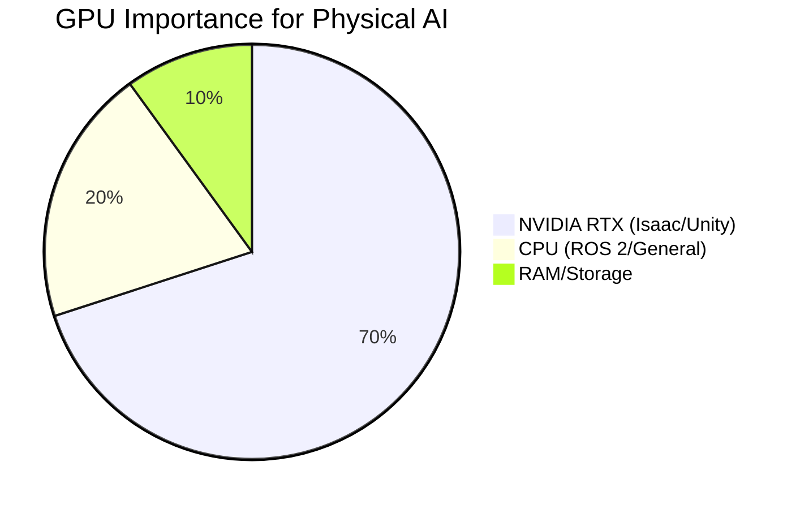

# Hardware Requirements

## High-level overview
Detailed specifications for the computational hardware necessary to run the course material, simulations, and develop the capstone project effectively.

## Deep technical explanation
*   **Minimum System Requirements:**
    *   **CPU:** Intel Core i7-10th gen / AMD Ryzen 7 3rd gen or newer.
    *   **RAM:** 16 GB DDR4.
    *   **GPU:** NVIDIA GeForce RTX 2060 / Quadro RTX 4000 (essential for Isaac Sim/Unity).
    *   **Storage:** 500GB SSD (NVMe preferred).
    *   **OS:** Ubuntu 22.04 LTS (native installation or VM with GPU passthrough).
*   **Recommended System Requirements (for optimal experience):**
    *   **CPU:** Intel Core i9-12th gen / AMD Ryzen 9 5th gen or newer.
    *   **RAM:** 32-64 GB DDR4/DDR5.
    *   **GPU:** NVIDIA GeForce RTX 3070+ / Quadro RTX 5000+ (for advanced RL and high-fidelity simulation).
    *   **Storage:** 1TB NVMe SSD.
    *   **OS:** Ubuntu 22.04 LTS.
*   **Networking:** Stable internet connection for updates and VLM API access.

## Real-world examples
N/A - System specifications.

## Diagrams (Mermaid syntax)

*   Table: Hardware component breakdown with minimum and recommended specs.

## Code snippet ideas
N/A.

<h2>Simulation exercises</h2>
N/A.

<h2>Hardware & software requirements for this module</h2>
Specific hardware discussed.

<h2>Mini-tasks for students</h2>
N/A.

<h2>Learning outcomes</h2>
*   Identify the necessary hardware specifications for participating in the course.
*   Understand the importance of a dedicated NVIDIA GPU for advanced robotics simulation and AI.

<h2>Integration points for capstone project</h2>
The capstone project's performance will be directly tied to the student's hardware capabilities.

<h2>Cross-references between modules</h2>
Modules 2, 3, and 4 are particularly GPU-intensive.

<h2>Notes for weekly progression (Week 1–13)</h2>
Early weeks should include a hardware setup guide.
