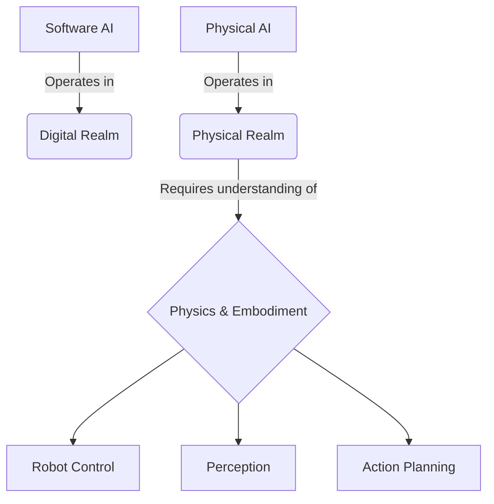

# Introduction to Physical AI

## High-level overview
Define Physical AI, its importance, and contrast with purely software-based AI. Introduce the concept of embodiment and its role in intelligence.

## Deep technical explanation
*   **Embodied AI:** Why physical interaction with the world is crucial for general intelligence.
*   **Physics in AI:** The need for AI systems to understand and predict physical phenomena (gravity, friction, collision, material properties).
*   **AI-Robot Gap:** Bridging the gap between AI algorithms and real-world robotic deployment.

## Real-world examples
Autonomous vehicles, factory robots (e.g., Boston Dynamics Spot/Atlas for complex maneuvers), surgical robots, smart prosthetics.

## Diagrams (Mermaid syntax)

*   Flowchart: Evolution of AI from symbolic to embodied.
*   Diagram illustrating the feedback loop between perception, decision, and action in Physical AI.

## Code snippet ideas
N/A for an introductory chapter. Focus on conceptual understanding.

<h2>Simulation exercises</h2>
Brief conceptual walkthrough of a simple physics simulation (e.g., a falling box) in a generic physics engine, highlighting parameters like gravity, mass, and friction.

<h2>Hardware & software requirements for this module</h2>
Conceptual discussion. Mention common robotic platforms (mobile robots, manipulators, humanoids) and simulation environments (Gazebo, Unity, Isaac Sim).

<h2>Mini-tasks for students</h2>
*   Research and summarize 3 real-world applications of Physical AI.
*   Discuss the ethical implications of advanced Physical AI and humanoid robotics.

<h2>Learning outcomes</h2>
*   Define Physical AI and explain its core tenets (physics, embodiment, reality).
*   Differentiate between traditional AI and Physical AI applications.
*   Identify key challenges in deploying AI in physical environments.
*   Articulate the significance of embodiment for general AI.

<h2>Integration points for capstone project</h2>
Introduce the concept of an "Autonomous Humanoid" as the ultimate goal, requiring understanding across all modules.

<h2>Cross-references between modules</h2>
Briefly mention how concepts here will be expanded in ROS 2 (control), Gazebo/Unity (simulation), Isaac (brain), and VLA (perception/action).

<h2>Notes for weekly progression (Week 1–13)</h2>
Week 1: Foundational concepts and overview.
