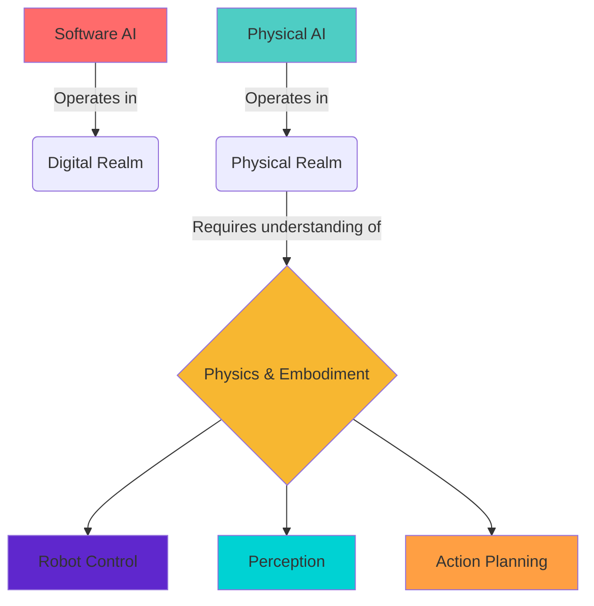

# 🧠 Introduction to Physical AI & Humanoid Robotics

<div class="module-highlight" style="padding: 1.5rem; margin: 2rem 0; border-radius: 12px; background: linear-gradient(135deg, #f5f7fa, #e4edf9); border-left: 5px solid #4a6cf7;">

## 🌟 Welcome to the Future of AI
Physical AI represents the next evolutionary step in artificial intelligence, bridging the gap between digital algorithms and the physical world. This is where AI stops being just "smart software" and becomes truly embodied intelligence.

</div>

## 🚀 Overview

Physical AI represents a significant evolution in artificial intelligence, moving beyond purely software-based systems to incorporate **physical embodiment** and interaction with the real world. This approach recognizes that intelligence is not merely computational but emerges from the interaction between an agent, its body, and the environment.

<div class="interactive-element" style="background: linear-gradient(135deg, #e8f4fd, #e3f2fd); padding: 1.5rem; border-radius: 12px; margin: 2rem 0; border-left: 4px solid #2196f3;">

### 🤖 The Embodiment Revolution
> *"Intelligence without embodiment is like flight without wings - it can soar in the digital realm, but it's only when grounded in the physical world that it achieves true potential."*

</div>

## 🧩 Key Concepts

### 🏗️ Embodied AI
Embodied AI emphasizes the importance of physical interaction with the world for developing true intelligence. Unlike traditional AI systems that operate in digital spaces, embodied AI systems must understand and navigate physical reality including:

- **Gravity & Motion** (physics, forces, collisions)
- **Material Properties** (textures, weights, fragility)
- **Real-time Sensory Integration** (sight, sound, touch, proprioception)
- **Embodied Learning** (learning through physical interaction and consequence)

<div style="display: flex; gap: 2rem; margin: 2rem 0;">

<div style="flex: 1; padding: 1.5rem; background: #f9f9f9; border-radius: 12px; border: 1px solid #e0e0e0;">
<h3>❌ Traditional AI</h3>
<ul>
<li>Operates in digital realm only</li>
<li>No physical consequences</li>
<li>Perfect virtual environments</li>
<li>Simulated physics</li>
</ul>
</div>

<div style="flex: 1; padding: 1.5rem; background: linear-gradient(135deg, #4a6cf7, #6a11cb); color: white; border-radius: 12px;">
<h3>✅ Physical AI</h3>
<ul>
<li>Interacts with real world</li>
<li>Real consequences for actions</li>
<li>Noisy, unpredictable environments</li>
<li>Actual physics constraints</li>
</ul>
</div>

</div>

### 🌉 The AI-Robot Gap
There's a significant gap between AI algorithms and their real-world deployment. Bridging this gap requires:
- **Robust Perception Systems** that handle noisy, real-world data
- **Adaptive Control Systems** that operate reliably in dynamic environments
- **Resilient Learning Systems** that adapt to physical complexities
- **Fail-safe Mechanisms** that prioritize safety and reliability

### 🧭 Core Principles of Physical AI

<div style="display: grid; grid-template-columns: repeat(auto-fit, minmax(250px, 1fr)); gap: 1.5rem; margin: 2rem 0;">

<div style="padding: 1.5rem; background: #f0f7ff; border-radius: 12px; border: 1px solid #4a6cf7;">
<h3>1. 🏗️ Embodiment</h3>
<p>Intelligence emerges from the interaction between agent and environment</p>
</div>

<div style="padding: 1.5rem; background: #f0fff0; border-radius: 12px; border: 1px solid #4caf50;">
<h3>2. 🌍 Physics Understanding</h3>
<p>Systems must understand and predict physical phenomena</p>
</div>

<div style="padding: 1.5rem; background: #fff0f0; border-radius: 12px; border: 1px solid #f44336;">
<h3>3. ⚡ Real-time Operation</h3>
<p>Systems must respond to environmental changes immediately</p>
</div>

<div style="padding: 1.5rem; background: #f0f0ff; border-radius: 12px; border: 1px solid #9c27b0;">
<h3>4. 🔄 Adaptability</h3>
<p>Systems must handle unexpected situations and changing environments</p>
</div>

</div>

## 🌍 Real-World Applications

Physical AI is revolutionizing multiple domains:

<div style="display: grid; grid-template-columns: repeat(auto-fill, minmax(300px, 1fr)); gap: 1.5rem; margin: 2rem 0;">

<div style="padding: 1.5rem; background: #f8f9fa; border-radius: 12px; box-shadow: 0 4px 8px rgba(0,0,0,0.1);">
<h3>🚗 Autonomous Vehicles</h3>
<p>Understanding traffic, physics, and navigation in dynamic environments</p>
<div style="display: flex; align-items: center; gap: 0.5rem; margin-top: 1rem;">
<span style="background: #e3f2fd; padding: 0.25rem 0.5rem; border-radius: 4px;">Sensing</span>
<span style="background: #e8f5e9; padding: 0.25rem 0.5rem; border-radius: 4px;">Planning</span>
<span style="background: #fff3e0; padding: 0.25rem 0.5rem; border-radius: 4px;">Control</span>
</div>
</div>

<div style="padding: 1.5rem; background: #f8f9fa; border-radius: 12px; box-shadow: 0 4px 8px rgba(0,0,0,0.1);">
<h3>🏭 Industrial Robotics</h3>
<p>Manufacturing, assembly, and quality control systems</p>
<div style="display: flex; align-items: center; gap: 0.5rem; margin-top: 1rem;">
<span style="background: #e3f2fd; padding: 0.25rem 0.5rem; border-radius: 4px;">Precision</span>
<span style="background: #e8f5e9; padding: 0.25rem 0.5rem; border-radius: 4px;">Speed</span>
<span style="background: #fff3e0; padding: 0.25rem 0.5rem; border-radius: 4px;">Safety</span>
</div>
</div>

<div style="padding: 1.5rem; background: #f8f9fa; border-radius: 12px; box-shadow: 0 4px 8px rgba(0,0,0,0.1);">
<h3>🏥 Surgical Robotics</h3>
<p>Precise, dexterous manipulation in constrained environments</p>
<div style="display: flex; align-items: center; gap: 0.5rem; margin-top: 1rem;">
<span style="background: #e3f2fd; padding: 0.25rem 0.5rem; border-radius: 4px;">Accuracy</span>
<span style="background: #e8f5e9; padding: 0.25rem 0.5rem; border-radius: 4px;">Stability</span>
<span style="background: #fff3e0; padding: 0.25rem 0.5rem; border-radius: 4px;">Tactility</span>
</div>
</div>

<div style="padding: 1.5rem; background: #f8f9fa; border-radius: 12px; box-shadow: 0 4px 8px rgba(0,0,0,0.1);">
<h3>🦾 Assistive Robotics</h3>
<p>Smart prosthetics and exoskeletons</p>
<div style="display: flex; align-items: center; gap: 0.5rem; margin-top: 1rem;">
<span style="background: #e3f2fd; padding: 0.25rem 0.5rem; border-radius: 4px;">Adaptability</span>
<span style="background: #e8f5e9; padding: 0.25rem 0.5rem; border-radius: 4px;">Comfort</span>
<span style="background: #fff3e0; padding: 0.25rem 0.5rem; border-radius: 4px;">Intuitive</span>
</div>
</div>

</div>

## 🏗️ Technical Architecture

<div style="background: linear-gradient(135deg, #2c3e50, #4a6cf7); padding: 2rem; border-radius: 12px; color: white; margin: 2rem 0;">



</div>

## 🤖 The Robot Operating System (ROS)

The Robot Operating System (ROS) provides the foundational middleware for physical AI systems. While not a traditional operating system, ROS provides:

- **✉️ Message Passing**: Communication between robot processes
- **🔧 Hardware Abstraction**: Unified interfaces for diverse hardware
- **📦 Package Management**: Organized code libraries and tools
- **🎮 Simulation**: Gazebo for testing without real hardware
- **👁️ Visualization**: Tools for monitoring and debugging

<div class="progress-bar" style="height: 10px; background-color: #e0e0e0; border-radius: 5px; margin: 2rem 0; overflow: hidden;">
  <div class="progress" style="height: 100%; background: linear-gradient(90deg, #4a6cf7, #6a11cb); border-radius: 5px; width: 100%;"></div>
</div>

## 🤖 MCP and Context7 Integration

Model Context Protocol (MCP) enables Physical AI systems to access external tools and knowledge sources. This is critical for physical AI systems that need to:

- **📚 Access** current documentation and specifications for hardware components
- **📋 Retrieve** best practices for robotics algorithms
- **🔗 Access** external APIs for enhanced capabilities
- **☁️ Integrate** with cloud services and databases

Context7 documentation servers provide up-to-date information about robotics libraries, APIs, and best practices, ensuring AI systems have access to current, accurate information when making decisions.

<div class="cta-section" style="background: linear-gradient(135deg, #4ecdc4, #44a08d); padding: 2rem; border-radius: 12px; color: white; text-align: center; margin: 2rem 0;">

### 🛠️ MCP Integration in Physical AI

Physical AI systems can leverage MCP servers in several ways:

```javascript
// Example: MCP integration for documentation lookup
async function getRobotAPIInfo(apiFunctionName) {
  // Use Context7 MCP server to retrieve current API documentation
  const mcpClient = new MCPClient();
  const result = await mcpClient.callTool('get-library-docs', {
    context7CompatibleLibraryID: '/ros2/ros2-documentation',
    topic: apiFunctionName
  });
  return result.documentation;
}

// Example usage
const apiInfo = await getRobotAPIInfo('rclpy.init');
console.log('Current ROS2 API documentation:', apiInfo);
```

This approach allows Physical AI systems to access the most current information about robotic APIs, hardware specifications, and best practices, which is crucial for systems operating in complex physical environments where outdated information could lead to failures or safety issues.

</div>

## 📚 Learning Outcomes

<div style="display: grid; grid-template-columns: repeat(auto-fit, minmax(300px, 1fr)); gap: 1.5rem; margin: 2rem 0;">

<div style="padding: 1.5rem; background: #e8f4fd; border-radius: 12px; border: 2px solid #2196f3;">
<h3>🎯 Outcome 1</h3>
<p>Define Physical AI and explain its core tenets (physics, embodiment, reality)</p>
</div>

<div style="padding: 1.5rem; background: #e8f4fd; border-radius: 12px; border: 2px solid #2196f3;">
<h3>🎯 Outcome 2</h3>
<p>Differentiate between traditional AI and Physical AI applications</p>
</div>

<div style="padding: 1.5rem; background: #e8f4fd; border-radius: 12px; border: 2px solid #2196f3;">
<h3>🎯 Outcome 3</h3>
<p>Identify key challenges in deploying AI in physical environments</p>
</div>

<div style="padding: 1.5rem; background: #e8f4fd; border-radius: 12px; border: 2px solid #2196f3;">
<h3>🎯 Outcome 4</h3>
<p>Articulate the significance of embodiment for general AI</p>
</div>

</div>

## 💻 Hardware & Software Requirements

### 🛠️ Software Stack
<div style="display: flex; flex-wrap: wrap; gap: 0.5rem; margin: 1rem 0;">
<span style="background: #e3f2fd; padding: 0.5rem 1rem; border-radius: 20px;">Ubuntu 22.04 LTS</span>
<span style="background: #e3f2fd; padding: 0.5rem 1rem; border-radius: 20px;">ROS 2 Humble</span>
<span style="background: #e3f2fd; padding: 0.5rem 1rem; border-radius: 20px;">Python 3.10+</span>
<span style="background: #e3f2fd; padding: 0.5rem 1rem; border-radius: 20px;">Docusaurus</span>
<span style="background: #e3f2fd; padding: 0.5rem 1rem; border-radius: 20px;">Git</span>
</div>

### 💪 Recommended Hardware
<div style="display: flex; flex-wrap: wrap; gap: 0.5rem; margin: 1rem 0;">
<span style="background: #e8f5e9; padding: 0.5rem 1rem; border-radius: 20px;">Intel i7/AMD Ryzen 7+</span>
<span style="background: #e8f5e9; padding: 0.5rem 1rem; border-radius: 20px;">NVIDIA RTX 3060+</span>
<span style="background: #e8f5e9; padding: 0.5rem 1rem; border-radius: 20px;">16GB+ RAM</span>
<span style="background: #e8f5e9; padding: 0.5rem 1rem; border-radius: 20px;">500GB+ SSD</span>
</div>

## 🧪 Mini-Tasks for Students

<div style="background: #fff3e0; padding: 1.5rem; border-radius: 12px; border-left: 5px solid #ff9800; margin: 2rem 0;">

1. **🔍 Research**: Summarize 3 real-world applications of Physical AI
2. **📚 Investigation**: Compare ROS 1 vs ROS 2 differences
3. **🧪 Experiment**: Try a physics simulation (dropping objects with different properties)
4. **🌐 Exploration**: Find MCP servers relevant for robotics applications

</div>

## 🔄 Cross-References to Other Modules

This foundational module introduces concepts that will be expanded in:

<div style="display: grid; grid-template-columns: repeat(auto-fill, minmax(250px, 1fr)); gap: 1rem; margin: 2rem 0;">

<div style="padding: 1rem; background: #f1f8e9; border-radius: 8px; border: 1px solid #8bc34a;">
<strong>Module 1:</strong> The Robotic Nervous System (ROS 2)
</div>

<div style="padding: 1rem; background: #f1f8e9; border-radius: 8px; border: 1px solid #8bc34a;">
<strong>Module 2:</strong> The Digital Twin (Gazebo & Unity)
</div>

<div style="padding: 1rem; background: #f1f8e9; border-radius: 8px; border: 1px solid #8bc34a;">
<strong>Module 3:</strong> The AI-Robot Brain (NVIDIA Isaac)
</div>

<div style="padding: 1rem; background: #f1f8e9; border-radius: 8px; border: 1px solid #8bc34a;">
<strong>Module 4:</strong> Vision-Language-Action (VLA)
</div>

</div>

## 🏆 Integration Points for Capstone Project

The capstone project "Autonomous Humanoid" will require understanding of all concepts introduced here:

- **🧩 Embodiment & Intelligence**: Relationship between physical and cognitive systems
- **⚙️ Physical Constraints**: How AI must accommodate real-world limitations
- **🔗 Perception-Control-Cognition**: Integration of sensing, decision-making, and action
- **⚠️ Safety Considerations**: Critical importance in physical systems
- **🎮 Simulation Role**: Foundation for safe development and testing

## 📅 Weekly Progression Notes

<div style="background: linear-gradient(135deg, #667eea, #764ba2); padding: 1.5rem; border-radius: 12px; color: white; margin: 2rem 0;">

**Week 1**: Focus on foundational concepts and overview. Students should understand what Physical AI is and why it's different from traditional AI. Introduce the course structure and the capstone project concept.

<div style="margin-top: 1rem; padding: 1rem; background: rgba(255,255,255,0.2); border-radius: 8px;">
<button style="background: white; color: #667eea; border: none; padding: 0.75rem 1.5rem; border-radius: 8px; font-weight: bold; cursor: pointer;">Continue to ROS 2 →</button>
</div>

</div>