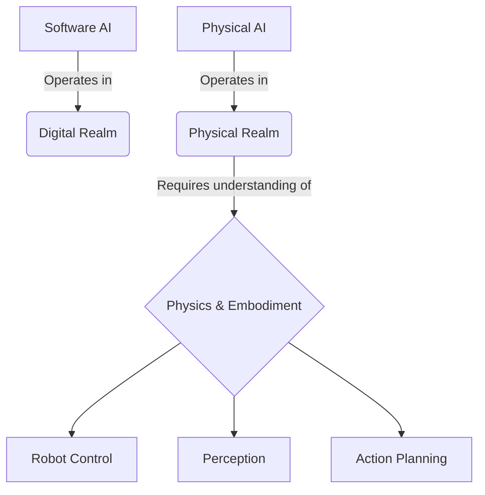

# Introduction to Physical AI & Humanoid Robotics

## Overview

Physical AI represents a significant evolution in artificial intelligence, moving beyond purely software-based systems to incorporate physical embodiment and interaction with the real world. This approach recognizes that intelligence is not merely computational but emerges from the interaction between an agent, its body, and the environment.

## Key Concepts

### Embodied AI
Embodied AI emphasizes the importance of physical interaction with the world for developing true intelligence. Unlike traditional AI systems that operate in digital spaces, embodied AI systems must understand and navigate physical reality including:
- Physics (gravity, friction, collision, material properties)
- Embodiment (body-environment interactions)
- Real-time sensorimotor processes

### The AI-Robot Gap
There's a significant gap between AI algorithms and their real-world deployment. Briding this gap requires:
- Robust perception systems that handle noisy, real-world data
- Control systems that can operate reliably in dynamic environments
- Learning systems that can adapt to the complexities of physical reality

### Core Principles of Physical AI

1. **Embodiment**: Intelligence emerges from the interaction between agent and environment
2. **Physics Understanding**: Systems must understand and predict physical phenomena
3. **Real-time Operation**: Systems must respond to environmental changes in real time
4. **Adaptability**: Systems must handle unexpected situations and changing environments

## Real-World Applications

Physical AI is already transforming multiple domains:

- **Autonomous Vehicles**: Understanding traffic, physics, and navigation in dynamic environments
- **Industrial Robotics**: Manufacturing, assembly, and quality control systems
- **Surgical Robotics**: Precise, dexterous manipulation in constrained environments
- **Assistive Robotics**: Smart prosthetics and exoskeletons
- **Exploration Robotics**: Mars rovers and underwater exploration systems

## Technical Architecture



## The Robot Operating System (ROS)

The Robot Operating System (ROS) provides the foundational middleware for physical AI systems. While not a traditional operating system, ROS provides:

- **Message Passing**: Communication between robot processes
- **Hardware Abstraction**: Unified interfaces for diverse hardware
- **Package Management**: Organized code libraries and tools
- **Simulation**: Gazebo for testing without real hardware
- **Visualization**: Tools for monitoring and debugging

## MCP and Context7 Integration

Model Context Protocol (MCP) enables Physical AI systems to access external tools and knowledge sources. This is critical for physical AI systems that need to:

- Access current documentation and specifications for hardware components
- Retrieve best practices for robotics algorithms
- Access external APIs for enhanced capabilities
- Integrate with cloud services and databases

Context7 documentation servers provide up-to-date information about robotics libraries, APIs, and best practices, ensuring AI systems have access to current, accurate information when making decisions.

## Learning Outcomes

After completing this module, students should be able to:

1. Define Physical AI and explain its core tenets (physics, embodiment, reality)
2. Differentiate between traditional AI and Physical AI applications
3. Identify key challenges in deploying AI in physical environments
4. Articulate the significance of embodiment for general AI
5. Understand the role of ROS in robotic systems
6. Comprehend how MCP and Context7 enhance Physical AI capabilities

## Hardware & Software Requirements

### Software Stack
- Ubuntu 22.04 LTS
- ROS 2 Humble Hawksbill
- Python 3.10+
- Docusaurus (for documentation)
- Git version control

### Recommended Hardware
- Modern Linux PC/VM (Intel i7/AMD Ryzen 7 or better)
- NVIDIA GPU (RTX 3060 or equivalent for simulation)
- 16GB+ RAM
- 500GB+ SSD storage

## Mini-Tasks for Students

1. Research and summarize 3 real-world applications of Physical AI
2. Investigate the difference between ROS 1 and ROS 2
3. Experiment with a simple physics simulation (e.g., dropping objects with different properties)
4. Explore available MCP servers that might be relevant for robotics applications

## Cross-References to Other Modules

This foundational module introduces concepts that will be expanded in:
- **Module 1**: The Robotic Nervous System (ROS 2) - detailed ROS implementation
- **Module 2**: The Digital Twin (Gazebo & Unity) - simulation environments
- **Module 3**: The AI-Robot Brain (NVIDIA Isaac) - advanced simulation and AI
- **Module 4**: Vision-Language-Action (VLA) - perception and cognition integration

## MCP Integration in Physical AI

Physical AI systems can leverage MCP servers in several ways:

```javascript
// Example: MCP integration for documentation lookup
async function getRobotAPIInfo(apiFunctionName) {
  // Use Context7 MCP server to retrieve current API documentation
  const mcpClient = new MCPClient();
  const result = await mcpClient.callTool('get-library-docs', {
    context7CompatibleLibraryID: '/ros2/ros2-documentation',
    topic: apiFunctionName
  });
  return result.documentation;
}

// Example usage
const apiInfo = await getRobotAPIInfo('rclpy.init');
console.log('Current ROS2 API documentation:', apiInfo);
```

This approach allows Physical AI systems to access the most current information about robotic APIs, hardware specifications, and best practices, which is crucial for systems operating in complex physical environments where outdated information could lead to failures or safety issues.

## Integration Points for Capstone Project

The capstone project "Autonomous Humanoid" will require understanding of all concepts introduced here, particularly:
- The relationship between embodiment and intelligence
- Physical constraints that AI systems must accommodate
- Integration of perception, control, and cognition
- Safety considerations for physical AI systems
- The role of simulation in physical AI development

## Weekly Progression Notes

**Week 1**: Focus on foundational concepts and overview. Students should understand what Physical AI is and why it's different from traditional AI. Introduce the course structure and the capstone project concept.