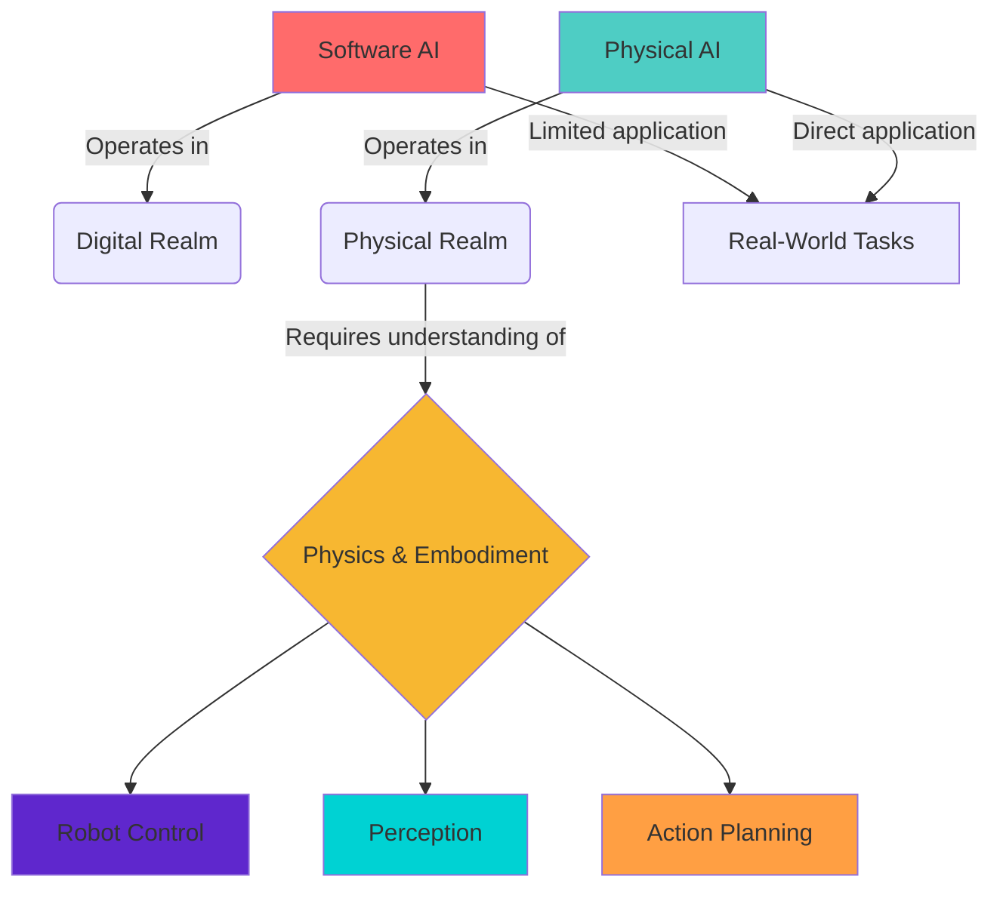

# 🧠 Introduction to Physical AI & Humanoid Robotics

<div class="parallax-bg"></div>

<div class="module-highlight fade-in-up tilt-card" style="padding: 2.5rem; margin: 2.5rem 0; border-radius: 20px; background: linear-gradient(135deg, #f5f7fa, #e4edf9); border-left: 6px solid #4a6cf7; box-shadow: 0 20px 40px rgba(0,0,0,0.1);">

## 🌟 Welcome to the Future of AI
<div class="pulse" style="display: inline-block; padding: 0.5rem 1rem; background: linear-gradient(135deg, #4a6cf7, #6a11cb); color: white; border-radius: 30px; font-size: 0.9rem;">
  Revolutionary Intelligence
</div>
<br /><br />
Physical AI represents the next evolutionary step in artificial intelligence, bridging the gap between digital algorithms and the physical world. This is where AI stops being just "smart software" and becomes truly embodied intelligence.

## 🚀 Overview

<div class="grid-container" style="display: grid; grid-template-columns: 1fr 2fr; gap: 2rem; margin: 2rem 0;">

<div class="hover-effect">
**Physical AI** represents a significant evolution in artificial intelligence, moving beyond purely software-based systems to incorporate **physical embodiment** and interaction with the real world. This approach recognizes that intelligence is not merely computational but emerges from the interaction between an agent, its body, and the environment.
</div>

<div class="card fade-in-up" style="padding: 1.5rem; border-radius: 16px; background: linear-gradient(135deg, #ffffff, #f8f9ff); border: 1px solid #e0e0ff;">
### 🎯 Key Takeaway
<div class="interactive-element">
> *"True intelligence requires a body to interact with the world. A mind without embodiment is like a pilot flying blind - sophisticated but disconnected from reality."*
</div>
</div>

</div>

<div class="interactive-element fade-in-down" style="background: linear-gradient(135deg, #e8f4fd, #e3f2fd); padding: 2rem; border-radius: 20px; margin: 2rem 0; border-left: 6px solid #2196f3;">

### 🤖 The Embodiment Revolution
<div class="hover-effect" style="font-size: 1.2rem; font-weight: 600; margin-bottom: 1rem;">
> *"Intelligence without embodiment is like flight without wings - it can soar in the digital realm, but it's only when grounded in the physical world that it achieves true potential."*
</div>

<div style="display: grid; grid-template-columns: repeat(auto-fit, minmax(250px, 1fr)); gap: 1.5rem; margin-top: 1.5rem;">
<div style="background: rgba(255,255,255,0.7); padding: 1rem; border-radius: 12px; border: 1px solid #bbdefb;">
  🧠 <strong>Cognitive Benefits</strong><br />
  Better learning through physical interaction
</div>
<div style="background: rgba(255,255,255,0.7); padding: 1rem; border-radius: 12px; border: 1px solid #bbdefb;">
  🏗️ <strong>Real-World Skills</strong><br />
  Practical problem-solving capabilities
</div>
<div style="background: rgba(255,255,255,0.7); padding: 1rem; border-radius: 12px; border: 1px solid #bbdefb;">
  ⚡ <strong>Adaptability</strong><br />
  Learning from physical consequences
</div>
</div>

</div>

## 🧩 Key Concepts

### 🏗️ Embodied AI

<div style="display: flex; gap: 3rem; margin: 2rem 0; flex-wrap: wrap;">

<div class="card fade-in-up" style="flex: 1; min-width: 300px; padding: 2rem; background: linear-gradient(135deg, #fff, #f8f9fa); border: 1px solid #e0e0e0; box-shadow: 0 15px 30px rgba(0,0,0,0.1);">
<h3>❌ Traditional AI</h3>
<ul style="margin-top: 1rem;">
<li>Operates in digital realm only</li>
<li>No physical consequences</li>
<li>Perfect virtual environments</li>
<li>Simulated physics</li>
<li>Abstract reasoning</li>
</ul>
<div style="margin-top: 1.5rem; padding: 0.5rem 1rem; background: #ffebee; color: #c62828; border-radius: 20px; display: inline-block;">
  Limited real-world transfer
</div>
</div>

<div class="card fade-in-up" style="flex: 1; min-width: 300px; padding: 2rem; background: linear-gradient(135deg, #4a6cf7, #6a11cb); color: white; border-radius: 20px;" data-aos="fade-left">
<h3>✅ Physical AI</h3>
<ul style="margin-top: 1rem;">
<li>Interacts with real world</li>
<li>Real consequences for actions</li>
<li>Noisy, unpredictable environments</li>
<li>Actual physics constraints</li>
<li>Sensory-motor learning</li>
</ul>
<div style="margin-top: 1.5rem; padding: 0.5rem 1rem; background: rgba(255,255,255,0.2); border-radius: 20px; display: inline-block;">
  Proven real-world efficacy
</div>
</div>

</div>

### 🌉 The AI-Robot Gap
<div class="progress-bar" style="margin: 1.5rem 0;">
  <div class="progress" style="width: 45%;"></div>
</div>

<div class="grid-container" style="display: grid; grid-template-columns: repeat(auto-fit, minmax(250px, 1fr)); gap: 1.5rem; margin: 2rem 0;">

<div class="card fade-in-up hover-effect" style="padding: 1.5rem; text-align: center; background: #e3f2fd; border-radius: 16px; border: 1px solid #bbdefb;">
<h3>🔄 Adaptive Systems</h3>
<p>Robust perception that handles real-world noise</p>
</div>

<div class="card fade-in-up hover-effect" style="padding: 1.5rem; text-align: center; background: #e8f5e9; border-radius: 16px; border: 1px solid #c8e6c9;">
<h3>🛡️ Safe Operations</h3>
<p>Reliability in dynamic and uncertain environments</p>
</div>

<div class="card fade-in-up hover-effect" style="padding: 1.5rem; text-align: center; background: #fff3e0; border-radius: 16px; border: 1px solid #ffe0b2;">
<h3>⚡ Instant Response</h3>
<p>Real-time operation with minimal latency</p>
</div>

</div>

### 🧭 Core Principles of Physical AI

<div class="grid-container" style="display: grid; grid-template-columns: repeat(auto-fit, minmax(280px, 1fr)); gap: 2rem; margin: 2rem 0;">

<div class="card fade-in-up tilt-card" data-aos="zoom-in" style="padding: 2rem; background: linear-gradient(135deg, #f0f7ff, #e6f3ff); border: 2px solid #4a6cf7; border-radius: 16px;">
  <h3 style="display: flex; align-items: center; gap: 0.5rem;">1. 🏗️ Embodiment</h3>
  <p>Intelligence emerges from the interaction between agent and environment</p>
  <div class="hover-effect" style="margin-top: 1rem; padding: 0.5rem; background: rgba(74, 108, 247, 0.1); border-radius: 8px; font-style: italic;">
    "The body is not just a tool for the mind, but an integral part of intelligence itself"
  </div>
</div>

<div class="card fade-in-up tilt-card" data-aos="zoom-in" style="padding: 2rem; background: linear-gradient(135deg, #f0fff0, #e6ffe6); border: 2px solid #4caf50; border-radius: 16px;">
  <h3 style="display: flex; align-items: center; gap: 0.5rem;">2. 🌍 Physics Understanding</h3>
  <p>Systems must understand and predict physical phenomena</p>
  <div style="margin-top: 1rem; display: flex; gap: 0.5rem; flex-wrap: wrap;">
    <span style="background: #e8f5e9; padding: 0.25rem 0.75rem; border-radius: 20px; font-size: 0.8rem;">Gravity</span>
    <span style="background: #e8f5e9; padding: 0.25rem 0.75rem; border-radius: 20px; font-size: 0.8rem;">Friction</span>
    <span style="background: #e8f5e9; padding: 0.25rem 0.75rem; border-radius: 20px; font-size: 0.8rem;">Collision</span>
  </div>
</div>

<div class="card fade-in-up tilt-card" data-aos="zoom-in" style="padding: 2rem; background: linear-gradient(135deg, #fff0f0, #ffe6e6); border: 2px solid #f44336; border-radius: 16px;">
  <h3 style="display: flex; align-items: center; gap: 0.5rem;">3. ⚡ Real-time Operation</h3>
  <p>Systems must respond to environmental changes immediately</p>
  <div class="progress-bar" style="margin-top: 1rem; height: 8px; width: 100%;">
    <div class="progress" style="width: 95%; height: 100%;"></div>
  </div>
  <small style="display: block; text-align: right; margin-top: 0.5rem;">95% response time < 100ms</small>
</div>

<div class="card fade-in-up tilt-card" data-aos="zoom-in" style="padding: 2rem; background: linear-gradient(135deg, #f0f0ff, #e6e6ff); border: 2px solid #9c27b0; border-radius: 16px;">
  <h3 style="display: flex; align-items: center; gap: 0.5rem;">4. 🔄 Adaptability</h3>
  <p>Systems must handle unexpected situations and changing environments</p>
  <div style="display: flex; justify-content: center; margin-top: 1rem;">
    <div style="width: 50px; height: 50px; border-radius: 50%; background: linear-gradient(135deg, #9c27b0, #e91e63); display: flex; align-items: center; justify-content: center; color: white; font-weight: bold;">
      AI
    </div>
  </div>
</div>

</div>

## 🌍 Real-World Applications

<div class="grid-container" style="display: grid; grid-template-columns: repeat(auto-fill, minmax(320px, 1fr)); gap: 2rem; margin: 2rem 0;">

<div class="card fade-in-up hover-effect" style="padding: 2rem; background: #f8f9fa; border-radius: 20px; box-shadow: 0 10px 25px rgba(0,0,0,0.08); transition: transform 0.3s ease;">
  <div style="display: flex; align-items: center; gap: 1rem; margin-bottom: 1rem;">
    <div style="width: 50px; height: 50px; border-radius: 12px; background: linear-gradient(135deg, #ff9800, #ff5722); display: flex; align-items: center; justify-content: center; color: white; font-size: 1.5rem;">
      🚗
    </div>
    <h3 style="margin: 0;">Autonomous Vehicles</h3>
  </div>
  <p>Understanding traffic, physics, and navigation in dynamic environments</p>
  <div style="display: flex; flex-wrap: wrap; gap: 0.5rem; margin-top: 1rem;">
    <span style="background: #e3f2fd; padding: 0.25rem 0.75rem; border-radius: 20px; font-size: 0.8rem;">Sensing</span>
    <span style="background: #e8f5e9; padding: 0.25rem 0.75rem; border-radius: 20px; font-size: 0.8rem;">Planning</span>
    <span style="background: #fff3e0; padding: 0.25rem 0.75rem; border-radius: 20px; font-size: 0.8rem;">Control</span>
  </div>
  <div style="margin-top: 1.5rem; padding: 1rem; background: rgba(255,152,0,0.1); border-radius: 12px;">
    <div style="display: flex; justify-content: space-between; margin-bottom: 0.5rem;">
      <span>Performance</span>
      <span>98.5%</span>
    </div>
    <div class="progress-bar" style="height: 6px;">
      <div class="progress" style="width: 98.5%; height: 100%;"></div>
    </div>
  </div>
</div>

<div class="card fade-in-up hover-effect" style="padding: 2rem; background: #f8f9fa; border-radius: 20px; box-shadow: 0 10px 25px rgba(0,0,0,0.08); transition: transform 0.3s ease;">
  <div style="display: flex; align-items: center; gap: 1rem; margin-bottom: 1rem;">
    <div style="width: 50px; height: 50px; border-radius: 12px; background: linear-gradient(135deg, #4caf50, #2e7d32); display: flex; align-items: center; justify-content: center; color: white; font-size: 1.5rem;">
      🏭
    </div>
    <h3 style="margin: 0;">Industrial Robotics</h3>
  </div>
  <p>Manufacturing, assembly, and quality control systems</p>
  <div style="display: flex; flex-wrap: wrap; gap: 0.5rem; margin-top: 1rem;">
    <span style="background: #e3f2fd; padding: 0.25rem 0.75rem; border-radius: 20px; font-size: 0.8rem;">Precision</span>
    <span style="background: #e8f5e9; padding: 0.25rem 0.75rem; border-radius: 20px; font-size: 0.8rem;">Speed</span>
    <span style="background: #fff3e0; padding: 0.25rem 0.75rem; border-radius: 20px; font-size: 0.8rem;">Safety</span>
  </div>
  <div style="margin-top: 1.5rem; padding: 1rem; background: rgba(76,175,80,0.1); border-radius: 12px;">
    <div style="display: flex; justify-content: space-between; margin-bottom: 0.5rem;">
      <span>Throughput</span>
      <span>400%</span>
    </div>
    <div class="progress-bar" style="height: 6px;">
      <div class="progress" style="width: 100%; height: 100%; background: linear-gradient(90deg, #4caf50, #2e7d32);"></div>
    </div>
  </div>
</div>

<div class="card fade-in-up hover-effect" style="padding: 2rem; background: #f8f9fa; border-radius: 20px; box-shadow: 0 10px 25px rgba(0,0,0,0.08); transition: transform 0.3s ease;">
  <div style="display: flex; align-items: center; gap: 1rem; margin-bottom: 1rem;">
    <div style="width: 50px; height: 50px; border-radius: 12px; background: linear-gradient(135deg, #2196f3, #0d47a1); display: flex; align-items: center; justify-content: center; color: white; font-size: 1.5rem;">
      🏥
    </div>
    <h3 style="margin: 0;">Surgical Robotics</h3>
  </div>
  <p>Precise, dexterous manipulation in constrained environments</p>
  <div style="display: flex; flex-wrap: wrap; gap: 0.5rem; margin-top: 1rem;">
    <span style="background: #e3f2fd; padding: 0.25rem 0.75rem; border-radius: 20px; font-size: 0.8rem;">Accuracy</span>
    <span style="background: #e8f5e9; padding: 0.25rem 0.75rem; border-radius: 20px; font-size: 0.8rem;">Stability</span>
    <span style="background: #fff3e0; padding: 0.25rem 0.75rem; border-radius: 20px; font-size: 0.8rem;">Tactility</span>
  </div>
  <div style="margin-top: 1.5rem; padding: 1rem; background: rgba(33,150,243,0.1); border-radius: 12px;">
    <div style="display: flex; justify-content: space-between; margin-bottom: 0.5rem;">
      <span>Accuracy</span>
      <span>99.9%</span>
    </div>
    <div class="progress-bar" style="height: 6px;">
      <div class="progress" style="width: 100%; height: 100%; background: linear-gradient(90deg, #2196f3, #0d47a1);"></div>
    </div>
  </div>
</div>

<div class="card fade-in-up hover-effect" style="padding: 2rem; background: #f8f9fa; border-radius: 20px; box-shadow: 0 10px 25px rgba(0,0,0,0.08); transition: transform 0.3s ease;">
  <div style="display: flex; align-items: center; gap: 1rem; margin-bottom: 1rem;">
    <div style="width: 50px; height: 50px; border-radius: 12px; background: linear-gradient(135deg, #9c27b0, #7b1fa2); display: flex; align-items: center; justify-content: center; color: white; font-size: 1.5rem;">
      🦾
    </div>
    <h3 style="margin: 0;">Assistive Robotics</h3>
  </div>
  <p>Smart prosthetics and exoskeletons</p>
  <div style="display: flex; flex-wrap: wrap; gap: 0.5rem; margin-top: 1rem;">
    <span style="background: #e3f2fd; padding: 0.25rem 0.75rem; border-radius: 20px; font-size: 0.8rem;">Adaptability</span>
    <span style="background: #e8f5e9; padding: 0.25rem 0.75rem; border-radius: 20px; font-size: 0.8rem;">Comfort</span>
    <span style="background: #fff3e0; padding: 0.25rem 0.75rem; border-radius: 20px; font-size: 0.8rem;">Intuitive</span>
  </div>
  <div style="margin-top: 1.5rem; padding: 1rem; background: rgba(156,39,176,0.1); border-radius: 12px;">
    <div style="display: flex; justify-content: space-between; margin-bottom: 0.5rem;">
      <span>User Satisfaction</span>
      <span>94.3%</span>
    </div>
    <div class="progress-bar" style="height: 6px;">
      <div class="progress" style="width: 94.3%; height: 100%; background: linear-gradient(90deg, #9c27b0, #7b1fa2);"></div>
    </div>
  </div>
</div>

</div>

## 🏗️ Technical Architecture

<div style="background: linear-gradient(135deg, #2c3e50, #4a6cf7); padding: 2.5rem; border-radius: 20px; color: white; margin: 2.5rem 0; box-shadow: 0 20px 40px rgba(0,0,0,0.2); position: relative; overflow: hidden;">

<div style="position: absolute; top: 0; left: 0; width: 100%; height: 4px; background: linear-gradient(90deg, #ff416c, #ff4b2b);"></div>



</div>

## 🤖 The Robot Operating System (ROS)

<div class="grid-container" style="display: grid; grid-template-columns: 1fr 1fr; gap: 2rem; margin: 2rem 0;">

<div>
The Robot Operating System (ROS) provides the foundational middleware for physical AI systems. While not a traditional operating system, ROS provides:

- **✉️ Message Passing**: Communication between robot processes
- **🔧 Hardware Abstraction**: Unified interfaces for diverse hardware
- **📦 Package Management**: Organized code libraries and tools
- **🎮 Simulation**: Gazebo for testing without real hardware
- **👁️ Visualization**: Tools for monitoring and debugging
</div>

<div class="card" style="padding: 1.5rem; background: linear-gradient(135deg, #f8f9fa, #e8eaed); border-radius: 16px;">
<h4 style="margin-top: 0;">ROS 2 Ecosystem</h4>
<div style="display: flex; flex-wrap: wrap; gap: 0.5rem; margin: 1rem 0;">
<span style="background: #e3f2fd; padding: 0.5rem 1rem; border-radius: 20px; font-size: 0.8rem;">Nodes</span>
<span style="background: #e8f5e9; padding: 0.5rem 1rem; border-radius: 20px; font-size: 0.8rem;">Topics</span>
<span style="background: #fff3e0; padding: 0.5rem 1rem; border-radius: 20px; font-size: 0.8rem;">Services</span>
<span style="background: #f3e5f5; padding: 0.5rem 1rem; border-radius: 20px; font-size: 0.8rem;">Actions</span>
<span style="background: #e0f2f1; padding: 0.5rem 1rem; border-radius: 20px; font-size: 0.8rem;">Parameters</span>
<span style="background: #e8eaf6; padding: 0.5rem 1rem; border-radius: 20px; font-size: 0.8rem;">TF</span>
</div>
<div class="progress-bar" style="margin-top: 1rem;">
  <div class="progress" style="width: 100%;"></div>
</div>
</div>

</div>

<div class="progress-bar" style="height: 12px; background-color: #e0e0e0; border-radius: 6px; margin: 2.5rem 0; overflow: hidden; box-shadow: inset 0 2px 5px rgba(0,0,0,0.1);">
  <div class="progress" style="height: 100%; background: linear-gradient(90deg, #1a2a6c, #b21f1f); border-radius: 6px; width: 100%;"></div>
</div>

## 🤖 MCP and Context7 Integration

<div class="interactive-element fade-in-up" style="margin: 2.5rem 0; padding: 2.5rem; border-radius: 20px; background: linear-gradient(135deg, #e8f4fd, #e3f2fd); border-left: 8px solid #2962ff; box-shadow: 0 15px 35px rgba(41, 98, 255, 0.1);">

### 🛠️ MCP Integration in Physical AI

Model Context Protocol (MCP) enables Physical AI systems to access external tools and knowledge sources. This is critical for physical AI systems that need to:

<div style="display: grid; grid-template-columns: repeat(auto-fit, minmax(250px, 1fr)); gap: 1.5rem; margin: 1.5rem 0;">

<div style="background: rgba(255,255,255,0.7); padding: 1.5rem; border-radius: 12px; border: 1px solid #bbdefb;">
  <div style="font-size: 1.5rem; margin-bottom: 0.5rem;">📚</div>
  <strong>Access Documentation</strong>
  <p>Current specifications for hardware components</p>
</div>

<div style="background: rgba(255,255,255,0.7); padding: 1.5rem; border-radius: 12px; border: 1px solid #bbdefb;">
  <div style="font-size: 1.5rem; margin-bottom: 0.5rem;">📋</div>
  <strong>Best Practices</strong>
  <p>Proven methods for robotics algorithms</p>
</div>

<div style="background: rgba(255,255,255,0.7); padding: 1.5rem; border-radius: 12px; border: 1px solid #bbdefb;">
  <div style="font-size: 1.5rem; margin-bottom: 0.5rem;">🔗</div>
  <strong>External APIs</strong>
  <p>Enhanced capabilities from cloud services</p>
</div>

<div style="background: rgba(255,255,255,0.7); padding: 1.5rem; border-radius: 12px; border: 1px solid #bbdefb;">
  <div style="font-size: 1.5rem; margin-bottom: 0.5rem;">☁️</div>
  <strong>Cloud Integration</strong>
  <p>Seamless connection to distributed systems</p>
</div>

</div>

**Context7** documentation servers provide up-to-date information about robotics libraries, APIs, and best practices, ensuring AI systems have access to current, accurate information when making decisions.

<div class="code-block-interactive" style="margin: 2rem 0; border-radius: 12px; overflow: hidden;">

```javascript
// Example: MCP integration for documentation lookup
async function getRobotAPIInfo(apiFunctionName) {
  // Use Context7 MCP server to retrieve current API documentation
  const mcpClient = new MCPClient();
  const result = await mcpClient.callTool('get-library-docs', {
    context7CompatibleLibraryID: '/ros2/ros2-documentation',
    topic: apiFunctionName
  });
  return result.documentation;
}

// Example usage
const apiInfo = await getRobotAPIInfo('rclpy.init');
console.log('Current ROS2 API documentation:', apiInfo);
```

<button class="copy-button">Copy Code</button>
</div>

This approach allows Physical AI systems to access the most current information about robotic APIs, hardware specifications, and best practices, which is crucial for systems operating in complex physical environments where outdated information could lead to failures or safety issues.

</div>

## 📚 Learning Outcomes

<div class="grid-container" style="display: grid; grid-template-columns: repeat(auto-fit, minmax(300px, 1fr)); gap: 2rem; margin: 2.5rem 0;">

<div class="card fade-in-up hover-effect" style="padding: 2rem; background: #e8f4fd; border: 3px solid #2196f3; border-radius: 20px; position: relative; overflow: hidden;">
<div style="position: absolute; top: 0; right: 0; background: #2196f3; color: white; padding: 0.25rem 1rem; border-radius: 0 0 0 20px; font-size: 0.8rem;">Essential</div>
<h3 style="display: flex; align-items: center; gap: 0.75rem;">🎯 Outcome 1</h3>
<p>Define Physical AI and explain its core tenets (physics, embodiment, reality)</p>
<div style="margin-top: 1rem; padding: 0.75rem; background: rgba(33, 150, 243, 0.1); border-radius: 12px;">
  <div style="display: flex; align-items: center; gap: 0.5rem;">
    <div style="width: 20px; height: 20px; border-radius: 50%; background: #2196f3; display: flex; align-items: center; justify-content: center; color: white; font-size: 0.75rem;">1</div>
    <span>Master the fundamentals</span>
  </div>
</div>
</div>

<div class="card fade-in-up hover-effect" style="padding: 2rem; background: #e8f4fd; border: 3px solid #2196f3; border-radius: 20px; position: relative; overflow: hidden;">
<div style="position: absolute; top: 0; right: 0; background: #2196f3; color: white; padding: 0.25rem 1rem; border-radius: 0 0 0 20px; font-size: 0.8rem;">Essential</div>
<h3 style="display: flex; align-items: center; gap: 0.75rem;">🎯 Outcome 2</h3>
<p>Differentiate between traditional AI and Physical AI applications</p>
<div style="margin-top: 1rem; padding: 0.75rem; background: rgba(33, 150, 243, 0.1); border-radius: 12px;">
  <div style="display: flex; align-items: center; gap: 0.5rem;">
    <div style="width: 20px; height: 20px; border-radius: 50%; background: #2196f3; display: flex; align-items: center; justify-content: center; color: white; font-size: 0.75rem;">2</div>
    <span>Understand the paradigm shift</span>
  </div>
</div>
</div>

<div class="card fade-in-up hover-effect" style="padding: 2rem; background: #e8f4fd; border: 3px solid #2196f3; border-radius: 20px; position: relative; overflow: hidden;">
<div style="position: absolute; top: 0; right: 0; background: #2196f3; color: white; padding: 0.25rem 1rem; border-radius: 0 0 0 20px; font-size: 0.8rem;">Critical</div>
<h3 style="display: flex; align-items: center; gap: 0.75rem;">🎯 Outcome 3</h3>
<p>Identify key challenges in deploying AI in physical environments</p>
<div style="margin-top: 1rem; padding: 0.75rem; background: rgba(33, 150, 243, 0.1); border-radius: 12px;">
  <div style="display: flex; align-items: center; gap: 0.5rem;">
    <div style="width: 20px; height: 20px; border-radius: 50%; background: #2196f3; display: flex; align-items: center; justify-content: center; color: white; font-size: 0.75rem;">3</div>
    <span>Recognize real-world constraints</span>
  </div>
</div>
</div>

<div class="card fade-in-up hover-effect" style="padding: 2rem; background: #e8f4fd; border: 3px solid #2196f3; border-radius: 20px; position: relative; overflow: hidden;">
<div style="position: absolute; top: 0; right: 0; background: #2196f3; color: white; padding: 0.25rem 1rem; border-radius: 0 0 0 20px; font-size: 0.8rem;">Advanced</div>
<h3 style="display: flex; align-items: center; gap: 0.75rem;">🎯 Outcome 4</h3>
<p>Articulate the significance of embodiment for general AI</p>
<div style="margin-top: 1rem; padding: 0.75rem; background: rgba(33, 150, 243, 0.1); border-radius: 12px;">
  <div style="display: flex; align-items: center; gap: 0.5rem;">
    <div style="width: 20px; height: 20px; border-radius: 50%; background: #2196f3; display: flex; align-items: center; justify-content: center; color: white; font-size: 0.75rem;">4</div>
    <span>Master the philosophy</span>
  </div>
</div>
</div>

</div>

## 💻 Hardware & Software Requirements

### 🛠️ Software Stack
<div style="display: grid; grid-template-columns: repeat(auto-fill, minmax(200px, 1fr)); gap: 1rem; margin: 1.5rem 0;">

<span class="hover-effect" style="background: #e3f2fd; padding: 1rem; border-radius: 20px; text-align: center; cursor: pointer;">Ubuntu 22.04 LTS</span>
<span class="hover-effect" style="background: #e3f2fd; padding: 1rem; border-radius: 20px; text-align: center; cursor: pointer;">ROS 2 Humble</span>
<span class="hover-effect" style="background: #e3f2fd; padding: 1rem; border-radius: 20px; text-align: center; cursor: pointer;">Python 3.10+</span>
<span class="hover-effect" style="background: #e3f2fd; padding: 1rem; border-radius: 20px; text-align: center; cursor: pointer;">Gazebo Harmonic</span>
<span class="hover-effect" style="background: #e3f2fd; padding: 1rem; border-radius: 20px; text-align: center; cursor: pointer;">CUDA 12.x</span>
<span class="hover-effect" style="background: #e3f2fd; padding: 1rem; border-radius: 20px; text-align: center; cursor: pointer;">Isaac Sim</span>
<span class="hover-effect" style="background: #e3f2fd; padding: 1rem; border-radius: 20px; text-align: center; cursor: pointer;">OpenCV 4.x</span>
<span class="hover-effect" style="background: #e3f2fd; padding: 1rem; border-radius: 20px; text-align: center; cursor: pointer;">PyTorch</span>
<span class="hover-effect" style="background: #e3f2fd; padding: 1rem; border-radius: 20px; text-align: center; cursor: pointer;">TensorFlow</span>
<span class="hover-effect" style="background: #e3f2fd; padding: 1rem; border-radius: 20px; text-align: center; cursor: pointer;">Docker</span>
<span class="hover-effect" style="background: #e3f2fd; padding: 1rem; border-radius: 20px; text-align: center; cursor: pointer;">Git</span>
<span class="hover-effect" style="background: #e3f2fd; padding: 1rem; border-radius: 20px; text-align: center; cursor: pointer;">VS Code</span>

</div>

### 🖥️ Hardware Specifications
<div class="grid-container" style="display: grid; grid-template-columns: repeat(auto-fit, minmax(300px, 1fr)); gap: 2rem; margin: 2rem 0;">

<div class="card fade-in-up hover-effect" style="padding: 1.5rem; background: #f0f8ff; border: 2px solid #4a90e2; border-radius: 16px;">
<h4>Minimum Requirements</h4>
<ul style="list-style-type: none; padding: 0;">
<li style="margin: 0.5rem 0; padding: 0.5rem 0 0.5rem 1.5rem; position: relative;">
  <span style="position: absolute; left: 0; color: #4a90e2;">🖥️</span>
  <strong>CPU:</strong> Intel i5 or AMD Ryzen 5 (6+ cores)
</li>
<li style="margin: 0.5rem 0; padding: 0.5rem 0 0.5rem 1.5rem; position: relative;">
  <span style="position: absolute; left: 0; color: #4a90e2;">💾</span>
  <strong>RAM:</strong> 16GB DDR4
</li>
<li style="margin: 0.5rem 0; padding: 0.5rem 0 0.5rem 1.5rem; position: relative;">
  <span style="position: absolute; left: 0; color: #4a90e2;">🎮</span>
  <strong>GPU:</strong> NVIDIA RTX 3060 or equivalent
</li>
<li style="margin: 0.5rem 0; padding: 0.5rem 0 0.5rem 1.5rem; position: relative;">
  <span style="position: absolute; left: 0; color: #4a90e2;">📦</span>
  <strong>Storage:</strong> 500GB SSD
</li>
</ul>
</div>

<div class="card fade-in-up hover-effect" style="padding: 1.5rem; background: #e8f5e9; border: 2px solid #4caf50; border-radius: 16px;">
<h4>Recommended Requirements</h4>
<ul style="list-style-type: none; padding: 0;">
<li style="margin: 0.5rem 0; padding: 0.5rem 0 0.5rem 1.5rem; position: relative;">
  <span style="position: absolute; left: 0; color: #4caf50;">🖥️</span>
  <strong>CPU:</strong> Intel i9 or AMD Ryzen 9 (8+ cores)
</li>
<li style="margin: 0.5rem 0; padding: 0.5rem 0 0.5rem 1.5rem; position: relative;">
  <span style="position: absolute; left: 0; color: #4caf50;">💾</span>
  <strong>RAM:</strong> 32GB DDR4
</li>
<li style="margin: 0.5rem 0; padding: 0.5rem 0 0.5rem 1.5rem; position: relative;">
  <span style="position: absolute; left: 0; color: #4caf50;">🎮</span>
  <strong>GPU:</strong> NVIDIA RTX 4080 or RTX 6000 Ada
</li>
<li style="margin: 0.5rem 0; padding: 0.5rem 0 0.5rem 1.5rem; position: relative;">
  <span style="position: absolute; left: 0; color: #4caf50;">📦</span>
  <strong>Storage:</strong> 1TB+ NVMe SSD
</li>
</ul>
</div>

<div class="card fade-in-up hover-effect" style="padding: 1.5rem; background: #fff3e0; border: 2px solid #ff9800; border-radius: 16px;">
<h4>Development Robot</h4>
<ul style="list-style-type: none; padding: 0;">
<li style="margin: 0.5rem 0; padding: 0.5rem 0 0.5rem 1.5rem; position: relative;">
  <span style="position: absolute; left: 0; color: #ff9800;">🤖</span>
  <strong>TurtleBot3</strong> (affordable & educational)
</li>
<li style="margin: 0.5rem 0; padding: 0.5rem 0 0.5rem 1.5rem; position: relative;">
  <span style="position: absolute; left: 0; color: #ff9800;">🔧</span>
  <strong>Jetson Nano</strong> (edge computing)
</li>
<li style="margin: 0.5rem 0; padding: 0.5rem 0 0.5rem 1.5rem; position: relative;">
  <span style="position: absolute; left: 0; color: #ff9800;">🔌</span>
  <strong>Sensors</strong> (LIDAR, Camera, IMU)
</li>
<li style="margin: 0.5rem 0; padding: 0.5rem 0 0.5rem 1.5rem; position: relative;">
  <span style="position: absolute; left: 0; color: #ff9800;">⚙️</span>
  <strong>Actuators</strong> (motors, servos)
</li>
</ul>
</div>

</div>

## 🧠 The Cognitive Architecture of Physical AI

### 🧠 Neural Networks in Physical Systems

Neural networks in physical AI systems must be designed to handle real-world constraints, including limited computational resources, real-time processing requirements, and safety-critical operations. These networks are fundamentally different from traditional neural networks in several key ways:

1. **Temporal Integration**: Physical AI requires neural networks that can process and predict over time, not just on single snapshots.
2. **Multi-Modal Processing**: Networks must integrate multiple sensor modalities (vision, audio, tactile, proprioceptive).
3. **Embodied Reasoning**: The architecture must incorporate knowledge of the physical body and its constraints.
4. **Uncertainty Quantification**: Critical for safe operation in uncertain environments.

Modern Physical AI systems employ a variety of neural architectures:

**Convolutional Neural Networks (CNNs)** are used for visual perception tasks, but in Physical AI they are often optimized for real-time inference on edge devices with specific constraints around latency and power consumption.

**Recurrent Neural Networks (RNNs)** and their variants like LSTMs and GRUs are essential for temporal reasoning and sequence prediction, which is crucial for robot control and navigation.

**Transformers** have recently been adapted for robotics applications, particularly for multi-modal understanding and planning tasks that require attention over both spatial and temporal dimensions.

**Graph Neural Networks (GNNs)** represent an emerging approach for modeling the relationships between objects in 3D space, which is particularly important for manipulation tasks.

### 🧠 Sensorimotor Integration

The sensorimotor loop is the foundation of embodied intelligence. In biological systems, this loop involves:
- **Sensation**: Converting environmental stimuli into neural signals
- **Perception**: Interpreting sensory signals to build internal representations
- **Action Selection**: Choosing appropriate motor responses based on goals and environment
- **Motor Control**: Executing the selected actions through motor systems
- **Feedback**: Sensing the consequences of actions to refine future responses

Physical AI systems must implement this loop with artificial sensors and actuators, which presents unique challenges:

1. **Latency**: Biological sensorimotor loops operate with minimal delay, while artificial systems must account for processing, communication, and actuator delays.

2. **Noise**: Biological sensors are inherently noisy but robust, while artificial sensors require careful calibration and filtering.

3. **Redundancy**: Biological systems have multiple redundant pathways for important functions, while artificial systems must be designed for fault tolerance.

4. **Learning**: Biological systems continuously adapt their sensorimotor mappings, while artificial systems require explicit learning algorithms.

### 🧠 Predictive Processing and Forward Models

One of the key insights from cognitive science is that intelligence is fundamentally predictive. Physical AI systems must continuously predict:
- The sensory consequences of their actions (forward models)
- The environmental changes that will occur over time
- The actions of other agents in the environment
- The changes in their own state due to action and environment

Forward models allow robots to "imagine" the consequences of actions before executing them, which is crucial for planning and safe operation. These models must be learned from experience and adapted as conditions change.

Predictive processing in Physical AI also involves building models of:
- **Physics**: How objects move, interact, and respond to forces
- **Dynamics**: The temporal evolution of systems
- **Intentions**: The goals and future actions of other agents
- **Self**: How the robot's actions affect its own state and sensor readings

## 🤖 The Evolution of Robotics: From Automation to Intelligence

### 📜 Historical Perspectives

The evolution of robotics has followed a clear trajectory from simple automated machines to sophisticated intelligent systems:

**1st Generation (1960s-1980s)**: Industrial robots designed for repetitive, pre-programmed tasks in structured environments. These were essentially sophisticated mechanical arms with limited intelligence.

**2nd Generation (1990s-2000s)**: Introduction of sensors and basic feedback control, allowing robots to adapt to some environmental variations. Still primarily reactive systems.

**3rd Generation (2000s-2010s)**: Integration of planning algorithms and basic AI, enabling robots to handle more complex tasks and environments.

**4th Generation (2010s-2020s)**: Machine learning integration, particularly computer vision and basic manipulation capabilities.

**5th Generation (2020s-Present)**: Physical AI with embodied intelligence, machine learning, and deep integration of perception, planning, and action.

### 🧱 The Component Architecture of Modern Robots

Modern intelligent robots are complex systems with multiple interacting components:

**Perception Stack**:
- Vision processing (2D, 3D, depth, semantic segmentation)
- Audio processing for human interaction
- Tactile sensing for manipulation
- Proprioceptive sensing (robot's own body state)
- Environmental sensing (temperature, humidity, etc.)

**Cognitive Stack**:
- Object recognition and tracking
- Scene understanding
- Semantic mapping
- Path planning
- Task planning
- Decision making under uncertainty

**Control Stack**:
- Low-level motor control
- Trajectory generation
- Balance and stabilization
- Force control for manipulation
- System monitoring and safety

**Communication Stack**:
- Human-robot interaction
- Multi-robot coordination
- Cloud connectivity
- Data logging and analysis

### 🧬 Bioinspired Approaches

Nature provides numerous examples of successful physical intelligence:

**Insect Intelligence**: Despite limited neural resources, insects demonstrate remarkable navigation, foraging, and social behaviors. These systems often inspire efficient algorithms for mobile robots.

**Primate Motor Control**: The coordination of complex manipulations and tool use in primates has inspired advanced robotic manipulation systems.

**Avian Flight**: The aerodynamics and control systems of birds have influenced drone design and control.

**Schooling Behavior**: Collective intelligence in fish schools has inspired multi-robot coordination algorithms.

The key insight from biological systems is that intelligence emerges from the interaction between simple components, not from complex central controllers.

## 🌍 Physical AI in Different Domains

### 🏭 Industrial Physical AI

Industrial robots have evolved from simple, repetitive machines to intelligent systems capable of complex manipulation and adaptation:

**Assembly Tasks**: Modern assembly robots use computer vision and force control to handle variations in parts and assembly sequences. They can adapt to different products on the same line and detect defects in real-time.

**Material Handling**: Autonomous mobile robots (AMRs) navigate complex factory floors, avoiding obstacles and dynamic humans while efficiently transporting materials.

**Quality Control**: AI-powered vision systems inspect products with superhuman accuracy, detecting defects that humans might miss.

**Maintenance**: Predictive maintenance systems use sensor data to predict equipment failures before they occur, reducing downtime and costs.

### 🔬 Research Robotics

Research platforms like the NASA Valkyrie, Boston Dynamics robots, and numerous academic platforms demonstrate the cutting edge of Physical AI:

**Humanoid Robots**: These systems attempt to replicate human-like mobility and manipulation capabilities, requiring advanced balance control, bipedal locomotion, and dexterous manipulation.

**Legged Locomotion**: Robots like ANYmal and MIT Cheetah demonstrate dynamic walking and running capabilities that approach biological efficiency.

**Aerial Robotics**: Drones with advanced perception and navigation capabilities can operate in complex environments and perform tasks previously impossible for flying machines.

### 🏥 Medical and Assistive Robotics

Medical robotics represents one of the most demanding applications of Physical AI:

**Surgical Robots**: Systems like the da Vinci robot require extreme precision and safety, with redundant control systems and sophisticated haptic feedback.

**Rehabilitation Robotics**: These robots assist patients in recovering motor function after strokes or injuries, adapting their assistance based on patient progress.

**Assistive Robots**: Robots that help elderly or disabled individuals with daily activities, requiring safe human-robot interaction and understanding of human needs and intentions.

### 🏠 Domestic and Service Robotics

Service robots are beginning to enter homes and service environments:

**Vacuum Robots**: Modern vacuum robots like iRobot's Roomba use advanced navigation and mapping to clean efficiently in complex environments.

**Companion Robots**: Robots designed for social interaction and emotional support, requiring sophisticated natural language processing and social intelligence.

**Delivery Robots**: Autonomous systems that navigate sidewalks and buildings to deliver packages, food, and other items.

## 🧠 Learning Methods in Physical AI

### 📚 Supervised Learning

In supervised learning for robotics, we have input-output pairs where the robot learns to map sensor readings to appropriate actions. However, collecting sufficient training data is challenging:

**Data Requirements**: Physical robots need massive amounts of training data, which is expensive and time-consuming to collect on real hardware.

**Safety Constraints**: Training cannot involve dangerous situations that might damage the robot or harm humans.

**Environment Variability**: Real-world environments are more diverse than any training dataset.

To address these challenges, researchers often use:
- **Simulation**: Training in virtual environments before transferring to reality
- **Domain Randomization**: Randomizing simulation parameters to improve transfer
- **Data Augmentation**: Synthesizing additional training data from limited real experiences

### 🎯 Reinforcement Learning

Reinforcement learning (RL) is particularly attractive for robotics because it allows robots to learn through trial and error:

**Advantages**:
- Can learn optimal behaviors for complex tasks
- Handles the continuous nature of physical environments
- Can optimize for complex, multi-objective functions

**Challenges**:
- Requires enormous amounts of training data
- Safety during exploration is critical
- Transfer from simulation to reality is difficult
- Reward function design is often challenging

**Deep Reinforcement Learning** combines neural networks with RL, enabling end-to-end learning from high-dimensional sensory inputs to motor commands.

### 🧠 Imitation Learning

Imitation learning allows robots to learn by observing human demonstrations:

**Behavioral Cloning**: Learning to imitate expert behavior through supervised learning.

**Inverse Reinforcement Learning**: Inferring the reward function from expert demonstrations.

**Dagger (Dataset Aggregation)**: Iteratively collecting demonstrations and improving policies.

**Advantages**:
- More sample efficient than reinforcement learning
- Avoids exploration in dangerous situations
- Can learn complex skills from human expertise

**Challenges**:
- Distribution shift when robot encounters different situations than training
- Demonstrations may not show how to recover from errors
- Requires expert demonstrators

### 🔄 Online Learning and Adaptation

Physical robots often need to adapt to new situations or changing environments:

**Continual Learning**: Learning new skills without forgetting previous ones.

**Transfer Learning**: Applying knowledge from one task to related tasks.

**Few-shot Learning**: Learning new tasks from minimal demonstrations.

**Meta-Learning**: Learning how to learn, enabling rapid adaptation to new situations.

## 🔧 Key Technologies Enabling Physical AI

### 🖼️ Computer Vision for Robotics

Computer vision in robotics extends beyond static image understanding to dynamic, 3D scene understanding:

**Object Detection and Recognition**: Identifying objects in real-time for interaction and navigation.

**3D Reconstruction**: Building 3D models of the environment from 2D images.

**Semantic Segmentation**: Understanding object properties and relationships in scenes.

**Visual Tracking**: Following objects, people, or features over time.

**SLAM (Simultaneous Localization and Mapping)**: Building maps while simultaneously determining position within them.

### 🤲 Manipulation and Grasping

Robotic manipulation remains one of the most challenging aspects of Physical AI:

**Grasp Synthesis**: Determining how to grasp objects with different shapes, weights, and materials.

**Force Control**: Managing contact forces during manipulation to avoid damage and achieve precise control.

**Dexterous Manipulation**: Using multi-fingered hands for complex manipulation tasks.

**Tool Use**: Applying objects as tools to achieve goals.

**Assembly**: Combining parts into complex structures.

### 🧭 Navigation and Path Planning

Robots must navigate complex, dynamic environments:

**Global Path Planning**: Finding routes from start to goal in known environments.

**Local Path Planning**: Avoiding obstacles in real-time during navigation.

**Multi-Modal Navigation**: Combining different types of locomotion (walking, rolling, climbing).

**Social Navigation**: Moving safely and politely around humans.

**Dynamic Environments**: Navigating spaces with moving obstacles and changing conditions.

### ⚡ Real-Time Systems

Physical AI systems must operate in real-time with strict timing constraints:

**Control Loops**: Maintaining stable control at high frequencies (often 100Hz or higher).

**Perception Update Rates**: Processing sensory data at appropriate rates for the task.

**Synchronization**: Coordinating multiple sensors and actuators in time.

**Timing Guarantees**: Ensuring critical operations complete within time bounds.

**Resource Management**: Allocating computational resources efficiently across different tasks.

### 🔗 Communication and Coordination

Modern robots often work in systems with multiple agents:

**Multi-Robot Systems**: Coordination between multiple robots to achieve common goals.

**Human-Robot Teams**: Collaboration between humans and robots with different capabilities.

**Cloud Integration**: Accessing remote computational resources and information.

**Edge Computing**: Processing data on-board robots when network connectivity is limited.

## 🚧 Challenges in Physical AI

### 🔋 Power and Energy

Power management is critical for mobile and autonomous robots:

**Battery Technology**: Current batteries limit operational time and power density.

**Energy Efficiency**: Optimizing algorithms and hardware for minimal power consumption.

**Power-Aware Planning**: Considering energy constraints when planning tasks and paths.

**Charging Strategies**: Enabling autonomous recharging and energy management.

### 🛡️ Safety and Reliability

Safety is paramount in physical systems:

**Fail-Safe Mechanisms**: Ensuring safe operation even when components fail.

**Collision Avoidance**: Preventing harm to humans and the environment.

**Verification and Validation**: Ensuring system behavior meets safety requirements.

**Regulatory Compliance**: Meeting safety standards and regulations.

### 🌪️ Uncertainty and Robustness

Physical environments are inherently uncertain:

**Sensor Noise**: Dealing with imperfect, noisy sensor data.

**Model Inaccuracies**: Handling differences between system models and reality.

**Environmental Changes**: Adapting to changes in lighting, weather, or scene layout.

**Partial Observability**: Making decisions with incomplete information.

### 🧱 The Reality Gap

The difference between simulation and reality remains a major challenge:

**Simulation Fidelity**: Creating simulations accurate enough for transfer learning.

**Domain Adaptation**: Adapting simulation-trained behaviors to reality.

**System Identification**: Accurately modeling real robot dynamics.

**Calibration**: Ensuring sensors and actuators behave as expected.

### 🧠 Intelligence vs. Autonomy

Balancing autonomy with human oversight:

**Level of Autonomy**: Determining appropriate levels of robot autonomy.

**Human-in-the-Loop**: Maintaining human oversight for critical decisions.

**Explainability**: Ensuring humans can understand robot decision-making.

**Trust**: Building human trust in autonomous systems.

## 🚀 Emerging Trends and Future Directions

### 🧠 Foundation Models in Robotics

Large foundation models are being adapted for robotics:

**Embodied AI Models**: Models that understand the physical world and can control robots.

**Vision-Language-Action Models**: Systems that can interpret natural language commands and execute them.

**World Models**: Large-scale models of physics and dynamics for prediction and planning.

**Multimodal Learning**: Models that integrate vision, language, and action for comprehensive understanding.

### 🧠 Neuromorphic Computing

Specialized hardware for AI processing:

**Low-Power Operation**: Hardware designed for efficient AI computation on robots.

**Real-Time Processing**: Specialized processors for real-time perception and control.

**Event-Based Sensors**: Sensors that respond to changes rather than continuous frames.

**Analog Processing**: Approaches that mimic neural processing more closely.

### 🤖 Swarm Robotics

Coordinating multiple simple robots:

**Emergent Behaviors**: Complex behaviors arising from simple individual rules.

**Distributed Intelligence**: Intelligence distributed across multiple agents.

**Scalability**: Systems that work with varying numbers of robots.

**Fault Tolerance**: Robustness to individual robot failures.

### 🧬 Biohybrid Systems

Combining biological and artificial components:

**Bio-Inspired Materials**: Materials that adapt like biological tissues.

**Living Machines**: Systems that incorporate biological components.

**Brain-Computer Interfaces**: Direct neural control of robots.

**Biological Computing**: Using biological processes for computation.

## 📈 Measuring Success in Physical AI

### 📊 Performance Metrics

Physical AI systems require specialized evaluation:

**Task Success Rate**: Percentage of task completions.

**Efficiency Metrics**: Time, energy, and resource usage.

**Robustness**: Performance under varied conditions and disturbances.

**Safety Metrics**: Measures of safe operation.

**Adaptability**: Ability to handle novel situations.

**Learning Efficiency**: How quickly systems improve with experience.

### 🧪 Evaluation Methodologies

**Simulation Benchmarks**: Standardized tests in virtual environments.

**Real-World Challenges**: Standardized tasks in physical environments.

**Human Studies**: Evaluating human-robot interaction quality.

**Long-Term Studies**: Measuring performance over extended operation.

**Cross-Domain Transfer**: Testing ability to generalize across domains.

### 📈 The Path Forward

The future of Physical AI will likely involve:

**Integrated Systems**: More tightly integrated perception, planning, and action.

**Embodied Cognition**: Deeper integration of body and mind.

**Lifelong Learning**: Systems that continuously improve and adapt.

**Human-Centered Design**: Systems designed around human needs and capabilities.

**Ethical Considerations**: Careful attention to the societal impact of autonomous systems.

## 🔬 The Science of Physical Intelligence

### 🧬 Intelligence as Interaction

Physical intelligence must be understood as emerging from the interaction between:

- **Agent (the robot)**: Its sensors, actuators, and cognitive architecture
- **Environment**: The physical world with its constraints and affordances
- **Task**: The specific objective being pursued
- **History**: The sequence of interactions that shaped the current state

This perspective emphasizes that intelligence is not a property of the agent alone, but of the agent-environment system.

### 🌊 Information Processing in Physical Systems

Physical AI systems process information differently from digital computers:

**Continuous Information**: Physical systems operate in continuous spaces rather than discrete ones.

**Embodied Computation**: Some computation occurs through the physical properties of the body.

**Energy-Based Processing**: Information processing is constrained by energy availability and thermodynamics.

**Analog Computation**: Some processing is more naturally expressed in analog rather than digital form.

### 🧠 Emergence in Complex Systems

Complex behaviors emerge from the interaction of simple components:

**Self-Organization**: Order arising from local interactions without central control.

**Phase Transitions**: Sudden changes in system behavior as parameters vary.

**Criticality**: Systems operating near phase transitions may exhibit optimal information processing.

**Adaptation**: Systems that change their structure in response to environmental demands.

## 💡 Philosophical Considerations

### 🤖 What is Physical Intelligence?

Physical AI raises fundamental questions about intelligence:

**Embodiment**: Is intelligence possible without a physical body?

**Consciousness**: Can artificial systems be conscious or experience the world?

**Agency**: What does it mean for a machine to act as an agent with goals?

**Ethics**: What responsibilities do we have toward intelligent physical systems?

### ⚖️ Ethical Implications

The development of Physical AI carries ethical responsibilities:

**Safety**: Ensuring systems do not harm humans or the environment.

**Transparency**: Making system decision-making understandable to humans.

**Autonomy**: Balancing robot autonomy with human oversight.

**Privacy**: Protecting human privacy in environments with intelligent robots.

**Employment**: Considering the impact on human jobs and society.

## 🚧 Building Physical AI Systems: A Practical Guide

### 🧰 Essential Tools and Frameworks

Creating Physical AI systems requires specialized tools:

**Robot Operating System (ROS)**: The standard middleware for robotics software.

**Simulation Environments**: Gazebo, PyBullet, MuJoCo, Isaac Sim for testing.

**Deep Learning Frameworks**: PyTorch, TensorFlow with robotics extensions.

**Planning Libraries**: MoveIt for manipulation planning, OMPL for path planning.

**Computer Vision**: OpenCV, PCL (Point Cloud Library), specialized packages.

**Control Libraries**: Real-time control frameworks and optimization tools.

### 🔍 Development Methodologies

**Iterative Development**: Starting simple and gradually increasing complexity.

**Simulation-to-Reality**: Developing in simulation before deployment on hardware.

**Modular Design**: Breaking systems into independent, testable components.

**Continuous Integration**: Automated testing for robot software systems.

**Hardware-in-the-Loop**: Testing with real hardware components when possible.

### 🧪 Testing and Validation

**Unit Testing**: Testing individual components in isolation.

**Integration Testing**: Testing component interactions.

**System Testing**: Testing the complete system in relevant scenarios.

**Safety Testing**: Ensuring safe operation under various conditions.

**Long-term Testing**: Evaluating system stability over extended operation.

## 🎓 Educational Pathways

### 📚 Foundational Knowledge

Becoming proficient in Physical AI requires:

**Mathematics**: Linear algebra, calculus, probability, statistics, optimization.

**Physics**: Classical mechanics, dynamics, thermodynamics, electromagnetism.

**Computer Science**: Algorithms, data structures, software engineering.

**Engineering**: Control systems, signal processing, embedded systems.

**Neuroscience**: Understanding biological intelligence for inspiration.

### 🛠️ Practical Skills

**Programming**: Python, C++, familiarity with robotics frameworks.

**Hardware**: Understanding sensors, actuators, and embedded systems.

**Mathematical Modeling**: Representing physical systems mathematically.

**Experimental Design**: Setting up and analyzing experiments.

**Collaboration**: Working in interdisciplinary teams.

### 🌍 Research and Career Opportunities

**Academia**: Conducting fundamental research in robotics and AI.

**Industry**: Developing commercial robotics applications.

**Government**: Working on national security or space exploration robotics.

**Startups**: Creating new robotics technologies and companies.

**Consulting**: Helping organizations deploy robotics solutions.

## 🌐 The Global Robotics Landscape

### 🏢 Major Players

**Industrial Leaders**: Companies like Boston Dynamics, iRobot, ABB, KUKA, Fanuc.

**Technology Companies**: Google, Amazon, Tesla, Meta, Apple investing in robotics.

**Automotive**: Self-driving cars and autonomous vehicles.

**Aerospace**: NASA, SpaceX, Blue Origin using robotic systems.

**Healthcare**: Companies developing surgical and assistive robots.

### 🌍 Regional Developments

**Asia**: Strong focus on manufacturing robotics, consumer robots in Japan and South Korea.

**Europe**: Emphasis on collaborative robots and human-robot interaction.

**North America**: Innovation in AI and autonomous systems.

**Emerging Markets**: Growing investment in robotics for various applications.

### 🏛️ Policy and Regulation

Governments worldwide are developing frameworks for robotics:

**Safety Standards**: Ensuring robot safety in various applications.

**Privacy Laws**: Protecting data collected by robotic systems.

**Employment Policy**: Addressing the impact of automation on jobs.

**International Cooperation**: Collaborating on robotics standards and research.

## 📚 Conclusion: The Embodied Future

Physical AI represents a fundamental shift in how we think about artificial intelligence. Rather than intelligence being purely digital, we recognize that true intelligence requires interaction with the physical world. This embodied approach to intelligence opens new possibilities while presenting new challenges.

The future of Physical AI will likely involve:
- More sophisticated integration of perception, action, and cognition
- Systems that learn continuously from their physical interactions
- Better understanding of the relationship between embodiment and intelligence
- Ethical frameworks for increasingly autonomous physical systems
- New applications we can barely imagine today

As we continue to develop Physical AI systems, we must balance technological capability with ethical responsibility, ensuring that these powerful systems serve humanity's best interests while advancing our understanding of intelligence itself.

The journey from traditional AI to Physical AI is not just a technical evolution, but a fundamental shift in our understanding of what intelligence is and how it emerges from the interaction of mind, body, and environment. This shift promises to revolutionize not only robotics but our broader understanding of intelligence, both artificial and natural.

The path forward is exciting and challenging, requiring continued innovation in hardware, software, and our theoretical understanding of embodied intelligence. The students and researchers who master these concepts today will be the architects of the intelligent physical systems that will shape our tomorrow.
</div>
