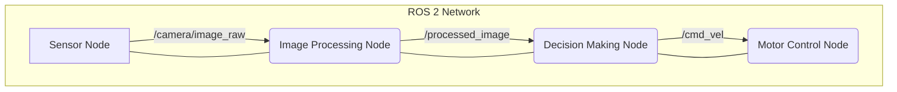

# Module 1: The Robotic Nervous System (ROS 2) - Overview

## High-level overview
Introduction to ROS 2 as the de facto standard for robotic middleware. Explain its role in managing communication, hardware abstraction, and modularity in complex robotic systems.

## Deep technical explanation
*   **ROS 2 Architecture:** Nodes, topics, services, actions, parameters.
*   **DDS (Data Distribution Service):** The underlying communication middleware.
*   **`rclpy` fundamentals:** Creating nodes, publishers, subscribers, service servers/clients.
*   **Message Types:** Standard messages and creating custom messages.
*   **`ros2 launch`:** Managing complex multi-node systems.
*   **`ros2 bag`:** Recording and replaying data.
*   **TF2 (Transformations):** Managing coordinate frames.
*   **Nav2 stack (high-level):** Introduction to navigation concepts.

## Real-world examples
Autonomous mobile robots (AMRs) in warehouses, robotic arms in manufacturing, research humanoid platforms.

## Diagrams (Mermaid syntax)

*   Diagram of a simple ROS 2 graph showing nodes, topics, and data flow.
*   Structure of a ROS 2 package.

## Code snippet ideas (ROS2 Python, `rclpy`)
*   **Simple Publisher/Subscriber:**
    ```python
    # publisher_node.py
    import rclpy
    from rclpy.node import Node
    from std_msgs.msg import String

    class SimplePublisher(Node):
        def __init__(self):
            super().__init__('simple_publisher')
            self.publisher_ = self.create_publisher(String, 'chatter', 10)
            timer_period = 0.5  # seconds
            self.timer = self.create_timer(timer_period, self.timer_callback)
            self.i = 0

        def timer_callback(self):
            msg = String()
            msg.data = f'Hello ROS 2: {self.i}'
            self.publisher_.publish(msg)
            self.get_logger().info(f'Publishing: "{msg.data}"')
            self.i += 1

    def main(args=None):
        rclpy.init(args=args)
        node = SimplePublisher()
        rclpy.spin(node)
        node.destroy_node()
        rclpy.shutdown()

    if __name__ == '__main__':
        main()
    ```
    ```python
    # subscriber_node.py
    import rclpy
    from rclpy.node import Node
    from std_msgs.msg import String

    class SimpleSubscriber(Node):
        def __init__(self):
            super().__init__('simple_subscriber')
            self.subscription = self.create_subscription(
                String,
                'chatter',
                self.listener_callback,
                10)
            self.subscription  # prevent unused variable warning

        def listener_callback(self):
            self.get_logger().info(f'I heard: "{msg.data}"')

        def main(args=None):
            rclpy.init(args=args)
            node = SimpleSubscriber()
            rclpy.spin(node)
            node.destroy_node()
            rclpy.shutdown()

    if __name__ == '__main__':
        main()
    ```
*   **Simple Service Server/Client:** Requesting a custom service to "add two numbers".
*   **Custom Message Definition:** Example of `MyCustomMessage.msg` and its use.

<h2>Simulation exercises (conceptual for ROS 2)</h2>
*   Launch a simple robot in Gazebo (later covered) and interact with it using ROS 2 commands (`ros2 topic pub`, `ros2 topic echo`).
*   Implement a ROS 2 node that controls a simulated joint.

<h2>Hardware & software requirements for this module</h2>
*   **Software:** Ubuntu 22.04+, ROS 2 Humble Hawksbill (desktop-full installation), Python 3.
*   **Hardware:** A modern Linux PC/VM capable of running ROS 2.

<h2>Mini-tasks for students</h2>
*   Create a ROS 2 package with a publisher and subscriber that exchange data.
*   Implement a simple service to trigger an action on a simulated robot.
*   Use `ros2 bag` to record and replay sensor data.

<h2>Learning outcomes</h2>
*   Understand the core concepts of ROS 2 (nodes, topics, services, actions).
*   Develop basic ROS 2 applications using `rclpy` in Python.
*   Manage ROS 2 workspaces and packages.
*   Utilize ROS 2 command-line tools for introspection and debugging.
*   Explain the role of DDS and TF2 in a robotic system.

<h2>Integration points for capstone project</h2>
ROS 2 will be the backbone for all communication and control of the autonomous humanoid. Students will implement nodes for perception, planning, and motor control.

<h2>Cross-references between modules</h2>
Sets up the communication framework for Module 2 (simulation), Module 3 (AI brain), and Module 4 (VLA).

<h2>Notes for weekly progression (Week 1–13)</h2>
Weeks 2-3: Core ROS 2 concepts and `rclpy` programming.
