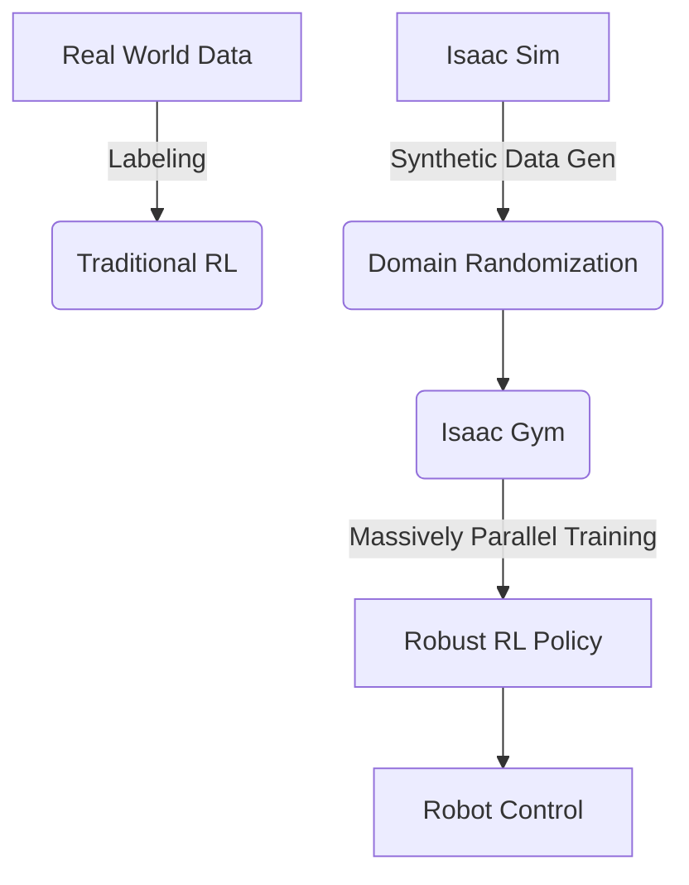

# Module 3: The AI-Robot Brain (NVIDIA Isaac) - Overview

## High-level overview
Dive into NVIDIA Isaac Sim, a powerful simulation platform built on Omniverse, leveraging GPU acceleration for advanced robotics and AI development, including reinforcement learning, synthetic data generation, and complex robot manipulation.

## Deep technical explanation
*   **NVIDIA Omniverse & USD (Universal Scene Description):** The foundation of Isaac Sim.
*   **Isaac Sim Architecture:** Python API, Omniverse Kit, PhysX, Warp.
*   **Robot Import & Control:** URDF/USD import, inverse kinematics (IK), forward kinematics (FK).
*   **Synthetic Data Generation:** Domain randomization for robust perception training.
*   **Isaac Gym:** Massively parallel reinforcement learning (RL) training.
*   **ROS 2 Bridge:** Seamless integration with ROS 2.
*   **Sensor Simulation:** Advanced camera models, LiDAR, force sensors.

## Real-world examples
Training robotic manipulators to grasp novel objects, developing humanoid locomotion policies, simulating complex factory environments for automation.

## Diagrams (Mermaid syntax)

*   Isaac Sim's role in the Omniverse ecosystem.
*   Data flow from Isaac Sim to a deep learning model for training.

## Code snippet ideas (Python with Isaac Sim API)
*   **Basic Isaac Sim Environment Setup:**
    ```python
    # minimal_isaac.py
    from omni.isaac.kit import SimulationApp
    simulation_app = SimulationApp({"headless": False})

    from omni.isaac.core import World
    from omni.isaac.core.objects import DynamicCuboid

    world = World(stage_units_in_meters=1.0)
    world.scene.add_default_ground_plane()
    my_cube = world.scene.add(
        DynamicCuboid(
            prim_path="/World/cube",
            name="my_cube",
            position=[0.0, 0.0, 1.0],
            size=0.5,
            color=[0.0, 0.0, 1.0],
        )
    )
    world.reset()

    while simulation_app.is_running():
        world.step(render=True)
        if world.is_playing():
            if world.current_time_step_index == 0:
                world.get_rigid_prim_view("/World/cube").set_velocities(
                    [[-0.5, 0.0, 0.0]], [[0.0, 0.0, 0.0]]
                )
    simulation_app.close()
    ```
*   **ROS 2 Bridge integration (conceptual):** Publishing a camera feed or joint commands.
*   **Simple Reinforcement Learning (RL) task (conceptual with Isaac Gym/RL-Games):** Defining observations, actions, rewards for a basic task like reaching.

<h2>Simulation steps (Isaac Sim)</h2>
1.  Install NVIDIA Omniverse Launcher and Isaac Sim.
2.  Launch Isaac Sim and create a new project.
3.  Import a humanoid robot model (e.g., from Nucleus).
4.  Set up the ROS 2 Bridge to publish joint states and subscribe to joint commands for the humanoid.
5.  Implement a simple RL environment in Isaac Sim where the humanoid learns to maintain balance or walk a short distance using Isaac Gym.
6.  Utilize domain randomization to vary textures or lighting for a camera sensor.

<h2>Hardware & software requirements for this module</h2>
*   **Software:** Ubuntu 22.04+, NVIDIA Omniverse Launcher, Isaac Sim 2023.1.1+, ROS 2 Humble.
*   **Hardware:** High-end NVIDIA GPU (RTX 3070+ recommended, workstation grade for serious RL), Intel i7/AMD Ryzen 7+, 32GB+ RAM.

<h2>Mini-tasks for students</h2>
*   Spawn a custom robot in Isaac Sim and control its joints using the Python API.
*   Generate a dataset of diverse images from a simulated camera using domain randomization.
*   Train a simple RL agent in Isaac Sim to perform a basic locomotion or manipulation task.

<h2>Learning outcomes</h2>
*   Understand the NVIDIA Omniverse ecosystem and Universal Scene Description (USD).
*   Utilize Isaac Sim for advanced robotic simulation and development.
*   Implement basic robot control and sensor simulation within Isaac Sim.
*   Apply synthetic data generation and domain randomization for robust AI training.
*   Grasp the fundamentals of parallelized reinforcement learning with Isaac Gym.
*   Integrate Isaac Sim with ROS 2 for holistic robotic system development.

<h2>Integration points for capstone project</h2>
Isaac Sim will be critical for training complex locomotion, manipulation, and perception policies for the autonomous humanoid using RL and synthetic data.

<h2>Cross-references between modules</h2>
Leverages ROS 2 (Module 1) for communication. Provides advanced simulation capabilities beyond Gazebo (Module 2). Policies developed here feed into the VLA module (Module 4).

<h2>Notes for weekly progression (Week 1–13)</h2>
Weeks 7-9: Isaac Sim basics, ROS 2 integration, introduction to RL with Isaac Gym.
