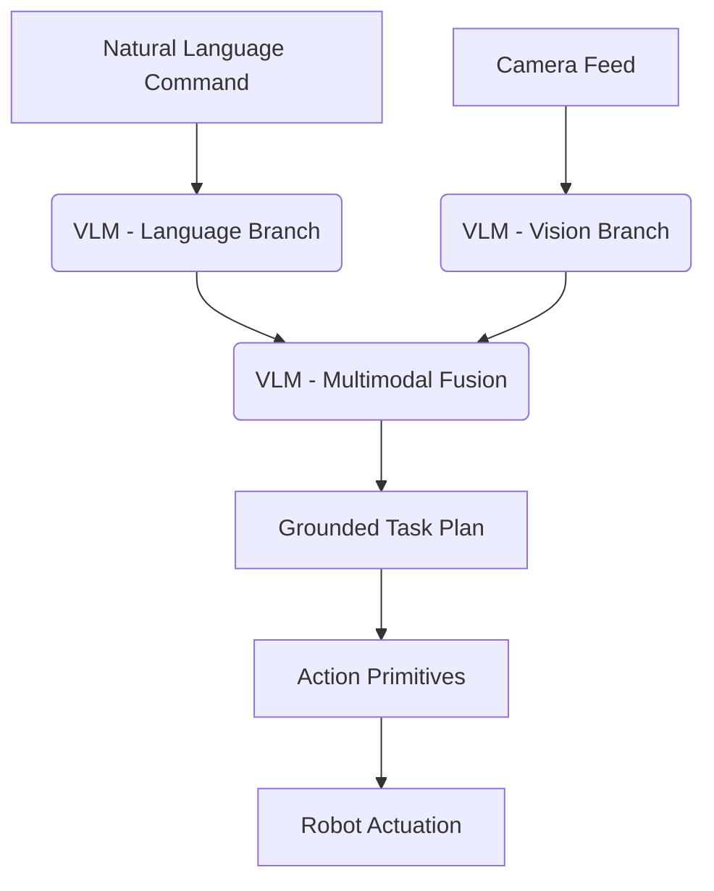

# Module 4: Vision-Language-Action (VLA) - Overview

## High-level overview
Explore the frontier of AI where perception (vision), natural language understanding, and physical action are seamlessly integrated. Introduce Vision-Language Models (VLMs) and how they enable robots to interpret human commands and perform complex tasks in unstructured environments.

## Deep technical explanation
*   **Vision-Language Models (VLMs):** CLIP, DALL-E (conceptual), GPT-4V, LLaVA, Gemini.
*   **Embodied AI & Foundation Models:** How large language models are extended to physical world reasoning.
*   **Perception for Action:** Object detection, semantic segmentation, 3D scene understanding.
*   **Language Grounding:** Mapping natural language instructions to robot actions and states.
*   **Action Primitive Generation:** Breaking down high-level commands into executable robot movements.
*   **Task Planning & Reasoning:** Combining VLMs with classical planning (e.g., PDDL - conceptual).
*   **Conversational Robotics:** Building interfaces for natural human-robot interaction.

## Real-world examples
Robots responding to voice commands ("Pick up the red mug"), household robots performing chores, robots assisting in search and rescue by interpreting instructions and visual cues.

## Diagrams (Mermaid syntax)

*   Architecture of a VLM for robotic control.
*   Flowchart: How a natural language command translates to robot movement.

## Code snippet ideas (Python with VLM API & ROS 2)
*   **Image Captioning with a VLM (conceptual API call):**
    ```python
    # vlm_captioning.py (conceptual)
    import requests
    import base64

    def get_image_caption(image_path, vlm_api_url):
        with open(image_path, "rb") as f:
            image_data = base64.b64encode(f.read()).decode("utf-8")

        payload = {"image": image_data, "task": "captioning"}
        response = requests.post(vlm_api_url, json=payload)
        response.raise_for_status()
        return response.json().get("caption")

    # Example usage:
    # caption = get_image_caption("path/to/robot_workspace.jpg", "https://api.vlmprovider.com/v1/process")
    # print(f"Image caption: {caption}")
    ```
*   **Grounded Action Generation (conceptual):** Taking a caption and generating a ROS 2 command.
    ```python
    # action_generator.py (conceptual)
    import rclpy
    from rclpy.node import Node
    from geometry_msgs.msg import Twist # Example for mobile robot

    class ActionGenerator(Node):
        def __init__(self):
            super().__init__('action_generator')
            self.publisher = self.create_publisher(Twist, '/cmd_vel', 10)

        def generate_and_execute_action(self, VLM_output_text):
            # Simple heuristic: if VLM output mentions "move forward"
            if "move forward" in VLM_output_text.lower():
                twist_msg = Twist()
                twist_msg.linear.x = 0.2
                self.publisher.publish(twist_msg)
                self.get_logger().info("Moving forward!")
            # More complex logic would involve parsing structured output from VLM
            # or using a classical planner

    # In main:
    # VLM_output = "The robot should move forward to the red box."
    # node = ActionGenerator()
    # node.generate_and_execute_action(VLM_output)
    ```
*   **ROS 2 node for conversational interface:** Subscribing to speech-to-text, sending to VLM, publishing actions.

<h2>Simulation exercises (Isaac Sim/Gazebo with VLM integration)</h2>
1.  Set up a simulated environment (e.g., a kitchen scene) with various objects in Isaac Sim.
2.  Use the Isaac Sim camera to capture an image and feed it to a VLM (external API or local).
3.  Send a natural language command (e.g., "Pick up the apple") to the VLM.
4.  The VLM provides a grounded response (e.g., object coordinates, sequence of actions).
5.  Translate the VLM's output into ROS 2 commands to control the simulated humanoid's gripper and arm to pick up the apple.
6.  Implement a simple conversational loop where the robot asks for clarification ("Which apple?") if ambiguous.

<h2>Hardware & software requirements for this module</h2>
*   **Software:** Ubuntu 22.04+, ROS 2 Humble, Python 3 (with `requests` for API calls), NVIDIA Isaac Sim. Access to VLM APIs (e.g., OpenAI, Google Gemini, local LLaVA/open-source VLM).
*   **Hardware:** High-performance PC with NVIDIA GPU for running local VLMs or for high-fidelity simulation. Internet access for cloud-based VLM APIs.

<h2>Mini-tasks for students</h2>
*   Integrate a camera feed from Gazebo/Isaac Sim with a VLM API to generate descriptions of the scene.
*   Develop a ROS 2 node that interprets simple text commands ("go forward", "turn left") and translates them into `cmd_vel` messages for a simulated mobile robot.
*   Explore prompt engineering techniques for VLMs to elicit desired robot behaviors.

<h2>Learning outcomes</h2>
*   Understand the architecture and capabilities of Vision-Language Models.
*   Implement perception-action loops using VLMs for robot control.
*   Ground natural language commands into executable robot actions.
*   Design and implement basic conversational interfaces for robotics.
*   Apply VLMs for complex task planning in simulated environments.

<h2>Integration points for capstone project</h2>
The capstone humanoid will use VLA techniques to understand complex human instructions, interpret its environment, and execute multi-step tasks.

<h2>Cross-references between modules</h2>
Leverages ROS 2 (Module 1) for control. Operates within the simulated environments (Module 2, Module 3). The AI-Robot Brain (Module 3) is where the VLM inference would run.

<h2>Notes for weekly progression (Week 1–13)</h2>
Weeks 10-12: VLA concepts, VLM integration, advanced task planning.
