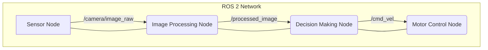

# Module 1: The Robotic Nervous System (ROS 2)

## Overview

ROS 2 (Robot Operating System 2) serves as the communication backbone for complex robotic systems. It provides standardized interfaces for sensor data acquisition, actuator control, and coordination between different software components. Think of ROS 2 as the nervous system of a robot, enabling different parts to communicate and work together seamlessly.

## Core Architecture

ROS 2 is built on Data Distribution Service (DDS) which provides reliable, real-time communication between different processes (nodes). The main architectural components are:

1. **Nodes**: Individual processes that perform specific functions
2. **Topics**: Communication channels using publish/subscribe pattern
3. **Services**: Request/response communication pattern
4. **Actions**: Goal-oriented communication with feedback
5. **Parameters**: Configuration values that can be changed at runtime
6. **TF2**: Transform framework for coordinate system management

## Deep Technical Explanation

### Nodes and Communication Patterns

ROS 2 nodes communicate using different patterns depending on the use case:

- **Publish/Subscribe (Topics)**: One-to-many communication, suitable for sensor data
- **Request/Response (Services)**: One-to-one synchronous communication
- **Goal/Feedback/Result (Actions)**: Long-running tasks with status updates

### DDS Middleware

Data Distribution Service (DDS) is an industry-standard middleware that provides:
- Reliable message delivery
- Quality of Service (QoS) policies
- Real-time capabilities
- Language and platform independence

## Practical Implementation

### Basic Publisher Node

```python
# publisher_node.py
import rclpy
from rclpy.node import Node
from std_msgs.msg import String

class SimplePublisher(Node):
    def __init__(self):
        super().__init__('simple_publisher')
        self.publisher_ = self.create_publisher(String, 'chatter', 10)
        timer_period = 0.5  # seconds
        self.timer = self.create_timer(timer_period, self.timer_callback)
        self.i = 0

    def timer_callback(self):
        msg = String()
        msg.data = f'Hello ROS 2: {self.i}'
        self.publisher_.publish(msg)
        self.get_logger().info(f'Publishing: "{msg.data}"')
        self.i += 1

def main(args=None):
    rclpy.init(args=args)
    node = SimplePublisher()
    rclpy.spin(node)
    node.destroy_node()
    rclpy.shutdown()

if __name__ == '__main__':
    main()
```

### Basic Subscriber Node

```python
# subscriber_node.py
import rclpy
from rclpy.node import Node
from std_msgs.msg import String

class SimpleSubscriber(Node):
    def __init__(self):
        super().__init__('simple_subscriber')
        self.subscription = self.create_subscription(
            String,
            'chatter',
            self.listener_callback,
            10)
        self.subscription  # prevent unused variable warning

    def listener_callback(self, msg):
        self.get_logger().info(f'I heard: "{msg.data}"')

def main(args=None):
    rclpy.init(args=args)
    node = SimpleSubscriber()
    rclpy.spin(node)
    node.destroy_node()
    rclpy.shutdown()

if __name__ == '__main__':
    main()
```

### Service Server Implementation

```python
# add_two_ints_server.py
import rclpy
from rclpy.node import Node
from example_interfaces.srv import AddTwoInts

class MinimalService(Node):
    def __init__(self):
        super().__init__('minimal_service')
        self.srv = self.create_service(AddTwoInts, 'add_two_ints', self.add_two_ints_callback)

    def add_two_ints_callback(self, request, response):
        response.sum = request.a + request.b
        self.get_logger().info(f'Returning {request.a} + {request.b} = {response.sum}')
        return response

def main(args=None):
    rclpy.init(args=args)
    minimal_service = MinimalService()
    rclpy.spin(minimal_service)
    minimal_service.destroy_node()
    rclpy.shutdown()

if __name__ == '__main__':
    main()
```

### Service Client Implementation

```python
# add_two_ints_client.py
import sys
import rclpy
from rclpy.node import Node
from example_interfaces.srv import AddTwoInts

class MinimalClient(Node):
    def __init__(self):
        super().__init__('minimal_client')
        self.cli = self.create_client(AddTwoInts, 'add_two_ints')
        while not self.cli.wait_for_service(timeout_sec=1.0):
            self.get_logger().info('Service not available, waiting again...')
        self.req = AddTwoInts.Request()

    def send_request(self, a, b):
        self.req.a = a
        self.req.b = b
        self.future = self.cli.call_async(self.req)
        rclpy.spin_until_future_complete(self, self.future)
        return self.future.result()

def main(args=None):
    rclpy.init(args=args)
    minimal_client = MinimalClient()
    response = minimal_client.send_request(int(sys.argv[1]), int(sys.argv[2]))
    minimal_client.get_logger().info(f'Result of add_two_ints: {response.sum}')
    minimal_client.destroy_node()
    rclpy.shutdown()

if __name__ == '__main__':
    main()
```

## Real-World Examples

ROS 2 is used extensively in:
- Autonomous mobile robots in warehouses
- Robotic arms in manufacturing
- Research humanoid platforms (Boston Dynamics, Unitree)
- Self-driving car development
- Agricultural robots
- Medical robotics systems

## Diagrams



## TF2 - Transform Framework

TF2 is critical for managing coordinate frames in robotic systems:

```python
# tf2_broadcaster.py
import rclpy
from rclpy.node import Node
from geometry_msgs.msg import TransformStamped
from tf2_ros import TransformBroadcaster

class FramePublisher(Node):
    def __init__(self):
        super().__init__('frame_publisher')
        self.tf_broadcaster = TransformBroadcaster(self)
        self.timer = self.create_timer(0.1, self.broadcast_frame)

    def broadcast_frame(self):
        t = TransformStamped()
        t.header.stamp = self.get_clock().now().to_msg()
        t.header.frame_id = 'turtle1'
        t.child_frame_id = 'carrot1'
        t.transform.translation.x = 1.0
        t.transform.translation.y = 0.0
        t.transform.translation.z = 0.0
        t.transform.rotation.x = 0.0
        t.transform.rotation.y = 0.0
        t.transform.rotation.z = 0.0
        t.transform.rotation.w = 1.0
        self.tf_broadcaster.sendTransform(t)

def main(args=None):
    rclpy.init(args=args)
    node = FramePublisher()
    rclpy.spin(node)
    node.destroy_node()
    rclpy.shutdown()

if __name__ == '__main__':
    main()
```

## Launch Files

ROS 2 launch files allow you to start multiple nodes together:

```python
# minimal_launch.py
from launch import LaunchDescription
from launch_ros.actions import Node

def generate_launch_description():
    return LaunchDescription([
        Node(
            package='demo_nodes_py',
            executable='talker',
            name='publisher'
        ),
        Node(
            package='demo_nodes_py',
            executable='listener',
            name='subscriber'
        )
    ])
```

## Context7 Integration with ROS 2

ROS 2 systems can benefit from Context7 documentation access through MCP integration:

```python
# ros2_context_helper.py
import rclpy
from rclpy.node import Node
import requests
import json

class ROS2ContextHelper(Node):
    def __init__(self):
        super().__init__('ros2_context_helper')
        self.mcp_client = None  # Initialize MCP client
        
    async def get_ros2_api_docs(self, topic_type):
        """
        Retrieve up-to-date ROS 2 API documentation using MCP
        """
        # This would connect to a Context7 MCP server
        # In practice, this would use the actual MCP client implementation
        try:
            # Example: resolve library ID for ROS 2 documentation
            library_id = await self.mcp_call('resolve-library-id', {
                'libraryName': f'ros2/{topic_type}'
            })
            
            # Get documentation for the resolved library
            docs = await self.mcp_call('get-library-docs', {
                'context7CompatibleLibraryID': library_id,
                'topic': topic_type
            })
            
            return docs
        except Exception as e:
            self.get_logger().error(f'Error retrieving docs: {e}')
            return None
            
    async def mcp_call(self, method, params):
        """
        Make an MCP call to retrieve documentation
        """
        # Implementation would connect to an MCP server
        # This is a placeholder for the actual MCP integration
        pass

def main(args=None):
    rclpy.init(args=args)
    node = ROS2ContextHelper()
    # Example usage would be implemented here
    rclpy.spin(node)
    node.destroy_node()
    rclpy.shutdown()

if __name__ == '__main__':
    main()
```

## Simulation Exercises

1. Create a ROS 2 workspace with publisher and subscriber nodes
2. Implement a custom message type
3. Use `ros2 topic echo` and `ros2 topic pub` to interact with running nodes
4. Record and replay data using `ros2 bag`
5. Use TF2 to track coordinate transforms between robot components

## Mini-Tasks for Students

1. Create a ROS 2 package with a publisher and subscriber that exchange sensor data
2. Implement a service to control a simulated robot joint
3. Use `ros2 param` to dynamically configure node parameters
4. Create a ROS 2 launch file that starts multiple coordinated nodes
5. Implement a simple action server for a navigation goal

## Integration Points for Capstone Project

ROS 2 will form the backbone of the capstone project's communication system, handling:
- Sensor data distribution (cameras, IMU, LIDAR)
- Control command propagation to actuators
- Coordination between perception, planning, and control modules
- Communication with simulation environments (Gazebo, Isaac Sim)
- Integration with VLA (Vision-Language-Action) systems

## Learning Outcomes

After completing this module, students should be able to:
1. Understand the core concepts of ROS 2 (nodes, topics, services, actions, parameters)
2. Develop basic ROS 2 applications using `rclpy` in Python
3. Manage ROS 2 workspaces and packages
4. Utilize ROS 2 command-line tools for introspection and debugging
5. Use TF2 for coordinate frame management
6. Implement complex communication patterns using services, actions, and parameters
7. Integrate MCP/Context7 for real-time documentation access

## Weekly Progression Notes

**Weeks 2-3**: Focus on core ROS 2 concepts and `rclpy` programming. Students should build simple publisher/subscriber pairs, then progress to services and actions. By the end of week 3, they should be comfortable with launch files and TF2 basics.