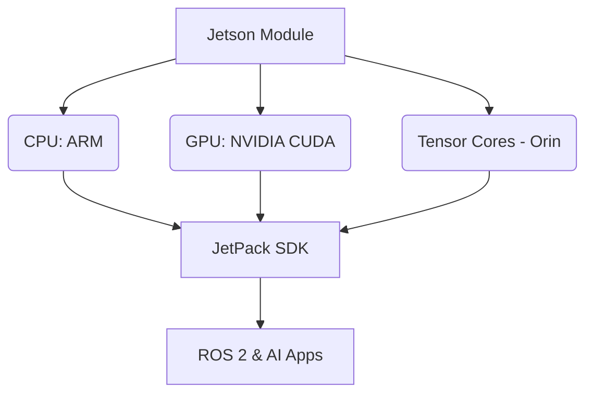

# The Economy Jetson Student Kit

## High-level overview
Introduce the NVIDIA Jetson platform as an accessible, cost-effective embedded system for hands-on robotics development, perfect for student projects and constrained environments. Focus on the Jetson Nano or Orin Nano as primary examples.

## Deep technical explanation
*   **Jetson Architecture:** CPU, integrated GPU (CUDA cores), Tensor Cores (Orin series).
*   **JetPack SDK:** OS, CUDA, cuDNN, TensorRT, ROS 2 support.
*   **ROS 2 on Jetson:** Cross-compilation, deployment, performance considerations.
*   **Camera & Sensor Integration:** CSI cameras, USB sensors.
*   **Power Management & Thermal Considerations:** Optimizing performance for embedded use.
*   **Edge AI Applications:** Running small VLMs or inference models directly on the device.

## Real-world examples
Smart cameras, small autonomous robots, educational robotics platforms, rapid prototyping for industrial applications.

## Diagrams (Mermaid syntax)

*   Block diagram of a Jetson board (e.g., Jetson Nano Developer Kit).
*   Comparison of Jetson models (Nano vs. Orin Nano for cost/performance).

## Code snippet ideas (ROS2 Python on Jetson)
*   **ROS 2 Camera Node for Jetson CSI Camera:**
    ```python
    # jetson_camera_node.py (conceptual)
    import rclpy
    from rclpy.node import Node
    from sensor_msgs.msg import Image
    from cv_bridge import CvBridge
    import cv2

    class JetsonCameraNode(Node):
        def __init__(self):
            super().__init__('jetson_camera_node')
            self.publisher = self.create_publisher(Image, 'image_raw', 10)
            self.bridge = CvBridge()
            # Use GStreamer pipeline for CSI camera on Jetson
            # For example, 'nvarguscamerasrc sensor_id=0 ! video/x-raw(memory:NVMM), width=640, height=480, format=NV12, framerate=30/1 ! nvvidconv flip-method=0 ! video/x-raw, width=640, height=480, format=BGRx ! videoconvert ! video/x-raw, format=BGR ! appsink'
            self.cap = cv2.VideoCapture(0) # or GStreamer pipeline
            if not self.cap.isOpened():
                self.get_logger().error("Failed to open camera!")
                return
            self.timer = self.create_timer(0.1, self.timer_callback) # 10 FPS

        def timer_callback(self):
            ret, frame = self.cap.read()
            if ret:
                ros_image = self.bridge.cv2_to_imgmsg(frame, "bgr8")
                self.publisher.publish(ros_image)
            else:
                self.get_logger().warn("Failed to read frame from camera.")

    def main(args=None):
        rclpy.init(args=args)
        node = JetsonCameraNode()
        rclpy.spin(node)
        node.destroy_node()
        rclpy.shutdown()

    if __name__ == '__main__':
        main()
    ```
*   **Running a tiny ML model (TensorRT accelerated) on Jetson (conceptual inference code).**

<h2>Simulation exercises</h2>
N/A - Focus on actual hardware deployment.

<h2>Hardware & software requirements for this module</h2>
*   **Hardware:** NVIDIA Jetson Nano Developer Kit / Jetson Orin Nano Developer Kit, compatible CSI camera, microSD card (64GB+), power supply.
*   **Software:** JetPack SDK (latest version), ROS 2 Humble.

<h2>Mini-tasks for students</h2>
*   Set up a Jetson Developer Kit with JetPack and ROS 2.
*   Integrate a CSI camera and publish its feed as a ROS 2 topic.
*   Deploy a pre-trained (small) object detection model to the Jetson and perform inference on the camera feed.

<h2>Learning outcomes</h2>
*   Configure and deploy the NVIDIA Jetson platform for robotics applications.
*   Develop and optimize ROS 2 nodes for embedded systems.
*   Implement basic perception (camera, sensors) on the Jetson.
*   Understand the challenges and opportunities of edge AI in robotics.

<h2>Integration points for capstone project</h2>
Students can opt to build a scaled-down version of the autonomous humanoid's brain using a Jetson, especially for cost-constrained projects, or use it for specific embedded tasks within a larger humanoid.

<h2>Cross-references between modules</h2>
Provides a tangible hardware platform for ROS 2 (Module 1) and VLA (Module 4) concepts, contrasting with high-end desktop/cloud setups.

<h2>Notes for weekly progression (Week 1–13)</h2>
Can be introduced as an alternative hardware path during initial weeks. Practical labs involving Jetson would be in later modules.
