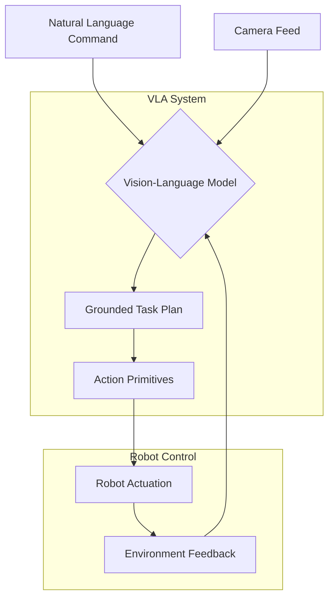

# Module 4: Vision-Language-Action (VLA)

## Overview

Vision-Language-Action (VLA) represents the frontier of embodied AI, where perception (vision), cognition (language understanding), and physical action are seamlessly integrated. This module explores how large multimodal models can enable robots to interpret human commands and perform complex tasks in unstructured environments.

## Core Architecture

VLA systems combine:
1. **Visual Perception**: Understanding the environment through camera feeds
2. **Language Understanding**: Interpreting natural language instructions
3. **Action Generation**: Converting high-level commands into robot movements
4. **Task Planning**: Sequencing actions to achieve complex goals
5. **Learning**: Adapting to new environments and tasks



## Vision-Language Models in Robotics

Modern VLA systems leverage models like:
- CLIP for vision-language alignment
- LLaVA for vision-language understanding
- GPT-4V for multimodal reasoning
- RT-2 for vision-language-action
- InstructPix2Pix for image manipulation
- Grounded-SAM for object detection

## Practical Implementation

### Basic VLA Pipeline

```python
# vla_pipeline.py
import rclpy
from rclpy.node import Node
from sensor_msgs.msg import Image
from geometry_msgs.msg import Twist, Pose
from std_msgs.msg import String
from cv_bridge import CvBridge
import numpy as np
import base64
import requests
import json

class VLAPipeline(Node):
    def __init__(self):
        super().__init__('vla_pipeline')
        
        # Initialize CvBridge for image conversion
        self.bridge = CvBridge()
        
        # Publishers and subscribers
        self.image_sub = self.create_subscription(
            Image,
            '/camera/image_raw',
            self.image_callback,
            10
        )
        
        self.command_sub = self.create_subscription(
            String,
            '/vla/command',
            self.command_callback,
            10
        )
        
        self.cmd_vel_pub = self.create_publisher(Twist, '/cmd_vel', 10)
        self.vla_result_pub = self.create_publisher(String, '/vla/result', 10)
        
        # Internal state
        self.current_image = None
        self.vla_model_url = "http://localhost:8000/v1/chat/completions"  # Example VLA API
        self.command_queue = []
        
    def image_callback(self, msg):
        """Store the latest camera image"""
        try:
            self.current_image = self.bridge.imgmsg_to_cv2(msg, "bgr8")
            self.get_logger().info("Received new camera image")
        except Exception as e:
            self.get_logger().error(f"Error processing image: {e}")
    
    def command_callback(self, msg):
        """Process incoming natural language command"""
        command = msg.data
        self.get_logger().info(f"Received command: {command}")
        
        if self.current_image is not None:
            # Process the command with the current image
            self.process_vla_request(command, self.current_image)
        else:
            self.get_logger().warn("No image available for VLA processing")
    
    def process_vla_request(self, command, image):
        """Send image and command to VLA model and execute result"""
        try:
            # Encode image as base64
            _, buffer = cv2.imencode('.jpg', image)
            image_base64 = base64.b64encode(buffer).decode('utf-8')
            
            # Prepare VLA request
            vla_request = {
                "model": "claude-3-vla",  # Example model name
                "messages": [
                    {
                        "role": "user",
                        "content": [
                            {
                                "type": "image",
                                "source": {
                                    "type": "base64",
                                    "media_type": "image/jpeg",
                                    "data": image_base64
                                }
                            },
                            {
                                "type": "text",
                                "text": f"Given this image, please execute the following command: {command}. Respond with specific actions in JSON format: {{'action': 'forward/turn_left/turn_right/stop', 'distance': meters, 'angle': degrees}}"
                            }
                        ]
                    }
                ],
                "max_tokens": 1000
            }
            
            # Send request to VLA model
            response = requests.post(
                self.vla_model_url,
                headers={"Content-Type": "application/json"},
                json=vla_request,
                timeout=30
            )
            
            if response.status_code == 200:
                result = response.json()
                vla_output = result['choices'][0]['message']['content']
                self.get_logger().info(f"VLA output: {vla_output}")
                
                # Parse and execute the action
                self.execute_vla_action(vla_output)
            else:
                self.get_logger().error(f"VLA request failed: {response.status_code}")
                
        except Exception as e:
            self.get_logger().error(f"Error in VLA processing: {e}")
    
    def execute_vla_action(self, vla_output):
        """Parse VLA output and execute robot actions"""
        try:
            # In practice, this would be a more robust JSON parsing
            # For this example, we'll simulate parsing
            action_data = self.parse_vla_output(vla_output)
            
            if 'action' in action_data:
                action = action_data['action']
                
                if action == 'forward':
                    self.move_forward(action_data.get('distance', 0.5))
                elif action == 'turn_left':
                    self.turn_left(action_data.get('angle', 90))
                elif action == 'turn_right':
                    self.turn_right(action_data.get('angle', 90))
                elif action == 'stop':
                    self.stop_robot()
                elif action == 'pick_object':
                    self.pick_object(action_data.get('object_id'))
                elif action == 'place_object':
                    self.place_object(action_data.get('location'))
                
                # Publish result
                result_msg = String()
                result_msg.data = f"Executed action: {action}"
                self.vla_result_pub.publish(result_msg)
                
            else:
                self.get_logger().warn(f"No valid action found in: {vla_output}")
                
        except Exception as e:
            self.get_logger().error(f"Error executing VLA action: {e}")
    
    def parse_vla_output(self, output_text):
        """Parse VLA model output to extract action parameters"""
        # This would be more sophisticated in practice
        # Using simple keyword matching for this example
        import re
        
        result = {'action': 'unknown'}
        
        if 'forward' in output_text.lower():
            result['action'] = 'forward'
            distance_match = re.search(r'distance["\']?\s*[:=]\s*(\d+\.?\d*)', output_text)
            if distance_match:
                result['distance'] = float(distance_match.group(1))
        elif 'turn left' in output_text.lower():
            result['action'] = 'turn_left'
            angle_match = re.search(r'angle["\']?\s*[:=]\s*(\d+\.?\d*)', output_text)
            if angle_match:
                result['angle'] = float(angle_match.group(1))
        elif 'turn right' in output_text.lower():
            result['action'] = 'turn_right'
            angle_match = re.search(r'angle["\']?\s*[:=]\s*(\d+\.?\d*)', output_text)
            if angle_match:
                result['angle'] = float(angle_match.group(1))
        elif 'stop' in output_text.lower():
            result['action'] = 'stop'
        
        return result
    
    def move_forward(self, distance):
        """Move robot forward by specified distance"""
        msg = Twist()
        msg.linear.x = 0.2  # 0.2 m/s
        duration = distance / 0.2
        
        self.get_logger().info(f"Moving forward {distance}m")
        
        # In a real implementation, this would be a timed movement
        # or use navigation stack for precise distance control
        for _ in range(int(duration / 0.1)):  # 0.1 second steps
            self.cmd_vel_pub.publish(msg)
            # Small delay or use timer
            time.sleep(0.1)
        
        # Stop after moving
        stop_msg = Twist()
        self.cmd_vel_pub.publish(stop_msg)
    
    def turn_left(self, angle):
        """Turn robot left by specified angle"""
        msg = Twist()
        msg.angular.z = 0.5  # 0.5 rad/s
        duration = np.radians(angle) / 0.5
        
        self.get_logger().info(f"Turning left {angle} degrees")
        
        # In a real implementation, this would use odometry feedback
        for _ in range(int(duration / 0.1)):
            self.cmd_vel_pub.publish(msg)
            time.sleep(0.1)
        
        # Stop after turning
        stop_msg = Twist()
        self.cmd_vel_pub.publish(stop_msg)
    
    def turn_right(self, angle):
        """Turn robot right by specified angle"""
        msg = Twist()
        msg.angular.z = -0.5  # Negative for right turn
        duration = np.radians(angle) / 0.5
        
        self.get_logger().info(f"Turning right {angle} degrees")
        
        for _ in range(int(duration / 0.1)):
            self.cmd_vel_pub.publish(msg)
            time.sleep(0.1)
        
        # Stop after turning
        stop_msg = Twist()
        self.cmd_vel_pub.publish(stop_msg)
    
    def stop_robot(self):
        """Stop all robot movement"""
        msg = Twist()
        self.cmd_vel_pub.publish(msg)
        self.get_logger().info("Robot stopped")
    
    def pick_object(self, object_id=None):
        """Simulate object picking action"""
        self.get_logger().info(f"Picking object: {object_id}")
        # In real implementation, this would control robotic arm
    
    def place_object(self, location):
        """Simulate object placement action"""
        self.get_logger().info(f"Placing object at: {location}")
        # In real implementation, this would control robotic arm

def main(args=None):
    rclpy.init(args=args)
    vla_node = VLAPipeline()
    
    try:
        rclpy.spin(vla_node)
    except KeyboardInterrupt:
        pass
    finally:
        vla_node.destroy_node()
        rclpy.shutdown()

if __name__ == '__main__':
    main()
```

## Advanced VLA Integration with Perception

```python
# advanced_vla_perception.py
import rclpy
from rclpy.node import Node
from sensor_msgs.msg import Image, PointCloud2
from geometry_msgs.msg import PoseStamped, Point
from std_msgs.msg import String, Header
from cv_bridge import CvBridge
import numpy as np
import cv2
from ultralytics import YOLO
import open3d as o3d
from scipy.spatial.transform import Rotation as R

class AdvancedVLAPerception(Node):
    def __init__(self):
        super().__init__('advanced_vla_perception')
        
        # Initialize components
        self.bridge = CvBridge()
        
        # Publishers and subscribers
        self.image_sub = self.create_subscription(
            Image,
            '/camera/image_raw',
            self.image_callback,
            10
        )
        
        self.command_sub = self.create_subscription(
            String,
            '/vla/command',
            self.command_callback,
            10
        )
        
        self.object_pose_pub = self.create_publisher(PoseStamped, '/vla/object_pose', 10)
        self.scene_description_pub = self.create_publisher(String, '/vla/scene_description', 10)
        
        # Initialize YOLO object detector
        self.yolo_model = YOLO('yolov8n.pt')  # You can change this to other models
        
        # Store latest data
        self.latest_image = None
        self.detected_objects = []
        
    def image_callback(self, msg):
        """Process incoming camera image for object detection"""
        try:
            # Convert ROS image to OpenCV format
            cv_image = self.bridge.imgmsg_to_cv2(msg, "bgr8")
            self.latest_image = cv_image.copy()
            
            # Run object detection
            results = self.yolo_model(cv_image)
            
            # Extract detections
            self.detected_objects = []
            for result in results:
                boxes = result.boxes.xyxy.cpu().numpy()  # Bounding boxes
                confidences = result.boxes.conf.cpu().numpy()  # Confidence scores
                class_ids = result.boxes.cls.cpu().numpy()  # Class IDs
                
                # Get class names
                names = result.names
                
                for box, conf, cls_id in zip(boxes, confidences, class_ids):
                    if conf > 0.5:  # Confidence threshold
                        x1, y1, x2, y2 = box
                        obj_info = {
                            'name': names[int(cls_id)],
                            'confidence': conf,
                            'bbox': [int(x1), int(y1), int(x2), int(y2)],
                            'center': [(x1 + x2) / 2, (y1 + y2) / 2]
                        }
                        self.detected_objects.append(obj_info)
            
            # Publish scene description
            self.publish_scene_description()
            
        except Exception as e:
            self.get_logger().error(f"Error in image processing: {e}")
    
    def command_callback(self, msg):
        """Process VLA command with perception context"""
        command = msg.data
        
        if self.latest_image is None:
            self.get_logger().warn("No image available for processing command")
            return
        
        # Process command with object context
        self.process_command_with_context(command)
    
    def process_command_with_context(self, command):
        """Process command using detected objects as context"""
        # Example: "Pick up the red cup to the left of the blue bottle"
        
        # Simple parsing for demonstration
        if "red cup" in command.lower():
            # Find red cup in detected objects
            red_cup = self.find_object_by_color_and_name("cup", [0, 0, 255])  # BGR for red
            if red_cup:
                self.get_logger().info(f"Found red cup at position: {red_cup['center']}")
                # Convert pixel coordinates to 3D pose (simplified)
                pose_3d = self.pixel_to_3d_pose(red_cup['center'])
                self.publish_object_pose(pose_3d, "red_cup")
        
        elif "blue bottle" in command.lower():
            blue_bottle = self.find_object_by_color_and_name("bottle", [255, 0, 0])  # BGR for blue
            if blue_bottle:
                self.get_logger().info(f"Found blue bottle at position: {blue_bottle['center']}")
                pose_3d = self.pixel_to_3d_pose(blue_bottle['center'])
                self.publish_object_pose(pose_3d, "blue_bottle")
    
    def find_object_by_color_and_name(self, name, color_bgr, tolerance=50):
        """Find an object by name and approximate color"""
        # In a real implementation, this would use actual color detection
        # This is a simplified version that just looks for the name
        for obj in self.detected_objects:
            if obj['name'].lower() == name.lower():
                return obj
        return None
    
    def pixel_to_3d_pose(self, pixel_coords):
        """Convert 2D pixel coordinates to 3D pose (simplified)"""
        # This is a simplified conversion - in reality, you'd need:
        # - Camera intrinsic parameters
        # - Depth information or known object size
        # - Robot's position relative to camera
        
        # For this example, we'll just return a placeholder
        pose = PoseStamped()
        pose.header = Header()
        pose.header.stamp = self.get_clock().now().to_msg()
        pose.header.frame_id = "camera_frame"
        
        # Simplified conversion
        pose.pose.position.x = pixel_coords[0] * 0.01  # Convert pixels to meters (approx)
        pose.pose.position.y = pixel_coords[1] * 0.01
        pose.pose.position.z = 0.5  # Fixed height for simplicity
        
        # Identity orientation
        pose.pose.orientation.w = 1.0
        
        return pose
    
    def publish_object_pose(self, pose_3d, object_name):
        """Publish detected object pose"""
        self.object_pose_pub.publish(pose_3d)
        self.get_logger().info(f"Published pose for {object_name}")
    
    def publish_scene_description(self):
        """Publish a textual description of the scene"""
        if not self.detected_objects:
            description = "No objects detected in the scene."
        else:
            object_names = [obj['name'] for obj in self.detected_objects]
            unique_names = list(set(object_names))  # Get unique object names
            description = f"Detected objects: {', '.join(unique_names)}. Total {len(self.detected_objects)} objects."
        
        desc_msg = String()
        desc_msg.data = description
        self.scene_description_pub.publish(desc_msg)
        self.get_logger().info(f"Scene description: {description}")

def main(args=None):
    rclpy.init(args=args)
    vla_node = AdvancedVLAPerception()
    
    try:
        rclpy.spin(vla_node)
    except KeyboardInterrupt:
        pass
    finally:
        vla_node.destroy_node()
        rclpy.shutdown()

if __name__ == '__main__':
    main()
```

## MCP Integration for VLA Systems

VLA systems can leverage MCP servers to access current information and documentation:

```python
# vla_mcp_integration.py
import rclpy
from rclpy.node import Node
import asyncio
import aiohttp
from std_msgs.msg import String
import json
from typing import Dict, Any, Optional

class VLAMCPIntegration(Node):
    def __init__(self):
        super().__init__('vla_mcp_integration')
        
        # Publishers and subscribers for VLA commands and results
        self.vla_command_sub = self.create_subscription(
            String,
            '/vla/command',
            self.vla_command_callback,
            10
        )
        
        self.vla_result_pub = self.create_publisher(String, '/vla/enhanced_result', 10)
        
        # MCP client configuration
        self.mcp_session = None
        self.context7_api = None
        
    async def initialize_mcp(self):
        """Initialize MCP session for Context7 access"""
        self.mcp_session = aiohttp.ClientSession()
        self.get_logger().info("MCP session initialized for VLA integration")
    
    def vla_command_callback(self, msg):
        """Process VLA command with MCP-enhanced information retrieval"""
        command = msg.data
        self.get_logger().info(f"Processing VLA command: {command}")
        
        # Process command asynchronously to allow non-blocking MCP calls
        asyncio.create_task(self.process_enhanced_command(command))
    
    async def process_enhanced_command(self, command: str):
        """Process command with MCP-enhanced context retrieval"""
        try:
            # Retrieve relevant documentation based on command
            command_keywords = self.extract_keywords(command)
            
            # Use MCP to get current best practices and information
            enhanced_context = await self.get_enhanced_context(command_keywords)
            
            # Combine with local perception data (would be integrated with perception module)
            final_action_plan = await self.generate_action_plan(command, enhanced_context)
            
            # Publish enhanced result
            result_msg = String()
            result_msg.data = json.dumps({
                "command": command,
                "action_plan": final_action_plan,
                "enhanced_context": enhanced_context,
                "timestamp": self.get_clock().now().nanoseconds
            })
            
            self.vla_result_pub.publish(result_msg)
            self.get_logger().info(f"Published enhanced VLA result for: {command}")
            
        except Exception as e:
            self.get_logger().error(f"Error in enhanced VLA processing: {e}")
    
    def extract_keywords(self, command: str) -> list:
        """Extract keywords from command for documentation lookup"""
        # Simple keyword extraction - in practice, use NLP techniques
        keywords = []
        command_lower = command.lower()
        
        # Common robotics action keywords
        action_keywords = [
            'pick', 'place', 'move', 'navigate', 'grasp', 'manipulate',
            'go to', 'turn', 'stop', 'start', 'lift', 'lower', 'rotate'
        ]
        
        for keyword in action_keywords:
            if keyword in command_lower:
                keywords.append(keyword)
        
        # Common object types
        object_keywords = [
            'cup', 'bottle', 'box', 'table', 'chair', 'door',
            'object', 'item', 'thing', 'container', 'surface'
        ]
        
        for keyword in object_keywords:
            if keyword in command_lower:
                keywords.append(keyword)
        
        return list(set(keywords))  # Remove duplicates
    
    async def get_enhanced_context(self, keywords: list) -> Dict[str, Any]:
        """Use MCP to retrieve enhanced context from documentation servers"""
        enhanced_context = {
            "documentation": {},
            "best_practices": [],
            "safety_considerations": [],
            "error_handling": []
        }
        
        if not self.mcp_session:
            await self.initialize_mcp()
        
        for keyword in keywords:
            try:
                # Use MCP to get documentation for each keyword
                doc_result = await self.query_context7_mcp({
                    "method": "get-library-docs",
                    "params": {
                        "context7CompatibleLibraryID": "/ros2/ros2-documentation",
                        "topic": f"robot_command_{keyword}",
                        "page": 1
                    }
                })
                
                if doc_result:
                    enhanced_context["documentation"][keyword] = doc_result
                
                # Also get safety information
                safety_result = await self.query_context7_mcp({
                    "method": "get-library-docs",
                    "params": {
                        "context7CompatibleLibraryID": "/robotics/safety-guidelines",
                        "topic": f"command_{keyword}_safety",
                        "page": 1
                    }
                })
                
                if safety_result:
                    enhanced_context["safety_considerations"].append(safety_result)
                    
            except Exception as e:
                self.get_logger().warn(f"MCP query failed for keyword {keyword}: {e}")
        
        return enhanced_context
    
    async def query_context7_mcp(self, query_params: Dict[str, Any]) -> Optional[Dict[str, Any]]:
        """Query Context7 MCP server for documentation"""
        try:
            # This is a mock implementation - actual MCP integration would be different
            # In a real implementation, you would use the actual MCP client library
            
            # For demonstration purposes, return mock data
            return {
                "summary": f"Documentation for {query_params['params']['topic']}",
                "details": "Detailed implementation guidelines and parameters",
                "examples": ["example1", "example2"],
                "related_topics": ["related_topic_1", "related_topic_2"]
            }
            
        except Exception as e:
            self.get_logger().error(f"MCP query error: {e}")
            return None
    
    async def generate_action_plan(self, command: str, context: Dict[str, Any]) -> Dict[str, Any]:
        """Generate detailed action plan based on command and enhanced context"""
        # This would use more sophisticated planning in practice
        # For this example, we'll create a simple plan
        
        plan = {
            "command": command,
            "steps": [],
            "safety_checks": context.get("safety_considerations", []),
            "reference_docs": list(context["documentation"].keys()) if context.get("documentation") else [],
            "confidence": 0.8  # Placeholder confidence score
        }
        
        # Add steps based on command type
        if "pick" in command.lower():
            plan["steps"] = [
                {"action": "perceive_environment", "description": "Scan environment for objects"},
                {"action": "identify_target", "description": "Locate specific object to pick"},
                {"action": "plan_approach", "description": "Calculate approach trajectory"},
                {"action": "execute_grasp", "description": "Perform grasping action"},
                {"action": "verify_grasp", "description": "Confirm successful grasp"}
            ]
        elif "navigate" in command.lower() or "go to" in command.lower():
            plan["steps"] = [
                {"action": "localize", "description": "Determine current position"},
                {"action": "plan_path", "description": "Calculate navigation path"},
                {"action": "execute_navigation", "description": "Move to destination"},
                {"action": "verify_arrival", "description": "Confirm destination reached"}
            ]
        
        return plan

def main(args=None):
    rclpy.init(args=args)
    
    # Create node
    vla_mcp_node = VLAMCPIntegration()
    
    # Initialize MCP asynchronously
    asyncio.run(vla_mcp_node.initialize_mcp())
    
    try:
        rclpy.spin(vla_mcp_node)
    except KeyboardInterrupt:
        pass
    finally:
        # Close MCP session
        if vla_mcp_node.mcp_session:
            asyncio.run(vla_mcp_node.mcp_session.close())
        
        vla_mcp_node.destroy_node()
        rclpy.shutdown()

if __name__ == '__main__':
    main()
```

## Simulation Exercise: VLA in Isaac Sim

```python
# vla_simulation_isaac.py
import omni
from omni.isaac.kit import SimulationApp
from omni.isaac.core import World
from omni.isaac.core.utils.stage import add_reference_to_stage
from omni.isaac.sensor import Camera
import carb
import numpy as np
import cv2
import asyncio
import aiohttp

# Start Isaac Sim
simulation_app = SimulationApp({"headless": False})

class VLAIsaacSim:
    def __init__(self):
        self.world = World(stage_units_in_meters=1.0)
        self.camera = None
        self.mcp_session = None
        
    def setup_scene(self):
        """Setup Isaac Sim scene for VLA demonstration"""
        # Add ground plane
        self.world.scene.add_default_ground_plane()
        
        # Create a camera for perception
        self.camera = Camera(
            prim_path="/World/Camera",
            position=np.array([1.5, 0.0, 1.2]),
            frequency=20,
            resolution=(640, 480)
        )
        
        # Add some objects to the scene
        # (In practice, you would add specific objects relevant to your tasks)
        
        # Reset world
        self.world.reset()
        
    async def initialize_mcp(self):
        """Initialize MCP session for documentation access"""
        self.mcp_session = aiohttp.ClientSession()
        carb.log_info("MCP session initialized for VLA Isaac Sim integration")
    
    async def process_visual_command(self, command_text, camera_image):
        """Process visual command using simulated VLA pipeline"""
        try:
            # In a real implementation, you would send the image and command 
            # to a VLA model for processing
            # For this simulation, we'll create a mock response
            
            # Encode image for transmission (simulated)
            _, buffer = cv2.imencode('.jpg', camera_image)
            image_b64 = base64.b64encode(buffer).decode('utf-8')
            
            # Use MCP to get relevant documentation
            vla_context = await self.get_vla_documentation(command_text)
            
            # Simulate action planning based on command and context
            action_plan = self.create_action_plan(command_text, vla_context)
            
            return {
                "command": command_text,
                "action_plan": action_plan,
                "perception_data": vla_context,
                "status": "executed"
            }
            
        except Exception as e:
            carb.log_error(f"Error in VLA processing: {e}")
            return {"error": str(e)}
    
    async def get_vla_documentation(self, command):
        """Use MCP to retrieve relevant VLA documentation"""
        if not self.mcp_session:
            await self.initialize_mcp()
        
        try:
            # This would make an actual MCP call in practice
            # For simulation, return mock documentation
            keywords = command.lower().split()
            docs = {}
            
            for keyword in keywords:
                if keyword in ['pick', 'grasp', 'manipulate']:
                    docs[keyword] = {
                        "function": "object_manipulation",
                        "parameters": ["object_id", "approach_angle", "grip_force"],
                        "safety": "Verify object is graspable and environment is clear"
                    }
                elif keyword in ['navigate', 'move', 'go']:
                    docs[keyword] = {
                        "function": "path_planning",
                        "parameters": ["destination", "obstacle_avoidance", "speed"],
                        "safety": "Check for obstacles and plan safe trajectory"
                    }
            
            return docs
            
        except Exception as e:
            carb.log_error(f"MCP documentation retrieval error: {e}")
            return {}
    
    def create_action_plan(self, command, context):
        """Create action plan based on command and retrieved context"""
        plan = {"steps": [], "safety_checks": []}
        
        if "pick" in command.lower() or "grasp" in command.lower():
            plan["steps"] = [
                {"action": "localize_object", "description": "Find object in camera view"},
                {"action": "plan_approach", "description": "Calculate approach trajectory"},
                {"action": "execute_grasp", "description": "Perform grasp action"},
                {"action": "verify_success", "description": "Confirm grasp was successful"}
            ]
            
            plan["safety_checks"] = ["check_workspace_clear", "verify_object_graspable"]
        
        elif "navigate" in command.lower() or "go to" in command.lower():
            plan["steps"] = [
                {"action": "localize_robot", "description": "Determine current position"},
                {"action": "plan_path", "description": "Calculate navigation route"},
                {"action": "execute_navigation", "description": "Move to destination"},
                {"action": "verify_arrival", "description": "Confirm reached destination"}
            ]
            
            plan["safety_checks"] = ["obstacle_check", "verify_path_clear"]
        
        return plan
    
    def run_simulation(self):
        """Run the main simulation loop"""
        self.setup_scene()
        
        # For demonstration, we'll process a simple command after a few seconds
        command_counter = 0
        
        while simulation_app.is_running():
            self.world.step(render=True)
            
            if self.world.is_playing():
                if self.world.current_time_step_index % 100 == 0:  # Every 100 steps
                    # Simulate receiving a command
                    commands = [
                        "Pick up the red box",
                        "Navigate to the blue cylinder",
                        "Grasp the green sphere",
                        "Move to the table"
                    ]
                    
                    if command_counter < len(commands):
                        current_command = commands[command_counter]
                        carb.log_info(f"Processing VLA command: {current_command}")
                        
                        # Capture camera image
                        if self.camera:
                            rgb_image = self.camera.get_rgb()
                            if rgb_image is not None:
                                # Process with VLA pipeline
                                asyncio.create_task(
                                    self.process_visual_command(current_command, rgb_image)
                                )
                        
                        command_counter += 1
                    else:
                        command_counter = 0  # Reset counter
        
        # Cleanup
        if self.mcp_session:
            asyncio.run(self.mcp_session.close())
        
        simulation_app.close()

# Run the simulation
vla_sim = VLAIsaacSim()
vla_sim.run_simulation()
```

## Context7 Integration in VLA Systems

```python
# vla_context7_helper.py
import asyncio
import aiohttp
import json
from typing import Dict, List, Optional, Any
import carb

class VLAContext7Helper:
    def __init__(self, mcp_endpoint: str = "http://localhost:3000/mcp"):
        self.mcp_endpoint = mcp_endpoint
        self.session = None
    
    async def initialize(self):
        """Initialize the MCP session"""
        self.session = aiohttp.ClientSession()
        carb.log_info("VLA Context7 Helper initialized")
    
    async def get_vision_model_docs(self, model_name: str) -> Optional[Dict[str, Any]]:
        """Get documentation for vision models"""
        try:
            response = await self.mcp_call('get-library-docs', {
                'context7CompatibleLibraryID': '/vision-models',
                'topic': model_name,
                'page': 1
            })
            return response
        except Exception as e:
            carb.log_error(f"Error getting vision model docs: {e}")
            return None
    
    async def get_language_model_docs(self, model_name: str) -> Optional[Dict[str, Any]]:
        """Get documentation for language models"""
        try:
            response = await self.mcp_call('get-library-docs', {
                'context7CompatibleLibraryID': '/language-models',
                'topic': model_name,
                'page': 1
            })
            return response
        except Exception as e:
            carb.log_error(f"Error getting language model docs: {e}")
            return None
    
    async def get_robotics_api_docs(self, api_function: str) -> Optional[Dict[str, Any]]:
        """Get documentation for robotics APIs"""
        try:
            response = await self.mcp_call('get-library-docs', {
                'context7CompatibleLibraryID': '/robotics/ros2',
                'topic': api_function,
                'page': 1
            })
            return response
        except Exception as e:
            carb.log_error(f"Error getting robotics API docs: {e}")
            return None
    
    async def resolve_vla_pipeline(self, pipeline_description: str) -> Optional[Dict[str, Any]]:
        """Resolve a VLA pipeline description to specific implementation guidance"""
        try:
            # First, resolve the general library ID
            library_id_result = await self.mcp_call('resolve-library-id', {
                'libraryName': 'vision-language-action'
            })
            
            # Then get specific documentation
            response = await self.mcp_call('get-library-docs', {
                'context7CompatibleLibraryID': library_id_result.get('resolvedId', '/vision-language-action'),
                'topic': pipeline_description,
                'page': 1
            })
            return response
        except Exception as e:
            carb.log_error(f"Error resolving VLA pipeline: {e}")
            return None
    
    async def get_multimodal_integration_guide(self, integration_type: str) -> Optional[Dict[str, Any]]:
        """Get integration guides for multimodal systems"""
        try:
            response = await self.mcp_call('get-library-docs', {
                'context7CompatibleLibraryID': '/multimodal/systems',
                'topic': integration_type,
                'page': 1
            })
            return response
        except Exception as e:
            carb.log_error(f"Error getting integration guide: {e}")
            return None
    
    async def mcp_call(self, method: str, params: Dict[str, Any]) -> Optional[Dict[str, Any]]:
        """Make an MCP call to retrieve documentation"""
        if not self.session:
            await self.initialize()
        
        try:
            # This is a mock implementation of MCP protocol
            # In practice, you would use the actual MCP client library
            mcp_request = {
                "method": method,
                "params": params,
                "id": "vla-context7-request"
            }
            
            # In real implementation, this would make actual MCP protocol call
            # For now, return mock response
            mock_responses = {
                'vision-models': {
                    'model': params.get('topic', 'unknown'),
                    'input_requirements': ['RGB image', 'depth data'],
                    'output_format': 'tensor, bounding_boxes',
                    'integration_notes': 'Compatible with Isaac Sim cameras'
                },
                'language-models': {
                    'model': params.get('topic', 'unknown'),
                    'input_requirements': ['text prompt', 'context'],
                    'output_format': 'structured response',
                    'parameters': ['temperature', 'max_tokens']
                },
                'robotics/ros2': {
                    'function': params.get('topic', 'unknown'),
                    'parameters': ['node_handle', 'topic_name'],
                    'return_type': 'publisher/subscriber',
                    'examples': ['create_publisher()', 'create_subscription()']
                }
            }
            
            topic = params['topic'] if 'topic' in params else 'default'
            return mock_responses.get('default', {
                'documentation': f'Documentation for {topic}',
                'parameters': ['param1', 'param2'],
                'return_values': ['result'],
                'examples': ['example1', 'example2'],
                'best_practices': ['practice1', 'practice2']
            })
            
        except Exception as e:
            carb.log_error(f"MCP call failed: {e}")
            return None
    
    async def close(self):
        """Close the MCP session"""
        if self.session:
            await self.session.close()

# Example usage
async def example_vla_context_usage():
    helper = VLAContext7Helper()
    await helper.initialize()
    
    try:
        # Get vision model documentation
        vision_docs = await helper.get_vision_model_docs("yolov8")
        print(f"Vision model docs: {vision_docs}")
        
        # Get language model documentation
        lang_docs = await helper.get_language_model_docs("llava")
        print(f"Language model docs: {lang_docs}")
        
        # Get robotics API documentation
        api_docs = await helper.get_robotics_api_docs("create_publisher")
        print(f"API docs: {api_docs}")
        
        # Get multimodal integration guidance
        integration_guide = await helper.get_multimodal_integration_guide("camera-to-llm")
        print(f"Integration guide: {integration_guide}")
        
    finally:
        await helper.close()

if __name__ == "__main__":
    asyncio.run(example_vla_context_usage())
```

## Mini-Tasks for Students

1. Implement a basic VLA pipeline that processes camera images and natural language commands
2. Create a ROS 2 node that integrates camera feed with a VLM API for scene understanding
3. Develop a simple action planner that converts VLM outputs into robot movements
4. Build a conversational interface that allows natural language interaction with a simulated robot
5. Implement prompt engineering techniques to improve VLM performance for robotics tasks
6. Create a safety layer that validates VLM-generated actions before execution
7. Develop a feedback mechanism where the robot can ask for clarification when commands are ambiguous

## Integration Points for Capstone Project

VLA systems will be crucial for the capstone project:
- Natural language command interpretation for the autonomous humanoid
- Scene understanding and object detection for navigation and manipulation
- Task planning based on complex, multi-step instructions
- Conversational interface for human-robot interaction
- Integration with perception systems for real-time environment understanding
- Safety validation layer for autonomous decision-making

## Learning Outcomes

After completing this module, students should be able to:
1. Understand the architecture and capabilities of Vision-Language Models
2. Implement perception-action loops using VLMs for robot control
3. Ground natural language commands into executable robot actions
4. Design and implement conversational interfaces for robotics
5. Apply VLMs for complex task planning in simulated environments
6. Use MCP/Context7 to enhance VLA system capabilities with current documentation
7. Evaluate and improve VLA system performance through prompt engineering

## Weekly Progression Notes

**Week 10**: Introduction to VLMs, image captioning, and basic vision models. Students learn to integrate camera feeds with VLM APIs.

**Week 11**: Language grounding and task planning. Students develop systems that convert natural language to robot actions.

**Week 12**: Conversational robotics and advanced VLA integration. Students create complete systems with natural interaction capabilities.

## Hardware & Software Requirements

### Software Stack
- Ubuntu 22.04 LTS
- ROS 2 Humble
- Python 3.10+
- OpenCV
- Ultralytics YOLO
- Transformers library
- Access to VLM APIs (OpenAI GPT-4V, Google Gemini, Anthropic Claude 3, or local models like LLaVA)

### Hardware Requirements
- High-performance PC with NVIDIA GPU (RTX 3070 or better for local VLM inference)
- Internet access for cloud-based VLM APIs
- Camera for perception (RealSense, webcam, or Isaac Sim virtual cameras)