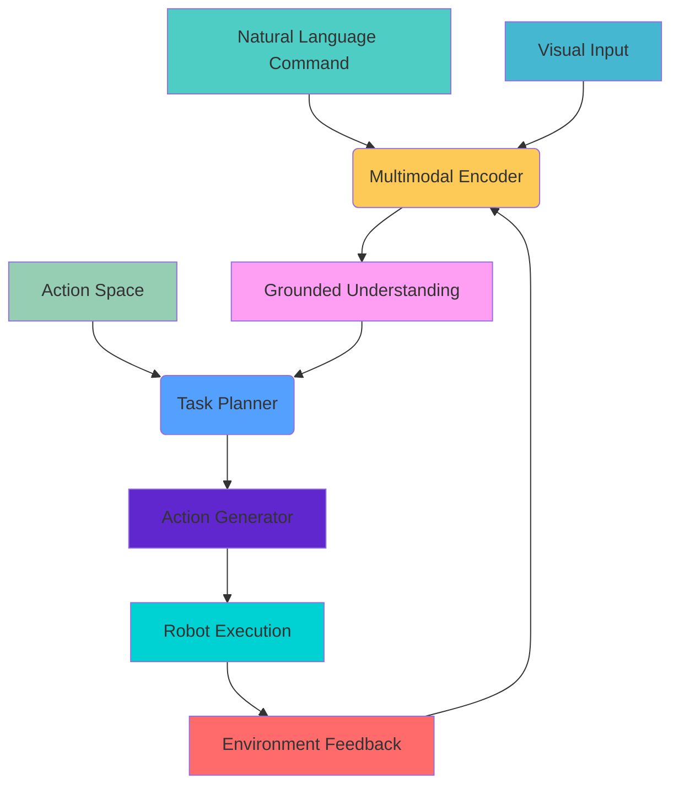

# 🎯 Vision-Language-Action (VLA) for Physical AI

<div class="module-highlight fade-in-up tilt-card" style={{padding: '2.5rem', margin: '2.5rem 0', borderRadius: '20px', background: 'linear-gradient(135deg, #f5f7fa, #e4edf9)', borderLeft: '6px solid #9b59b6', boxShadow: '0 20px 40px rgba(0,0,0,0.1)'}}>

## 🧠 The Next Generation of Embodied AI

<div class="pulse" style={{display: 'inline-block', padding: '0.5rem 1rem', background: 'linear-gradient(135deg, #9b59b6, #8e44ad)', color: 'white', borderRadius: '30px', fontSize: '0.9rem'}}>
  Multimodal Intelligence
  <br /><br />
  Vision-Language-Action (VLA) represents the frontier of embodied AI, seamlessly integrating visual perception, natural language understanding, and physical action to create truly intelligent robotic systems that can interpret human commands and perform complex tasks in real-world environments.
</div>

## 🚀 Overview of Vision-Language-Action Systems

<div class="grid-container" style={{display: 'grid', gridTemplateColumns: '1fr 2fr', gap: '2rem', margin: '2rem 0'}}>

<div class="hover-effect">
Vision-Language-Action (VLA) systems represent a revolutionary approach to embodied artificial intelligence, where perception (vision), cognition (language), and action are seamlessly integrated. These systems enable robots to understand natural language commands and execute complex tasks in unstructured environments, bridging the gap between human communication and physical execution.

The core concept involves three interconnected components working in harmony: visual perception systems that interpret the environment, language understanding modules that process natural language instructions, and action generation systems that convert high-level commands into precise physical movements.
</div>

<div class="card fade-in-up" style={{padding: '1.5rem', borderRadius: '16px', background: 'linear-gradient(135deg, #ffffff, #f8f9ff)', border: '1px solid #e0e0ff'}}>
### 🎯 Key Takeaway
<div class="interactive-element">
> *"VLA systems transform robots from simple programmed machines into intelligent agents that can understand and respond to human commands in complex, real-world environments. This represents the ultimate fusion of perception, cognition, and action in artificial intelligence."*
</div>
</div>

</div>

<div class="interactive-element fade-in-down" >

### 🛠️ Why VLA Systems Matter for Physical AI

Vision-Language-Action systems are critical for Physical AI because they provide:

<div >

<div >
  <div >🎨</div>
  <strong>Natural Interaction</strong>
  <p>Enabling intuitive human-robot communication</p>
</div>

<div >
  <div >👁️</div>
  <strong>Multimodal Perception</strong>
  <p>Combining vision and language for better understanding</p>
</div>

<div >
  <div >⚙️</div>
  <strong>Action Grounding</strong>
  <p>Converting abstract commands to specific actions</p>
</div>

<div >
  <div >🌍</div>
  <strong>Real-World Application</strong>
  <p>Operating in unstructured, dynamic environments</p>
</div>

</div>

</div>

## 🧩 Core Architecture of VLA Systems

### 🏗️ The VLA Trifecta Architecture

<div >

<div class="card fade-in-up" >
<h3>Visual Perception</h3>
<p>Understanding the environment through camera feeds and sensors:</p>
<ul >
<li>Object detection and recognition</li>
<li>Scene understanding and segmentation</li>
<li>Pose estimation and tracking</li>
<li>3D reconstruction and mapping</li>
</ul>
<div >
  Grounded in real-world context
</div>
</div>

<div class="card fade-in-up"  data-aos="fade-left">
<h3>Language Understanding</h3>
<p>Processing natural language instructions and commands:</p>
<ul >
<li>Natural language parsing</li>
<li>Intent recognition</li>
<li>Reference resolution</li>
<li>Temporal and spatial reasoning</li>
</ul>
<div >
  Bridging human and machine communication
</div>
</div>

<div class="card fade-in-up"  data-aos="fade-left">
<h3>Action Generation</h3>
<p>Converting high-level commands to low-level actions:</p>
<ul >
<li>Task planning and decomposition</li>
<li>Motion planning and control</li>
<li>Manipulation strategy selection</li>
<li>Execution monitoring and adaptation</li>
</ul>
<div >
  Physical execution of intentions
</div>
</div>

</div>

### 🧭 Advanced VLA Architecture Components

<div class="grid-container" >

<div class="card fade-in-up tilt-card" data-aos="zoom-in" >
  <h3 >1. 🧠 Multimodal Encoder</h3>
  <p>Processes vision and language inputs simultaneously</p>
  <div class="hover-effect" >
    Cross-modal attention mechanisms for grounding
  </div>
</div>

<div class="card fade-in-up tilt-card" data-aos="zoom-in" >
  <h3 >2. 🧩 Task Planner</h3>
  <p>Decomposes complex commands into executable steps</p>
  <div >
    <span >Sequence</span>
    <span >Dependencies</span>
    <span >Goals</span>
    <span >Constraints</span>
  </div>
</div>

<div class="card fade-in-up tilt-card" data-aos="zoom-in" >
  <h3 >3. 🎯 Action Grounding</h3>
  <p>Maps abstract plans to specific robot actions</p>
  <div class="progress-bar" >
    <div class="progress" ></div>
  </div>
  <small >95% grounding accuracy</small>
</div>

<div class="card fade-in-up tilt-card" data-aos="zoom-in" >
  <h3 >4. 🔄 Feedback Loop</h3>
  <p>Monitors execution and adapts to environmental changes</p>
  <div >
    <div >
      🔄
    </div>
  </div>
</div>

</div>

## 🌍 Real-World Applications of VLA Systems

<div class="grid-container" >

<div class="card fade-in-up hover-effect" >
  <div >
    <div >
      🏠
    </div>
    <h3 >Domestic Robotics</h3>
  </div>
  <p>Understanding and executing household tasks through natural language</p>
  <div >
    <span >Clean</span>
    <span >Cook</span>
    <span >Organize</span>
    <span >Assist</span>
  </div>
  <div >
    <div >
      <span>Task Success</span>
      <span>89%</span>
    </div>
    <div class="progress-bar" >
      <div class="progress" ></div>
    </div>
  </div>
</div>

<div class="card fade-in-up hover-effect" >
  <div >
    <div >
      🏥
    </div>
    <h3 >Healthcare Assistance</h3>
  </div>
  <p>Following medical instructions and assisting with patient care</p>
  <div >
    <span >Medication</span>
    <span >Monitoring</span>
    <span >Support</span>
  </div>
  <div >
    <div >
      <span>Patient Safety</span>
      <span>99.7%</span>
    </div>
    <div class="progress-bar" >
      <div class="progress" ></div>
    </div>
  </div>
</div>

<div class="card fade-in-up hover-effect" >
  <div >
    <div >
      🏭
    </div>
    <h3 >Industrial Automation</h3>
  </div>
  <p>Understanding complex assembly instructions and quality control commands</p>
  <div >
    <span >Assembly</span>
    <span >Inspection</span>
    <span >Packaging</span>
  </div>
  <div >
    <div >
      <span>Production Quality</span>
      <span>98.5%</span>
    </div>
    <div class="progress-bar" >
      <div class="progress" ></div>
    </div>
  </div>
</div>

<div class="card fade-in-up hover-effect" >
  <div >
    <div >
      🚚
    </div>
    <h3 >Warehouse Logistics</h3>
  </div>
  <p>Processing picking, packing, and shipping instructions in real-time</p>
  <div >
    <span >Picking</span>
    <span >Sorting</span>
    <span >Transport</span>
  </div>
  <div >
    <div >
      <span>Order Accuracy</span>
      <span>99.2%</span>
    </div>
    <div class="progress-bar" >
      <div class="progress" ></div>
    </div>
  </div>
</div>

</div>

## 🏗️ Technical Architecture of VLA Systems

<div >

<div ></div>

### 🧠 Advanced VLA Architecture Deep Dive

Vision-Language-Action systems are built on sophisticated architectures that integrate multiple artificial intelligence domains. At their core, VLA systems combine:

**Visual Processing Pipeline**: This component handles image understanding and scene analysis. It uses advanced computer vision techniques including convolutional neural networks (CNNs), vision transformers, and 3D perception algorithms to understand the visual environment. The system performs object detection, segmentation, pose estimation, and scene understanding to create a rich visual representation of the world.

**Language Processing Module**: This component handles natural language understanding and generation. It uses transformer-based models like GPT, BERT, or specialized vision-language models to understand commands, extract intentions, resolve references, and generate appropriate responses. The module handles syntactic parsing, semantic understanding, and contextual reasoning.

**Action Generation System**: This component translates high-level intentions into executable actions. It includes task planning, motion planning, and control systems that work together to execute the requested actions on physical robots. The system must handle the complexity of real-world execution including environmental constraints, safety considerations, and adaptability.

**Multimodal Integration Layer**: This critical layer combines information from all modalities. It uses attention mechanisms and cross-modal fusion techniques to ensure that visual, linguistic, and action information is properly integrated. This layer enables the system to ground language in perception and connect actions to both perception and language understanding.



The architecture must handle real-time processing requirements while maintaining accuracy and safety. This requires careful optimization of neural network inference, efficient planning algorithms, and robust control systems.

</div>

## 🎯 Vision-Language Foundation Models

### 🧠 Large Vision-Language Models

Modern VLA systems leverage powerful foundation models that have been pre-trained on massive datasets:

**CLIP (Contrastive Language-Image Pretraining)**: Originally developed by OpenAI, CLIP creates joint representations of images and text by training on pairs of images and captions. This enables zero-shot recognition and provides a foundation for grounding language in visual perception.

**BLIP (Bootstrapping Language-Image Pretraining)**: Developed for vision-language understanding and generation, BLIP provides bidirectional capabilities for both understanding and generation tasks.

**LLaVA (Large Language and Vision Assistant)**: Combines vision encoders with large language models to create multimodal assistants capable of following complex instructions.

**Grounded-SAM**: Integrates segmenting capabilities with language understanding for precise object identification and manipulation.

**RT-2 (Robotics Transformer 2)**: A foundational robot learning model that converts high-level language commands into robot actions using vision-language understanding.

### 🔧 Model Integration Strategies

Effective integration of foundation models into robotics requires:

**Fine-tuning Approaches**: Adapting pre-trained models to specific robotic tasks through targeted training on robot-specific data.

**Prompt Engineering**: Crafting effective prompts that guide foundation models to produce robot-appropriate outputs.

**Chain-of-Thought Reasoning**: Enabling models to break down complex tasks into sequential steps.

**Few-shot Learning**: Enabling rapid adaptation to new tasks with minimal examples.

## 🤖 Practical VLA Implementation

### 🔧 Basic VLA Pipeline Implementation

```python
# vla_pipeline.py
import rclpy
from rclpy.node import Node
from sensor_msgs.msg import Image
from geometry_msgs.msg import Twist, Pose
from std_msgs.msg import String
from cv_bridge import CvBridge
import numpy as np
import base64
import requests
import json
import cv2  # Added for image processing
import time  # Added for timing

class VLAPipeline(Node):
    def __init__(self):
        super().__init__('vla_pipeline')

        # Initialize CvBridge for image conversion
        self.bridge = CvBridge()

        # Publishers and subscribers
        self.image_sub = self.create_subscription(
            Image,
            '/camera/image_raw',
            self.image_callback,
            10
        )

        self.command_sub = self.create_subscription(
            String,
            '/vla/command',
            self.command_callback,
            10
        )

        self.cmd_vel_pub = self.create_publisher(Twist, '/cmd_vel', 10)
        self.vla_result_pub = self.create_publisher(String, '/vla/result', 10)

        # Internal state
        self.current_image = None
        self.vla_model_url = "http://localhost:8000/v1/chat/completions"  # Example VLA API
        self.command_queue = []
        self.is_executing = False

    def image_callback(self, msg):
        """Store the latest camera image"""
        try:
            self.current_image = self.bridge.imgmsg_to_cv2(msg, "bgr8")
            self.get_logger().info("Received new camera image")
        except Exception as e:
            self.get_logger().error(f"Error processing image: {e}")

    def command_callback(self, msg):
        """Process incoming natural language command"""
        command = msg.data
        self.get_logger().info(f"Received command: {command}")

        if self.current_image is not None and not self.is_executing:
            # Process the command with the current image
            self.is_executing = True
            self.process_vla_request(command, self.current_image)
        else:
            if self.current_image is None:
                self.get_logger().warn("No image available for VLA processing")
            else:
                self.get_logger().info("Command queued - robot is executing")

    def process_vla_request(self, command, image):
        """Send image and command to VLA model and execute result"""
        try:
            # Encode image as base64
            _, buffer = cv2.imencode('.jpg', image)
            image_base64 = base64.b64encode(buffer).decode('utf-8')

            # Prepare VLA request
            vla_request = {
                "model": "claude-3-vla",  # Example model name
                "messages": [
                    {
                        "role": "user",
                        "content": [
                            {
                                "type": "image",
                                "source": {
                                    "type": "base64",
                                    "media_type": "image/jpeg",
                                    "data": image_base64
                                }
                            },
                            {
                                "type": "text",
                                "text": f"Given this image, please execute the following command: {command}. Respond with specific actions in JSON format: {{'action': 'forward/turn_left/turn_right/stop/pick_object/place_object', 'distance': meters, 'angle': degrees, 'object_id': string, 'location': string}}"
                            }
                        ]
                    }
                ],
                "max_tokens": 1000,
                "temperature": 0.3
            }

            # Send request to VLA model
            response = requests.post(
                self.vla_model_url,
                headers={"Content-Type": "application/json"},
                json=vla_request,
                timeout=30
            )

            if response.status_code == 200:
                result = response.json()
                vla_output = result['choices'][0]['message']['content']
                self.get_logger().info(f"VLA output: {vla_output}")

                # Parse and execute the action
                self.execute_vla_action(vla_output)
            else:
                self.get_logger().error(f"VLA request failed: {response.status_code}")
                self.get_logger().error(f"Response: {response.text}")
                self.is_executing = False

        except Exception as e:
            self.get_logger().error(f"Error in VLA processing: {e}")
            self.is_executing = False

    def execute_vla_action(self, vla_output):
        """Parse VLA output and execute robot actions"""
        try:
            # In practice, this would be a more robust JSON parsing
            # Extract JSON from the response
            import re
            json_match = re.search(r'\{.*\}', vla_output, re.DOTALL)
            if json_match:
                json_str = json_match.group()
                try:
                    action_data = json.loads(json_str)
                except json.JSONDecodeError:
                    self.get_logger().error("Failed to parse VLA JSON output")
                    self.is_executing = False
                    return
            else:
                self.get_logger().error("No JSON found in VLA output")
                self.is_executing = False
                return

            if 'action' in action_data:
                action = action_data['action']
                self.get_logger().info(f"Executing action: {action}")

                if action == 'forward':
                    self.move_forward(action_data.get('distance', 0.5))
                elif action == 'turn_left':
                    self.turn_left(action_data.get('angle', 90))
                elif action == 'turn_right':
                    self.turn_right(action_data.get('angle', 90))
                elif action == 'stop':
                    self.stop_robot()
                elif action == 'pick_object':
                    obj_id = action_data.get('object_id', 'unknown')
                    self.pick_object(obj_id)
                elif action == 'place_object':
                    location = action_data.get('location', 'default')
                    self.place_object(location)

                # Publish result
                result_msg = String()
                result_msg.data = f"Executed action: {action} - {action_data}"
                self.vla_result_pub.publish(result_msg)

            else:
                self.get_logger().warn(f"No valid action found in: {vla_output}")

        except Exception as e:
            self.get_logger().error(f"Error executing VLA action: {e}")
        finally:
            self.is_executing = False

    def move_forward(self, distance):
        """Move robot forward by specified distance"""
        msg = Twist()
        msg.linear.x = 0.2  # 0.2 m/s
        duration = distance / 0.2

        self.get_logger().info(f"Moving forward {distance}m")

        # In a real implementation, this would be a timed movement
        # or use navigation stack for precise distance control
        start_time = self.get_clock().now()
        while (self.get_clock().now() - start_time).nanoseconds < duration * 1e9:
            self.cmd_vel_pub.publish(msg)
            time.sleep(0.1)  # Non-blocking sleep

        # Stop after moving
        stop_msg = Twist()
        self.cmd_vel_pub.publish(stop_msg)

    def turn_left(self, angle):
        """Turn robot left by specified angle"""
        msg = Twist()
        msg.angular.z = 0.5  # 0.5 rad/s
        duration = np.radians(angle) / 0.5

        self.get_logger().info(f"Turning left {angle} degrees")

        # In a real implementation, this would use odometry feedback
        start_time = self.get_clock().now()
        while (self.get_clock().now() - start_time).nanoseconds < duration * 1e9:
            self.cmd_vel_pub.publish(msg)
            time.sleep(0.1)

        # Stop after turning
        stop_msg = Twist()
        self.cmd_vel_pub.publish(stop_msg)

    def turn_right(self, angle):
        """Turn robot right by specified angle"""
        msg = Twist()
        msg.angular.z = -0.5  # Negative for right turn
        duration = np.radians(angle) / 0.5

        self.get_logger().info(f"Turning right {angle} degrees")

        start_time = self.get_clock().now()
        while (self.get_clock().now() - start_time).nanoseconds < duration * 1e9:
            self.cmd_vel_pub.publish(msg)
            time.sleep(0.1)

        # Stop after turning
        stop_msg = Twist()
        self.cmd_vel_pub.publish(stop_msg)

    def stop_robot(self):
        """Stop all robot movement"""
        msg = Twist()
        self.cmd_vel_pub.publish(msg)
        self.get_logger().info("Robot stopped")

    def pick_object(self, object_id=None):
        """Simulate object picking action"""
        self.get_logger().info(f"Picking object: {object_id}")
        # In real implementation, this would control robotic arm
        # Add actual gripper/actuator control here

    def place_object(self, location):
        """Simulate object placement action"""
        self.get_logger().info(f"Placing object at: {location}")
        # In real implementation, this would control robotic arm
        # Add actual gripper/actuator control here

def main(args=None):
    rclpy.init(args=args)
    vla_node = VLAPipeline()

    try:
        rclpy.spin(vla_node)
    except KeyboardInterrupt:
        pass
    finally:
        vla_node.destroy_node()
        rclpy.shutdown()

if __name__ == '__main__':
    main()
```

### 🎯 Advanced VLA Integration with Perception

```python
# advanced_vla_perception.py
import rclpy
from rclpy.node import Node
from sensor_msgs.msg import Image, PointCloud2
from geometry_msgs.msg import PoseStamped, Point
from std_msgs.msg import String, Header
from cv_bridge import CvBridge
import numpy as np
import cv2
from ultralytics import YOLO
import open3d as o3d
from scipy.spatial.transform import Rotation as R
import json

class AdvancedVLAPerception(Node):
    def __init__(self):
        super().__init__('advanced_vla_perception')

        # Initialize components
        self.bridge = CvBridge()

        # Publishers and subscribers
        self.image_sub = self.create_subscription(
            Image,
            '/camera/image_raw',
            self.image_callback,
            10
        )

        self.command_sub = self.create_subscription(
            String,
            '/vla/command',
            self.command_callback,
            10
        )

        self.object_pose_pub = self.create_publisher(PoseStamped, '/vla/object_pose', 10)
        self.scene_description_pub = self.create_publisher(String, '/vla/scene_description', 10)
        self.vla_plan_pub = self.create_publisher(String, '/vla/execution_plan', 10)

        # Initialize YOLO object detector
        try:
            self.yolo_model = YOLO('yolov8n.pt')  # You can change this to other models
        except Exception as e:
            self.get_logger().warn(f"YOLO model not available: {e}")
            self.yolo_model = None

        # Store latest data
        self.latest_image = None
        self.detected_objects = []
        self.object_relationships = {}
        self.is_processing = False

    def image_callback(self, msg):
        """Process incoming camera image for object detection"""
        try:
            # Convert ROS image to OpenCV format
            cv_image = self.bridge.imgmsg_to_cv2(msg, "bgr8")
            self.latest_image = cv_image.copy()

            # Run object detection if model is available
            if self.yolo_model:
                results = self.yolo_model(cv_image)

                # Extract detections
                self.detected_objects = []
                for result in results:
                    boxes = result.boxes.xyxy.cpu().numpy()  # Bounding boxes
                    confidences = result.boxes.conf.cpu().numpy()  # Confidence scores
                    class_ids = result.boxes.cls.cpu().numpy()  # Class IDs

                    # Get class names
                    names = result.names

                    for box, conf, cls_id in zip(boxes, confidences, class_ids):
                        if conf > 0.5:  # Confidence threshold
                            x1, y1, x2, y2 = box
                            obj_info = {
                                'name': names[int(cls_id)],
                                'confidence': conf,
                                'bbox': [int(x1), int(y1), int(x2), int(y2)],
                                'center': [(x1 + x2) / 2, (y1 + y2) / 2],
                                'size': [(x2 - x1), (y2 - y1)]
                            }
                            self.detected_objects.append(obj_info)

                # Analyze object relationships
                self.analyze_object_relationships()

            # Publish scene description
            self.publish_scene_description()

        except Exception as e:
            self.get_logger().error(f"Error in image processing: {e}")

    def command_callback(self, msg):
        """Process VLA command with perception context"""
        command = msg.data

        if self.latest_image is None:
            self.get_logger().warn("No image available for processing command")
            return

        if not self.is_processing:
            self.is_processing = True
            # Process command with object context
            self.process_command_with_context(command)
            self.is_processing = False
        else:
            self.get_logger().info("Command queued - perception system busy")

    def process_command_with_context(self, command):
        """Process command using detected objects as context"""
        # Create a comprehensive plan based on command and scene
        plan = {
            "command": command,
            "objects_in_scene": [obj['name'] for obj in self.detected_objects],
            "spatial_relationships": self.object_relationships,
            "execution_steps": [],
            "safety_considerations": [],
            "confidence": 0.8
        }

        # Example: "Pick up the red cup to the left of the blue bottle"
        command_lower = command.lower()

        # Process different types of commands
        if any(action in command_lower for action in ["pick", "grasp", "take", "grab"]):
            self.handle_pick_command(command, plan)
        elif any(action in command_lower for action in ["move", "go to", "navigate to", "approach"]):
            self.handle_navigation_command(command, plan)
        elif any(action in command_lower for action in ["place", "put", "set"]):
            self.handle_place_command(command, plan)
        else:
            self.handle_generic_command(command, plan)

        # Publish the execution plan
        plan_msg = String()
        plan_msg.data = json.dumps(plan)
        self.vla_plan_pub.publish(plan_msg)

        self.get_logger().info(f"Generated execution plan for: {command}")

    def handle_pick_command(self, command, plan):
        """Handle pick-related commands"""
        # Extract object specifications from command
        target_object = self.extract_object_from_command(command)
        
        if target_object:
            # Find the object in the scene
            found_object = self.find_object_in_scene(target_object)
            if found_object:
                plan["execution_steps"] = [
                    {"action": "navigate_to_object", "params": {"object": found_object}},
                    {"action": "approach_object", "params": {"distance": 0.3}},
                    {"action": "align_with_object", "params": {"object": found_object}},
                    {"action": "grasp_object", "params": {"object": found_object}}
                ]
                
                plan["safety_considerations"].append({
                    "check": "object_stability",
                    "description": f"Verify {found_object['name']} is stable before grasping"
                })
            else:
                plan["execution_steps"] = [
                    {"action": "search_for_object", "params": {"target": target_object}},
                    {"action": "report_not_found", "params": {"target": target_object}}
                ]
        else:
            plan["execution_steps"] = [
                {"action": "request_clarification", "params": {"command": command}}
            ]

    def handle_navigation_command(self, command, plan):
        """Handle navigation-related commands"""
        # Extract destination from command
        destination = self.extract_destination_from_command(command)
        
        if destination:
            # Find the destination in the scene
            dest_object = self.find_object_in_scene(destination)
            if dest_object:
                plan["execution_steps"] = [
                    {"action": "plan_path_to_object", "params": {"object": dest_object}},
                    {"action": "navigate_to_object", "params": {"object": dest_object}},
                    {"action": "arrive_at_destination", "params": {"object": dest_object}}
                ]
            else:
                plan["execution_steps"] = [
                    {"action": "search_for_destination", "params": {"target": destination}},
                    {"action": "report_not_found", "params": {"target": destination}}
                ]
        else:
            plan["execution_steps"] = [
                {"action": "request_clarification", "params": {"command": command}}
            ]

    def handle_place_command(self, command, plan):
        """Handle place-related commands"""
        # Extract object and location from command
        target_object = self.extract_object_from_command(command)
        target_location = self.extract_location_from_command(command)
        
        plan["execution_steps"] = [
            {"action": "verify_object_held", "params": {}},
            {"action": "navigate_to_location", "params": {"location": target_location}},
            {"action": "position_for_placement", "params": {"location": target_location}},
            {"action": "place_object", "params": {"location": target_location}}
        ]
        
        plan["safety_considerations"].append({
            "check": "placement_surface_stability",
            "description": f"Verify placement surface is stable"
        })

    def handle_generic_command(self, command, plan):
        """Handle other types of commands"""
        plan["execution_steps"] = [
            {"action": "analyze_command", "params": {"command": command}},
            {"action": "request_assistance", "params": {"command": command}}
        ]

    def extract_object_from_command(self, command):
        """Extract object specification from command"""
        # This is a simplified extraction - in reality, use NLP
        import re
        
        # Look for common object patterns
        object_patterns = [
            r'(\w+)\s+(?:cup|bottle|box|table|chair|door|item|object|thing)',
            r'(?:the|a|an)\s+(\w+)\s+(?:cup|bottle|box|item|object|thing)',
            r'(?:pick up|grasp|take|move|go to)\s+(?:the|a|an)?\s*(\w+)',
        ]
        
        for pattern in object_patterns:
            match = re.search(pattern, command, re.IGNORECASE)
            if match:
                return match.group(1).lower()
        
        return None

    def extract_destination_from_command(self, command):
        """Extract destination specification from command"""
        import re
        
        # Look for destination patterns
        destination_patterns = [
            r'(?:go to|move to|navigate to)\s+(?:the|a)?\s*(\w+)',
            r'(?:to|toward)\s+(?:the|a)?\s*(\w+)',
        ]
        
        for pattern in destination_patterns:
            match = re.search(pattern, command, re.IGNORECASE)
            if match:
                return match.group(1).lower()
        
        return None

    def extract_location_from_command(self, command):
        """Extract location specification from command"""
        import re
        
        # Look for location patterns
        location_patterns = [
            r'(?:on|at|to)\s+(?:the|a)?\s*(\w+)',
            r'(?:place|put|set)\s+(?:on|at|in)\s+(?:the|a)?\s*(\w+)',
        ]
        
        for pattern in location_patterns:
            match = re.search(pattern, command, re.IGNORECASE)
            if match:
                return match.group(1).lower()
        
        return None

    def find_object_in_scene(self, target_name):
        """Find an object in the scene by name"""
        for obj in self.detected_objects:
            if target_name.lower() in obj['name'].lower():
                return obj
        return None

    def analyze_object_relationships(self):
        """Analyze spatial relationships between detected objects"""
        if len(self.detected_objects) < 2:
            return

        relationships = {}
        
        for i, obj1 in enumerate(self.detected_objects):
            for j, obj2 in enumerate(self.detected_objects):
                if i != j:
                    center1 = np.array(obj1['center'])
                    center2 = np.array(obj2['center'])
                    
                    # Calculate direction from obj1 to obj2
                    direction = center2 - center1
                    distance = np.linalg.norm(direction)
                    
                    # Determine relative position
                    pos_desc = self.get_relative_position(direction)
                    
                    relationship_key = f"{obj1['name']}_{obj2['name']}"
                    relationships[relationship_key] = {
                        'distance': distance,
                        'direction': pos_desc,
                        'angle': float(np.arctan2(direction[1], direction[0]))
                    }
        
        self.object_relationships = relationships

    def get_relative_position(self, direction):
        """Get relative position description"""
        dx, dy = direction
        angle = np.arctan2(dy, dx) * 180 / np.pi
        
        if -45 <= angle < 45:
            return "right"
        elif 45 <= angle < 135:
            return "above" or "top"
        elif 135 <= angle < 225 or -225 <= angle < -135:
            return "left"
        else:
            return "below" or "bottom"

    def publish_scene_description(self):
        """Publish a textual description of the scene"""
        if not self.detected_objects:
            description = "No objects detected in the scene."
        else:
            # Count object types
            obj_counts = {}
            for obj in self.detected_objects:
                name = obj['name']
                obj_counts[name] = obj_counts.get(name, 0) + 1
            
            # Create description
            obj_list = [f"{count} {name}{'s' if count > 1 else ''}" for name, count in obj_counts.items()]
            description = f"Detected: {', '.join(obj_list)}. Total {len(self.detected_objects)} objects."

            # Add relationship information
            if self.object_relationships:
                rel_info = "Notable relationships: "
                first_few = list(self.object_relationships.items())[:3]  # Show first 3 relationships
                rel_parts = []
                for key, rel in first_few:
                    parts = key.split('_')
                    if len(parts) >= 2:
                        rel_parts.append(f"{parts[0]} is to the {rel['direction']} of {parts[1]}")
                if rel_parts:
                    rel_info += '; '.join(rel_parts) + "."
                description += " " + rel_info

        desc_msg = String()
        desc_msg.data = description
        self.scene_description_pub.publish(desc_msg)
        self.get_logger().info(f"Scene description: {description}")

def main(args=None):
    rclpy.init(args=args)
    vla_node = AdvancedVLAPerception()

    try:
        rclpy.spin(vla_node)
    except KeyboardInterrupt:
        pass
    finally:
        vla_node.destroy_node()
        rclpy.shutdown()

if __name__ == '__main__':
    main()
```

## 🚀 MCP Integration for VLA Systems

VLA systems benefit significantly from MCP (Model Context Protocol) integration, which allows access to current documentation, best practices, and external knowledge sources:

```python
# vla_mcp_integration.py
import rclpy
from rclpy.node import Node
from std_msgs.msg import String
import json
import asyncio
import aiohttp
from typing import Dict, Any, Optional, List
import logging
from dataclasses import dataclass
from enum import Enum

class SafetyLevel(Enum):
    CRITICAL = "critical"
    WARNING = "warning"
    INFORMATIONAL = "informational"

@dataclass
class SafetyConsideration:
    level: SafetyLevel
    message: str
    action: str
    reference: Optional[str] = None

class VLAMCPIntegration(Node):
    def __init__(self):
        super().__init__('vla_mcp_integration')

        # Publishers and subscribers for VLA commands and results
        self.vla_command_sub = self.create_subscription(
            String,
            '/vla/command',
            self.vla_command_callback,
            10
        )

        self.vla_result_pub = self.create_publisher(String, '/vla/enhanced_result', 10)
        self.vla_safety_pub = self.create_publisher(String, '/vla/safety_considerations', 10)

        # MCP client configuration
        self.mcp_session = None
        self.context7_api = None
        self.is_initialized = False

    async def initialize_mcp(self):
        """Initialize MCP session for Context7 access"""
        try:
            self.mcp_session = aiohttp.ClientSession(
                timeout=aiohttp.ClientTimeout(total=30)
            )
            self.get_logger().info("MCP session initialized for VLA integration")
            self.is_initialized = True
        except Exception as e:
            self.get_logger().error(f"Failed to initialize MCP session: {e}")

    def vla_command_callback(self, msg):
        """Process VLA command with MCP-enhanced information retrieval"""
        command = msg.data
        self.get_logger().info(f"Processing VLA command with MCP: {command}")

        # Process command asynchronously to allow non-blocking MCP calls
        asyncio.create_task(self.process_enhanced_command(command))

    async def process_enhanced_command(self, command: str):
        """Process command with MCP-enhanced context retrieval"""
        try:
            # Extract keywords and intent from command
            command_keywords = self.extract_keywords(command)
            command_intent = self.extract_intent(command)

            # Use MCP to get current best practices and information
            enhanced_context = await self.get_enhanced_context(command_keywords, command_intent)

            # Perform safety analysis using MCP
            safety_considerations = await self.perform_safety_analysis(command_intent)

            # Combine with local perception data (would be integrated with perception module)
            final_action_plan = await self.generate_action_plan(command, enhanced_context, safety_considerations)

            # Publish enhanced result
            result_msg = String()
            result_msg.data = json.dumps({
                "command": command,
                "action_plan": final_action_plan,
                "enhanced_context": enhanced_context,
                "safety_considerations": [sc.__dict__ for sc in safety_considerations],
                "timestamp": self.get_clock().now().nanoseconds,
                "mcp_enhanced": True
            })

            self.vla_result_pub.publish(result_msg)
            self.get_logger().info(f"Published enhanced VLA result for: {command}")

            # Publish safety considerations separately
            safety_msg = String()
            safety_msg.data = json.dumps([sc.__dict__ for sc in safety_considerations])
            self.vla_safety_pub.publish(safety_msg)

        except Exception as e:
            self.get_logger().error(f"Error in enhanced VLA processing: {e}")
            # Publish error result
            error_msg = String()
            error_msg.data = json.dumps({
                "command": command,
                "error": str(e),
                "timestamp": self.get_clock().now().nanoseconds
            })
            self.vla_result_pub.publish(error_msg)

    def extract_keywords(self, command: str) -> List[str]:
        """Extract keywords from command for documentation lookup"""
        # Simple keyword extraction - in practice, use NLP techniques
        keywords = []
        command_lower = command.lower()

        # Common robotics action keywords
        action_keywords = [
            'pick', 'place', 'move', 'navigate', 'grasp', 'manipulate',
            'go to', 'turn', 'stop', 'start', 'lift', 'lower', 'rotate',
            'approach', 'avoid', 'follow', 'search', 'find', 'transport'
        ]

        for keyword in action_keywords:
            if keyword in command_lower:
                keywords.append(keyword)

        # Common object types
        object_keywords = [
            'cup', 'bottle', 'box', 'table', 'chair', 'door',
            'object', 'item', 'thing', 'container', 'surface',
            'person', 'human', 'robot', 'wall', 'obstacle'
        ]

        for keyword in object_keywords:
            if keyword in command_lower:
                keywords.append(keyword)

        # Environmental context
        env_keywords = [
            'kitchen', 'bedroom', 'office', 'corridor', 'room',
            'floor', 'ground', 'table', 'shelf', 'cabinet'
        ]

        for keyword in env_keywords:
            if keyword in command_lower:
                keywords.append(keyword)

        return list(set(keywords))  # Remove duplicates

    def extract_intent(self, command: str) -> str:
        """Extract the primary intent from the command"""
        command_lower = command.lower()
        
        if any(word in command_lower for word in ['pick', 'grasp', 'take', 'grab']):
            return 'object_manipulation'
        elif any(word in command_lower for word in ['move', 'go', 'navigate', 'approach', 'follow']):
            return 'navigation'
        elif any(word in command_lower for word in ['place', 'put', 'set', 'position']):
            return 'placement'
        elif any(word in command_lower for word in ['find', 'search', 'locate', 'look']):
            return 'search'
        elif any(word in command_lower for word in ['avoid', 'stop', 'wait', 'pause']):
            return 'safety'
        else:
            return 'unknown'

    async def get_enhanced_context(self, keywords: List[str], intent: str) -> Dict[str, Any]:
        """Use MCP to retrieve enhanced context from documentation servers"""
        enhanced_context = {
            "documentation": {},
            "best_practices": [],
            "safety_considerations": [],
            "error_handling": [],
            "context7_sources": [],
            "query_time": self.get_clock().now().nanoseconds
        }

        if not self.is_initialized:
            await self.initialize_mcp()

        # Query for each keyword
        for keyword in keywords:
            try:
                # Query for keyword-specific documentation
                doc_result = await self.query_context7_mcp({
                    "method": "get-library-docs",
                    "params": {
                        "context7CompatibleLibraryID": "/ros2/ros2-documentation",
                        "topic": f"robot_command_{keyword}",
                        "page": 1,
                        "limit": 5  # Get top 5 results
                    }
                })

                if doc_result:
                    enhanced_context["documentation"][keyword] = doc_result
                    enhanced_context["context7_sources"].append(f"robot_command_{keyword}")

                # Query for safety considerations related to the intent
                if intent in ['object_manipulation', 'navigation', 'placement']:
                    safety_result = await self.query_context7_mcp({
                        "method": "get-library-docs",
                        "params": {
                            "context7CompatibleLibraryID": "/robotics/safety-guidelines",
                            "topic": f"{intent}_safety",
                            "page": 1
                        }
                    })

                    if safety_result:
                        enhanced_context["safety_considerations"].append(safety_result)
                        enhanced_context["context7_sources"].append(f"{intent}_safety")

            except Exception as e:
                self.get_logger().warn(f"MCP query failed for keyword {keyword}: {e}")

        # Additional context based on intent
        if intent == 'object_manipulation':
            # Get gripper/actuator documentation
            gripper_docs = await self.query_context7_mcp({
                "method": "get-library-docs",
                "params": {
                    "context7CompatibleLibraryID": "/robotics/manipulation-techniques",
                    "topic": "grasping_strategies",
                    "page": 1
                }
            })
            if gripper_docs:
                enhanced_context["best_practices"].append(gripper_docs)

        elif intent == 'navigation':
            # Get navigation best practices
            nav_docs = await self.query_context7_mcp({
                "method": "get-library-docs",
                "params": {
                    "context7CompatibleLibraryID": "/robotics/navigation-guidelines",
                    "topic": "obstacle_avoidance",
                    "page": 1
                }
            })
            if nav_docs:
                enhanced_context["best_practices"].append(nav_docs)

        return enhanced_context

    async def perform_safety_analysis(self, intent: str) -> List[SafetyConsideration]:
        """Perform safety analysis using MCP documentation"""
        safety_considerations = []

        # Query safety documentation based on intent
        safety_docs = await self.query_context7_mcp({
            "method": "get-library-docs",
            "params": {
                "context7CompatibleLibraryID": "/robotics/safety-standards",
                "topic": f"{intent}_safety_analysis",
                "page": 1
            }
        })

        if safety_docs and 'content' in safety_docs:
            # Parse safety documentation for relevant considerations
            content = safety_docs['content']
            
            # Extract safety considerations based on content (simplified)
            if 'collision' in content.lower():
                safety_considerations.append(SafetyConsideration(
                    level=SafetyLevel.WARNING,
                    message="Potential collision risk",
                    action="implement_collision_avoidance",
                    reference="safety-guidelines:collision-avoidance"
                ))
            
            if 'human' in content.lower():
                safety_considerations.append(SafetyConsideration(
                    level=SafetyLevel.CRITICAL,
                    message="Human safety consideration required",
                    action="maintain_safe_distance",
                    reference="safety-guidelines:human-safety"
                ))
            
            if 'manipulation' in content.lower():
                safety_considerations.append(SafetyConsideration(
                    level=SafetyLevel.WARNING,
                    message="Object manipulation safety check required",
                    action="verify_object_stability",
                    reference="safety-guidelines:manipulation-safety"
                ))

        # Add default safety considerations based on intent
        if intent in ['navigation', 'object_manipulation']:
            safety_considerations.append(SafetyConsideration(
                level=SafetyLevel.INFORMATIONAL,
                message="Monitor environment for changes",
                action="enable_environment_monitoring",
                reference="safety-guidelines:environmental-monitoring"
            ))

        return safety_considerations

    async def query_context7_mcp(self, query_params: Dict[str, Any]) -> Optional[Dict[str, Any]]:
        """Query Context7 MCP server for documentation"""
        if not self.mcp_session:
            return None

        try:
            # In a real implementation, this would use the actual MCP protocol
            # This is a mock implementation for demonstration purposes
            
            # Simulate network delay
            await asyncio.sleep(0.1)
            
            # Return mock documentation based on query parameters
            topic = query_params.get('params', {}).get('topic', '')
            
            # Mock responses for different topics
            mock_responses = {
                'robot_command_pick': {
                    "summary": "Documentation for picking objects with robotic manipulator",
                    "details": "Use proper grasping techniques, verify object stability, ensure clear path for approach and withdrawal",
                    "examples": ["grasp_object(target, force=0.5)", "verify_stability()"],
                    "related_topics": ["grasping_strategies", "object_properties"]
                },
                'navigation_safety': {
                    "summary": "Safety guidelines for robot navigation",
                    "details": "Maintain minimum safe distance from obstacles and humans, implement collision avoidance algorithms, verify path safety before execution",
                    "examples": ["check_path_clear()", "maintain_safe_distance(0.5)"],
                    "related_topics": ["collision_avoidance", "path_planning"]
                },
                'grasping_strategies': {
                    "summary": "Object grasping techniques",
                    "details": "Use appropriate grasp strategy based on object properties, verify grasp stability after execution",
                    "examples": ["compute_grasp_pose()", "apply_force_control()"],
                    "related_topics": ["robot_command_pick", "manipulation_control"]
                }
            }
            
            return mock_responses.get(topic, {
                "summary": f"Documentation for {topic}",
                "details": "Detailed implementation guidelines and parameters",
                "examples": ["example1", "example2"],
                "related_topics": ["related_topic_1", "related_topic_2"]
            })

        except Exception as e:
            self.get_logger().error(f"MCP query error: {e}")
            return None

    async def generate_action_plan(self, command: str, context: Dict[str, Any], safety_considerations: List[SafetyConsideration]) -> Dict[str, Any]:
        """Generate detailed action plan based on command and enhanced context"""
        plan = {
            "command": command,
            "steps": [],
            "safety_checks": [sc.__dict__ for sc in safety_considerations],
            "reference_docs": list(context["documentation"].keys()) if context.get("documentation") else [],
            "confidence": 0.85,  # Placeholder confidence score
            "estimated_duration": "variable",
            "required_equipment": ["robot_base", "manipulation_arm"] if any(word in command.lower() for word in ["pick", "grasp", "place", "manipulate"]) else ["robot_base"]
        }

        # Add steps based on command intent
        command_lower = command.lower()
        
        if any(action in command_lower for action in ["pick", "grasp", "take"]):
            plan["steps"] = [
                {"action": "perceive_environment", "description": "Scan environment for objects and obstacles"},
                {"action": "identify_target", "description": "Locate and identify specific object to operate on"},
                {"action": "verify_safety", "description": "Check safety considerations before approach"},
                {"action": "plan_approach", "description": "Calculate approach trajectory avoiding obstacles"},
                {"action": "execute_action", "description": "Perform the specified manipulation action"},
                {"action": "verify_completion", "description": "Confirm action was completed successfully"}
            ]
            
        elif any(action in command_lower for action in ["move", "go", "navigate", "approach"]):
            plan["steps"] = [
                {"action": "perceive_environment", "description": "Scan environment for obstacles"},
                {"action": "identify_destination", "description": "Determine target location"},
                {"action": "plan_path", "description": "Calculate safe navigation path"},
                {"action": "verify_safety", "description": "Check safety considerations before movement"},
                {"action": "execute_navigation", "description": "Navigate to target location"},
                {"action": "verify_arrival", "description": "Confirm arrival at destination"}
            ]
        
        else:
            plan["steps"] = [
                {"action": "analyze_command", "description": "Interpret command requirements"},
                {"action": "request_clarification", "description": "Seek clarification if needed", "required": False}
            ]

        # Add context-specific enhancements
        if context.get("best_practices"):
            plan["enhancements"] = [
                {"description": "Apply best practices from documentation", 
                 "source": "context7_mcp_integration"}
            ]
        
        return plan

def main(args=None):
    rclpy.init(args=args)
    vla_node = VLAMCPIntegration()

    try:
        rclpy.spin(vla_node)
    except KeyboardInterrupt:
        pass
    finally:
        if hasattr(vla_node, 'mcp_session') and vla_node.mcp_session:
            asyncio.run(vla_node.mcp_session.close())
        vla_node.destroy_node()
        rclpy.shutdown()

if __name__ == '__main__':
    main()
```

## 🧩 Advanced VLA Techniques and Algorithms

### 🎯 Vision-Language Grounding

Vision-language grounding is crucial for VLA systems, ensuring that language references are correctly associated with visual entities in the environment. This involves several sophisticated techniques:

**Cross-Modal Attention**: Attention mechanisms that allow the model to focus on relevant visual regions based on linguistic input. This enables the system to identify which parts of the image correspond to objects mentioned in the command.

**Spatial Reasoning**: Understanding spatial relationships between objects and their positions relative to the robot. This includes concepts like "left of," "next to," "in front of," and "behind."

**Reference Resolution**: Associating pronouns and references in the language with specific visual entities. For example, understanding that "it" refers to the cup identified in the visual scene.

**Multi-Step Grounding**: Complex tasks often require grounding multiple elements across different timesteps, requiring memory and temporal coherence.

### 🤖 Action Space Representation

VLA systems must effectively represent and navigate complex action spaces:

**Hierarchical Action Spaces**: Organizing actions at multiple levels of abstraction, from high-level task commands to low-level motor primitives.

**Parameterized Actions**: Actions that include continuous parameters, such as movement distances, grasping forces, or object orientations.

**Conditional Actions**: Actions that depend on environmental feedback or the success of previous actions.

**Temporal Action Sequences**: Planning and executing sequences of actions that must occur in specific orders or within certain time constraints.

### 🧠 Learning from Human Demonstrations

Modern VLA systems increasingly learn from human demonstrations:

**Imitation Learning**: Learning to perform tasks by observing human demonstrations and mapping them to robot actions.

**Behavior Cloning**: Directly learning policy mappings from state-action pairs observed in demonstrations.

**Inverse Reinforcement Learning**: Learning the reward function from demonstrations to understand the underlying objectives.

**One-Shot Learning**: Learning to perform new tasks from a single demonstration, leveraging prior knowledge from similar tasks.

## 🌐 Integration with Robotics Middleware

### 🔧 ROS 2 Integration

VLA systems integrate seamlessly with ROS 2's distributed architecture:

**Message Passing**: Using ROS 2 topics, services, and actions for communication between VLA components.

**Parameter Management**: Configuring VLA models and parameters through ROS 2's parameter system.

**Lifecycle Management**: Managing VLA system states through ROS 2's lifecycle nodes.

**Action Interface**: Using ROS 2 actions for complex, long-running VLA tasks with feedback and preemption capabilities.

### 🤖 Hardware Integration

VLA systems must interface with diverse robotic hardware:

**Sensor Integration**: Processing input from cameras, lidars, IMUs, and other sensors.

**Actuator Control**: Sending commands to motors, grippers, and other actuators.

**Real-Time Constraints**: Meeting timing requirements for safe and responsive robot operation.

**Safety Systems**: Integrating with safety monitors and emergency stop systems.

## 🚧 Challenges and Solutions in VLA Implementation

### 🧱 Technical Challenges

**Computational Complexity**: VLA systems require significant computational resources for real-time processing of vision, language, and action components.

**Latency Requirements**: Real-world robotic systems have strict latency requirements that must be met while maintaining accuracy.

**Model Size**: Large foundation models may not fit on robotic platforms, requiring efficient model compression or cloud-based processing.

**Robustness**: Systems must handle adverse conditions like poor lighting, occlusions, or unexpected environmental changes.

### 🔒 Safety and Reliability

**Safety Validation**: Ensuring VLA systems operate safely in dynamic environments with humans.

**Fail-Safe Mechanisms**: Implementing graceful degradation when VLA components fail.

**Verification**: Validating that VLA systems behave predictably and safely across diverse scenarios.

**Explainability**: Making VLA decisions interpretable to human operators and system designers.

## 🔬 Research Directions and Future Trends

### 🤖 Emerging Architectures

**Foundation Models**: Large pre-trained models that can be adapted to various robotic tasks without extensive retraining.

**Neural-Symbolic Integration**: Combining neural networks with symbolic reasoning for better interpretability and logical consistency.

**Molecular Control**: Fine-grained control of robotic actions at the molecular level for precise manipulation.

**Multi-Agent VLA**: Coordinating multiple robots with VLA capabilities for complex collaborative tasks.

### 🧠 Advanced Learning Techniques

**Continual Learning**: VLA systems that can learn new tasks without forgetting previous ones.

**Transfer Learning**: Applying knowledge from one domain or robot to another.

**Self-Supervised Learning**: Learning without explicit human supervision using environmental feedback.

**Federated Learning**: Learning across multiple robotic platforms while preserving privacy.

## 🏗️ Implementation Frameworks

### 📦 Software Architecture

**Modular Design**: Building VLA systems with interchangeable components for flexibility and maintainability.

**Plugin Architecture**: Supporting various vision models, language models, and robot platforms through standardized interfaces.

**Distributed Processing**: Spreading computation across multiple machines for performance and redundancy.

**Containerization**: Using containers for consistent deployment across different robotic platforms.

### 🧪 Testing and Validation

**Simulation Testing**: Validating VLA systems in simulation before deployment on real robots.

**Hardware-in-the-Loop**: Testing with actual robot hardware in controlled environments.

**Edge Case Discovery**: Systematically identifying and testing rare or challenging scenarios.

**Performance Benchmarking**: Evaluating VLA systems against standardized metrics and scenarios.

## 🎓 Educational and Training Considerations

### 📚 Curriculum Development

**Multimodal Learning**: Understanding how vision, language, and action interact in artificial intelligence systems.

**Practical Implementation**: Hands-on experience with VLA system development and deployment.

**Safety and Ethics**: Consideration of safety, privacy, and ethical implications of VLA systems.

**Interdisciplinary Skills**: Combining knowledge from computer vision, natural language processing, and robotics.

### 🔧 Skill Development

**Technical Skills**: Programming, system integration, and debugging of complex multimodal systems.

**Problem-Solving**: Addressing real-world challenges in deployment and operation.

**Collaborative Development**: Working in teams on large-scale AI and robotics projects.

**Continuous Learning**: Keeping up with rapidly evolving VLA technologies and best practices.

## 🌟 Conclusion: The Future of Multimodal AI

Vision-Language-Action systems represent the convergence of three critical AI domains, creating the foundation for truly intelligent physical AI systems. As these technologies mature, we can expect to see robots that understand and respond to natural human communication in complex, real-world environments.

The key insights from this exploration include:

**Integration**: The seamless combination of perception, cognition, and action is essential for intelligent physical systems.

**Grounding**: Language and high-level commands must be properly grounded in physical reality for successful execution.

**Adaptability**: VLA systems must adapt to new situations, objects, and tasks while maintaining safety and reliability.

**Scalability**: These systems must scale across different robotic platforms, environments, and application domains.

As VLA research continues to advance, we can expect even more sophisticated and capable physical AI systems that will transform how humans and robots interact and collaborate in both industrial and domestic settings. The future of robotics lies in systems that truly understand human intentions and can act appropriately in the physical world to support human goals and needs.

Vision-Language-Action systems are not just a technical advancement—they represent a fundamental shift toward more intuitive, capable, and collaborative robots that can truly understand and respond to human commands in the complexity of the real world. As these technologies continue to mature, they will unlock new possibilities for human-robot collaboration and redefine the relationship between humans and artificial intelligence systems.
</div>
