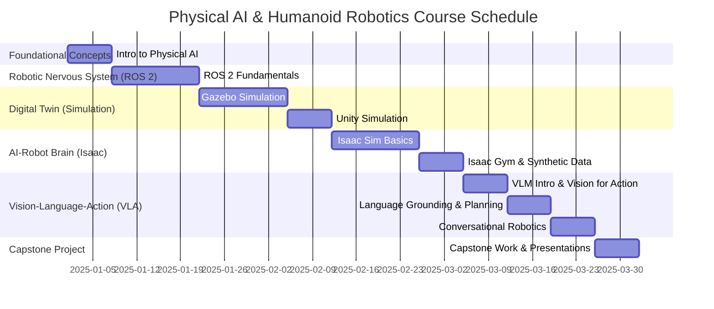

# Weekly Breakdown (Week 1–13)

## High-level overview
A structured timeline for the course, ensuring progressive learning and effective project integration.

## Deep technical explanation
*   **Week 1:** Introduction to Physical AI.
*   **Week 2-3:** Module 1: ROS 2 Fundamentals (`rclpy` nodes, topics, services, actions, TF2).
*   **Week 4-5:** Module 2: Gazebo Simulation (SDF, ROS 2 integration, custom worlds).
*   **Week 6:** Module 2: Unity Simulation (Unity Robotics Hub, ROS-TCP-Connector, URDF import).
*   **Week 7-8:** Module 3: NVIDIA Isaac Sim (USD, Python API, basic robot control).
*   **Week 9:** Module 3: Isaac Gym & Synthetic Data (RL fundamentals, domain randomization).
*   **Week 10:** Module 4: VLM Introduction & Vision for Action (Image captioning, object detection).
*   **Week 11:** Module 4: Language Grounding & Task Planning (Translating commands to actions).
*   **Week 12:** Module 4: Conversational Robotics & Advanced VLA Integration.
*   **Week 13:** Capstone Project Work & Presentations.

## Real-world examples
N/A - Course structure.

## Diagrams (Mermaid syntax)

*   Table summarizing weekly topics, assignments, and key milestones.

## Code snippet ideas
N/A.

<h2>Simulation exercises</h2>
N/A.

<h2>Hardware & software requirements for this module</h2>
N/A - Overview.

<h2>Mini-tasks for students</h2>
N/A.

<h2>Learning outcomes</h2>
*   Understand the structured progression of the course.
*   Manage time effectively to complete weekly assignments and project milestones.
*   See how individual modules contribute to the final capstone.

<h2>Integration points for capstone project</h2>
Each week's learning directly contributes to the capstone, culminating in Week 13.

<h2>Cross-references between modules</h2>
All modules are explicitly referenced and scheduled.

<h2>Notes for weekly progression (Week 1–13)</h2>
Emphasize iterative development for the capstone project.
