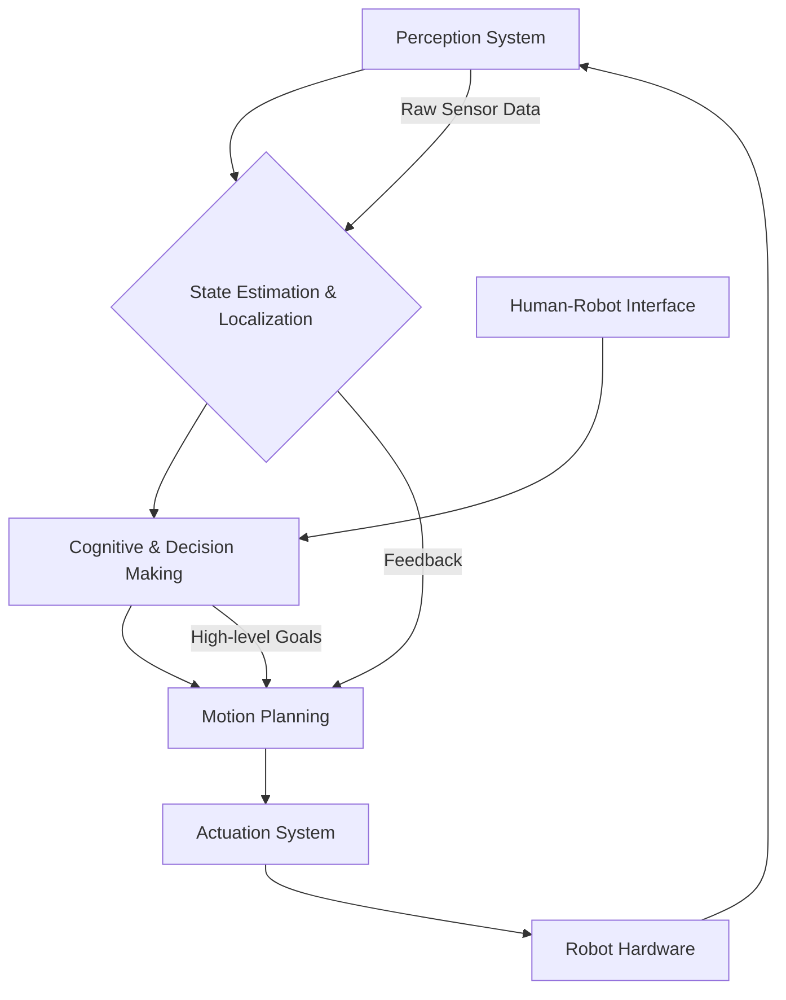

# Chapter P: The Plan Phase in AI Robotics

After a robotics project's vision is crystalized in the Constitution Phase and its requirements rigorously defined in the Specify Phase, the "Plan Phase" orchestrates the translation of these requirements into a tangible architectural design and a detailed implementation strategy. Driven by tools and methodologies like `/sp.plan`, this phase is where high-level decisions are made, system components are defined, and the blueprint for development is laid out.

## How `/sp.plan` Generates Architecture and Design Decisions in AI Robotics

The `/sp.plan` command (or the structured planning workflow it represents) is designed to guide architects and development teams through the process of designing an implementation strategy. In AI Robotics, this involves addressing the unique challenges of integrating diverse systems, managing real-time constraints, and ensuring safe and intelligent operation. `/sp.plan` facilitates this by:

1.  **Breaking Down Complexity:** Decomposing the system into logical, manageable modules (e.g., perception, navigation, manipulation, human-robot interaction).
2.  **Evaluating Trade-offs:** Considering different approaches for critical components (e.g., centralized vs. distributed control, specific sensor types, choice of path planning algorithms) and documenting the rationale for each decision.
3.  **Defining Interfaces:** Specifying how different modules will communicate and interact, ensuring interoperability and reducing integration friction.
4.  **Identifying Architectural Patterns:** Applying established robotics architectures (e.g., deliberative, reactive, hybrid) or designing novel ones to meet specific project needs.
5.  **Foreseeing Implementation Challenges:** Anticipating technical hurdles, resource limitations, and integration complexities early in the process.
6.  **Establishing a Roadmap:** Creating a step-by-step plan that guides development teams, prioritizes tasks, and sets clear milestones.

## Robotics-Specific Planning: Sensor Integration, Actuator Control, Path Planning

The Plan Phase in AI Robotics delves into the specifics of how the robot will perceive, act, and reason.

### 1. Sensor Integration

**Design Decision:** How will the robot integrate data from multiple heterogeneous sensors (e.g., cameras, LiDAR, IMU, force sensors)?

*   **Options Considered:**
    *   **Direct Processing:** Each sensor feeds directly into a specific module.
    *   **Sensor Fusion (Recommended):** Data from multiple sensors is combined to create a more robust and accurate understanding of the environment.
*   **Rationale:** Sensor fusion provides redundancy, compensates for individual sensor limitations (e.g., camera in low light, LiDAR blind spots), and improves overall perception robustness. It's critical for reliable navigation and interaction in dynamic environments.
*   **Step-by-Step Design:**
    1.  **Identify Core Sensors:** List all sensors and their primary data outputs (e.g., Camera: RGB images; LiDAR: Point clouds, depth maps; IMU: orientation, acceleration).
    2.  **Select Fusion Technique:** Choose appropriate fusion algorithms (e.g., Kalman Filters, Extended Kalman Filters, Particle Filters for state estimation; deep learning for multi-modal perception).
    3.  **Define Data Synchronization:** Establish protocols for timestamping and synchronizing sensor data streams to ensure coherent perception.
    4.  **Specify Data Preprocessing:** Outline steps for noise reduction, filtering, and transformation for each sensor before fusion.
    5.  **Design Communication Interfaces:** Define messages and topics (e.g., ROS messages) for publishing fused data to downstream modules (e.g., Navigation, Object Recognition).

### 2. Actuator Control

**Design Decision:** How will the robot precisely control its motors and other actuators to achieve desired movements?

*   **Options Considered:**
    *   **Direct PWM/Voltage Control:** Low-level control, complex to manage for complex movements.
    *   **Joint-Space Control (Recommended):** Control individual joints to reach desired angles/positions.
    *   **Task-Space Control:** Control the end-effector directly in Cartesian space (requires inverse kinematics).
*   **Rationale:** Joint-space control offers a good balance of precision and manageable complexity for most robotic arms/mobile bases. Task-space control can be built on top for specific applications.
*   **Step-by-Step Design:**
    1.  **Characterize Actuators:** Document motor types, gear ratios, encoders, and maximum torque/speed.
    2.  **Select Control Loop Architecture:** Implement PID controllers (Proportional-Integral-Derivative) for each joint, tuned for stability and responsiveness.
    3.  **Define Control Modes:** Specify different operational modes (e.g., position control, velocity control, torque control).
    4.  **Design Safety Limits:** Implement software and hardware limits for joint angles, velocities, and currents to prevent damage or unsafe operation.
    5.  **Integrate Feedback:** Utilize encoder readings and other sensor feedback for closed-loop control and state estimation.

### 3. Path Planning

**Design Decision:** How will the robot generate optimal and collision-free paths in dynamic environments?

*   **Options Considered:**
    *   **Graph Search (e.g., A*, Dijkstra):** Effective for known, static environments.
    *   **Sampling-based (e.g., RRT, PRM):** Good for high-dimensional spaces or complex obstacles.
    *   **Model Predictive Control (MPC):** Real-time, reactive planning, handles dynamic obstacles well.
    *   **Hybrid Approach (Recommended):** Combine global planning (e.g., A*) for long-range routes with local, reactive planning (e.g., MPC, DWA) for immediate obstacle avoidance.
*   **Rationale:** A hybrid approach offers the best balance of global optimality and local responsiveness, crucial for navigating complex, changing real-world environments safely.
*   **Step-by-Step Design:**
    1.  **Global Planner Selection:** Choose a global planner (e.g., A*) to generate a high-level, long-term path based on a static map.
    2.  **Local Planner Selection:** Select a local planner (e.g., Dynamic Window Approach - DWA) to generate short-term, reactive trajectories that avoid dynamic obstacles.
    3.  **Cost Function Definition:** Define parameters for evaluating paths (e.g., distance to goal, proximity to obstacles, energy consumption, smoothness).
    4.  **Map Representation:** Decide on the map format (e.g., occupancy grid, point cloud map, topological map).
    5.  **Integration with Localization:** Ensure tight coupling with the robot's localization system to update current position accurately for planning.

## Sample Architecture Diagram Suggestion

The Plan Phase often culminates in an architectural overview. While I cannot draw diagrams, here's how you might conceptualize one in Markdown:

```markdown
# High-Level AI Robotics Architecture (Conceptual)

## [System Name]



**Key Components:**

*   **Perception System:** Gathers raw data from sensors (cameras, LiDAR, IMU, etc.).
*   **State Estimation & Localization:** Fuses sensor data to create an accurate understanding of the robot's own pose and the environment.
*   **Cognitive & Decision Making:** Interprets high-level goals, performs task planning, and makes strategic decisions based on environmental understanding.
*   **Motion Planning:** Generates collision-free trajectories to achieve cognitive goals, adapting to dynamic environments.
*   **Actuation System:** Translates motion commands into physical movements of motors and other actuators.
*   **Robot Hardware:** The physical robot platform (chassis, manipulators, sensors, motors).
*   **Human-Robot Interface (HRI):** Allows humans to provide commands, monitor status, and intervene.
```

## Tips for Modular Design and Future Scalability

*   **Loose Coupling, High Cohesion:** Design modules to be independent with well-defined interfaces. Each module should have a single, clear responsibility. This minimizes ripple effects when changes are made.
*   **API-First Approach:** Define the Application Programming Interfaces (APIs) between modules before implementation. This forces clarity and contracts.
*   **Standardized Communication Protocols:** Utilize established robotics communication frameworks (e.g., ROS, DDS) to ensure interoperability and ease of integration.
*   **Abstract Hardware:** Create an abstraction layer between high-level software and specific hardware components. This makes the system more resilient to hardware changes or upgrades.
*   **Parameterization & Configuration:** Design modules to be configurable through parameters (e.g., PID gains, safety distances, navigation speeds) rather than hardcoding values.
*   **Scalable Data Management:** Plan for handling increasing volumes of sensor data and learned models. Consider distributed storage and processing if necessary.
*   **Testability from Day One:** Design modules with testability in mind, making it easy to unit test, integrate test, and simulate their behavior independently.
*   **Documentation:** Maintain clear documentation for each module's purpose, APIs, and configuration. This is crucial for future maintenance and expansion.
*   **Identify Extension Points:** Design with an eye towards future features. Where might new sensors, actuators, or AI capabilities be added? Create clear extension points.
*   **Simulatable Components:** Prioritize making individual components and the entire system simulatable. This allows for rapid iteration, testing of edge cases, and parallel development.

The Plan Phase, executed with careful consideration and the aid of structured tools, transforms conceptual ideas into a robust, detailed design. In AI Robotics, this foundational planning is paramount for developing systems that are not only intelligent and autonomous but also safe, reliable, and capable of adapting to the complexities of the real world.
